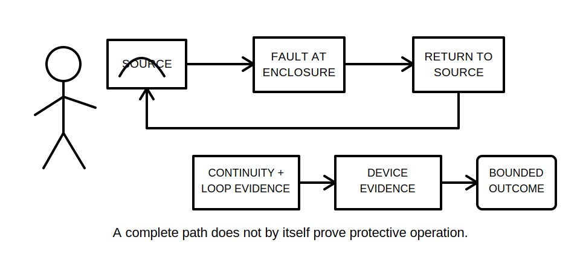
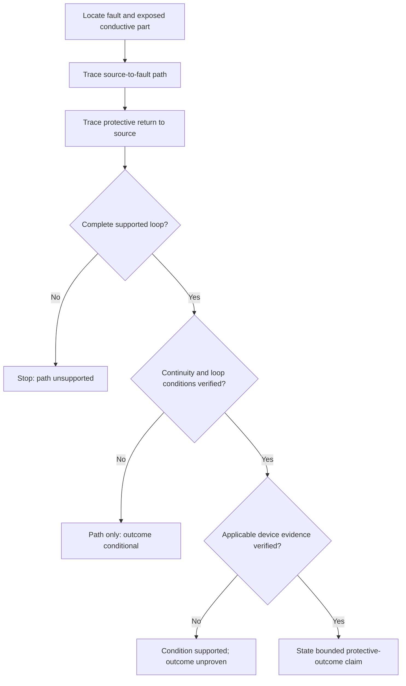
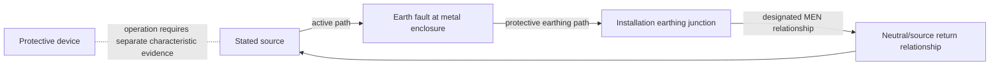

# Day 10 — Earth-Fault Current Path and Disconnection Reasoning

> **Currency and safety notice:** This is an original paper-based reasoning module. It does not prove an installation fault loop, protective-device operation or compliance, and it authorises no electrical work or testing. Exact MEN arrangements, conductor requirements, impedance conditions, device characteristics, operating times, test methods and jurisdiction-specific duties remain `reference_check_required`. This module is `review-required`, not `technically-reviewed`.

## 1. Outcome and entry check

### Learning objectives

By the end of this block, the learner should be able to:

1. distinguish normal load current from earth-fault current;
2. trace a complete conceptual earth-fault loop from source to fault and back to source;
3. identify the protective earthing, MEN and neutral segments that may form part of the stated conceptual loop;
4. explain why a complete path is necessary but not sufficient to prove automatic disconnection;
5. separate path evidence, loop-condition evidence and protective-device evidence;
6. classify a disconnection conclusion as supported, conditional or unsupported;
7. revise the analysis when continuity, source arrangement or device information changes;
8. score at least 10 out of 12 on the educational rubric with no zero in path accuracy, evidence control or safety boundary.

### Entry check

Without notes, answer and rate confidence as **guessing**, **unsure**, **reasonably confident** or **certain**:

1. State the normal-current loop from Day 9.
2. What event changes that loop into an earth-fault loop?
3. Does identifying a protective conductor prove its continuity?
4. Does a complete conceptual loop prove a protective device will operate in the required way?
5. What evidence categories are needed before making a disconnection claim?
6. Name one condition that would force the analysis to stop.

Record every high-confidence error for Beat 8.

## 2. Why it matters

A learner can draw a plausible fault path and still make an unsafe conclusion. Protective operation depends not only on the route, but also on the electrical condition of that route, the source arrangement and the characteristics of the protective device. Day 10 therefore moves from **where fault current could flow** to **what must be verified before claiming disconnection**.

*Caption: A labelled path is the beginning of the argument; continuity, loop conditions and device evidence must also be established before a disconnection claim.*

## 3. Core concepts and terminology

### Earth fault

An **earth fault** is an unintended conductive connection between a live part and an exposed conductive part, protective conductor or other relevant conductive path. Exact definitions and classifications require current authorised verification.

### Earth-fault current

**Earth-fault current** is current that flows because of an earth fault. Its conceptual route differs from the normal active-load-neutral loop.

### Fault-current loop

A **fault-current loop** is the complete route from the source, through the fault and protective return path, back to the source relationship. A path that stops at an earthing terminal, electrode, neutral or MEN point is incomplete unless the source return is also explained.

### Protective earthing continuity

**Protective earthing continuity** means the relevant protective path is electrically continuous. A drawing, conductor colour or visual presence does not prove continuity or condition.

### Loop condition

**Loop condition** is the combined electrical condition of the stated path that influences fault-current magnitude. This module does not provide or approve numerical limits.

### Automatic disconnection

**Automatic disconnection** is protective interruption that occurs when the applicable fault and protective conditions are satisfied. A conceptual path alone does not prove that those conditions are met.

### Three claim levels

- **Path claim:** the stated evidence supports a possible complete route.
- **Condition claim:** authorised evidence supports the relevant continuity and electrical conditions.
- **Outcome claim:** authorised evidence supports the applicable protective-device response and required outcome.

Each level depends on the previous level. Skipping a level produces an unsupported conclusion.

## 4. Rule-finding workflow

Use **L-O-O-P-S**.

1. **L — Locate the fault and exposed conductive part.** State exactly where the unintended connection occurs and what part becomes involved.
2. **O — Outline the outward source path.** Trace from the stated source through active conductors and the fault point without inventing hidden links.
3. **O — Outline the protective return path.** Trace through the stated protective earthing, earthing junction, designated MEN relationship and neutral/source relationship as applicable to the supplied scenario.
4. **P — Prove conditions and protection separately.** Identify evidence for continuity and loop condition, then separately identify protective-device type, location and applicable characteristic evidence.
5. **S — State the bounded conclusion and stop point.** Label the conclusion supported, conditional or unsupported; record missing evidence and practical-authority limits.

The diagram separates three evidence gates. Passing the path gate does not automatically pass the condition or outcome gates.

### Evidence grades

- **Grade A — scenario fact:** supplied source, fault location, labels, approved learning drawing or provided record.
- **Grade B — applicable authorised evidence:** current requirements, approved design, verified records, competent test evidence, manufacturer information or competent direction.
- **Grade C — assumption:** colour, visible presence, familiar arrangement, presumed continuity, guessed impedance or remembered device behaviour.

Grade C may identify a question. It cannot prove a safety-critical path or protective outcome.

## 5. Visual model or worked example

### Conceptual fault loop

The solid arrows show a conceptual closed route. They do not prove conductor continuity, impedance, exact physical routing, permitted connection points or device operation.

### Worked example

**Scenario:** A fictional approved learning diagram shows a stated grid-connected source, an active conductor feeding equipment with a metal enclosure, a labelled protective earthing conductor, an installation earthing junction, a designated MEN relationship and an upstream protective device. A fault symbol connects active to the enclosure. No test results or device characteristic data are supplied.

Apply L-O-O-P-S:

1. **Locate:** active-to-enclosure fault.
2. **Outward path:** source active to equipment and fault point.
3. **Protective return:** enclosure to protective conductor, earthing junction, designated MEN relationship, neutral/source relationship and back to source.
4. **Prove separately:** the drawing supports a conceptual path only; it supplies no continuity, loop-condition or device-response evidence.
5. **State:** the path is conceptually supported, but automatic disconnection remains unsupported until the missing evidence is verified by an authorised competent person using current requirements.

## 6. Practical application

### Round 1 — fault-loop record

Use a trainer-created fictional scenario and complete:

| Segment or claim | Role in reasoning | Evidence grade | Supported, conditional or unsupported | Missing evidence |
|---|---|---|---|---|
| Learner completes | Path, condition or outcome | A, B or C | Learner completes | Learner completes |

Then write one sentence for each claim level: path, condition and outcome.

### Round 2 — worked-example fading

Repeat with the MEN/source relationship partly hidden. The learner must stop at the unsupported segment, name the missing information and avoid completing the loop from memory.

### Round 3 — changed-condition transfer

Provide a second version where one of these changes:

- protective earthing continuity is not established;
- the source changes to an unspecified alternative supply;
- the protective device is identified only by appearance;
- a parallel conductive path is shown without verified status.

Reassess all three claim levels. The correct conclusion may fall from outcome claim to condition claim, path claim or insufficient evidence.

### Performance rubric

Score each category **0–2**.

| Category | 0 | 1 | 2 |
|---|---|---|---|
| Terminology | Confuses normal, fault and residual current | Defines terms with one blurred distinction | Uses all defined terms consistently |
| Path accuracy | Produces an open or invented loop | Traces most segments with one unsupported link | Completes only the supported source-fault-source loop |
| Evidence control | Treats visual clues as proof | Marks some assumptions | Grades every material path, condition and outcome claim |
| Protection reasoning | Claims tripping from path alone | Names missing factors generally | Separates path, loop-condition and device evidence |
| Transfer | Reuses the original conclusion unchanged | Revises one claim level | Reassesses every level after the scenario changes |
| Safety and conclusion | Proposes unauthorised testing or certainty | Gives a general caution | States evidence, uncertainty, authority boundary and escalation |

A score below **10/12**, or any zero in **path accuracy**, **evidence control** or **safety and conclusion**, requires targeted remediation and a varied re-attempt. This is an educational threshold, not an official RTO pass mark.

## 7. Common errors and safety checkpoint

### Common errors

- **Stopping at earth or the MEN point.** Complete the conceptual return to the stated source.
- **Treating an electrode as a universal return explanation.** Use only the path supported by the stated arrangement and authorised evidence.
- **Assuming visible protective earthing proves continuity.** Identity and continuity are different claims.
- **Claiming a device will trip because a path exists.** Prove applicable conditions and device evidence separately.
- **Using an RCD explanation for every earth fault.** First identify the protective function and applicable device evidence.
- **Importing the grid model into an alternative-source scenario.** Re-establish source and neutral relationships.
- **Quoting remembered values or times.** Use current authorised sources and mark unverified details `reference_check_required`.

### Safety checkpoint

This module authorises no opening, cover removal, isolation, proving, testing, continuity measurement, loop measurement, fault creation, bridging, disconnection, reconnection, resetting, alteration, energisation, commissioning or verification.

Stop and seek qualified guidance when:

- source, neutral, MEN or alternate-supply relationships are uncertain;
- protective conductor identity, continuity or condition is unverified;
- exposed live parts, damage, heat, moisture or altered conductors are reported;
- the proposed conclusion depends on exact values, times, curves, test methods or clauses not verified from current authorised sources;
- the learner lacks practical authority, supervision, equipment or an approved procedure.

## 8. Retrieval and next links

### Closed-note retrieval

1. Define earth fault, earth-fault current and fault-current loop.
2. State the five L-O-O-P-S steps.
3. Why is a complete path necessary but insufficient for a disconnection claim?
4. Distinguish path, condition and outcome claims.
5. Name three Grade C assumptions.
6. Why does visible protective earthing not prove continuity?
7. What must be reconsidered when the source changes?
8. State four stop conditions.

### Error-log remediation

Select no more than three errors. For each, redraw a small original loop, mark the unsupported gate, identify the required evidence and complete a varied re-attempt within 48 hours.

### Navigation

- **Program:** [Six-Week Capstone Learning Plan](../MASTER_PLAN.md)
- **Previous:** [Day 9 — MEN Arrangement and Normal-Current Paths](day-09-men-arrangement-and-normal-current-paths.md)
- **Knowledge note:** [[Six-Week Day 10 - Earth-Fault Current Path and Disconnection Reasoning]]
- **Next:** Day 11 — Protective Earthing Continuity and Equipotential Bonding Concepts

### References and review boundary

- AS/NZS 3000: use a current authorised copy and applicable amendments for exact definitions and requirements.
- Use current legislation, regulator guidance, network information, approved drawings, manufacturer information, workplace procedures and RTO instructions as applicable.
- This module uses original explanations, scenarios, workflows, diagrams and assessment activities. It reproduces no standards table, figure, device curve, systematic clause wording or source PDF content.
- Exact MEN arrangements, conductor requirements, fault-loop conditions, protective-device characteristics, operating times, test methods and jurisdiction-specific duties remain `reference_check_required`.
- This module remains `review-required`, has not received qualified technical review and must not be labelled `technically-reviewed`.
