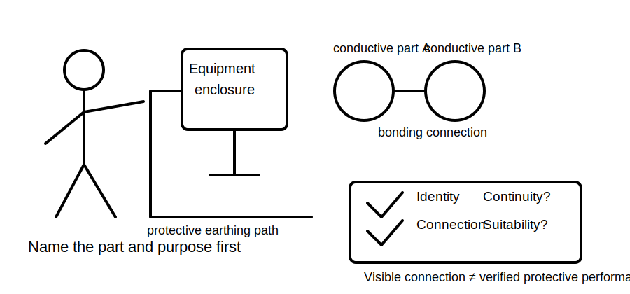
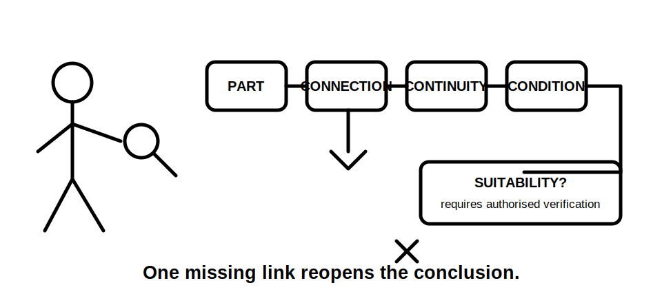
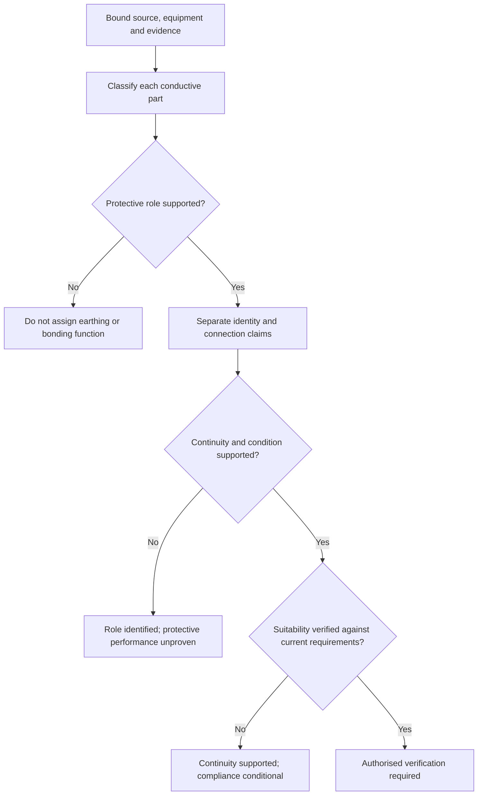
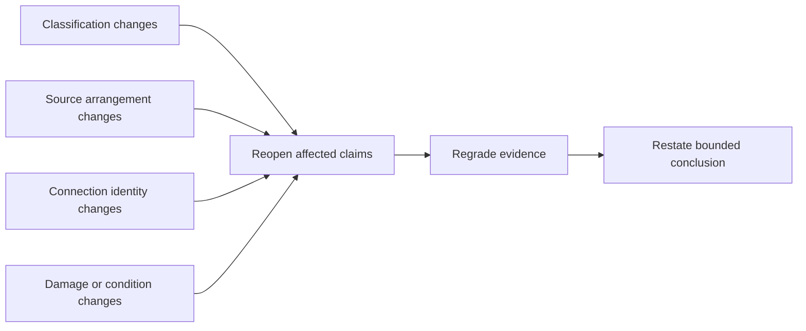
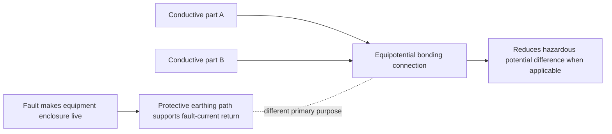

# Day 11 — Protective Earthing Continuity and Equipotential Bonding Concepts

> **Currency and safety notice:** This is an original paper-based learning module. It does not establish conductor continuity, bonding adequacy, installation compliance or permission to test. Exact definitions, required connections, conductor requirements, continuity criteria, test methods, exceptions and jurisdiction-specific duties remain `reference_check_required`. This module is `review-required`, not `technically-reviewed`.

## 1. Outcome and entry check

### Learning objectives

By the end of this block, the learner should be able to:

1. distinguish protective earthing continuity from equipotential bonding;
2. define exposed conductive part and extraneous conductive part in bounded learning language;
3. explain the different protective purposes of a fault-current return path and potential equalisation;
4. map a stated conductor or connection to its claimed function without relying on colour or appearance alone;
5. separate identity, connection, continuity, condition and suitability claims;
6. grade supplied evidence and limit each conclusion to the claim level actually supported;
7. reopen a conclusion when part classification, source arrangement, connection identity or condition changes;
8. score at least 10 out of 12 on the educational rubric with no zero in role distinction, evidence control or safety boundary.

### Entry check

Without notes, answer and rate confidence as **guessing**, **unsure**, **reasonably confident** or **certain**:

1. What did Day 10 require before a fault-path conclusion could progress to a protective-outcome claim?
2. Does a visible green-and-yellow conductor prove continuity?
3. Is every metal object automatically an exposed conductive part?
4. Is bonding identical to protective earthing?
5. What evidence would be needed to support a continuity claim?
6. Name one condition that should stop the analysis.

Record high-confidence errors for Beat 8.

## 2. Why it matters

Protective earthing and equipotential bonding are often grouped together because both involve conductive connections. Their purposes are related but not interchangeable. A learner who treats every green-and-yellow conductor as doing the same job may misclassify the path, overstate the evidence or miss a hazardous difference between an exposed conductive part, an extraneous conductive part and unrelated metalwork.

*Caption: First identify the part, connection and protective purpose; only then assess whether continuity and suitability are actually supported.*

*Caption: A labelled conductor is one clue. Every connection, classification and condition in the claimed protective relationship needs its own evidence.*

## 3. Core concepts and terminology

### Protective earthing

**Protective earthing** is the protective connection of relevant conductive parts to the installation earthing arrangement so that the intended protective function can operate under applicable fault conditions. Exact arrangements and requirements require current authorised verification.

### Protective earthing continuity

**Protective earthing continuity** means the relevant protective path is electrically continuous through the required connections. Visual presence, conductor colour, a label or a drawing does not prove continuity, low resistance, condition or suitability.

### Exposed conductive part

An **exposed conductive part** is a conductive part of electrical equipment that is not normally live but may become live under a fault. Exact classification depends on the equipment construction and applicable authorised definitions.

### Extraneous conductive part

An **extraneous conductive part** is a conductive part that may introduce a potential from outside the electrical installation’s intended protective system. Not every metal pipe, frame or structure automatically meets this classification; the scenario and authorised evidence must support it.

### Equipotential bonding

**Equipotential bonding** is a protective connection intended to reduce hazardous potential differences between relevant conductive parts. It does not replace protective earthing, prove a complete fault loop or establish that every connected item is correctly classified.

### Potential difference and touch voltage

**Potential difference** is the electrical difference between two points. **Touch voltage** is a potential difference that may appear across parts a person could touch simultaneously. This module uses these terms conceptually and supplies no design limits or acceptance values.

### Five claim layers

1. **Identity:** what part or conductor is it?
2. **Connection:** where is it stated to connect?
3. **Continuity:** is the path electrically continuous?
4. **Condition:** is the connection and conductor in an acceptable state?
5. **Suitability:** does the verified arrangement satisfy the applicable protective purpose and requirements?

A supported identity claim does not automatically support the later layers.

### Five evidence grades

- **Grade 1 — directly supplied:** an explicit scenario fact, labelled training drawing, stated equipment construction or provided record.
- **Grade 2 — corroborated:** two or more independent supplied sources agree and are applicable to the same item and arrangement.
- **Grade 3 — derived:** a transparent conclusion follows from supplied facts, with every dependency stated.
- **Grade 4 — assumed:** colour, appearance, proximity, familiar layout, presumed continuity, guessed classification or remembered rule.
- **Grade 5 — missing or conflicting:** required evidence is absent, ambiguous, stale or inconsistent.

Grades 4 and 5 can generate questions or stop conditions. They cannot prove a safety-critical connection or outcome.

### Four claim grades

- **Descriptive:** reports what the scenario shows or states.
- **Provisional:** proposes a classification or role while naming unresolved dependencies.
- **Supported paper reasoning:** the supplied evidence supports a bounded educational conclusion.
- **Authorised verification:** requires current authorised requirements, competent inspection or testing, approved procedures and qualified judgement; this module cannot award this grade.

## 4. Rule-finding workflow

Use **B-O-N-D-S**.

1. **B — Bound the scenario and source context.** Identify the supplied source arrangement, equipment, conductive parts, drawings and evidence limits.
2. **O — Observe and classify each relevant part.** Decide whether the scenario supports exposed conductive part, extraneous conductive part, protective conductor, bonding conductor or unrelated metalwork.
3. **N — Name the intended protective role.** State whether the claimed function is protective earthing continuity, potential equalisation, both under separate evidence, or neither.
4. **D — Demand evidence for every claim layer.** Separate identity, connection, continuity, condition and suitability; grade each item and mark assumptions explicitly.
5. **S — State the bounded conclusion and stop point.** Use descriptive, provisional or supported paper reasoning; identify missing authorised evidence and practical-authority limits.

The diagram prevents a learner from converting a visible connection directly into a compliance claim. Each evidence gate must be passed independently.

### Protective-relationship ledger

For every claimed relationship, record:

| Dependency | Question | Evidence grade | Claim grade | Reopen when |
|---|---|---|---|---|
| Part classification | What is the conductive part and why? | 1–5 | descriptive to supported | equipment construction or external-potential evidence changes |
| Connection identity | What conductor or connection is claimed? | 1–5 | descriptive to supported | labels, drawings, terminations or routing differ |
| Protective purpose | Earthing, bonding, both separately, or neither? | 1–5 | provisional to supported | source, fault-path or simultaneous-touch context changes |
| Continuity | Is the required path electrically continuous? | 1–5 | provisional or authorised verification | connection condition or competent evidence changes |
| Suitability | Does the arrangement satisfy current requirements? | 1–5 | authorised verification only | requirement, conductor, arrangement or exception changes |

A conclusion must be reopened whenever one of its recorded dependencies changes. Do not preserve an earlier answer merely because the visible conductor remains in the same place.

This reopening model prevents stale reasoning from surviving a material scenario change.

## 5. Visual model or worked example

### Role comparison model

The upper path represents the fault-current-return function associated with protective earthing. The lower path represents potential equalisation between correctly classified parts. Real installations may involve connected systems, but the reasoning purposes must remain distinct.

### Worked example

**Scenario:** A fictional approved training drawing shows Class I equipment with a metal enclosure connected by a labelled protective conductor to an earthing terminal. A metallic service entering the building is shown with a separate labelled bonding connection. No continuity results, conductor details or classification evidence beyond the drawing are supplied.

Apply B-O-N-D-S:

1. **Bound:** grid-connected training scenario; drawing evidence only.
2. **Observe:** enclosure is stated as an exposed conductive part; service is presented as a candidate extraneous conductive part.
3. **Name:** enclosure connection is claimed protective earthing; service connection is claimed equipotential bonding.
4. **Demand:** the drawing is Grade 1 evidence for identity and intended connection. Continuity, condition, classification validity and suitability are Grade 5 because evidence is missing.
5. **State:** the intended roles have a descriptive claim grade. Protective performance and compliance remain unsupported pending current authorised evidence and competent verification.

### Worked-example fading

Repeat the scenario with these supports removed in sequence:

1. remove the written role labels but retain equipment construction and routing;
2. remove the stated classification of the metallic service;
3. retain only a simplified drawing and a report of corrosion at one termination.

At each stage, complete the ledger and explain why the maximum defensible claim grade falls or remains unchanged.

## 6. Practical application

### Round 1 — part-and-purpose matrix

For a trainer-created fictional drawing, complete:

| Item | Claimed classification | Intended protective role | Evidence grade | Claim grade | Missing evidence |
|---|---|---|---|---|---|
| Learner completes | Exposed, extraneous, conductor or unrelated | Earthing, bonding, both separately, or neither | 1–5 | Descriptive, provisional or supported paper reasoning | Learner completes |

### Round 2 — changed-condition transfer

Reassess when one condition changes:

- the equipment is described as having a different construction class;
- the metallic service is electrically isolated before entering the installation;
- a bonding connection is shown but continuity is not established;
- the source arrangement changes or is unspecified;
- corrosion, looseness or alteration is reported at a connection.

For each change, identify which ledger rows must reopen and which claim grades fall from supported to provisional or unsupported.

### Round 3 — delayed retrieval

After at least 24 hours, complete a new fictional scenario without the B-O-N-D-S prompt. Reconstruct the workflow, identify five dependencies and state one practical stop condition before checking notes.

### Performance rubric

Score each category **0–2**.

| Category | 0 | 1 | 2 |
|---|---|---|---|
| Terminology | Treats all conductive parts or conductors as equivalent | Defines terms with one blurred distinction | Uses exposed, extraneous, earthing and bonding terms consistently |
| Role distinction | Treats bonding and protective earthing as identical | States different roles without applying them reliably | Maps each connection to its distinct protective purpose |
| Evidence control | Treats colour or appearance as proof | Marks some assumptions | Grades evidence, separates claim layers and limits the claim grade |
| Dependency control | Keeps conclusions after material changes | Reopens one affected claim | Uses the ledger to reopen every affected dependency |
| Transfer | Copies the worked answer | Revises one claim | Reconstructs the workflow and reassesses a changed scenario |
| Safety and conclusion | Proposes unauthorised testing or certainty | Gives a general caution | States evidence limits, authority boundary and escalation |

A score below **10/12**, or any zero in **role distinction**, **evidence control** or **safety and conclusion**, requires targeted remediation and a varied re-attempt. This is an educational threshold, not an official RTO pass mark.

### Critical-error gates

Regardless of total score, the attempt is incomplete when the learner:

- treats bonding and protective earthing as interchangeable;
- treats colour, appearance or a drawing as proof of continuity;
- classifies all metalwork as exposed or extraneous without evidence;
- claims compliance or protective performance from incomplete evidence;
- proposes unauthorised opening, isolation, measurement, alteration or energisation.

## 7. Common errors and safety checkpoint

### Common errors

- **Every metal part needs the same connection.** Classification and applicable requirements must be established first.
- **Green-and-yellow means proven protective continuity.** Colour supports identification only when applicable; it does not prove connection or condition.
- **Bonding and earthing are interchangeable words.** State the distinct protective purpose of each connection.
- **A drawing proves the installed condition.** Drawings support intended arrangement, not actual continuity or workmanship.
- **An exposed conductive part is normally live.** It is defined by possible fault energisation, not normal live function.
- **Any incoming metal service is automatically extraneous.** Use scenario evidence and current authorised definitions.
- **Continuity alone proves compliance.** Suitability also depends on applicable arrangement, conductor, connection and requirement evidence.

### Safety checkpoint

This module authorises no opening, cover removal, isolation, proving, continuity testing, resistance measurement, conductor tracing, disconnection, reconnection, bridging, alteration, repair, energisation, commissioning or verification.

Stop and seek qualified guidance when:

- a conductive part’s classification is uncertain;
- source, neutral, MEN or alternative-supply relationships are unclear;
- conductor identity, termination, continuity or condition is unverified;
- damage, corrosion, heat, moisture, looseness or alteration is reported;
- the conclusion depends on exact conductor sizes, resistance values, test methods, clauses or exceptions not verified from current authorised sources;
- the learner lacks practical authority, supervision, equipment or an approved procedure.

## 8. Retrieval and next links

### Closed-note retrieval

1. Distinguish protective earthing from equipotential bonding.
2. Define exposed conductive part and extraneous conductive part in bounded terms.
3. State the five B-O-N-D-S steps.
4. List the five claim layers.
5. List the five evidence grades and four claim grades.
6. Why does a visible conductor not prove continuity?
7. Name three dependencies that reopen a conclusion.
8. Why does continuity not by itself prove suitability?
9. State four stop conditions.

### Error-log remediation

Select no more than three errors. For each, create a new fictional part-and-purpose card, identify the failed dependency or claim layer, state the required evidence and complete a varied re-attempt within 48 hours.

### Navigation

- **Program:** [Six-Week Capstone Learning Plan](../MASTER_PLAN.md)
- **Previous:** [Day 10 — Earth-Fault Current Path and Disconnection Reasoning](day-10-earth-fault-current-path-and-disconnection-reasoning.md)
- **Knowledge note:** [[Six-Week Day 11 - Protective Earthing Continuity and Equipotential Bonding Concepts]]
- **Next:** [Day 12 — Rest, Retrieval and Misconception Repair](day-12-rest-retrieval-and-misconception-repair.md)

### References and review boundary

- AS/NZS 3000: use a current authorised copy and applicable amendments for exact definitions and requirements.
- Use current legislation, regulator guidance, network information, approved drawings, manufacturer information, workplace procedures and RTO instructions as applicable.
- This module uses original explanations, scenarios, workflows, diagrams and assessment activities. It reproduces no standards table, figure, systematic clause wording or source PDF content.
- Exact classifications, required connections, conductor requirements, continuity criteria, bonding arrangements, exceptions, test methods and jurisdiction-specific duties remain `reference_check_required`.
- This module remains `review-required`, has not received qualified technical review and must not be labelled `technically-reviewed`.
