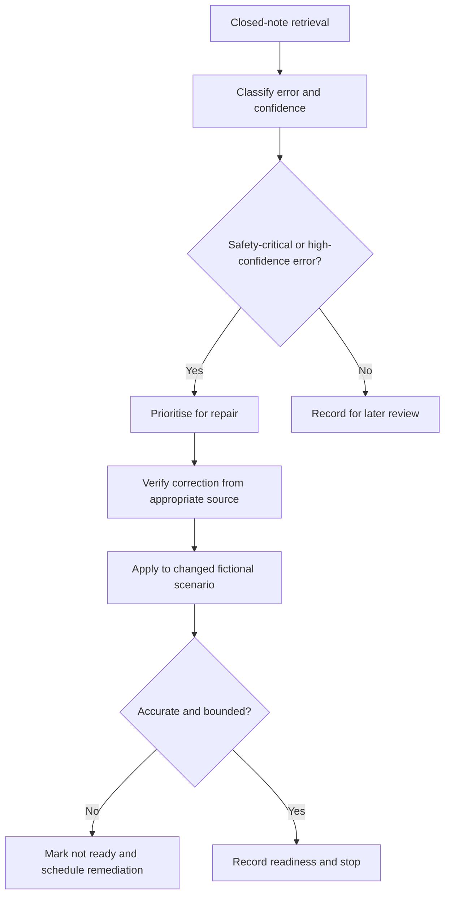
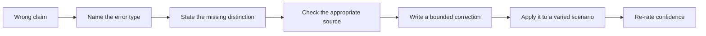

# Day 12 — Rest, Retrieval and Misconception Repair

> **Currency and safety notice:** This is an original rest-and-retrieval module. It introduces no new electrical theory and grants no authority to inspect, test, alter or energise electrical equipment. Any recalled clause, value, procedure or safety-critical statement must be checked against current authorised sources. This module is `review-required`, not `technically-reviewed`.

## 1. Outcome and entry check

### Learning objectives

By the end of this block, the learner should be able to:

1. retrieve the main protection, MEN, fault-path, protective-earthing and bonding distinctions from Days 8–11 without immediate rereading;
2. identify whether an error is a terminology, path, protection-role, evidence, confidence or safety-boundary error;
3. correct no more than three high-value errors using a fresh scenario rather than copying the original answer;
4. distinguish a supported statement from a remembered but unverified rule;
5. use a time limit and stop conditions to prevent fatigued study from becoming unsafe overconfidence;
6. produce a readiness decision of **ready**, **ready with one bounded review task**, or **not ready—remediation required**;
7. score at least 10 out of 12 on the educational rubric with no zero in evidence control, safety boundary or remediation quality.

### Entry check

Before opening notes, write brief answers and rate each as **guessing**, **unsure**, **reasonably confident** or **certain**:

1. What is the difference between a normal-current path and an earth-fault current path?
2. Why does a visible green-and-yellow conductor not prove continuity?
3. What is the distinct purpose of equipotential bonding?
4. What evidence is needed before a conceptual fault path becomes a supported protective-outcome claim?
5. Name one assumption that must not be treated as proof.
6. Name one condition that requires stopping and seeking qualified guidance.

Do not correct answers yet. Mark high-confidence errors first because they present the greatest risk of repeating an unsafe misconception.

## 2. Why it matters

Rest and retrieval are part of competent preparation, not lost study time. Immediate rereading can create familiarity without proving recall. A learner who confidently confuses neutral and protective paths, bonding and earthing, or a visible connection and verified continuity may produce plausible but unsafe reasoning.

This block reduces that risk by requiring closed-note retrieval, selective correction and a changed-scenario re-attempt. It also limits workload so fatigue does not convert uncertainty into guessing.

*Caption: Repair the highest-risk reasoning error, verify the correction, then decide whether to continue or stop.*

## 3. Core concepts and terminology

### Retrieval

**Retrieval** means producing an answer from memory before looking at notes. It tests access to knowledge rather than recognition of familiar wording.

### Misconception

A **misconception** is a persistent incorrect model, not merely a forgotten fact. Examples include treating bonding as identical to protective earthing or assuming a labelled conductor proves continuity.

### High-confidence error

A **high-confidence error** is an incorrect answer marked reasonably confident or certain. It receives priority because the learner is less likely to self-correct it during an assessment or workplace discussion.

### Error categories

1. **Terminology error:** a technical term is undefined, swapped or used too broadly.
2. **Path error:** the learner omits, reverses or invents part of a current path.
3. **Protection-role error:** a device, conductor or connection is assigned the wrong protective purpose.
4. **Evidence error:** appearance, memory or assumption is treated as proof.
5. **Confidence error:** confidence is higher than the available evidence justifies.
6. **Safety-boundary error:** the learner proposes work, testing or certainty beyond authority or verified information.

### Catch-up triage

**Catch-up triage** means selecting the smallest missing prerequisite that blocks the next module. It is not wholesale rereading. In this block, catch-up is limited to one bounded prerequisite review after retrieval and error classification.

### Readiness decision

- **Ready:** retrieval is accurate enough, no critical error remains and confidence broadly matches evidence.
- **Ready with one bounded review task:** one non-critical gap remains and can be resolved within the time limit.
- **Not ready—remediation required:** a safety-critical misconception, repeated high-confidence error or unresolved prerequisite remains.

## 4. Rule-finding workflow

Use **R-E-P-A-I-R**.

1. **R — Retrieve before reopening notes.** Complete the entry check and short mixed retrieval set closed-note.
2. **E — Examine errors and confidence.** Classify each error and identify high-confidence mistakes.
3. **P — Prioritise no more than three repairs.** Safety-boundary, path and evidence errors come before low-value wording errors.
4. **A — Authorise the source of correction.** Check the relevant prior module and current authorised source where exact technical detail matters.
5. **I — Interleave a changed scenario.** Re-attempt the concept in a new fictional context so correction is not tied to memorised wording.
6. **R — Record readiness and stop.** Choose one readiness outcome, record the next action and end the session when the time or fatigue limit is reached.

The diagram prevents immediate rereading from replacing retrieval. It also prevents a corrected sentence from being accepted until the learner can use the idea in a varied scenario.

### Session limits

- Maximum total time: **30 minutes**.
- Maximum selected repairs: **three**.
- Maximum catch-up task: **one prerequisite gap**.
- Stop early after two repeated safety-critical errors, rising frustration, reduced concentration or any urge to guess rather than verify.

These are learning-management limits, not electrical test values or official assessment conditions.

## 5. Visual model or worked example

### Misconception repair ladder

Each step changes the learner's model. Simply crossing out the wrong answer does not show why it was wrong or whether the correction transfers.

### Worked example

**Initial claim:** “The bonding conductor provides the earth-fault return path for every item of equipment.” The learner marks this **certain**.

Apply R-E-P-A-I-R:

1. **Retrieve:** the claim was produced without notes.
2. **Examine:** it is a high-confidence protection-role and path error.
3. **Prioritise:** it outranks a minor vocabulary error.
4. **Authorise:** review the bounded distinctions in Days 10 and 11; exact arrangements remain subject to current authorised sources.
5. **Interleave:** in a new fictional drawing, separately label an exposed conductive part, a candidate extraneous conductive part, the protective earthing path and a bonding connection. State the purpose of each without claiming verified continuity.
6. **Record:** if the learner now separates fault-current return from potential equalisation and identifies missing evidence, mark the repair complete. Otherwise record **not ready—remediation required**.

## 6. Practical application

### Part A — eight-minute mixed retrieval

Without notes, produce one-sentence answers for:

1. neutral versus protective earthing conductor;
2. normal-current path versus earth-fault current path;
3. protective earthing versus equipotential bonding;
4. exposed versus extraneous conductive part;
5. identity claim versus continuity claim;
6. conceptual device role versus verified protective outcome.

### Part B — error-log triage

Select up to three items using this order:

1. unsafe or authority-crossing claim;
2. high-confidence path or evidence error;
3. repeated protection-role misconception;
4. prerequisite terminology gap;
5. low-confidence omission;
6. minor wording issue.

For each selected item, record:

| Field | Required response |
|---|---|
| Original claim | Exact learner wording |
| Confidence | Guessing, unsure, reasonably confident or certain |
| Error category | Terminology, path, protection role, evidence, confidence or safety boundary |
| Corrected distinction | One bounded sentence |
| Source used | Prior module and, where needed, current authorised source |
| Varied re-attempt | New fictional scenario and revised answer |
| Result | Repaired, partly repaired or unresolved |

### Part C — catch-up decision

Choose only one:

- no catch-up needed;
- review one diagram or workflow from Days 8–11;
- redo one varied scenario;
- stop and schedule supervised or qualified clarification.

### Performance rubric

Score each category **0–2**.

| Category | 0 | 1 | 2 |
|---|---|---|---|
| Retrieval | Opens notes immediately or leaves most prompts blank | Retrieves some distinctions with prompting | Retrieves the main distinctions before checking notes |
| Error diagnosis | Corrects wording without identifying the error | Identifies some error types | Correctly classifies terminology, path, role, evidence, confidence and safety errors |
| Prioritisation | Attempts everything or selects low-value items first | Selects relevant items inconsistently | Limits repair to the highest-risk three items |
| Evidence control | Treats memory or appearance as proof | Adds a general source reminder | Uses the relevant module and flags exact claims for authorised verification |
| Remediation quality | Copies a correction without transfer | Completes a similar re-attempt | Applies the corrected model accurately to a changed scenario |
| Safety and readiness | Continues despite fatigue or unresolved critical error | Gives a vague caution | Applies stop conditions and records a defensible readiness outcome |

A score below **10/12**, or any zero in **evidence control**, **remediation quality** or **safety and readiness**, requires a later varied re-attempt. This is an educational threshold, not an official RTO pass mark.

## 7. Common errors and safety checkpoint

### Common errors

- **Rereading before retrieval.** This measures familiarity, not reliable recall.
- **Repairing every error in one sitting.** Triage the errors that block safe progression.
- **Correcting wording without correcting the model.** Explain the missing distinction and test it in a varied scenario.
- **Using confidence as evidence.** Confidence must be recalibrated after source checking and transfer.
- **Treating the rest block as a new theory lesson.** Only revisit theory needed to repair a demonstrated gap.
- **Continuing after concentration has fallen.** More time is not automatically better learning.
- **Using a remembered clause or value as current authority.** Mark it `reference_check_required` until verified.

### Safety checkpoint

This module authorises no opening, cover removal, isolation, proving, continuity testing, resistance or loop measurement, conductor tracing, disconnection, reconnection, fault creation, resetting, alteration, repair, energisation, commissioning or verification.

Stop the session and seek qualified guidance when:

- a safety-critical misconception remains after one verified correction attempt;
- the learner cannot distinguish normal and fault paths, earthing and bonding roles, or identity and continuity claims;
- an exact clause, limit, test value, device behaviour or procedure is required but current authorised access is unavailable;
- fatigue, frustration or time pressure causes guessing;
- the scenario implies real equipment, live work, testing or decisions beyond the learner's authority.

## 8. Retrieval and next links

### Final three-minute retrieval

Close all notes and answer:

1. What makes a high-confidence error a priority?
2. State the six R-E-P-A-I-R steps.
3. Name the six error categories.
4. Why is a varied re-attempt required?
5. What are the three readiness outcomes?
6. State two fatigue or safety stop conditions.

### Spaced follow-up

Within 48 hours, repeat only the varied re-attempts for unresolved or partly repaired items. Do not repeat already secure items merely to create activity.

### Navigation

- **Program:** [Six-Week Capstone Learning Plan](../MASTER_PLAN.md)
- **Previous:** [Day 11 — Protective Earthing Continuity and Equipotential Bonding Concepts](day-11-protective-earthing-continuity-and-equipotential-bonding-concepts.md)
- **Knowledge note:** [[Six-Week Day 12 - Rest Retrieval and Misconception Repair]]
- **Next:** Day 13 — Earthing Defect Scenarios and Consequence Analysis

### References and review boundary

- Use Days 8–11 as the immediate learning sources for retrieval and misconception repair.
- Use a current authorised copy of applicable standards, current legislation, regulator guidance, network information, approved drawings, manufacturer information, workplace procedures and RTO instructions where an exact technical claim must be verified.
- This module uses original explanations, workflows, diagrams, scenarios and assessment activities. It reproduces no standards table, figure, systematic clause wording or source PDF content.
- Exact technical claims remain `reference_check_required`; this content remains `review-required` and not `technically-reviewed`.
