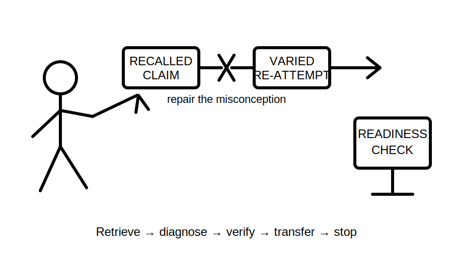
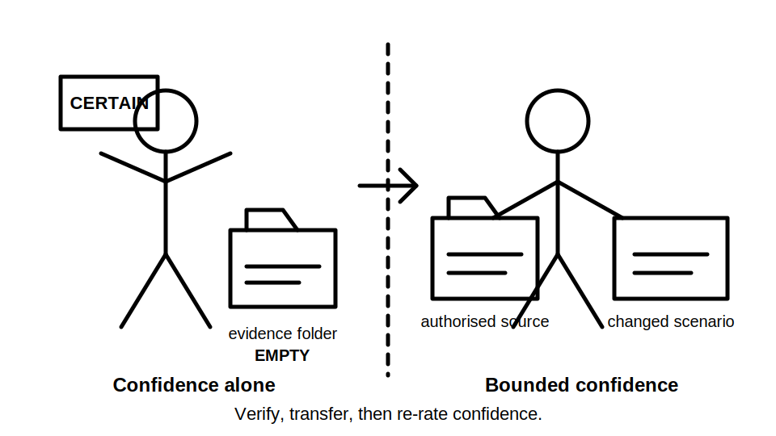
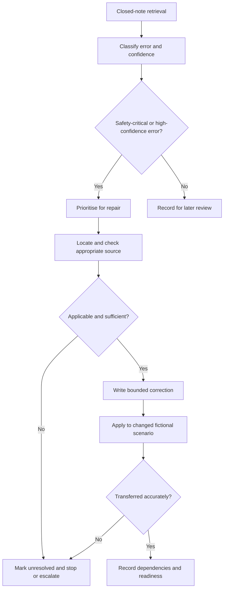

# Day 12 — Rest, Retrieval and Misconception Repair

> **Currency and safety notice:** This is an original rest-and-retrieval module. It introduces no new electrical theory and grants no authority to inspect, test, alter or energise electrical equipment. Any recalled clause, value, procedure or safety-critical statement must be checked against current authorised sources. This module is `review-required`, `reference_check_required` and not `technically-reviewed`.

## 1. Outcome and entry check

### Learning objectives

By the end of this block, the learner should be able to:

1. retrieve the main protection, MEN, fault-path, protective-earthing and bonding distinctions from Days 8–11 without immediate rereading;
2. classify an error as terminology, path, protection-role, evidence, confidence or safety-boundary related;
3. distinguish **recalled**, **located**, **supported**, **transferred** and **unresolved** evidence states;
4. repair no more than three high-value misconceptions using a changed scenario rather than copied wording;
5. identify the dependency that would reopen a previously repaired claim;
6. use time limits and stop conditions to prevent fatigued study from becoming unsafe overconfidence;
7. record **ready**, **ready with one bounded review task**, or **not ready—remediation required**;
8. score at least 10 out of 12 on the educational rubric with no critical-error gate triggered.

### Entry check

Before opening notes, answer briefly and rate each response as **guessing**, **unsure**, **reasonably confident** or **certain**:

1. What is the difference between a normal-current path and an earth-fault current path?
2. Why does a visible green-and-yellow conductor not prove continuity?
3. What is the distinct purpose of equipotential bonding?
4. What evidence is needed before a conceptual fault path becomes a supported protective-outcome claim?
5. Name one assumption that must not be treated as proof.
6. Name one condition that requires stopping and seeking qualified guidance.

Do not correct answers yet. Mark high-confidence errors first because they are the most likely to persist into assessment or workplace reasoning.

## 2. Why it matters

Rest and retrieval are part of competent preparation, not lost study time. Immediate rereading can create familiarity without proving recall. A learner who confidently confuses neutral and protective paths, bonding and earthing, or a visible connection and verified continuity may produce plausible but unsafe reasoning.

This block reduces that risk through closed-note retrieval, selective correction, changed-scenario transfer and a deliberate stopping decision. It limits workload so fatigue does not convert uncertainty into guessing.

*Caption: Repair the highest-risk reasoning error, verify the correction, then decide whether to continue or stop.*

*Caption: Confidence becomes defensible only after the claim is checked, applied to a changed scenario and bounded by remaining uncertainty.*

## 3. Core concepts and terminology

### Retrieval and misconception

**Retrieval** means producing an answer from memory before looking at notes. It tests access to knowledge rather than recognition of familiar wording.

A **misconception** is a persistent incorrect model, not merely a forgotten fact. Examples include treating bonding as identical to protective earthing or assuming a labelled conductor proves continuity.

A **high-confidence error** is an incorrect answer marked reasonably confident or certain. It receives priority because the learner is less likely to self-correct it.

### Error categories

1. **Terminology error:** a technical term is undefined, swapped or used too broadly.
2. **Path error:** part of a current path is omitted, reversed or invented.
3. **Protection-role error:** a device, conductor or connection is assigned the wrong purpose.
4. **Evidence error:** appearance, memory or assumption is treated as proof.
5. **Confidence error:** confidence exceeds the available evidence.
6. **Safety-boundary error:** work, testing or certainty is proposed beyond authority or verified information.

### Evidence states

- **Recalled:** produced from memory; useful for diagnosis but not proof.
- **Located:** a relevant source or prior module has been found, but applicability is not yet established.
- **Supported:** the source applies to the stated fictional conditions and supports the bounded claim.
- **Transferred:** the corrected distinction has been applied accurately to a changed scenario.
- **Unresolved:** evidence is missing, conflicting, inapplicable or beyond the learner's authority to establish.

Evidence states are cumulative only when their dependencies remain unchanged. A changed source arrangement, component identity, current path, scenario boundary or authorised reference reopens the claim.

### Misconception-repair ledger

For each selected error, record:

| Field | Purpose |
|---|---|
| Original claim | Preserve the exact error rather than replacing it with a vague summary |
| Confidence | Identify dangerous certainty and recalibrate it later |
| Error category | Diagnose the failed reasoning process |
| Missing distinction | State what the learner failed to separate |
| Evidence state | Mark recalled, located, supported, transferred or unresolved |
| Dependencies | Record facts that must remain true for the correction to hold |
| Reopening trigger | Name a change that requires the claim to be checked again |
| Readiness result | Repaired, partly repaired or unresolved |

### Catch-up triage and readiness

**Catch-up triage** means selecting the smallest missing prerequisite that blocks the next module. It is not wholesale rereading.

- **Ready:** retrieval is sufficiently accurate, no critical error remains and confidence broadly matches evidence.
- **Ready with one bounded review task:** one non-critical gap remains and can be resolved within the time limit.
- **Not ready—remediation required:** a safety-critical misconception, repeated high-confidence error or unresolved prerequisite remains.

## 4. Rule-finding workflow

Use **R-E-P-A-I-R**.

1. **R — Retrieve before reopening notes.** Complete the entry check and mixed retrieval set closed-note.
2. **E — Examine errors and confidence.** Classify each error and identify high-confidence mistakes.
3. **P — Prioritise no more than three repairs.** Safety-boundary, path and evidence errors come first.
4. **A — Authorise the source of correction.** Use the relevant prior module and current authorised source where exact detail matters.
5. **I — Interleave a changed scenario.** Re-attempt the concept in a new fictional context.
6. **R — Record evidence, reopening triggers, readiness and stop.** Do not carry a correction forward without its limits.

The process prevents immediate rereading from replacing retrieval and prevents a corrected sentence from being accepted before transfer is demonstrated.

### Session limits

- Maximum total time: **30 minutes**.
- Maximum selected repairs: **three**.
- Maximum catch-up task: **one blocking prerequisite**.
- Stop early after two repeated safety-critical errors, rising frustration, reduced concentration or any urge to guess rather than verify.

These are learning-management limits, not electrical test values or official assessment conditions.

## 5. Visual model or worked example

### Misconception repair ladder

Each step changes the learner's model. Crossing out a sentence does not show why it was wrong or whether the correction transfers.

### Worked example with fading

**Initial claim:** “The bonding conductor provides the earth-fault return path for every item of equipment.” The learner marks this **certain**.

**Fully guided repair:**

1. classify it as a high-confidence path and protection-role error;
2. state the missing distinction between protective earthing and equipotential bonding;
3. check the bounded explanations in Days 10 and 11, while marking exact arrangements `reference_check_required`;
4. rewrite the claim without asserting verified continuity or universal application;
5. apply the distinction to a new fictional drawing;
6. record which component identity and installation arrangement the answer depends on;
7. re-rate confidence from the available evidence.

**Partly guided repair:** A learner claims that a visible labelled conductor proves a complete protective path. Complete only steps 2–7 without using the worked wording above.

**Independent transfer:** A changed drawing alters the supply relationship and omits one connection label. Decide which earlier correction must be reopened, identify the missing evidence and record readiness.

## 6. Practical application

### Part A — eight-minute mixed retrieval

Without notes, produce one-sentence answers for:

1. neutral versus protective earthing conductor;
2. normal-current path versus earth-fault current path;
3. protective earthing versus equipotential bonding;
4. exposed versus extraneous conductive part;
5. identity claim versus continuity claim;
6. conceptual device role versus verified protective outcome.

### Part B — error-log triage

Select up to three items using this order:

1. unsafe or authority-crossing claim;
2. high-confidence path or evidence error;
3. repeated protection-role misconception;
4. prerequisite terminology gap;
5. low-confidence omission;
6. minor wording issue.

Complete the misconception-repair ledger for each selected item.

### Part C — changed-scenario transfer

For each repaired item, alter one dependency: source arrangement, component identity, path boundary, drawing completeness or evidence source. State whether the previous correction remains supported, becomes provisional or must be reopened.

### Part D — catch-up decision

Choose only one:

- no catch-up needed;
- review one diagram or workflow from Days 8–11;
- redo one changed scenario;
- stop and schedule supervised or qualified clarification.

### Performance rubric

Score each category **0–2**.

| Category | 0 | 1 | 2 |
|---|---|---|---|
| Retrieval | Opens notes immediately or leaves most prompts blank | Retrieves some distinctions with prompting | Retrieves the main distinctions before checking notes |
| Error diagnosis | Corrects wording without identifying the error | Identifies some error types | Correctly classifies terminology, path, role, evidence, confidence and safety errors |
| Prioritisation | Attempts everything or selects low-value items first | Selects relevant items inconsistently | Limits repair to the highest-risk three items |
| Evidence control | Treats memory or appearance as proof | Locates a source but does not establish applicability | Uses evidence states, bounds claims and flags exact claims for authorised verification |
| Remediation quality | Copies a correction without transfer | Completes a similar re-attempt | Applies the corrected model accurately to a changed scenario and records reopening triggers |
| Safety and readiness | Continues despite fatigue or unresolved critical error | Gives a vague caution | Applies stop conditions and records a defensible readiness outcome |

A score below **10/12** requires a later varied re-attempt.

### Critical-error gates

Regardless of total score, record **not ready—remediation required** when the learner:

- treats a remembered rule, visible label or confidence rating as proof;
- cannot separate normal-current and earth-fault paths;
- cannot separate protective earthing and bonding purposes;
- proposes real testing, alteration or access beyond authority;
- carries a correction into a changed scenario without reopening altered dependencies;
- continues after a defined fatigue or safety stop condition.

This rubric is educational and is not an official RTO pass mark.

## 7. Common errors and safety checkpoint

### Common errors

- **Rereading before retrieval.** This measures familiarity, not reliable recall.
- **Repairing every error in one sitting.** Triage the errors that block safe progression.
- **Correcting wording without correcting the model.** Explain the missing distinction and test it in a varied scenario.
- **Using confidence as evidence.** Confidence must be recalibrated after checking and transfer.
- **Treating a located source as automatically applicable.** Applicability and scenario assumptions still need to be established.
- **Failing to reopen a changed claim.** A correction is bounded by its dependencies.
- **Treating the rest block as a new theory lesson.** Revisit only what is needed to repair a demonstrated gap.
- **Continuing after concentration has fallen.** More time is not automatically better learning.
- **Using a remembered clause or value as current authority.** Mark it `reference_check_required` until verified.

### Safety checkpoint

This module authorises no opening, cover removal, isolation, proving, continuity testing, resistance or loop measurement, conductor tracing, disconnection, reconnection, fault creation, resetting, alteration, repair, energisation, commissioning or verification.

Stop the session and seek qualified guidance when:

- a safety-critical misconception remains after one checked correction attempt;
- the learner cannot distinguish normal and fault paths, earthing and bonding roles, or identity and continuity claims;
- an exact clause, limit, test value, device behaviour or procedure is required but current authorised access is unavailable;
- fatigue, frustration or time pressure causes guessing;
- the scenario implies real equipment, live work, testing or decisions beyond the learner's authority.

## 8. Retrieval and next links

### Final three-minute retrieval

Close all notes and answer:

1. What makes a high-confidence error a priority?
2. State the six R-E-P-A-I-R steps.
3. Name the six error categories.
4. Name the five evidence states.
5. Why is a changed-scenario re-attempt required?
6. What change would reopen a repaired claim?
7. What are the three readiness outcomes?
8. State two fatigue or safety stop conditions.

### Spaced follow-up

Within 48 hours, repeat only the changed-scenario attempts for unresolved or partly repaired items. Do not repeat already secure items merely to create activity.

### Navigation

- **Program:** [Six-Week Capstone Learning Plan](../MASTER_PLAN.md)
- **Previous:** [Day 11 — Protective Earthing Continuity and Equipotential Bonding Concepts](day-11-protective-earthing-continuity-and-equipotential-bonding-concepts.md)
- **Knowledge note:** [[Six-Week Day 12 - Rest Retrieval and Misconception Repair]]
- **Next:** [Day 13 — Earthing Defect Scenarios and Consequence Analysis](day-13-earthing-defect-scenarios-and-consequence-analysis.md)

### References and review boundary

- Use Days 8–11 as the immediate learning sources for retrieval and misconception repair.
- Use a current authorised copy of applicable standards, current legislation, regulator guidance, network information, approved drawings, manufacturer information, workplace procedures and RTO instructions where an exact technical claim must be verified.
- This module uses original explanations, workflows, diagrams, scenarios and assessment activities. It reproduces no standards table, figure, systematic clause wording or source PDF content.
- Exact technical claims remain `reference_check_required`; this content remains `review-required` and not `technically-reviewed`.
