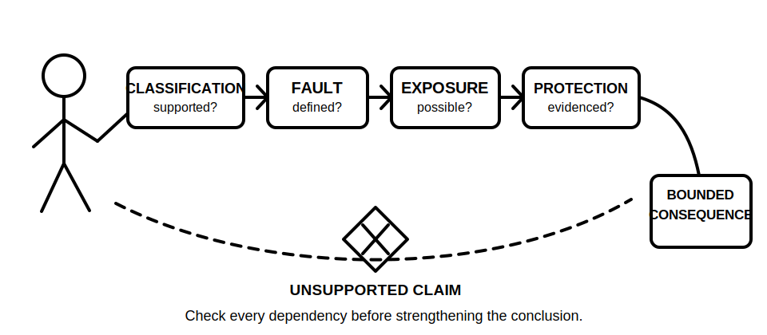
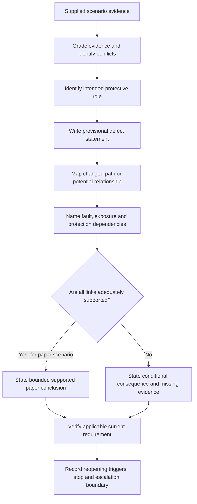
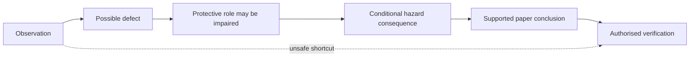
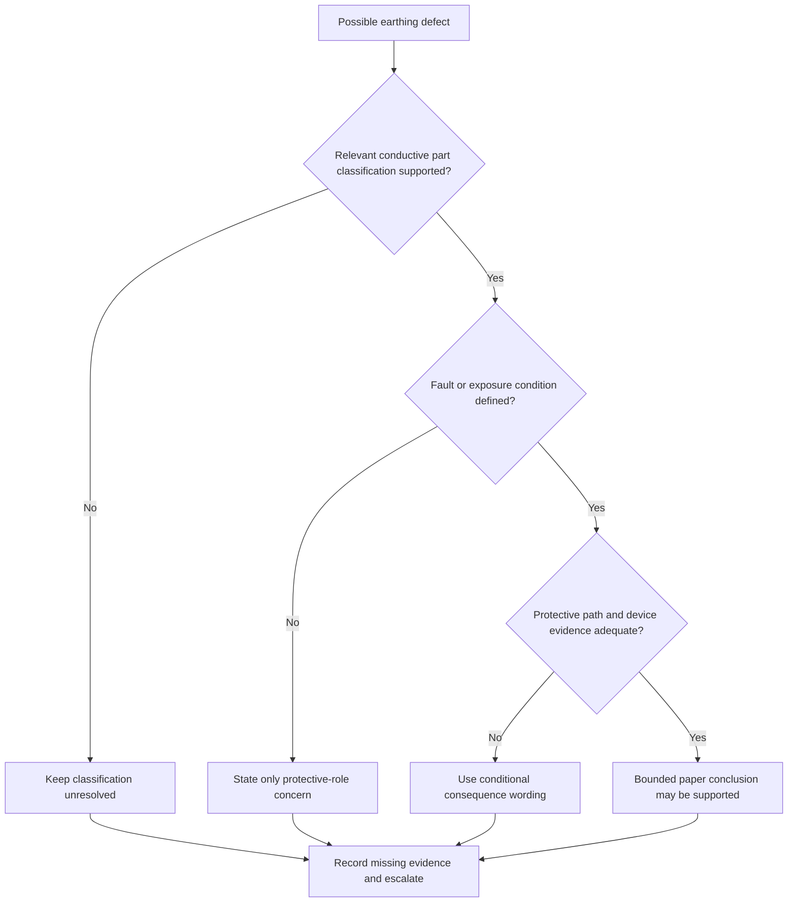

# Day 13 — Earthing Defect Scenarios and Consequence Analysis

> **Currency and safety notice:** This original educational module develops paper-based defect reasoning only. It does not establish that any real installation has a defect and grants no authority to open, inspect, test, isolate, alter, repair, energise or verify electrical equipment. Exact definitions, required arrangements, test methods, limits, acceptance criteria and jurisdiction-specific duties must be checked against current authorised sources. This module is `review-required`, not `technically-reviewed`.

## 1. Outcome and entry check

### Learning objectives

By the end of this module, the learner should be able to:

1. distinguish an **observation**, a **possible defect**, a **supported defect finding** and a **verified technical conclusion**;
2. grade supplied evidence as **direct**, **corroborated**, **derived**, **assumed**, or **missing or conflicting**;
3. analyse an original fictional earthing scenario by tracing the intended protective role, changed condition, dependencies and plausible consequence chain;
4. identify which consequence claims are immediate, conditional, contradicted or unsupported;
5. state what documentary, visual, source or test evidence would be required before strengthening a claim;
6. reopen an analysis when a source, drawing, installation boundary, component identity, continuity record or protective-device condition changes;
7. rank scenarios by potential safety significance without inventing likelihood, fault current, touch voltage, device-operation time or compliance status;
8. write a bounded escalation statement separating learner analysis from qualified inspection, testing and rectification; and
9. score at least 10 out of 12 on the educational rubric with no critical error.

### Entry check

Without notes, answer briefly:

1. Why does a visible protective conductor not prove continuity?
2. What is the difference between protective earthing and equipotential bonding?
3. What must be present before a conceptual fault path becomes a supported protective-outcome claim?
4. Why is “the device will trip” usually too strong when no verified installation data is supplied?
5. What should a learner do when a scenario requires an exact clause, limit, test result or practical procedure?

Rate each answer as **guessing**, **unsure**, **reasonably confident** or **certain**. Any high-confidence error becomes a priority prerequisite repair before continuing.

## 2. Why it matters

Defect questions often reward disciplined evidence control more than dramatic fault descriptions. A learner may correctly recognise that an earthing-related condition is concerning but then overstate the result—for example, claiming that a conductive enclosure is energised, that a protective device cannot operate, or that a specific repair is required when the scenario provides no measurement, inspection record or authorised source.

A defensible analysis explains:

- what is actually supplied;
- how trustworthy and current that evidence is;
- which protective role may be affected;
- how the condition could alter a current path or potential relationship;
- which consequences depend on additional conditions;
- what fact would reopen the analysis; and
- where qualified inspection, testing or source verification is required.

*Caption: Move from supplied evidence to a bounded consequence claim; do not jump from appearance to certainty.*

*Caption: A plausible consequence remains conditional until the required path, exposure and protection dependencies are supported.*

## 3. Core concepts and terminology

### Observation

An **observation** is a supplied or directly documented fact in the fictional scenario, such as “the drawing shows no protective-conductor connection at the enclosure.” It is not automatically proof of the real installation condition.

### Possible defect

A **possible defect** is a condition that may depart from an applicable requirement or intended protective arrangement. It remains provisional when the applicable rule, installation context or physical condition has not been verified.

### Supported defect finding

A **supported defect finding** combines adequate evidence with an applicable current requirement and a clearly identified mismatch. In real work, determining this may require authorised access, competent inspection, testing and documentation.

### Verified technical conclusion

A **verified technical conclusion** is a conclusion made within the scope of competent, authorised work using suitable current sources, inspection or test evidence and documented limitations. A learner’s paper analysis does not become verified merely because it is well written.

### Consequence chain

A **consequence chain** links:

1. the supplied or changed condition;
2. the protective role potentially affected;
3. the current path or potential relationship that may change;
4. the initiating fault or exposure condition required;
5. the hazard mechanism;
6. the protective response that may or may not occur; and
7. the evidence needed to support each link.

### Dependency

A **dependency** is a fact that must be true before a later claim follows. Examples include the item being correctly classified as an exposed conductive part, an active-to-enclosure fault occurring, a protective path being ineffective, a person contacting the item and a reference potential, and the device response being insufficient or delayed. Dependencies must not be silently assumed.

### Evidence grades

Use five grades:

1. **Direct evidence** — explicitly supplied by a current, relevant scenario source.
2. **Corroborated evidence** — supported by at least two compatible sources whose scope and currency are understood.
3. **Derived evidence** — follows logically from supplied evidence without adding a new fact.
4. **Assumed evidence** — plausible but not supplied; it cannot support a firm conclusion.
5. **Missing or conflicting evidence** — absent, stale, inconsistent or outside the source’s scope.

Evidence grade is not the same as technical authority. Even strong scenario evidence may still require current authorised requirements and qualified verification.

### Claim grades

Use four claim grades:

1. **Descriptive claim** — states what the scenario says or shows.
2. **Provisional claim** — identifies a possible defect or impairment using bounded wording.
3. **Supported paper conclusion** — follows from sufficient supplied evidence and a verified applicable source, but remains limited to the fictional scenario.
4. **Authorised verified conclusion** — requires competent, authorised inspection, testing, documentation and technical review.

### Immediate, conditional, contradicted and unsupported claims

- **Immediate claim:** follows directly from supplied evidence, such as “the drawing does not show the connection.”
- **Conditional claim:** may follow only if named dependencies are true.
- **Contradicted claim:** conflicts with stronger supplied evidence and must be withdrawn or reframed.
- **Unsupported claim:** goes beyond the evidence, such as “the enclosure is live” or “the device will not operate” without verified data.

### Protective-function impairment

**Protective-function impairment** means a condition may weaken, remove or make uncertain a protective role. It does not by itself prove that harm has occurred or that every protective layer has failed.

### Escalation statement

An **escalation statement** identifies the safe next decision without prescribing unauthorised work. A bounded example is: “Treat the condition as requiring qualified inspection and verification against current authorised requirements; do not energise, reset or alter equipment on the basis of this paper analysis.”

## 4. Rule-finding workflow

Use **D-E-F-E-C-T**.

1. **D — Describe only the supplied evidence.** Separate direct evidence, corroboration, derivations, assumptions and conflicts.
2. **E — Establish the intended protective role.** Identify whether the element concerns protective earthing, bonding, fault-current return, potential equalisation, identification or another function.
3. **F — Form a provisional defect statement.** Match the wording to the evidence and applicable-source status.
4. **E — Extend a consequence chain conditionally.** Name every path, exposure and protection dependency.
5. **C — Check claim grade, source applicability and reopening triggers.** Record what is supported, what is `reference_check_required`, and what change would invalidate the analysis.
6. **T — Trigger the safe next action.** State stop conditions and refer real inspection, testing, rectification and approval to appropriately authorised people.

This workflow prevents two opposite errors: dismissing a potentially significant condition because it is not yet proven, and declaring a complete failure without enough evidence.

### Defect-consequence ledger

For each scenario, complete this ledger:

| Field | Required question |
|---|---|
| Evidence and grade | What is supplied, how current is it, and is it direct, corroborated, derived, assumed, or missing/conflicting? |
| Protective role | Which protective function may be affected? |
| Applicable source | Which current authorised source establishes the requirement, and does it apply to this arrangement? |
| Provisional defect | What bounded mismatch is being considered? |
| Consequence dependencies | Which path, fault, exposure and protective-response conditions must be true? |
| Claim grade | Is the statement descriptive, provisional, supported on paper, or reserved for authorised verification? |
| Reopening trigger | What changed fact would require the reasoning to be repeated? |
| Escalation | What must stop, and who must assess the real condition? |

## 5. Visual model or worked example

### Consequence-claim ladder

Each move requires additional support. The dotted line marks the unsafe shortcut from one observation to a verified conclusion.

### Dependency gate

The diagram shows that a defect label alone does not establish the full consequence. Classification, initiating condition, path and protective response are separate evidence gates.

### Worked example — fictional metal enclosure

**Scenario evidence:** An original training drawing shows a metal enclosure supplied by a circuit. The protective conductor is drawn to a nearby junction point, but no continuation to the enclosure is visible. No inspection record, continuity result, supply details, device data or energisation state is supplied.

Apply D-E-F-E-C-T:

1. **Describe:** the drawing directly shows no protective-conductor line continuing to the enclosure. It does not directly show the physical installation.
2. **Establish:** the apparent role may be protective earthing of an exposed conductive part, but classification and source applicability remain unresolved.
3. **Form:** “The scenario indicates a possible missing or undocumented protective-earthing connection requiring verification.”
4. **Extend:** if the enclosure requires protective earthing, if an active-to-enclosure fault occurs, if no effective protective path exists, and if contact creates an exposure pathway, hazardous touch potential could persist and automatic disconnection may not occur as intended.
5. **Check:** the claim remains provisional because classification, physical connection, continuity, fault-loop conditions, device characteristics and current requirements are missing.
6. **Trigger:** do not energise, access, test or alter real equipment on this analysis. Escalate for qualified inspection and verification.

### Faded example — bonding connection

A fictional inspection sketch shows a bonding conductor ending near, but not visibly connected to, a conductive service. Complete only these prompts:

- **Evidence and grade:** …
- **Possible affected role:** …
- **Provisional defect statement:** …
- **Named consequence dependencies:** …
- **Claim grade:** …
- **Missing or conflicting evidence:** …
- **Reopening trigger:** …
- **Safe escalation:** …

Do not assume the service is an extraneous conductive part, that the connection is required, or that a hazardous potential difference exists until those claims are supported.

## 6. Practical application

Complete all work on paper using the supplied fictional facts only.

### Scenario A — damaged protective conductor shown in a maintenance photograph

The fictional record states that a green-and-yellow conductor has visible insulation damage beside a metal appliance. The photograph does not show conductor termination, continuity, conductor identity, appliance class, energisation state or test results.

Produce:

1. an evidence list with grades;
2. one descriptive claim and one provisional claim;
3. two plausible but conditional protective concerns;
4. all dependencies needed for one consequence chain;
5. three missing evidence items;
6. one unsupported overclaim; and
7. a safe escalation statement.

### Scenario B — parallel conductive connection

A fictional diagram shows a bonding connection between two conductive systems and a separate protective conductor to equipment. A learner writes: “The bonding conductor is the normal return path and therefore proves the equipment is earthed.”

Identify:

1. each terminology or path error;
2. the distinct intended roles that must be considered;
3. why the drawing does not prove continuity, suitability or normal-current function;
4. a corrected bounded statement;
5. the evidence needed before making a supported paper conclusion; and
6. two facts that would reopen the analysis.

### Scenario C — changed-condition transfer

Start with the worked enclosure scenario, then add this fact: an approved record states that continuity of the relevant protective conductor was verified at an earlier date.

Explain:

- which evidence grade improves;
- which claim becomes stronger;
- which claims remain unresolved because present condition, classification, loop conditions or device response are absent;
- why historical verification does not prove current condition; and
- what the bounded next action remains.

Then change the scenario again: the drawing revision date is later than the continuity record. Reopen the ledger and identify every entry that must be reconsidered.

### Scenario D — independent transfer

A fictional switchboard schedule names an earthing conductor, while a later alteration sketch omits it. No site record, continuity result, conductor route, source arrangement or alteration completion record is supplied.

Using D-E-F-E-C-T, write no more than 180 words containing:

- graded evidence;
- one provisional defect statement;
- one conditional consequence chain with at least four named dependencies;
- one contradiction or currency issue;
- one reopening trigger; and
- one safe escalation.

### Performance rubric

Score each category **0–2**.

| Category | 0 | 1 | 2 |
|---|---|---|---|
| Evidence grading | Mixes facts, assumptions and conflicts | Separates some evidence but misgrades scope or currency | Correctly grades supplied, corroborated, derived, assumed and missing/conflicting evidence |
| Protective-role accuracy | Assigns the wrong role or collapses earthing and bonding | Identifies a general protection concern | Correctly distinguishes the relevant protective roles and classification uncertainty |
| Defect and claim wording | Declares a verified defect without support | Uses partly bounded wording | Matches descriptive, provisional and supported wording to evidence and source applicability |
| Consequence reasoning | States harm or device action as certain | Gives a plausible consequence with incomplete dependencies | Builds a logical chain naming path, fault, exposure and protective-response dependencies |
| Source and reopening control | Uses memory or appearance as proof | Mentions verification but omits applicability or change triggers | Identifies current sources, missing evidence and specific reopening triggers |
| Safety and escalation | Proposes unauthorised access, testing or repair | Gives a vague caution | Applies explicit stop conditions and a bounded qualified escalation |

A score below **10/12** requires remediation using a different fictional scenario.

### Critical-error gates

Regardless of score, remediation is required if the learner:

- claims a real installation is safe, unsafe, compliant or non-compliant from the paper scenario;
- treats a drawing, colour, label or visible conductor as proof of identity, continuity or suitability;
- states that a protective device will or will not operate without adequate verified evidence;
- invents an exact clause, limit, test value, fault current, touch voltage or operating time;
- prescribes practical inspection, testing, isolation, repair or energisation; or
- fails to stop when evidence is missing or conflicting.

This is an educational threshold, not an official RTO pass mark.

## 7. Common errors and safety checkpoint

### Common errors

- **Calling an observation a defect.** First establish the applicable requirement and adequate evidence.
- **Treating a drawing omission as physical proof.** Drawings, labels and photographs can be incomplete, stale or misinterpreted.
- **Jumping directly to injury or device failure.** Build the intermediate fault, path, exposure and response dependencies.
- **Assuming every conductive item requires the same connection.** Classification and applicable requirements must be verified.
- **Using historical evidence as proof of current condition.** Records support a claim only within their scope and currency.
- **Ignoring conflicting evidence.** A later drawing, altered boundary or incompatible record reopens the conclusion.
- **Prescribing a repair from a paper scenario.** Rectification requires competent assessment, current requirements and proper authority.
- **Quoting remembered clause numbers, limits or test values.** Mark exact details `reference_check_required` until verified.
- **Using “safe” as an unqualified conclusion.** Safety is not established by one observation, one connection or one test result.

### Safety checkpoint

This module authorises no site access, opening, cover removal, isolation, proving, conductor tracing, continuity testing, resistance or loop measurement, fault creation, resetting, disconnection, reconnection, alteration, repair, energisation, commissioning, certification or verification.

Stop and seek qualified guidance when:

- the scenario concerns real equipment or a real suspected defect;
- the applicable classification or requirement cannot be verified from current authorised material;
- evidence is stale, inconsistent or outside its documented scope;
- inspection or testing would be needed to distinguish possibilities;
- a learner is tempted to energise, reset, move, disconnect or expose equipment;
- the consequence depends on exact fault levels, operating times, touch-voltage conditions, test criteria or device characteristics; or
- uncertainty is being replaced by confident guessing.

A paper-based analysis may identify concern and missing evidence. It does not establish that an installation is safe, unsafe, compliant or non-compliant.

## 8. Retrieval and next links

### Closed-note retrieval

1. State the six D-E-F-E-C-T steps.
2. Name the five evidence grades and four claim grades.
3. Distinguish an observation, possible defect, supported paper conclusion and authorised verified conclusion.
4. What makes a consequence claim conditional?
5. Why can a drawing omission not prove physical discontinuity?
6. Give one example of a historical record strengthening—but not completing—a claim.
7. Name three reopening triggers.
8. State three activities this module does not authorise.

### Delayed retrieval

After at least 48 hours, complete Scenario D again without viewing the original response. Compare only after finishing. Mark every dependency that was omitted, every claim whose grade was too strong and every source-applicability assumption.

### Varied transfer

Create a new fictional scenario involving one unclear protective connection. Write eight lines only: evidence grade, protective role, possible defect, path change, named dependencies, conditional consequence, missing proof and escalation. Exchange the scenario with a peer or revisit it after 48 hours and identify any hidden assumption.

### Navigation

- **Program:** [Six-Week Capstone Learning Plan](../MASTER_PLAN.md)
- **Previous:** [Day 12 — Rest, Retrieval and Misconception Repair](day-12-rest-retrieval-and-misconception-repair.md)
- **Knowledge note:** [[Six-Week Day 13 - Earthing Defect Scenarios and Consequence Analysis]]
- **Next:** [Day 14 — Week 2 Integrated MEN and Protection Exercise](day-14-week-2-integrated-men-and-protection-exercise.md)

### References and review boundary

- Revisit Days 8–12 for terminology, MEN paths, fault-current reasoning, protective-earthing continuity, bonding and misconception repair.
- Use a current authorised copy of applicable standards, current legislation, regulator guidance, network requirements, approved drawings, manufacturer information, workplace procedures and RTO instructions before making exact or practical claims.
- This module uses original explanations, workflows, diagrams, scenarios and assessment activities. It reproduces no standards table, figure, systematic clause wording or source PDF content.
- Exact classifications, connection requirements, test methods, values, acceptance criteria, defect findings and jurisdiction-specific duties remain `reference_check_required`; this content remains `review-required` and not `technically-reviewed`.
