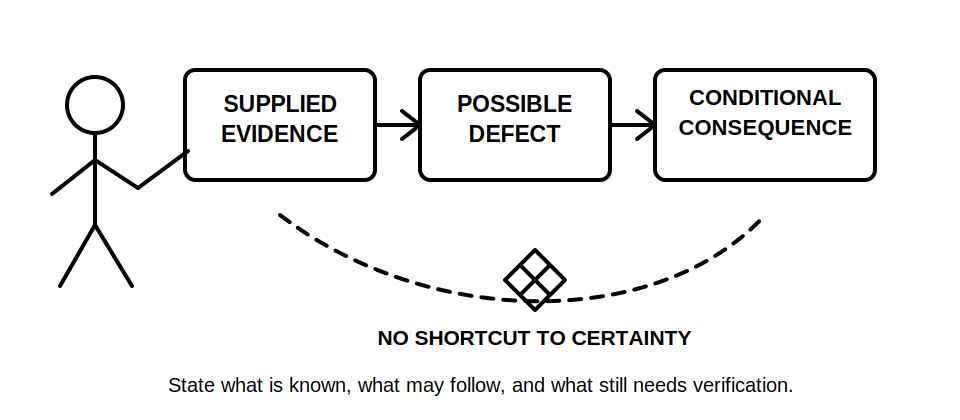
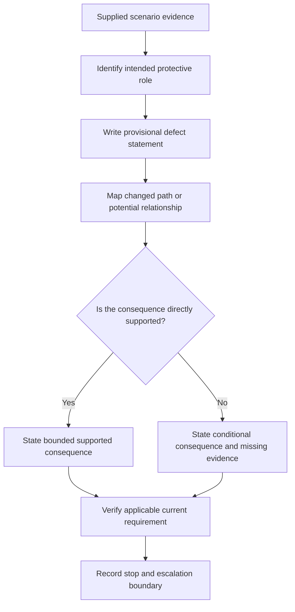
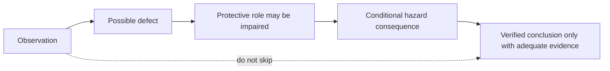

# Day 13 — Earthing Defect Scenarios and Consequence Analysis

> **Currency and safety notice:** This original educational module develops paper-based defect reasoning only. It does not establish that any real installation has a defect and grants no authority to open, inspect, test, isolate, alter, repair, energise or verify electrical equipment. Exact definitions, required arrangements, test methods, limits, acceptance criteria and jurisdiction-specific duties must be checked against current authorised sources. This module is `review-required`, not `technically-reviewed`.

## 1. Outcome and entry check

### Learning objectives

By the end of this module, the learner should be able to:

1. distinguish an **observation**, a **possible defect**, a **supported defect finding** and a **verified technical conclusion**;
2. analyse an original fictional earthing scenario by tracing the intended protective role, the changed condition and the plausible consequence chain;
3. identify which consequence claims are immediate, conditional or unsupported by the supplied evidence;
4. state what additional documentary, visual or test evidence would be required before strengthening a claim;
5. rank scenarios by potential safety significance without inventing likelihood, fault current, touch voltage or device-operation values;
6. write a bounded escalation statement that separates learner analysis from qualified inspection, testing and rectification;
7. revise the analysis when one scenario fact changes; and
8. score at least 10 out of 12 on the educational rubric with no zero in evidence control, consequence reasoning or safety boundary.

### Entry check

Without notes, answer briefly:

1. Why does a visible protective conductor not prove continuity?
2. What is the difference between protective earthing and equipotential bonding?
3. What must be present before a conceptual fault path becomes a supported protective-outcome claim?
4. Why is “the device will trip” usually too strong when no verified installation data is supplied?
5. What should a learner do when a scenario requires an exact clause, limit, test result or practical procedure?

Rate each answer as **guessing**, **unsure**, **reasonably confident** or **certain**. Any high-confidence error becomes a priority prerequisite repair before continuing.

## 2. Why it matters

Defect questions often reward disciplined evidence control more than dramatic fault descriptions. A learner may correctly recognise that an earthing-related condition is concerning but then overstate the result—for example, claiming that a conductive enclosure is energised, that a protective device cannot operate, or that a specific repair is required when the scenario provides no measurement, inspection record or authorised source.

A defensible analysis explains:

- what is actually supplied;
- which protective role may be affected;
- how the condition could alter a current path or potential relationship;
- which consequences depend on additional conditions; and
- where qualified inspection, testing or source verification is required.

*Caption: Move from supplied evidence to a bounded consequence claim; do not jump from appearance to certainty.*

## 3. Core concepts and terminology

### Observation

An **observation** is a supplied or directly documented fact in the fictional scenario, such as “the drawing shows no protective-conductor connection at the enclosure.” It is not automatically proof of the real installation condition.

### Possible defect

A **possible defect** is a condition that may depart from an applicable requirement or intended protective arrangement. It remains provisional when the applicable rule, installation context or physical condition has not been verified.

### Supported defect finding

A **supported defect finding** combines sufficient evidence with an applicable current requirement and a clearly identified mismatch. In real work, determining this may require authorised access, competent inspection, testing and documentation.

### Consequence chain

A **consequence chain** is a sequence linking:

1. the changed condition;
2. the protective role affected;
3. the current path or potential relationship that may change;
4. the resulting hazard mechanism; and
5. the evidence needed to confirm the outcome.

### Immediate, conditional and unsupported claims

- **Immediate claim:** follows directly from the supplied facts, such as “the drawing does not show the connection.”
- **Conditional claim:** may follow if additional stated conditions are true, such as “if the enclosure became connected to an active conductor and the protective path were ineffective, hazardous touch potential could persist.”
- **Unsupported claim:** goes beyond the evidence, such as “the enclosure is live” or “the device will not operate” without verified data.

### Protective-function impairment

**Protective-function impairment** means a condition may weaken, remove or make uncertain a protective role. It does not by itself prove that harm has occurred or that every protective layer has failed.

### Escalation statement

An **escalation statement** identifies what must happen next without prescribing unauthorised work. A bounded example is: “Treat the condition as requiring qualified inspection and verification against current authorised requirements; do not energise, reset or alter equipment on the basis of this paper analysis.”

## 4. Rule-finding workflow

Use **D-E-F-E-C-T**.

1. **D — Describe only the supplied evidence.** Separate drawing facts, written observations, assumptions and missing information.
2. **E — Establish the intended protective role.** Identify whether the relevant element concerns protective earthing, bonding, fault-current return, potential equalisation, identification or another function.
3. **F — Form a provisional defect statement.** Use bounded wording such as “possible absence,” “apparent discontinuity” or “requires verification.”
4. **E — Extend a consequence chain conditionally.** State the changed path or potential relationship and make every dependency explicit.
5. **C — Check the claim level and required source.** Decide whether the claim is observed, supported or still `reference_check_required`; identify current authorised references and evidence needed.
6. **T — Trigger the safe next action.** Record stop conditions and refer real inspection, testing, rectification and approval to appropriately authorised people.

The workflow prevents two opposite errors: dismissing a potentially significant condition because it is not yet proven, and declaring a complete failure without enough evidence.

### Evidence ledger

For each scenario, use four columns:

| Evidence class | Question | Example response |
|---|---|---|
| Supplied fact | What does the scenario explicitly state or show? | “The fictional inspection note records a loose connection.” |
| Derived statement | What follows logically without adding a new fact? | “The connection condition is uncertain and requires verification.” |
| Assumption | What am I tempted to add? | “The conductor has no continuity.” |
| Missing evidence | What would strengthen or reject the claim? | Authorised requirement, competent visual inspection, approved test evidence and installation context. |

The example responses are original learning prompts, not technical findings for a real installation.

## 5. Visual model or worked example

### Consequence-claim ladder

Each move requires additional support. The dotted line marks the unsafe shortcut from a single observation to a verified conclusion.

### Worked example — fictional metal enclosure

**Scenario evidence:** An original training drawing shows a metal enclosure supplied by a circuit. The protective conductor is drawn to a nearby junction point, but no continuation to the enclosure is visible. No inspection record, continuity result, supply details, device data or energisation state is supplied.

Apply D-E-F-E-C-T:

1. **Describe:** the drawing does not show a protective-conductor connection at the enclosure. That is a drawing observation, not proof of the physical installation.
2. **Establish:** the apparent role is protective earthing of an exposed conductive part, subject to correct classification and current requirements.
3. **Form:** “The scenario indicates a possible missing or undocumented protective-earthing connection requiring verification.”
4. **Extend:** if the enclosure is an exposed conductive part, if an active-to-enclosure fault occurs, and if no effective protective path exists, hazardous touch potential could persist and automatic disconnection may not occur as intended. Each clause is conditional.
5. **Check:** actual classification, required connection, continuity, fault-loop conditions and protective-device performance need current authorised requirements and competent verification.
6. **Trigger:** do not energise, access, test or alter real equipment on this analysis. Escalate for qualified inspection and verification.

### Faded example — bonding connection

A fictional inspection sketch shows a bonding conductor ending near, but not visibly connected to, a conductive service. Complete only these prompts:

- **Supplied evidence:** …
- **Possible affected role:** …
- **Provisional defect statement:** …
- **Conditional consequence:** …
- **Missing evidence:** …
- **Safe escalation:** …

Do not assume the service is an extraneous conductive part, that the connection is required, or that a hazardous potential difference exists until those claims are supported.

## 6. Practical application

Complete all work on paper using the supplied fictional facts only.

### Scenario A — damaged protective conductor shown in a maintenance photograph

The fictional record states that a green-and-yellow conductor has visible insulation damage beside a metal appliance. The photograph does not show conductor termination, continuity, conductor identity, appliance class, energisation state or test results.

Produce:

1. an observation statement;
2. two plausible but conditional protective concerns;
3. three missing evidence items;
4. one statement that would be an unsupported overclaim; and
5. a safe escalation statement.

### Scenario B — parallel conductive connection

A fictional diagram shows a bonding connection between two conductive systems and a separate protective conductor to equipment. A learner writes: “The bonding conductor is the normal return path and therefore proves the equipment is earthed.”

Identify:

1. each terminology or path error;
2. the distinct intended roles that must be considered;
3. why the drawing does not prove continuity or suitability;
4. a corrected bounded statement; and
5. the evidence needed before making a verified claim.

### Scenario C — changed condition transfer

Start with the worked enclosure scenario, then change one fact: an approved record now states that continuity of the relevant protective conductor was verified at an earlier date.

Explain:

- which claim becomes stronger;
- which claims remain unresolved because condition may have changed or other evidence is absent;
- why historical verification does not automatically prove current condition, fault-loop adequacy or device performance; and
- what the bounded next action remains.

### Consequence-analysis table

| Stage | Required learner response |
|---|---|
| Evidence | Supplied facts only |
| Protective role | Intended function potentially affected |
| Possible defect | Bounded provisional wording |
| Changed condition | Path, connection or potential relationship that may differ |
| Conditional consequence | Hazard mechanism with explicit “if” conditions |
| Missing proof | Source, inspection, test, documentation or context needed |
| Escalation | Safe stop and authorised next step |

### Performance rubric

Score each category **0–2**.

| Category | 0 | 1 | 2 |
|---|---|---|---|
| Evidence separation | Mixes facts, assumptions and conclusions | Separates some evidence but leaves hidden assumptions | Clearly labels supplied facts, derivations, assumptions and missing evidence |
| Protective-role accuracy | Assigns the wrong role or collapses earthing and bonding | Identifies a general protection concern | Correctly distinguishes the relevant protective roles |
| Defect wording | Declares a verified defect without support | Uses partly bounded wording | Writes a precise provisional or supported statement matching the evidence |
| Consequence reasoning | States harm or device action as certain | Gives a plausible consequence with weak dependencies | Builds a logical conditional chain and states each dependency |
| Source and evidence control | Uses memory or appearance as proof | Gives a general verification reminder | Identifies the exact evidence categories and current authorised sources needed |
| Safety and escalation | Proposes unauthorised access, testing or repair | Gives a vague caution | Applies explicit stop conditions and a bounded qualified escalation |

A score below **10/12**, or any zero in **consequence reasoning**, **source and evidence control** or **safety and escalation**, requires remediation with a different fictional scenario. This is an educational threshold, not an official RTO pass mark.

## 7. Common errors and safety checkpoint

### Common errors

- **Calling an observation a defect.** First establish the applicable requirement and adequate evidence.
- **Treating a drawing omission as physical proof.** Drawings, labels and photographs can be incomplete, stale or misinterpreted.
- **Jumping directly to injury or device failure.** Build the intermediate path and condition dependencies.
- **Assuming every conductive item requires the same connection.** Classification and applicable requirements must be verified.
- **Using historical evidence as proof of current condition.** Records support a claim only within their scope and currency.
- **Prescribing a repair from a paper scenario.** Rectification requires competent assessment, current requirements and proper authority.
- **Quoting remembered clause numbers, limits or test values.** Mark exact details `reference_check_required` until verified.
- **Using “safe” as an unqualified conclusion.** Safety is not established by one observation, one connection or one test result.

### Safety checkpoint

This module authorises no site access, opening, cover removal, isolation, proving, conductor tracing, continuity testing, resistance or loop measurement, fault creation, resetting, disconnection, reconnection, alteration, repair, energisation, commissioning, certification or verification.

Stop and seek qualified guidance when:

- the scenario concerns real equipment or a real suspected defect;
- the applicable classification or requirement cannot be verified from current authorised material;
- inspection or testing would be needed to distinguish possibilities;
- a learner is tempted to energise, reset, move, disconnect or expose equipment;
- the consequence depends on exact fault levels, operating times, touch-voltage conditions, test criteria or device characteristics;
- uncertainty is being replaced by confident guessing.

A paper-based analysis may identify concern and missing evidence. It does not establish that an installation is safe, unsafe, compliant or non-compliant.

## 8. Retrieval and next links

### Closed-note retrieval

1. State the six D-E-F-E-C-T steps.
2. Distinguish an observation, possible defect, supported finding and verified conclusion.
3. What makes a consequence claim conditional?
4. Why can a drawing omission not prove physical discontinuity?
5. Give one example of a historical record strengthening—but not completing—a claim.
6. State three activities this module does not authorise.

### Varied transfer

Create a new fictional scenario involving one unclear protective connection. Write seven lines only: evidence, protective role, possible defect, changed condition, conditional consequence, missing proof and escalation. Exchange the scenario with a peer or revisit it after 48 hours and identify any hidden assumption.

### Navigation

- **Program:** [Six-Week Capstone Learning Plan](../MASTER_PLAN.md)
- **Previous:** [Day 12 — Rest, Retrieval and Misconception Repair](day-12-rest-retrieval-and-misconception-repair.md)
- **Knowledge note:** [[Six-Week Day 13 - Earthing Defect Scenarios and Consequence Analysis]]
- **Next:** Day 14 — Week 2 Integrated MEN and Protection Exercise

### References and review boundary

- Revisit Days 8–12 for terminology, MEN paths, fault-current reasoning, protective-earthing continuity, bonding and misconception repair.
- Use a current authorised copy of applicable standards, current legislation, regulator guidance, network requirements, approved drawings, manufacturer information, workplace procedures and RTO instructions before making exact or practical claims.
- This module uses original explanations, workflows, diagrams, scenarios and assessment activities. It reproduces no standards table, figure, systematic clause wording or source PDF content.
- Exact classifications, connection requirements, test methods, values, acceptance criteria, defect findings and jurisdiction-specific duties remain `reference_check_required`; this content remains `review-required` and not `technically-reviewed`.
