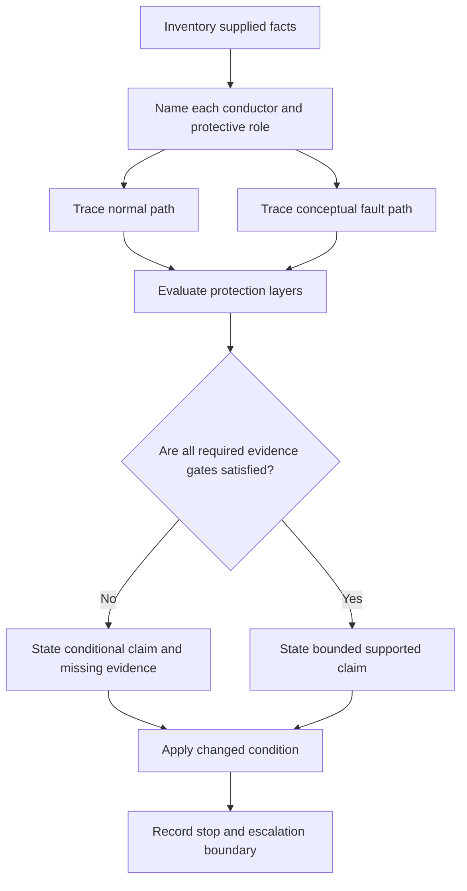
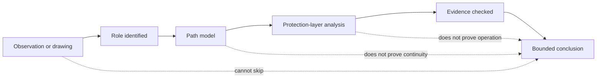

# Day 14 — Week 2 Integrated MEN and Protection Exercise

> **Currency and safety notice:** This is an original paper-based integration exercise. It does not establish the condition, compliance or safety of any real installation and grants no authority to inspect, open, isolate, test, alter, repair, energise, commission or verify electrical equipment. Exact definitions, arrangements, limits, device characteristics, test methods, acceptance criteria and jurisdiction-specific duties must be checked against current authorised sources. This module is `review-required`, `reference_check_required` and not `technically-reviewed`.

## 1. Outcome and entry check

### Learning objectives

By the end of this module, the learner should be able to:

1. classify each conductor, connection and protective element in an original fictional installation by its intended role;
2. separate the normal current path from the conceptual earth-fault current path without treating drawings as proof of physical continuity;
3. distinguish protective earthing, equipotential bonding, overcurrent protection and residual-current protection as related but non-interchangeable layers;
4. analyse two changed-condition scenarios using evidence-bounded consequence chains;
5. identify the authorised source categories and practical evidence needed before making an exact or verified claim;
6. revise a conclusion when one material fact changes;
7. write a safe escalation statement that does not prescribe unauthorised work; and
8. score at least 16 out of 20 on the educational rubric with no zero in path reasoning, evidence control or safety boundary.

### Entry check

Without notes, answer in one sentence each:

1. Why is the neutral path not interchangeable with the protective-earthing path?
2. What does a visible protective conductor prove, and what does it not prove?
3. Why can an RCD not be treated as proof of overcurrent protection or effective earthing?
4. What is the difference between an observation and a supported defect finding?
5. When must a paper-based learner stop and seek qualified guidance?

Rate each answer as **guessing**, **unsure**, **reasonably confident** or **certain**. Repair any high-confidence error before beginning the integrated scenario.

## 2. Why it matters

Capstone questions rarely isolate one concept. A single scenario may require the learner to identify an MEN-related arrangement, trace normal and fault paths, distinguish protective functions, classify evidence and decide what cannot yet be concluded.

The most common failure is not lack of terminology. It is collapsing several claims into one—for example:

- assuming that a drawn conductor proves continuity;
- assuming that a protective device proves an effective fault path;
- assuming that a bonding connection is a normal return path;
- assuming that one missing fact proves the installation unsafe; or
- assuming that recognising a concern authorises testing or rectification.

*Caption: Keep current path, protection role and evidence strength aligned; a conclusion is only as strong as the weakest required link.*

## 3. Core concepts and terminology

### Integrated claim

An **integrated claim** combines more than one domain—for example, a statement about conductor role, fault-current path, protective-device purpose and evidence strength. Each part must be supported independently.

### Normal current path

The **normal current path** is the intended operational circuit from source, through the load and back to the source. Its exact arrangement depends on the supply and installation context and must be verified from current authorised information.

### Conceptual earth-fault path

A **conceptual earth-fault path** is a reasoned model of how current might return to the source after an active-to-exposed-conductive-part fault. A conceptual path is not proof that each connection exists, is continuous, is suitable or will achieve a required protective outcome.

### Protective layer

A **protective layer** is one control or function contributing to risk reduction. Protective earthing, bonding, overcurrent protection, residual-current protection, insulation, barriers and safe work controls have distinct purposes. One layer must not be credited with another layer's function without evidence.

### Evidence gate

An **evidence gate** is a question that must be answered before a claim can be strengthened. Typical gates include identity, required role, physical connection, continuity, suitability, source conditions, device characteristics and verified results.

### Claim boundary

A **claim boundary** states the strongest conclusion justified by the supplied facts. It prevents a learner from turning a plausible mechanism into a verified technical finding.

### Changed condition

A **changed condition** is one altered scenario fact that requires the learner to reconsider only the affected parts of the reasoning chain. This tests understanding rather than memorised wording.

## 4. Rule-finding workflow

Use **I-N-T-E-G-R-A-T-E**.

1. **I — Inventory the supplied facts.** Separate labels, drawings, records, observations, assumptions and missing information.
2. **N — Name each intended role.** Identify normal-current, protective-earthing, bonding, overcurrent, residual-current and work-control functions without merging them.
3. **T — Trace normal and possible fault paths separately.** Mark every point where the path depends on an unverified connection or condition.
4. **E — Evaluate each protection layer.** State what harm it is intended to limit and what it cannot prove by itself.
5. **G — Grade every claim.** Label it observed, derived, conditional, supported or still `reference_check_required`.
6. **R — Recheck against current authorised sources.** Identify source categories needed for exact definitions, arrangements, limits and duties.
7. **A — Apply a changed condition.** Revise only the claims genuinely affected by the new fact.
8. **T — Trigger stop and escalation boundaries.** Do not convert paper reasoning into unauthorised inspection, testing, switching or repair.
9. **E — Explain the final bounded conclusion.** State what is known, what is plausible, what is missing and what the authorised next step is.

The two path branches are deliberately separate. They meet only when the learner evaluates how the installation's protective layers relate to the scenario. The evidence gate prevents a drawing-based model from becoming an unsupported verified conclusion.

### Source-navigation record

For every exact claim, record:

| Source question | Required response |
|---|---|
| What type of requirement is involved? | Definition, arrangement, connection, protection, inspection, test, documentation or jurisdictional duty |
| Which authorised source family governs it? | Current standard, legislation, regulator guidance, network requirement, manufacturer information, workplace procedure or RTO instruction |
| What evidence is still missing? | Installation context, approved drawing, competent observation, verified test result, device data or other relevant record |
| What is the current claim status? | `reference_check_required`, conditional, supported within the fictional facts, or outside learner authority |

## 5. Visual model or worked example

### Evidence-strength matrix

The dotted shortcuts show three common overclaims. A drawing, a plausible path or a named device may support analysis, but none alone proves the final protective outcome.

### Worked example — fictional detached workshop

**Supplied facts:** An original training drawing shows a main switchboard, a feeder to a detached workshop, a neutral conductor, a protective conductor, a metal workshop enclosure and an RCD symbol. The drawing states that the workshop enclosure is connected to the protective conductor. No installation type, conductor sizes, connection details, continuity result, device rating, source data, fault-loop evidence, commissioning record or current inspection record is supplied.

Apply I-N-T-E-G-R-A-T-E:

1. **Inventory:** the drawing supplies labels and intended connections only.
2. **Name:** neutral belongs to the normal return-path model; the protective conductor has a protective-earthing role; the RCD has a residual-current protection role; the enclosure may require classification as an exposed conductive part.
3. **Trace:** model the normal path through the load and neutral separately from the conditional active-to-enclosure fault path through the protective arrangement.
4. **Evaluate:** the RCD symbol does not prove overcurrent protection, effective earthing, correct selection, continuity or operation.
5. **Grade:** “the drawing shows an intended protective connection” is observed; “the connection is continuous and suitable” is unsupported; “a fault may create a protective-current path” is conditional.
6. **Recheck:** exact arrangement, required connections, device requirements and test criteria remain `reference_check_required`.
7. **Apply change:** if a current authorised record is added stating that relevant continuity was verified, the continuity claim becomes stronger within that record's scope and date, but device performance, current condition and the complete protective outcome remain unresolved.
8. **Trigger:** no real equipment may be accessed, reset, tested or energised on this analysis.
9. **Explain:** the scenario supports a role-and-path model plus a list of missing evidence; it does not establish compliance or safety.

### Faded example — metal service near equipment

A fictional sketch shows a conductive service entering a building near metal equipment. A bonding conductor is shown, but the sketch does not establish the service classification, connection condition, continuity or supply arrangement.

Complete only these prompts:

- **Supplied facts:** …
- **Role classifications requiring verification:** …
- **Normal path:** …
- **Possible fault or potential-difference concern:** …
- **Protection layers involved:** …
- **Unsupported conclusion to avoid:** …
- **Missing evidence and sources:** …
- **Safe escalation:** …

## 6. Practical application

Complete the following on paper. Use only the fictional facts supplied.

### Part A — integrated installation map

For the detached-workshop scenario, create a table with one row for each labelled conductor, connection, enclosure and device.

| Item | Intended role | Normal-path relevance | Fault-path relevance | Evidence supplied | Missing evidence | Claim boundary |
|---|---|---|---|---|---|---|

Do not infer continuity, suitability or operation merely because an item appears on the drawing.

### Part B — changed-condition sequence

Reanalyse the scenario three times, changing only one fact per round:

1. the protective conductor is no longer shown connected to the workshop enclosure;
2. an older maintenance record states that continuity was once verified;
3. the RCD symbol is removed from the drawing.

For each round, state:

- which observations changed;
- which path or role claims changed;
- which claims did not change;
- which new evidence is needed; and
- the bounded conclusion and stop boundary.

### Part C — misconception diagnosis

Correct each statement:

1. “The RCD proves the enclosure is safely earthed.”
2. “The bonding conductor is the normal return path.”
3. “The drawing shows a protective conductor, so continuity is confirmed.”
4. “A possible fault path proves the protective device will operate within the required time.”
5. “The missing symbol proves the installation is non-compliant.”

For each correction, name the exact reasoning error: role confusion, path confusion, evidence overclaim, device-function overclaim or unsupported compliance claim.

### Part D — timed integrated response

In 20 minutes, write a one-page response to a new original fictional scenario supplied by a peer or generated from the Day 8–13 concepts. The response must contain:

1. facts and assumptions;
2. role classifications;
3. separate normal and fault-path models;
4. protection-layer analysis;
5. claim grades;
6. current authorised source categories required;
7. changed-condition revision; and
8. stop and escalation statement.

### Performance rubric

Score each category **0–2**.

| Category | 0 | 1 | 2 |
|---|---|---|---|
| Terminology and roles | Collapses or mislabels roles | Mostly correct but one role remains vague | Distinguishes all relevant roles precisely |
| Normal-path reasoning | Confuses protective and normal paths | General path is plausible but incomplete | Traces the intended normal path with explicit evidence limits |
| Fault-path reasoning | Treats a hypothetical path as proven or omits key dependencies | Gives a plausible path with some hidden assumptions | Builds a conditional path and identifies every material evidence gate |
| Protection-layer reasoning | Credits one device with unrelated functions | Identifies layers but incompletely separates purposes | Separates each layer's purpose and limitation |
| Evidence control | Converts drawings or labels into verified conclusions | Uses some bounded wording | Grades every claim and identifies missing proof |
| Source navigation | Relies on memory or invented exact details | Names general sources | Matches each exact claim to the appropriate current authorised source family |
| Changed-condition revision | Repeats the original answer unchanged | Revises some affected claims | Revises only the claims actually changed by the new fact |
| Consequence analysis | States device action or harm as certain | Gives a plausible but weakly bounded consequence | Writes a logical conditional chain with dependencies |
| Explanation quality | Unstructured or contradictory | Understandable but incomplete | Concise, ordered and technically bounded |
| Safety and escalation | Proposes unauthorised access, testing or repair | Gives a vague warning | Applies explicit stop conditions and qualified escalation |

A score below **16/20**, or any zero in **fault-path reasoning**, **evidence control** or **safety and escalation**, requires remediation using a different fictional scenario. This is an educational threshold, not an official RTO assessment rule.

## 7. Common errors and safety checkpoint

### Common errors

- **Using one combined line for normal and fault paths.** Draw and explain them separately.
- **Treating an intended connection as verified continuity.** Identify the missing evidence gate.
- **Treating bonding as protective earthing or normal return.** State the role before analysing the path.
- **Treating an RCD as universal protection.** Separate residual-current, overcurrent, fault-path and isolation questions.
- **Claiming device operation from a conceptual path.** Exact outcomes require verified installation and device evidence.
- **Treating missing drawing information as proof of a physical defect.** Record the omission and require verification.
- **Using remembered clauses or values.** Mark them `reference_check_required` until checked against current authorised sources.
- **Prescribing rectification.** A learner may identify concern and escalation needs, not authorise practical work.

### Safety checkpoint

This module authorises no site access, switching, isolation, proving, opening, cover removal, conductor tracing, continuity testing, resistance or loop measurement, device testing, fault creation, resetting, disconnection, reconnection, alteration, repair, energisation, commissioning, certification or verification.

Stop and seek qualified guidance when:

- the scenario refers to real equipment or a real suspected defect;
- exact classification, arrangement, connection or device requirements cannot be verified;
- inspection or testing is needed to distinguish possibilities;
- a learner proposes energising, resetting, opening, moving or altering equipment;
- the conclusion depends on fault level, touch potential, operating time, device curve, test result or another exact technical value; or
- confidence exceeds the evidence.

A complete paper response may demonstrate reasoning quality. It does not prove that a real installation is safe, unsafe, compliant or non-compliant.

## 8. Retrieval and next links

### Closed-note retrieval

1. State the nine I-N-T-E-G-R-A-T-E steps.
2. Why must normal and fault paths be traced separately?
3. Name four distinct protective layers or functions and one limitation of each.
4. What are three evidence gates between a drawing and a verified conclusion?
5. Explain why a changed fact should not force every conclusion to change.
6. State five activities this module does not authorise.

### Delayed transfer

After 48 hours, redraw the detached-workshop model from memory. Then compare it with the module and record:

- one omitted role;
- one hidden assumption;
- one evidence gate you initially skipped; and
- one corrected bounded conclusion.

### Navigation

- **Program:** [Six-Week Capstone Learning Plan](../MASTER_PLAN.md)
- **Previous:** [Day 13 — Earthing Defect Scenarios and Consequence Analysis](day-13-earthing-defect-scenarios-and-consequence-analysis.md)
- **Knowledge note:** [[Six-Week Day 14 - Week 2 Integrated MEN and Protection Exercise]]
- **Next:** Day 15 — Load Identification and Maximum-Demand Workflow

### References and review boundary

- Revisit Days 8–13 for terminology, MEN models, normal and fault paths, protective earthing, bonding, retrieval repair and defect-consequence analysis.
- Use current authorised standards, legislation, regulator guidance, network requirements, approved drawings, manufacturer information, workplace procedures and RTO instructions before making exact or practical claims.
- This module uses original explanations, workflows, diagrams, scenarios, tables and assessment tasks organised around learner decisions rather than a standards clause sequence.
- No standards table, figure, systematic clause wording, exact test value or source PDF content is reproduced.
- Exact definitions, arrangements, classifications, connection requirements, device characteristics, test methods, values, acceptance criteria and jurisdiction-specific duties remain `reference_check_required`; this content remains `review-required` and not `technically-reviewed`.