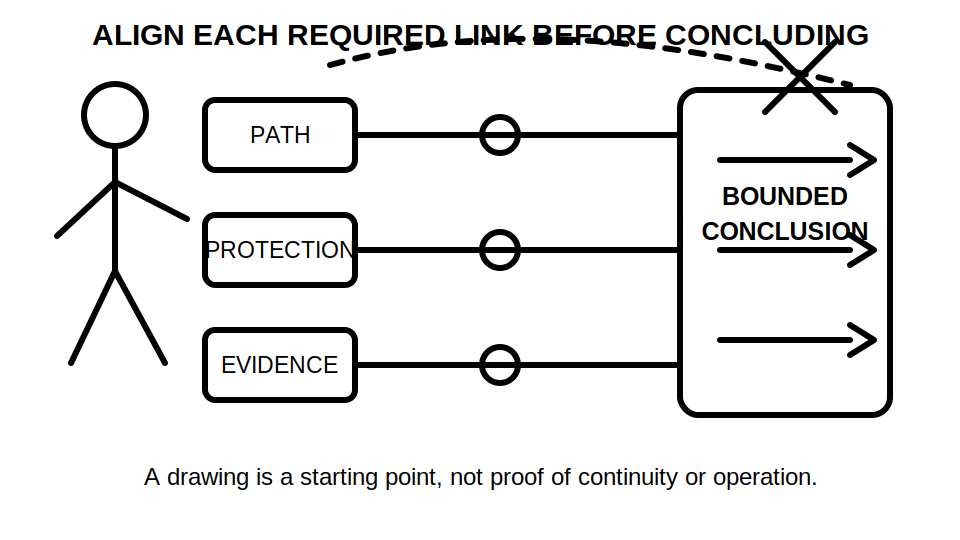
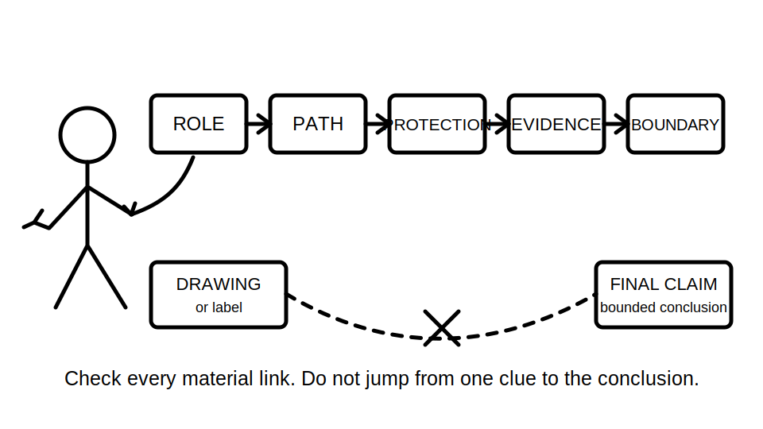
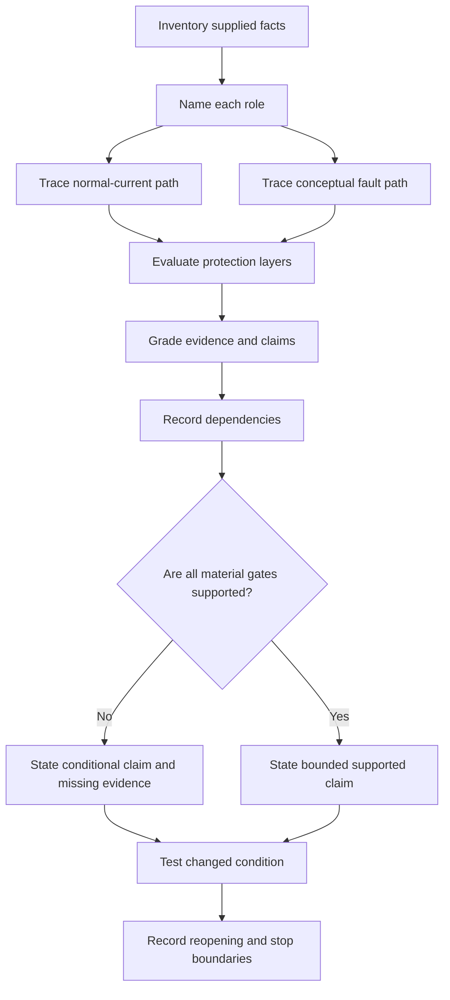
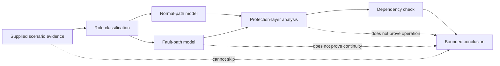

# Day 14 — Week 2 Integrated MEN and Protection Exercise

> **Currency and safety notice:** This is an original paper-based integration exercise. It does not establish the condition, compliance or safety of any real installation and grants no authority to inspect, open, isolate, test, alter, repair, energise, commission or verify electrical equipment. Exact definitions, arrangements, limits, device characteristics, test methods, acceptance criteria and jurisdiction-specific duties must be checked against current authorised sources. This module is `review-required`, `reference_check_required` and not `technically-reviewed`.

## 1. Outcome and entry check

### Learning objectives

By the end of this module, the learner should be able to:

1. classify each supplied conductor, connection, conductive part and protective element in an original fictional installation by intended role;
2. trace the normal-current path and a conceptual earth-fault path separately, marking every unverified dependency;
3. distinguish protective earthing, equipotential bonding, overcurrent protection, residual-current protection and work controls as related but non-interchangeable layers;
4. grade evidence and claims consistently before writing an integrated conclusion;
5. maintain an integration ledger linking each claim to its dependencies, evidence state and reopening trigger;
6. revise only affected claims when one source, connection, device or scenario condition changes;
7. identify the current authorised source categories and competent evidence needed before an exact or verified claim can be made; and
8. produce a bounded assessment-style response scoring at least 10 out of 12 on the educational rubric with no critical error.

### Entry check

Without notes, answer in one sentence each:

1. Why is the neutral path not interchangeable with the protective-earthing path?
2. What does a visible or drawn protective conductor prove, and what does it not prove?
3. Why can an RCD not be treated as proof of overcurrent protection or effective earthing?
4. What is the difference between an observation, a conditional mechanism and a supported finding?
5. Which changed facts would require an integrated conclusion to be reopened?
6. When must a paper-based learner stop and seek qualified guidance?

Rate each answer as **guessing**, **unsure**, **reasonably confident** or **certain**. Repair any high-confidence error before beginning the integrated scenario.

## 2. Why it matters

Capstone questions rarely isolate one concept. A single scenario may require the learner to identify an MEN-related relationship, trace normal and fault paths, distinguish protective functions, classify evidence and decide what cannot yet be concluded.

The central difficulty is **dependency control**. A conclusion can fail even when most of its parts are plausible because one material link remains assumed. Common examples include:

- treating a drawing as proof of physical continuity;
- treating a protective-device symbol as proof of correct selection or operation;
- treating a bonding connection as a normal-current return path;
- treating a historical result as proof of current condition;
- treating missing information as proof of a defect; or
- treating correct paper reasoning as authority to inspect, test or rectify.

*Caption: Keep current path, protection role and evidence strength aligned; a conclusion is only as strong as the weakest required link.*

*Caption: An integrated claim must pass every material dependency gate; one plausible link cannot stand in for the complete chain.*

## 3. Core concepts and terminology

### Integrated claim

An **integrated claim** combines more than one domain, such as component identity, current path, protective purpose, device response and evidence strength. Each material part must be supported independently.

### Dependency

A **dependency** is a fact or condition that must remain true for a claim to remain valid. Examples include source arrangement, conductor identity, connection location, continuity, device characteristics, installation condition and the currency of a record.

### Reopening trigger

A **reopening trigger** is new or changed information that makes an earlier conclusion provisional again. A changed source, altered connection, revised drawing, replaced device, stale record or conflicting observation can all trigger reopening.

### Normal-current path

The **normal-current path** is the intended operational circuit from source, through the load and back to the source. Its exact arrangement depends on the supply and installation context and must be verified from current authorised information.

### Conceptual earth-fault path

A **conceptual earth-fault path** is a reasoned model of how current might return to the source after an active-to-exposed-conductive-part fault. It is not proof that each connection exists, is continuous, is suitable or will produce a required protective outcome.

### Protective layer

A **protective layer** is one control or function contributing to risk reduction. Protective earthing, bonding, overcurrent protection, residual-current protection, insulation, barriers and work controls have distinct purposes. One layer must not be credited with another layer's function without evidence.

### Evidence grades

Use these five grades consistently:

1. **Supplied** — directly stated or shown in the fictional scenario.
2. **Corroborated** — supported by more than one compatible supplied source.
3. **Derived** — reasoned from supplied facts with the inference shown.
4. **Assumed** — necessary for the reasoning but not supplied or verified.
5. **Missing or conflicting** — absent, stale, incompatible or unresolved.

An evidence grade describes the support available. It does not by itself determine whether a technical requirement is satisfied.

### Claim grades

Use these four claim grades:

1. **Descriptive** — reports what the scenario states or shows.
2. **Conditional** — explains what may follow if named dependencies are true.
3. **Supported within the fictional facts** — justified by the supplied scenario while remaining bounded to that scenario.
4. **Authorised verification required** — depends on current technical sources, competent inspection, test evidence or practical authority.

### Claim boundary

A **claim boundary** states the strongest conclusion justified by the evidence. It prevents a plausible mechanism from becoming an unsupported verified finding.

## 4. Rule-finding workflow

Use **I-N-T-E-G-R-A-T-E**.

1. **I — Inventory the supplied facts.** Separate labels, drawings, records, observations, assumptions and missing information.
2. **N — Name each intended role.** Identify normal-current, protective-earthing, bonding, overcurrent, residual-current and work-control functions without merging them.
3. **T — Trace normal and possible fault paths separately.** Mark every point where a path depends on an unverified connection or condition.
4. **E — Evaluate each protection layer.** State the harm it is intended to limit and what it cannot prove by itself.
5. **G — Grade evidence and claims.** Use the five evidence grades and four claim grades above.
6. **R — Record dependencies and reopening triggers.** Link each material claim to the facts that must remain true.
7. **A — Apply current authorised source checks.** Identify the source family and competent evidence required for every exact claim.
8. **T — Test a changed condition.** Revise only claims genuinely affected by the new fact.
9. **E — Explain the bounded conclusion and stop boundary.** State what is known, conditional, missing and outside learner authority.

The path branches remain separate until protection-layer analysis. The dependency gate prevents a drawing-based model, device label or historical record from becoming an unsupported verified conclusion.

### Integration ledger

For each material claim, complete one row:

| Claim | Evidence grade | Claim grade | Material dependencies | Missing or conflicting evidence | Reopening trigger | Current authorised source or competent evidence needed |
|---|---|---|---|---|---|---|

The ledger is not a compliance certificate. It is a reasoning-control tool that makes hidden assumptions visible.

### Source-navigation record

For every exact claim, record:

| Source question | Required response |
|---|---|
| What type of requirement is involved? | Definition, arrangement, connection, protection, inspection, test, documentation or jurisdictional duty |
| Which authorised source family governs it? | Current standard, legislation, regulator guidance, network requirement, manufacturer information, workplace procedure or RTO instruction |
| What evidence is still missing? | Installation context, approved drawing, competent observation, verified test result, device data or another relevant current record |
| What is the current claim status? | Descriptive, conditional, supported within the fictional facts or authorised verification required |

## 5. Visual model or worked example

### Dependency-chain model

The dotted shortcuts identify common overclaims. A drawing, plausible path or named protective device may support analysis, but none alone proves the complete protective outcome.

### Worked example — fictional detached workshop

**Supplied facts:** An original training drawing shows a main switchboard, a feeder to a detached workshop, a neutral conductor, a protective conductor, a metal workshop enclosure and an RCD symbol. The drawing states that the enclosure is connected to the protective conductor. No installation type, conductor sizes, connection details, continuity result, device rating, source data, fault-loop evidence, commissioning record or current inspection record is supplied.

Apply I-N-T-E-G-R-A-T-E:

1. **Inventory:** labels and intended connections are supplied; physical condition and performance are not.
2. **Name:** neutral belongs to the normal-return model; the protective conductor has a protective-earthing role; the RCD has a residual-current protection role; the enclosure may require classification as an exposed conductive part.
3. **Trace:** model the normal path through the load and neutral separately from the conditional active-to-enclosure fault path through the protective arrangement.
4. **Evaluate:** the RCD symbol does not prove overcurrent protection, effective earthing, correct selection, continuity or operation.
5. **Grade:** the shown connection is **supplied** and supports a **descriptive** claim; continuity is **missing** and requires **authorised verification**; the possible fault path is a **derived**, **conditional** claim.
6. **Record:** dependencies include correct conductor identity, actual termination, continuity, source relationship, relevant device characteristics and current condition.
7. **Apply source checks:** exact arrangements, required connections, device requirements and acceptance criteria remain `reference_check_required`.
8. **Test change:** if a current authorised record is added stating that relevant continuity was verified, the continuity claim strengthens only within that record's scope and date. Device performance and current physical condition remain unresolved.
9. **Explain:** the scenario supports a role-and-path model plus a list of missing evidence. It does not establish compliance or safety and authorises no practical action.

### Faded example — metal service near equipment

A fictional sketch shows a conductive service entering a building near metal equipment. A bonding conductor is shown, but the sketch does not establish the service classification, connection condition, continuity or supply arrangement.

Complete only these prompts:

- supplied and missing facts;
- role classifications requiring verification;
- separate normal and possible fault-path models;
- protection layers involved;
- evidence and claim grades;
- material dependencies and reopening triggers;
- unsupported conclusion to avoid;
- current authorised sources or competent evidence needed; and
- safe escalation statement.

## 6. Practical application

Complete the following on paper using only fictional facts.

### Part A — integrated installation map

For the detached-workshop scenario, create one row for each labelled conductor, connection, enclosure and device.

| Item | Intended role | Normal-path relevance | Fault-path relevance | Evidence grade | Claim grade | Dependencies | Reopening trigger | Claim boundary |
|---|---|---|---|---|---|---|---|---|

Do not infer continuity, suitability or operation merely because an item appears on a drawing.

### Part B — changed-condition sequence

Reanalyse the scenario three times, changing only one fact per round:

1. the protective conductor is no longer shown connected to the workshop enclosure;
2. an older maintenance record states that continuity was once verified; and
3. the RCD symbol is removed from the drawing.

For each round, state:

- which supplied facts changed;
- which dependencies reopened;
- which claims changed and which remained valid;
- which evidence grades changed;
- which new source or competent evidence is needed; and
- the bounded conclusion and stop boundary.

### Part C — misconception diagnosis

Correct each statement and name the exact reasoning error:

1. “The RCD proves the enclosure is safely earthed.”
2. “The bonding conductor is the normal return path.”
3. “The drawing shows a protective conductor, so continuity is confirmed.”
4. “A possible fault path proves the protective device will operate as required.”
5. “The missing symbol proves the installation is non-compliant.”
6. “A result recorded several years ago proves the present condition.”

Use these error labels: role confusion, path confusion, evidence overclaim, device-function overclaim, stale-evidence overclaim or unsupported compliance claim.

### Part D — independent transfer

In 20 minutes, complete a one-page response to a new original fictional scenario using the Day 8–13 concepts. Include:

1. supplied facts and assumptions;
2. role classifications;
3. separate normal and fault-path models;
4. protection-layer analysis;
5. evidence and claim grades;
6. an integration ledger with dependencies and reopening triggers;
7. current authorised source categories required;
8. one changed-condition revision; and
9. a stop and escalation statement.

### Educational rubric

Score each category **0–2**.

| Category | 0 | 1 | 2 |
|---|---|---|---|
| Role and path separation | Confuses roles or merges normal and fault paths | Mostly separates them but leaves one hidden assumption | Classifies roles and traces both paths with explicit limits |
| Protection-layer reasoning | Credits one layer with unrelated functions | Identifies layers but incompletely separates purposes | States each relevant layer's purpose and limitation |
| Evidence and claim control | Converts labels, drawings or history into verified conclusions | Uses some bounded wording but grades inconsistently | Grades evidence and claims consistently and identifies missing proof |
| Dependency and reopening control | Omits material dependencies or leaves conclusions unchanged after a relevant change | Records some dependencies or revises too broadly | Links every material claim to dependencies and reopens only affected claims |
| Source navigation and explanation | Relies on memory, invented exact details or an unclear response | Names general sources and gives a mostly ordered response | Matches exact claims to current authorised source families and explains a concise bounded chain |
| Safety and authority boundary | Proposes unauthorised access, testing, resetting or repair | Gives a vague warning | Applies explicit stop conditions and qualified escalation |

A score below **10/12**, or any zero in **role and path separation**, **evidence and claim control**, **dependency and reopening control** or **safety and authority boundary**, requires remediation using a different fictional scenario. This is an educational threshold, not an official RTO assessment rule.

## 7. Common errors and safety checkpoint

### Common errors

- **Using one combined line for normal and fault paths.** Draw and explain them separately.
- **Treating an intended connection as verified continuity.** Identify the missing evidence gate.
- **Treating bonding as protective earthing or normal return.** State the role before analysing the path.
- **Treating an RCD as universal protection.** Separate residual-current, overcurrent, fault-path and work-control questions.
- **Claiming device operation from a conceptual path.** Exact outcomes require verified installation and device evidence.
- **Treating missing drawing information as proof of a physical defect.** Record the omission and require verification.
- **Treating historical evidence as permanently current.** Check scope, date, subsequent change and present applicability.
- **Rewriting every conclusion after one fact changes.** Reopen only claims dependent on that fact.
- **Using remembered clauses or values.** Mark them `reference_check_required` until checked against current authorised sources.
- **Prescribing rectification.** A learner may identify concern and escalation needs, not authorise practical work.

### Critical-error gates

The attempt is not educationally satisfactory if the learner:

- merges neutral and protective-earthing roles;
- states that a drawing, label or historical record proves current physical continuity or suitability;
- states that a conceptual fault path proves required device operation;
- invents an exact clause, value, test result or official assessment requirement; or
- proposes unauthorised opening, isolation, testing, resetting, alteration, repair or energisation.

### Safety checkpoint

This module authorises no site access, switching, isolation, proving, opening, cover removal, conductor tracing, continuity testing, resistance or loop measurement, device testing, fault creation, resetting, disconnection, reconnection, alteration, repair, energisation, commissioning, certification or verification.

Stop and seek qualified guidance when:

- the scenario refers to real equipment or a real suspected defect;
- exact classification, arrangement, connection or device requirements cannot be verified;
- inspection or testing is needed to distinguish possibilities;
- a learner proposes energising, resetting, opening, moving or altering equipment;
- the conclusion depends on fault level, touch potential, operating time, device curve, test result or another exact technical value; or
- confidence exceeds the evidence.

A complete paper response may demonstrate reasoning quality. It does not prove that a real installation is safe, unsafe, compliant or non-compliant.

## 8. Retrieval and next links

### Closed-note retrieval

1. State the nine I-N-T-E-G-R-A-T-E steps.
2. Define dependency and reopening trigger.
3. Why must normal and fault paths be traced separately?
4. State the five evidence grades and four claim grades.
5. Name four distinct protective layers or functions and one limitation of each.
6. What are three evidence gates between a drawing and a verified conclusion?
7. Explain why a changed fact should not force every conclusion to change.
8. State five activities this module does not authorise.

### Delayed transfer

After 48 hours, redraw the detached-workshop model and integration ledger from memory. Then compare them with the module and record:

- one omitted role;
- one hidden assumption;
- one dependency or reopening trigger initially missed;
- one evidence or claim grade corrected; and
- one improved bounded conclusion.

### Navigation

- **Program:** [Six-Week Capstone Learning Plan](../MASTER_PLAN.md)
- **Previous:** [Day 13 — Earthing Defect Scenarios and Consequence Analysis](day-13-earthing-defect-scenarios-and-consequence-analysis.md)
- **Knowledge note:** [[Six-Week Day 14 - Week 2 Integrated MEN and Protection Exercise]]
- **Next:** [Day 15 — Load Identification and Maximum-Demand Workflow](day-15-load-identification-and-maximum-demand-workflow.md)

### References and review boundary

- Revisit Days 8–13 for terminology, MEN models, normal and fault paths, protective earthing, bonding, retrieval repair and defect-consequence analysis.
- Use current authorised standards, legislation, regulator guidance, network requirements, approved drawings, manufacturer information, workplace procedures and RTO instructions before making exact or practical claims.
- This module uses original explanations, workflows, diagrams, scenarios, tables and assessment tasks organised around learner decisions rather than a standards clause sequence.
- No standards table, figure, systematic clause wording, exact test value or source PDF content is reproduced.
- Exact definitions, arrangements, classifications, connection requirements, device characteristics, test methods, values, acceptance criteria and jurisdiction-specific duties remain `reference_check_required`; this content remains `review-required` and not `technically-reviewed`.