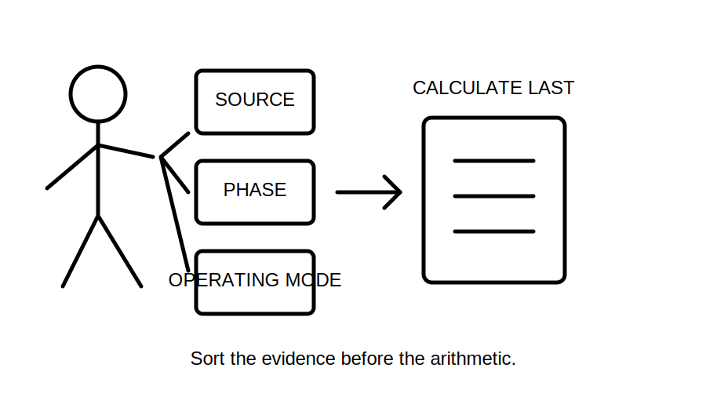
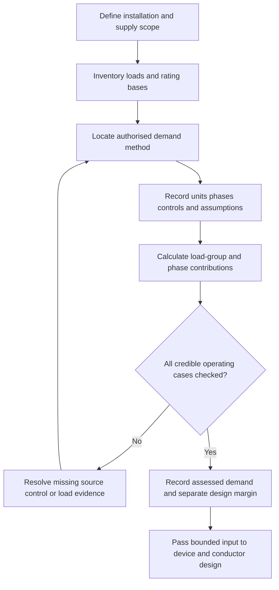
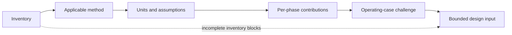

# Day 15 — Load Identification and Maximum-Demand Workflow

> **Currency, copyright and safety notice:** This original learning module teaches a reasoning and evidence workflow. It does not reproduce standards tables, demand factors, clause wording or network calculation rules. Exact allowances, limits, equations, supply assumptions and jurisdiction-specific requirements remain `reference_check_required`. Fictional figures are for learning only. This module is `review-required` and not `technically-reviewed`.

## 1. Outcome and entry check

### Observable objectives

By the end of this block, the learner should be able to:

1. distinguish connected load, assessed maximum demand, diversity, coincidence, controlled load and design margin;
2. build a load inventory that records rating basis, units, quantity, phase, source and operating mode;
3. identify missing information before converting power to current;
4. select the correct authorised source family for the installation and load category;
5. apply a fictional training method while keeping every assumption visible;
6. challenge the result for simultaneous operation, phase imbalance, alternate sources and future loads;
7. state a bounded output suitable for the next design stage; and
8. score at least 10/12 on the educational rubric with no zero for evidence control or safety boundary.

### Entry check — six minutes, closed note

Answer briefly:

1. Why is connected load not automatically maximum demand?
2. What information is missing from a load recorded only as “8 kW”?
3. Why is an unsupported percentage not diversity?
4. How can a reasonable total conceal an excessive phase demand?
5. Which exact values must be checked in authorised current sources?

Rate each answer: **guessing**, **unsure**, **reasonably confident** or **certain**.

## 2. Why it matters

Maximum demand is an early design input. An incomplete or incorrectly classified load model can distort downstream decisions about supply capacity, protective devices, conductors, switchboards, phase allocation and voltage drop. The goal is not the smallest number or the sum of every rating. The goal is a traceable estimate produced by an applicable method and realistic operating assumptions.

*Caption: Sort the evidence before the arithmetic; a mystery percentage is not a design method.*

## 3. Core concepts and terminology

- **Connected load:** the combined rating of equipment or load points within the defined scope. It is an inventory quantity, not proof of simultaneous demand.
- **Maximum demand:** the greatest demand assessed for the installation or section using an applicable authorised method and stated assumptions.
- **Demand allowance:** the contribution assigned to a load or group under the selected method. Exact allowances remain `reference_check_required`.
- **Diversity:** a justified reduction arising because individual maximum loads need not occur together.
- **Coincidence:** the degree to which loads operate at the same time.
- **Controlled load:** a load whose simultaneous operation is limited by a documented and reliable control arrangement.
- **Design margin:** a separately recorded allowance for future or uncertain demand; it must not be hidden inside an unexplained factor.
- **Rating basis:** whether a stated value is current, real power, apparent power, input power, output power or another quantity.
- **Phase allocation:** assignment of single-phase loads across a multiphase supply.
- **Operating case:** one credible combination of loads and sources that must be checked.

## 4. Rule-finding workflow

Use **L-O-A-D-S**:

1. **L — List the complete scope.** Record existing, proposed and future loads, quantities, rating bases, phases, sources and operating modes.
2. **O — Obtain the governing method.** Identify installation type and locate the applicable current authorised source, including notes, exceptions and cross-references.
3. **A — Align units and assumptions.** State voltage, phase, power factor, efficiency and control assumptions before conversion or calculation.
4. **D — Determine group and phase contributions.** Keep connected load, assessed contribution and design margin separate.
5. **S — Stress-test and state the result.** Check coincidence, phase balance, starting or cyclic behaviour, alternate supplies, future loads and missing evidence; then write a bounded conclusion.

The loop prevents calculation from outrunning classification. A precise total built from an incomplete inventory or inapplicable method is still weak evidence.

## 5. Visual model or worked example

### Fictional worked example

A small training tenancy has these invented loads:

| Load group | Connected rating | Training-only contribution |
|---|---:|---:|
| Lighting | 3.0 kW | 3.0 kW |
| Socket-outlet inventory | 12.0 kW | 4.8 kW |
| Fixed heater | 4.0 kW | 4.0 kW |
| Two air conditioners | 6.0 kW combined | 4.2 kW |
| Future margin | 2.0 kW | recorded separately |

The fictional present contribution is `3.0 + 4.8 + 4.0 + 4.2 = 16.0 kW`; the separate training design total is `18.0 kW`. These invented contributions are not standards values.

Before converting to current, the learner must resolve voltage, phase arrangement, rating basis, relevant power-factor or efficiency data, phase allocation, control assumptions, source topology and the applicable authorised demand method.

### Worked-example fading

Recalculate a second fictional scenario where the load ratings are supplied but the phase allocation, one control assumption and one rating basis are missing. Stop at each missing item and state what evidence is required rather than inventing it.

## 6. Practical application

### Part A — load-register build

For an original fictional workshop, create a register with columns for item, quantity, rating, rating basis, source, phase, operating mode, control dependency, demand category, evidence source and unresolved questions.

### Part B — three operating cases

Compare:

1. normal occupied operation;
2. a peak-use case with heating and process loads together; and
3. an alternate-source or future-load case.

State which assumptions change and which do not.

### Part C — changed-condition transfer

Revise the model when one fact changes: a proposed interlock is removed. Identify affected contributions, phase checks, evidence needs and downstream decisions.

### Educational rubric

Score each category **0–2**: terminology, inventory completeness, source selection, calculation traceability, evidence control, safety and claim boundary. A score below **10/12**, or zero in evidence control or safety, requires a varied re-attempt. This is not an official RTO threshold.

## 7. Common errors and safety checkpoint

### Common errors

- adding every rating and calling the result maximum demand;
- applying a remembered percentage without its category and conditions;
- mixing amperes, kilowatts and kilovolt-amperes without a conversion basis;
- ignoring phase allocation;
- treating an undocumented control as guaranteed;
- hiding future margin inside diversity;
- using old measured demand without checking representativeness; and
- presenting a training calculation as a compliant design result.

### Safety checkpoint

This module authorises no inspection, switching, opening, isolation, measurement, testing, alteration, energisation, commissioning or certification. Stop and seek qualified guidance when real equipment is involved, source data are incomplete, exact rules cannot be verified, or the result would be used for practical selection or approval.

## 8. Retrieval and next links

### Closed-note retrieval

1. Define connected load and maximum demand.
2. State the five L-O-A-D-S steps.
3. Name four facts required before converting power to current.
4. Explain why total demand and phase demand must both be checked.
5. State the boundary between a fictional calculation and an approved design.

### Delayed retrieval

After 48 hours, rebuild the fictional load register from memory, identify one hidden assumption and create one changed-condition re-attempt.

### Navigation

- **Program:** [Six-Week Capstone Learning Plan](../MASTER_PLAN.md)
- **Previous:** [Day 14 — Week 2 Integrated MEN and Protection Exercise](day-14-week-2-integrated-men-and-protection-exercise.md)
- **Knowledge note:** [[Six-Week Day 15 - Load Identification and Maximum-Demand Workflow]]
- **Next:** [Day 16 — Design Current, Device Rating and Conductor Capacity Relationship](day-16-design-current-device-rating-and-conductor-capacity-relationship.md)

### References and review boundary

Use current authorised standards, network requirements, manufacturer data, workplace procedures and RTO instructions for every exact allowance, definition and practical conclusion. No standards table, figure, clause sequence or official assessment material is reproduced.