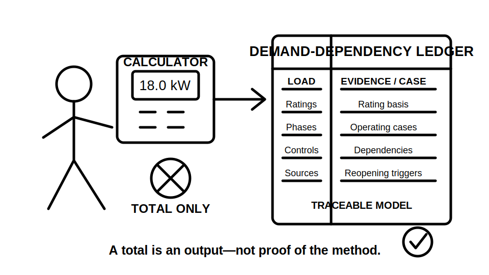
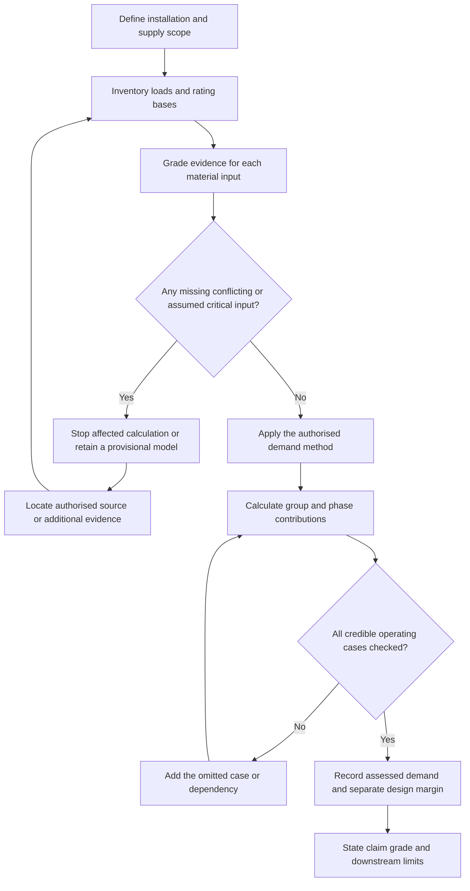
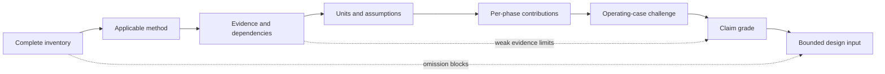

# Day 15 — Load Identification and Maximum-Demand Workflow

> **Currency, copyright and safety notice:** This original learning module teaches a reasoning and evidence workflow. It does not reproduce standards tables, demand factors, clause wording or network calculation rules. Exact allowances, limits, equations, supply assumptions and jurisdiction-specific requirements remain `reference_check_required`. Fictional figures are for learning only. This module is `review-required` and not `technically-reviewed`.

## 1. Outcome and entry check

### Observable objectives

By the end of this block, the learner should be able to:

1. distinguish connected load, assessed maximum demand, diversity, coincidence, controlled load and design margin;
2. build a load inventory that records rating basis, units, quantity, phase, source and operating mode;
3. grade each important input by evidence strength and prevent an assumption from being presented as verified fact;
4. identify missing information before converting power to current;
5. select the correct authorised source family for the installation and load category;
6. apply a fictional training method while keeping every dependency visible;
7. challenge the result for simultaneous operation, phase imbalance, alternate sources and future loads;
8. reopen the assessment when a source, load, control, rating basis, phase allocation or operating case changes; and
9. score at least 10/12 on the educational rubric without triggering a critical-error gate.

### Entry check — six minutes, closed note

Answer briefly:

1. Why is connected load not automatically maximum demand?
2. What information is missing from a load recorded only as “8 kW”?
3. Why is an unsupported percentage not diversity?
4. How can a reasonable total conceal an excessive phase demand?
5. What is the difference between a supplied rating and a verified rating basis?
6. Which exact values must be checked in authorised current sources?

Rate each answer: **guessing**, **unsure**, **reasonably confident** or **certain**. Circle any answer whose confidence is higher than its evidence.

## 2. Why it matters

Maximum demand is an early design input. An incomplete or incorrectly classified load model can distort downstream decisions about supply capacity, protective devices, conductors, switchboards, phase allocation and voltage drop. The goal is not the smallest number or the sum of every rating. The goal is a traceable estimate produced by an applicable method, realistic operating assumptions and evidence that is strong enough for the claim being made.

A mathematically correct total can still be unusable when the inventory is incomplete, a rating basis is misunderstood, a control is only proposed, a demand category is wrong or a phase allocation has not been checked.

*Caption: Sort the evidence before the arithmetic; a mystery percentage is not a design method.*

*Caption: A total is an output, not proof that the inventory, method and operating cases are sound.*

## 3. Core concepts and terminology

- **Connected load:** the combined rating of equipment or load points within the defined scope. It is an inventory quantity, not proof of simultaneous demand.
- **Maximum demand:** the greatest demand assessed for the installation or section using an applicable authorised method and stated assumptions.
- **Demand allowance:** the contribution assigned to a load or group under the selected method. Exact allowances remain `reference_check_required`.
- **Diversity:** a justified reduction arising because individual maximum loads need not occur together.
- **Coincidence:** the degree to which loads operate at the same time.
- **Controlled load:** a load whose simultaneous operation is limited by a documented, applicable and dependable control arrangement.
- **Design margin:** a separately recorded allowance for future or uncertain demand; it must not be hidden inside an unexplained factor.
- **Rating basis:** whether a stated value is current, real power, apparent power, input power, output power or another quantity.
- **Phase allocation:** assignment of single-phase loads across a multiphase supply.
- **Operating case:** one credible combination of loads, controls and sources that must be checked.
- **Dependency:** a fact on which a contribution or conclusion relies, such as a control remaining effective or a stated rating being input power.
- **Reopening trigger:** a changed or newly discovered fact that makes an earlier demand conclusion provisional again.

### Evidence grades

Use one grade for every material input:

1. **E1 — supplied:** present in the scenario, drawing, schedule or data sheet but not independently corroborated;
2. **E2 — corroborated:** supported by a second consistent source or cross-check;
3. **E3 — derived:** calculated transparently from supported inputs using a stated method;
4. **E4 — assumed:** introduced for training or because evidence is missing; clearly labelled and unsuitable for a final practical conclusion; and
5. **E5 — missing or conflicting:** unavailable, stale, ambiguous or inconsistent, so the affected calculation must stop or remain bounded.

### Claim grades

Match the conclusion to the evidence:

- **C1 — descriptive:** records what the source says without asserting design adequacy;
- **C2 — provisional model:** suitable for learning or further investigation, with assumptions and missing evidence visible;
- **C3 — supported paper conclusion:** traceable to applicable authorised sources and supported inputs, but still subject to qualified review;
- **C4 — authorised verification:** a practical conclusion made through the applicable authorised process by a competent person. This module cannot award C4.

A higher-precision calculation does not upgrade weak evidence. An E4 assumption can support a C2 training model, not a C3 practical design conclusion.

## 4. Rule-finding workflow

Use **L-O-A-D-S**:

1. **L — List the complete scope.** Record existing, proposed and future loads, quantities, rating bases, phases, sources and operating modes.
2. **O — Obtain the governing method.** Identify installation type and locate the applicable current authorised source, including notes, exceptions and cross-references.
3. **A — Align units, evidence and assumptions.** State voltage, phase, power factor, efficiency, control assumptions and evidence grades before conversion or calculation.
4. **D — Determine group and phase contributions.** Keep connected load, assessed contribution and design margin separate; record the dependency behind each reduction or grouping decision.
5. **S — Stress-test and state the result.** Check coincidence, phase balance, starting or cyclic behaviour, alternate supplies, future loads and missing evidence; then state the result at the correct claim grade.

The loop prevents calculation from outrunning classification. A precise total built from an incomplete inventory or inapplicable method is still weak evidence.

### Demand-dependency ledger

For each load group, record:

| Field | Purpose |
|---|---|
| Load and scope | Prevents omission or double counting |
| Rating and rating basis | Distinguishes current, real power, apparent power, input and output values |
| Evidence grade | Shows whether the input is supplied, corroborated, derived, assumed or unresolved |
| Demand category and authorised source | Makes the selected method traceable |
| Control or coincidence dependency | Records why loads may not operate together |
| Phase and source | Exposes imbalance and alternate-supply cases |
| Assessed contribution | Keeps the calculated contribution separate from connected load |
| Reopening trigger | States what change invalidates or weakens the conclusion |
| Claim grade | Prevents a training model from being presented as approved design evidence |

Reopen the affected calculation when a load is added or removed, a rating basis changes, a control is removed or altered, a phase allocation changes, the source arrangement changes, the governing source is revised, evidence conflicts or an omitted operating case becomes credible.

## 5. Visual model or worked example

### Fictional worked example

A small training tenancy has these invented loads:

| Load group | Connected rating | Training-only contribution | Evidence | Dependency |
|---|---:|---:|---|---|
| Lighting | 3.0 kW | 3.0 kW | E1 supplied | stated input rating |
| Socket-outlet inventory | 12.0 kW | 4.8 kW | E4 assumed method | fictional allowance only |
| Fixed heater | 4.0 kW | 4.0 kW | E1 supplied | assumed simultaneous operation |
| Two air conditioners | 6.0 kW combined | 4.2 kW | E4 assumed method | both units available; fictional contribution |
| Future margin | 2.0 kW | recorded separately | E4 assumed | planning allowance, not present load |

The fictional present contribution is `3.0 + 4.8 + 4.0 + 4.2 = 16.0 kW`; the separate training design total is `18.0 kW`. These invented contributions are not standards values. Because key contributions use E4 assumptions, the result is only a **C2 provisional model**.

Before converting to current, the learner must resolve voltage, phase arrangement, rating basis, relevant power-factor or efficiency data, phase allocation, control assumptions, source topology and the applicable authorised demand method.

The model shows that the final number depends on every earlier link. The total alone cannot reveal whether the inventory, method or dependencies were sound.

### Worked-example fading

1. **Guided pass:** complete a partly filled dependency ledger for the tenancy above.
2. **Prompted pass:** solve a second fictional scenario with headings only; stop at a missing phase allocation, one undocumented control and one unclear rating basis.
3. **Independent pass:** build a new demand model from a changed source pack without reusing the first scenario’s categories or assumptions.

For every stopped item, state what evidence is required and which downstream decisions remain blocked.

## 6. Practical application

### Part A — load-register build

For an original fictional workshop, create a register with columns for item, quantity, rating, rating basis, evidence grade, source, phase, operating mode, control dependency, demand category, authorised reference, assessed contribution, unresolved questions, reopening trigger and claim grade.

### Part B — three operating cases

Compare:

1. normal occupied operation;
2. a peak-use case with heating and process loads together; and
3. an alternate-source or future-load case.

State which assumptions change, which dependencies remain valid and whether each case produces a different phase or total demand.

### Part C — changed-condition transfer

Revise the model when one fact changes: a proposed interlock is removed. Identify affected contributions, phase checks, evidence grades, claim grades, reopening triggers and downstream decisions.

Then repeat with a different change: manufacturer data reveal that one quoted value was output power rather than input power. Do not preserve the earlier conversion merely because the total looked plausible.

### Educational rubric

Score each category **0–2**:

1. terminology and scope;
2. inventory and rating-basis completeness;
3. authorised-source and method selection;
4. calculation and phase traceability;
5. evidence, dependency and claim control; and
6. safety and review boundary.

A score below **10/12** requires a varied re-attempt.

### Critical-error gates

The attempt is not yet educationally complete, regardless of total score, when the learner:

- invents a missing rating, phase, control or demand allowance without labelling it;
- treats connected load as maximum demand without an applicable method;
- mixes units without a stated conversion basis;
- applies a control reduction without evidence that the control is applicable and dependable;
- ignores an identified phase or alternate-source case;
- presents an E4 or E5 input as a C3 or C4 conclusion; or
- implies authority to perform practical design, selection, approval or energisation.

This rubric is an original learning tool, not an official RTO pass mark.

## 7. Common errors and safety checkpoint

### Common errors

- adding every rating and calling the result maximum demand;
- applying a remembered percentage without its category and conditions;
- mixing amperes, kilowatts and kilovolt-amperes without a conversion basis;
- confusing input and output ratings;
- ignoring phase allocation;
- treating an undocumented control as guaranteed;
- hiding future margin inside diversity;
- using old measured demand without checking representativeness;
- carrying an earlier demand conclusion into a changed installation without reopening it; and
- presenting a training calculation as a compliant design result.

### Safety checkpoint

This module authorises no site access, inspection, switching, opening, isolation, proving, measurement, testing, alteration, energisation, commissioning, certification or approval. Stop and seek qualified guidance when real equipment is involved, source data are incomplete, exact rules cannot be verified, evidence conflicts, or the result would be used for practical selection or approval.

## 8. Retrieval and next links

### Closed-note retrieval

1. Define connected load and maximum demand.
2. State the five L-O-A-D-S steps.
3. Name the five evidence grades and four claim grades.
4. Name four facts required before converting power to current.
5. Explain why total demand and phase demand must both be checked.
6. Give three reopening triggers.
7. State the boundary between a fictional calculation and an approved design.

### Changed-source retrieval

Use a fresh fictional source pack in which one rating basis, one phase allocation and one control status differ from the worked example. Identify which earlier reasoning can transfer and which conclusions must be rebuilt.

### Delayed retrieval

After 48 hours, rebuild the demand-dependency ledger from memory, identify one hidden assumption and create one changed-condition re-attempt. After seven days, explain aloud why an accurate sum can still be an invalid maximum-demand conclusion.

### Navigation

- **Program:** [Six-Week Capstone Learning Plan](../MASTER_PLAN.md)
- **Previous:** [Day 14 — Week 2 Integrated MEN and Protection Exercise](day-14-week-2-integrated-men-and-protection-exercise.md)
- **Knowledge note:** [[Six-Week Day 15 - Load Identification and Maximum-Demand Workflow]]
- **Next:** [Day 16 — Design Current, Device Rating and Conductor Capacity Relationship](day-16-design-current-device-rating-and-conductor-capacity-relationship.md)

### References and review boundary

Use current authorised standards, network requirements, manufacturer data, workplace procedures and RTO instructions for every exact allowance, definition, equation and practical conclusion. Exact demand categories, allowances, conversion requirements, supply assumptions, phase rules, exceptions and acceptance decisions remain `reference_check_required`. No standards table, figure, clause sequence or official assessment material is reproduced.