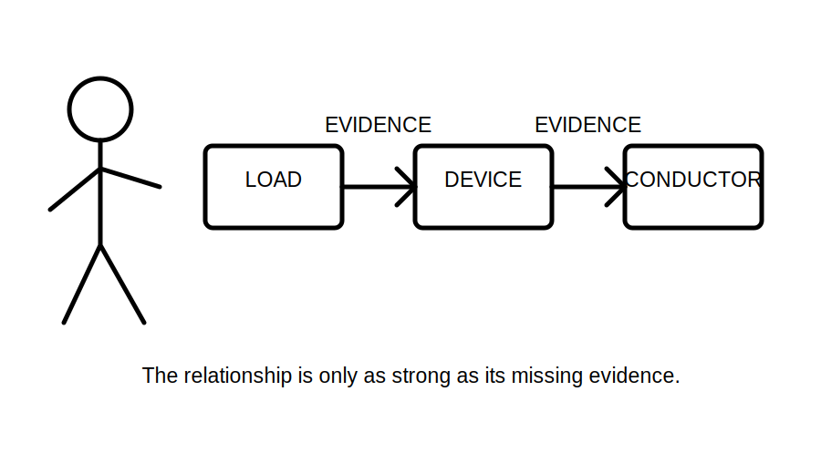
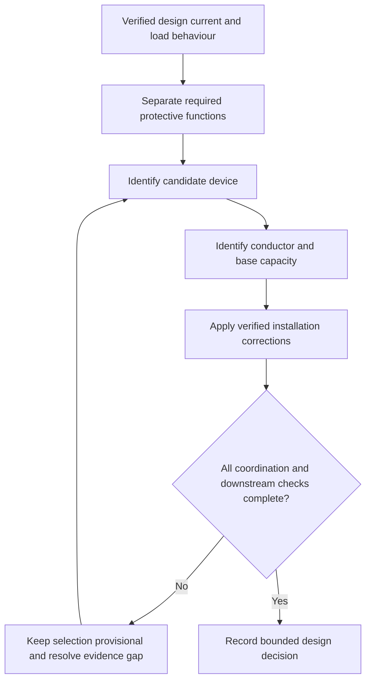
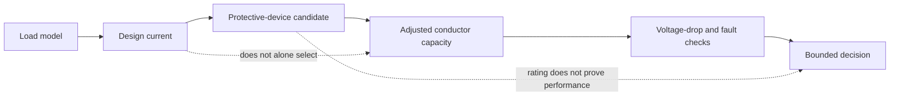

# Day 16 — Design Current, Device Rating and Conductor Capacity Relationship

> **Currency, copyright and safety notice:** This original module teaches the relationship between assessed load, protective-device selection and conductor capacity without reproducing standards tables, device curves, clause wording or selection values. Exact inequalities, ratings, correction methods, coordination requirements and exceptions remain `reference_check_required`. This module is `review-required` and not `technically-reviewed`.

## 1. Outcome and entry check

### Observable objectives

By the end of this block, the learner should be able to:

1. define design current, nominal protective-device rating and current-carrying capacity;
2. explain why these quantities are related but not interchangeable;
3. construct an evidence chain from a verified load model to a provisional circuit-selection decision;
4. identify when device type, load behaviour or installation conditions invalidate a simple comparison;
5. distinguish overload protection, short-circuit protection and equipment-specific protection questions;
6. expose every unresolved input before claiming a conductor is suitable;
7. revise the relationship when one input changes; and
8. score at least 10/12 on the educational rubric with no zero in relationship reasoning or safety boundary.

### Entry check — six minutes, closed note

1. What output from Day 15 becomes an input to circuit design?
2. Why is a conductor not selected from load current alone?
3. What is the difference between a device rating and proven protective performance?
4. Why can installation conditions change an otherwise plausible selection?
5. Which claims require current authorised source verification?

## 2. Why it matters

A circuit can fail conceptually even when each number looks reasonable in isolation. The design current describes expected load demand, the device rating describes one characteristic of the selected protective device, and conductor capacity describes the current the installed conductor can carry under defined conditions. The design task is to prove the relationship using applicable rules and complete evidence—not merely choose three ascending numbers.

*Caption: Three tidy numbers do not make a design; the evidence between them does.*

## 3. Core concepts and terminology

- **Design current:** the current expected for the circuit under the stated load and operating assumptions.
- **Nominal device rating:** the marked or assigned current rating of a protective device; it does not by itself prove coordination or required operating performance.
- **Current-carrying capacity:** the permitted continuous current for a conductor under the defined installation conditions and applicable correction factors.
- **Overload protection:** protection against sustained current above the intended carrying capability of a circuit or equipment.
- **Short-circuit protection:** protection addressing high fault current arising from a low-impedance unintended connection.
- **Coordination:** the verified relationship between load, conductors, devices and equipment so each protective function is appropriate to the circuit.
- **Correction factor:** an authorised adjustment reflecting an installation condition such as ambient temperature, grouping or thermal environment. Day 17 examines these factors in depth.
- **Provisional selection:** a paper-based candidate that remains subject to all downstream checks and technical review.
- **Reopening trigger:** a changed fact that requires the selection chain to be reassessed.

## 4. Rule-finding workflow

Use **R-A-T-I-N-G**:

1. **R — Retrieve the verified design input.** Use the Day 15 demand result and preserve its scope, phase, source and assumptions.
2. **A — Analyse load behaviour.** Identify continuous, cyclic, starting, inrush, harmonic, controlled and equipment-specific characteristics.
3. **T — Target each protective function.** Separate overload, short-circuit, fault/disconnection, residual-current and equipment-protection questions.
4. **I — Identify candidate device and conductor data.** Use current authorised rules and manufacturer information; record device type, rating basis, conductor material and installation method.
5. **N — Normalise for actual conditions.** Apply only verified correction methods and keep base capacity separate from adjusted capacity.
6. **G — Gate the conclusion.** Check all required relationships, voltage drop, fault performance, disconnection, terminal limits, selectivity and later verification before calling the candidate suitable.

This is a dependency chain. A later check may force an earlier choice to be reopened.

## 5. Visual model or worked example

### Fictional relationship model

Assume a training scenario supplies:

- fictional design current: 21 A;
- fictional candidate device rating: 25 A;
- fictional adjusted conductor capacity: 29 A.

The apparent ordering is not a complete design. Before accepting it, the learner must verify:

1. how the 21 A design current was derived;
2. whether load starting or cyclic behaviour affects device choice;
3. whether the 25 A device type and operating characteristics suit each required protection function;
4. how the 29 A capacity was obtained and whether all correction factors were applied;
5. whether terminal, voltage-drop, fault-current, disconnection and equipment constraints are satisfied; and
6. whether any special rule or exception applies.

The values are invented and must not be used for real work.

### Worked-example fading

A second scenario provides design current and device data but gives only a catalogue conductor capacity with no installation method. State the strongest justified claim, the missing evidence and the reopening trigger. Do not guess a derating factor.

## 6. Practical application

### Part A — relationship ledger

Create a table with columns: design input, protective function, device evidence, conductor evidence, installation correction, unresolved downstream check and claim status.

### Part B — changed conditions

Reassess the provisional selection separately when:

1. a motor with significant starting current replaces a resistive load;
2. the conductor installation method changes; and
3. a downstream voltage-drop check fails.

For each change, identify which decisions reopen and which remain supported.

### Part C — misconception repair

Correct these claims:

- “The breaker is larger than the load, so the cable is protected.”
- “The catalogue capacity proves installed capacity.”
- “Passing the simple current relationship proves voltage drop and fault protection.”
- “A larger conductor fixes every coordination problem.”

### Educational rubric

Score **0–2** for terminology, load-behaviour analysis, protection-function separation, relationship reasoning, evidence control, and safety/claim boundary. Below **10/12**, or zero in relationship reasoning or safety, requires a varied scenario re-attempt. This is not an official assessment threshold.

## 7. Common errors and safety checkpoint

### Common errors

- using maximum demand, design current and connected load as synonyms;
- treating nominal device rating as operating performance;
- selecting from a cable table before defining installation conditions;
- applying correction factors twice or not at all;
- checking overload while ignoring short-circuit or fault/disconnection questions;
- concealing assumptions inside a final cable size; and
- failing to reopen the chain when a downstream check fails.

### Safety checkpoint

This module authorises no equipment access, switching, isolation, measurement, testing, installation, alteration, energisation, commissioning or certification. Real design and selection require current authorised sources, complete installation data and competent technical review.

## 8. Retrieval and next links

### Closed-note retrieval

1. Define design current, nominal device rating and current-carrying capacity.
2. State the six R-A-T-I-N-G steps.
3. Explain why a correct ordering of three values remains insufficient.
4. Name four downstream checks that can reopen a provisional selection.
5. State the practical-authority boundary.

### Delayed transfer

After 48 hours, draw the dependency chain from memory and apply it to a new fictional load with one deliberately missing installation fact.

### Navigation

- **Program:** [Six-Week Capstone Learning Plan](../MASTER_PLAN.md)
- **Previous:** [Day 15 — Load Identification and Maximum-Demand Workflow](day-15-load-identification-and-maximum-demand-workflow.md)
- **Knowledge note:** [[Six-Week Day 16 - Design Current Device Rating and Conductor Capacity Relationship]]
- **Next:** [Day 17 — Installation Conditions and Derating-Factor Reasoning](day-17-installation-conditions-and-derating-factor-reasoning.md)

### References and review boundary

Use current authorised standards, manufacturer data, network requirements, workplace procedures and RTO instructions. Exact relationships, correction methods, device characteristics, conductor capacities, limits and exceptions remain `reference_check_required`; no copyrighted table, figure or clause sequence is reproduced.