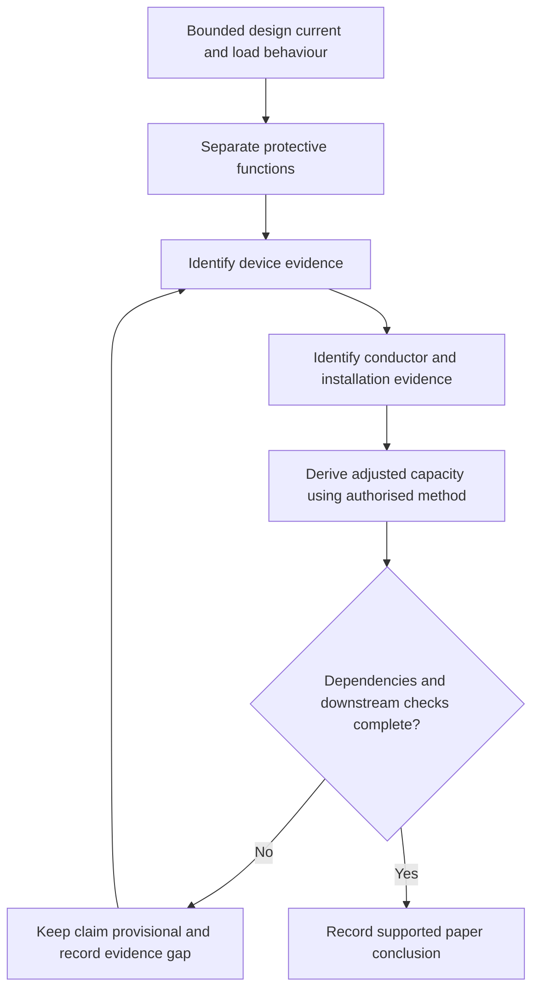
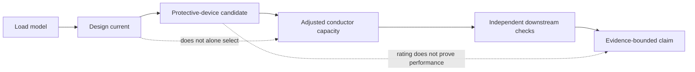
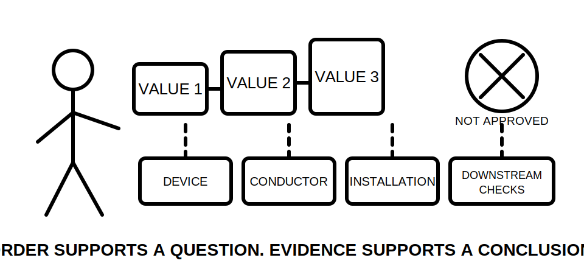

# Day 16 — Design Current, Device Rating and Conductor Capacity Relationship

> **Currency, copyright and safety notice:** This original module teaches how to reason from assessed load to a provisional protective-device and conductor relationship without reproducing standards tables, device curves, clause wording or selection values. Exact inequalities, ratings, correction methods, coordination requirements and exceptions remain `reference_check_required`. This module is `review-required` and not `technically-reviewed`.

## 1. Outcome and entry check

### Observable objectives

By the end of this block, the learner should be able to:

1. define design current, nominal protective-device rating and current-carrying capacity;
2. explain why these quantities are related but not interchangeable;
3. classify evidence supporting each quantity using the five evidence grades;
4. construct a coordination ledger from a bounded load model to a provisional selection;
5. separate overload, short-circuit, fault/disconnection, residual-current and equipment-specific protection questions;
6. identify the dependencies and reopening triggers behind every conclusion;
7. state the strongest justified claim without converting a candidate into an approved design; and
8. score at least 10/12 on the educational rubric with no critical error.

### Entry check — six minutes, closed note

1. What Day 15 output becomes an input to circuit design?
2. Why is a conductor not selected from load current alone?
3. What is the difference between a marked device rating and proven protective performance?
4. Why can installation conditions change an otherwise plausible selection?
5. Which claims require current authorised source verification?

## 2. Why it matters

A circuit can fail conceptually even when every number looks reasonable in isolation. Design current describes expected demand under stated assumptions. A device rating describes one device characteristic. Current-carrying capacity describes what a conductor may carry under defined installed conditions. A valid design must establish the relationship among them and then survive the separate downstream checks. Three ascending numbers are therefore a prompt to investigate, not proof of suitability.

*Caption: Three tidy numbers do not make a design; the evidence between them does.*

## 3. Core concepts and terminology

- **Design current:** the current expected for the circuit under the stated load, diversity, control and operating assumptions.
- **Nominal device rating:** the marked or assigned current rating of a protective device. It does not by itself establish operating time, fault capability, selectivity or equipment suitability.
- **Current-carrying capacity:** the permitted continuous current for a conductor under defined installation conditions and applicable correction methods.
- **Base capacity:** a source-derived capacity before the scenario-specific installation corrections are applied.
- **Adjusted capacity:** the capacity obtained after all applicable, verified installation corrections are applied once.
- **Overload protection:** protection against sustained current above the intended carrying capability of a circuit or equipment.
- **Short-circuit protection:** protection addressing high fault current caused by a low-impedance unintended connection.
- **Coordination:** a supported relationship among the load, conductor, protective device, connected equipment and installation conditions.
- **Dependency:** a fact that must remain true for a conclusion to remain valid.
- **Reopening trigger:** changed or newly credible evidence that requires an earlier conclusion to be reassessed.
- **Provisional selection:** a paper-based candidate that remains subject to authorised-source checks, downstream design checks and competent review.

### Five evidence grades

1. **Supplied:** stated in the scenario but not independently corroborated.
2. **Corroborated:** supported by a second consistent source or record.
3. **Derived:** calculated or classified from traceable inputs using an identified authorised method.
4. **Assumed:** used temporarily and labelled because evidence is absent.
5. **Missing or conflicting:** unavailable, stale or inconsistent; the affected claim remains unresolved.

### Four claim grades

1. **Description:** records what a source, label or scenario states.
2. **Provisional relationship:** identifies a plausible ordering or candidate without claiming suitability.
3. **Supported paper conclusion:** all stated paper dependencies are evidenced, but technical review and practical verification remain outstanding.
4. **Authorised verification:** requires current authorised sources, complete installation information, competent review and any required practical evidence. This module cannot award this grade.

## 4. Rule-finding workflow

Use **R-A-T-I-N-G**:

1. **R — Retrieve the bounded design input.** Preserve the Day 15 result, method, scope, phase, source, controls and assumptions.
2. **A — Analyse load behaviour.** Identify continuous, cyclic, starting, inrush, harmonic, controlled and equipment-specific characteristics.
3. **T — Target each protective function.** Separate overload, short-circuit, fault/disconnection, residual-current and equipment-protection questions.
4. **I — Identify candidate evidence.** Record device type and rating basis, conductor material, installation method, terminal constraints and source currency.
5. **N — Normalise for actual conditions.** Keep base and adjusted capacities separate; apply only verified correction methods once.
6. **G — Gate the conclusion.** Check every dependency, downstream design question and unresolved item before assigning a claim grade.

The loop is deliberate. A failed downstream check can reopen the load model, device candidate, conductor choice or installation assumption.

### Coordination ledger

For each candidate, record:

| Field | Required record |
|---|---|
| Design input | value or category, method, scope and evidence grade |
| Load behaviour | operating case, starting or cyclic behaviour, controls and uncertainties |
| Protective function | the harm or condition each device function is intended to address |
| Device evidence | type, rating basis, characteristics source and currency |
| Conductor evidence | material, construction, installation method, base capacity source and currency |
| Corrections | each applicable condition, method, input evidence and adjusted result |
| Downstream checks | voltage drop, fault performance, disconnection, terminals, equipment and selectivity as applicable |
| Claim grade | description, provisional relationship or supported paper conclusion |
| Dependencies | facts that must remain true |
| Reopening triggers | changes that invalidate or weaken the conclusion |

## 5. Visual model or worked example

### Fictional relationship model

A training scenario supplies a fictional design current, candidate device rating and adjusted conductor capacity. Their apparent ordering is not a complete design. Before assigning even a supported paper conclusion, the learner must establish:

1. how the design current was derived and bounded;
2. whether starting, cyclic, harmonic or controlled behaviour changes the device question;
3. whether the device type and characteristics address each required protective function;
4. how base and adjusted conductor capacities were obtained;
5. whether every applicable correction was evidenced and applied once;
6. whether terminal, voltage-drop, fault-current, disconnection, equipment and coordination constraints are satisfied; and
7. whether any authorised exception or special condition applies.

The fictional values used in exercises are not real-work selections.

*Caption: Numerical order can support a provisional relationship; it cannot replace device, conductor, installation and downstream evidence.*

### Worked-example fading

**Guided attempt:** The scenario supplies the load model, device data and installation method. Complete the coordination ledger with prompts.

**Partially faded attempt:** The scenario supplies design current and device data but only a catalogue conductor capacity. State the strongest claim, missing evidence and reopening trigger. Do not invent an installation method or correction.

**Independent transfer:** A new source changes the load control assumption after a provisional selection has been recorded. Reopen only the affected ledger fields, then explain why the previous conclusion cannot simply be retained.

## 6. Practical application

### Part A — build the coordination ledger

Complete every ledger field for one fictional circuit. Grade each evidence item and assign a claim grade. An empty dependency or reopening field is not acceptable.

### Part B — changed conditions

Reassess the candidate separately when:

1. a motor with significant starting current replaces a resistive load;
2. the conductor installation method changes;
3. a control that limited simultaneous operation is removed;
4. device manufacturer data conflicts with an older worksheet; and
5. a downstream voltage-drop or fault-performance check fails.

For each change, identify which conclusions remain supported, which reopen and what new evidence is required.

### Part C — misconception repair

Correct these claims:

- “The breaker is larger than the load, so the cable is protected.”
- “The catalogue capacity proves installed capacity.”
- “Passing the simple current relationship proves voltage drop and fault protection.”
- “A larger conductor fixes every coordination problem.”
- “Once a cable size is written down, later evidence cannot change it.”

### Educational rubric

Score **0–2** for each category:

1. terminology;
2. load-behaviour analysis;
3. protection-function separation;
4. relationship and dependency reasoning;
5. evidence and claim control; and
6. safety and authority boundary.

A score below **10/12** requires a varied-scenario re-attempt. Any critical error requires re-attempt regardless of total score. This is an educational checkpoint, not an official RTO pass mark.

## 7. Common errors and safety checkpoint

### Common errors

- using connected load, maximum demand and design current as synonyms;
- treating nominal device rating as proven operating performance;
- selecting from a conductor table before defining installation conditions;
- treating a catalogue capacity as installed capacity;
- applying a correction twice or omitting an applicable correction;
- checking overload while ignoring short-circuit, fault/disconnection or equipment questions;
- hiding assumptions inside a final conductor size;
- promoting a provisional relationship to an approved design; and
- failing to reopen the chain when a dependency changes or a downstream check fails.

### Critical errors

A critical error occurs if the learner:

- invents or silently substitutes a rating, capacity, correction, device characteristic or installation fact;
- claims that numerical ordering proves complete protection or design compliance;
- treats unresolved or conflicting evidence as verified;
- presents fictional values as real-work selections; or
- claims practical authority, technical approval or official assessment success.

### Safety checkpoint

This module authorises no site access, equipment opening, switching, isolation, proving, measurement, testing, installation, alteration, energisation, commissioning, certification or approval. Real design and selection require current authorised sources, complete installation data and competent technical review.

## 8. Retrieval and next links

### Closed-note retrieval

1. Define design current, nominal device rating, base capacity and adjusted capacity.
2. State the six R-A-T-I-N-G steps.
3. Name the five evidence grades and four claim grades.
4. Explain why a correct numerical ordering remains insufficient.
5. Give four dependencies and four reopening triggers.
6. State the practical-authority boundary.

### Delayed transfer

After 48 hours, draw the dependency chain and coordination ledger headings from memory. Apply them to a new fictional load containing one missing installation fact and one conflicting device-data source. State the strongest justified claim without resolving either gap by assumption.

### Navigation

- **Program:** [Six-Week Capstone Learning Plan](../MASTER_PLAN.md)
- **Previous:** [Day 15 — Load Identification and Maximum-Demand Workflow](day-15-load-identification-and-maximum-demand-workflow.md)
- **Knowledge note:** [[Six-Week Day 16 - Design Current Device Rating and Conductor Capacity Relationship]]
- **Next:** [Day 17 — Installation Conditions and Derating-Factor Reasoning](day-17-installation-conditions-and-derating-factor-reasoning.md)

### References and review boundary

Use current authorised standards, manufacturer data, network requirements, workplace procedures and RTO instructions. Exact relationships, correction methods, device characteristics, conductor capacities, limits, exceptions and assessment requirements remain `reference_check_required`. No copyrighted table, figure, systematic clause wording, exact official selection value or official assessment content is reproduced.