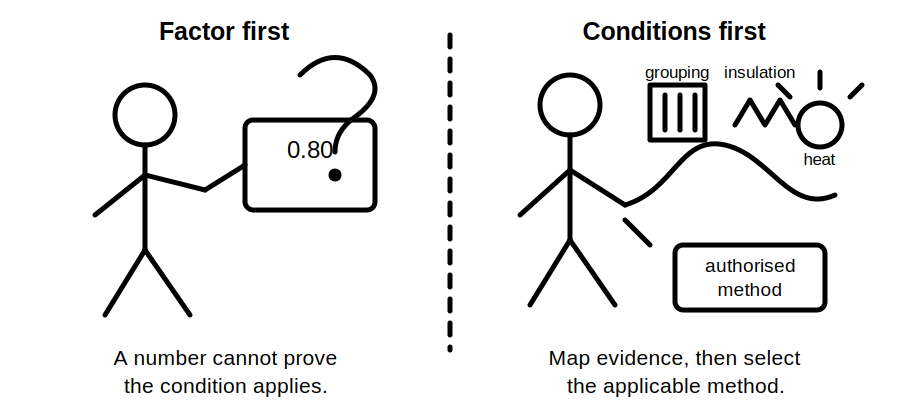
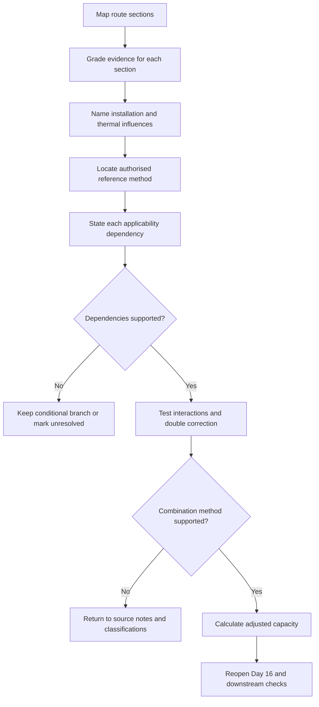
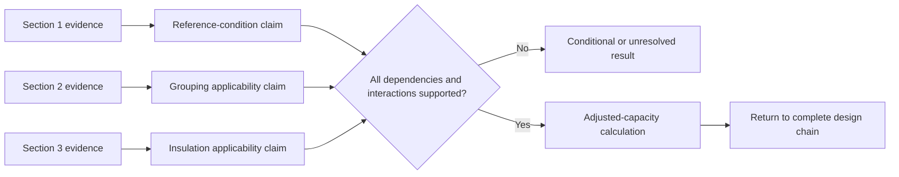

# Day 17 — Installation Conditions and Derating-Factor Reasoning

> **Currency, copyright and safety notice:** This original module teaches how installation conditions alter a conductor-capacity claim. It does not reproduce cable tables, correction-factor tables, clause wording or manufacturer datasets. Exact methods, factors, combinations, exceptions and installation classifications remain `reference_check_required`. It is `review-required` and not `technically-reviewed`.

## 1. Outcome and entry check

### Observable objectives

By the end of this block, the learner should be able to:

1. distinguish base tabulated capacity from adjusted current-carrying capacity;
2. divide a route into materially different thermal sections;
3. define ambient temperature, grouping, thermal insulation, enclosure, installation method and heat-source influence;
4. grade route evidence and limit each conclusion to what that evidence supports;
5. identify the dependency that makes a correction method applicable;
6. detect unsupported factors, incompatible combinations and double correction;
7. explain which Day 16 and downstream decisions reopen when conditions change; and
8. score at least 10/12 on the educational rubric without triggering a critical-error gate.

### Entry check — six minutes, closed note

1. Why is catalogue or tabulated capacity not automatically installed capacity?
2. Name four installation conditions that can affect heat dissipation.
3. What evidence is required before applying a grouping assumption?
4. Why does a supplied factor not prove that its condition exists?
5. Which Day 16 decisions may reopen when installation conditions change?

## 2. Why it matters

Conductor capacity depends on the thermal environment in which the conductor operates. A candidate chosen from an incomplete route description may appear adequate while relying on a capacity that the actual arrangement cannot support. The learner must classify the route first, establish the evidence for each condition, use an authorised method only within its stated scope, and return the adjusted result to the complete design chain.

A precise multiplication can still be a weak conclusion. Arithmetic answers **what happens if the inputs and method are valid**; it does not prove that the route classification, factor applicability or combination rule is correct.

*Caption: Find the heat story first; the factor comes later.*

*Caption: A factor is an input to a method, not proof that the installation condition exists.*

## 3. Core concepts and terminology

- **Base capacity:** a current-carrying value associated with a defined reference installation condition.
- **Adjusted capacity:** the capacity after all applicable authorised corrections are applied for the supported installation conditions.
- **Route section:** a part of the conductor run that has materially consistent installation and thermal conditions.
- **Governing section:** the route section that controls the supported capacity conclusion under the authorised method.
- **Installation method:** the physical arrangement of the wiring system, including support, enclosure, surrounding material and heat-dissipation path.
- **Ambient temperature:** the surrounding temperature relevant to the authorised method, not merely a convenient nearby temperature reading or general weather value.
- **Grouping:** proximity and loading of circuits or conductors that can increase mutual heating.
- **Thermal insulation influence:** reduction in heat dissipation where wiring is surrounded by, covered by or near insulating material.
- **Enclosure influence:** thermal effect of conduit, trunking, duct, enclosure or other containment.
- **Heat-source influence:** additional heating from equipment, sunlight, roof spaces or another environmental source.
- **Correction factor:** an authorised adjustment associated with a specified condition, reference method and scope.
- **Applicability dependency:** a fact that must be true before a condition, factor or method can be used.
- **Interaction rule:** the authorised instruction governing whether and how multiple conditions or corrections are considered together.
- **Double correction:** accounting for the same thermal influence twice because it is already embedded in the selected reference method or another correction.
- **Reopening trigger:** new or changed evidence that invalidates a prior dependency and requires the design conclusion to be reconsidered.

### Evidence grades

Use one of five grades for each material route claim:

1. **E1 — supplied:** stated in the current training scenario, drawing or instruction, but not independently corroborated;
2. **E2 — corroborated:** supported by two consistent current records or by an authorised source and a matching record;
3. **E3 — derived:** calculated or logically inferred from supported inputs using a stated method;
4. **E4 — assumed:** temporarily adopted for a conditional branch and clearly labelled as unverified; or
5. **E5 — missing or conflicting:** absent, stale, ambiguous or inconsistent evidence that prevents a bounded conclusion.

An assumption is not automatically wrong, but it cannot silently become a verified installation fact.

### Claim grades

- **C1 — description:** records what the supplied material shows without asserting suitability.
- **C2 — conditional classification:** states what classification or factor would apply if named dependencies are confirmed.
- **C3 — supported paper reasoning:** uses current authorised data and supported scenario evidence to reach a bounded educational conclusion.
- **C4 — authorised verification:** a conclusion completed by an appropriately authorised person using approved procedures; this module cannot award this grade.

## 4. Rule-finding workflow

Use **C-O-N-D-I-T-I-O-N**:

1. **C — Capture the route.** Divide the run into sections wherever support, enclosure, surrounding material, grouping, temperature or external heat changes.
2. **O — Observe and grade evidence.** Separate current scenario facts, drawing notation, manufacturer instruction, derived information, assumptions and missing evidence.
3. **N — Name each thermal influence.** Record installation method, ambient temperature, grouping, insulation, enclosure and external heat for every material section.
4. **D — Determine the authorised reference condition.** Locate current tables, notes, definitions and exceptions appropriate to the conductor, route and jurisdiction.
5. **I — Identify applicability dependencies.** For each proposed correction, state exactly which condition, loading state, route section and source scope make it relevant.
6. **T — Test interactions and double counting.** Confirm the authorised combination method and whether any influence is already represented.
7. **I — Integrate the adjusted capacity.** Return the supported result to the Day 16 load-device-conductor relationship.
8. **O — Observe downstream consequences.** Recheck voltage drop, protection, terminals, equipment limits and route transitions.
9. **N — Note the bounded conclusion.** State claim grade, unresolved evidence, assumptions, reopening triggers and required technical review.

A route may require more than one section analysis. A short section must not be ignored merely because most of the route has easier conditions. The governing conclusion depends on the current authorised method and supported route evidence, not on visual dominance or convenience.

### Route-condition ledger

For each material section, record:

| Field | Required record |
|---|---|
| Section boundary | where the condition begins and ends in the scenario |
| Evidence | source, date or scenario reference and evidence grade |
| Installation method | supported classification or conditional alternatives |
| Thermal influences | ambient, grouping, insulation, enclosure and external heat |
| Proposed correction | source and scope, without copying protected tables |
| Applicability dependency | fact that must be true before use |
| Interaction check | combination rule and double-correction check |
| Claim grade | C1, C2 or C3 |
| Reopening trigger | change that invalidates the conclusion |

## 5. Visual model or worked example

### Fictional worked example

A training drawing shows a cable route with three sections:

1. open support in a ventilated room;
2. shared enclosure with two other circuits; and
3. a short section near thermal insulation.

Before arithmetic, the learner records:

- the drawing proves proximity but does not prove that all neighbouring circuits are materially loaded;
- the insulation note does not state whether the wiring is partly covered, fully surrounded or merely nearby;
- the current source must define how the reference method treats the enclosure and insulation conditions; and
- the conclusion therefore begins as C2 conditional classification.

Fictional assessor-supplied training values are then provided solely to demonstrate arithmetic: base capacity `40 A`, grouping factor `0.80`, insulation factor `0.75`. If the fictional exercise explicitly confirms both dependencies and states that multiplication is the applicable combination method:

`40 × 0.80 × 0.75 = 24 A`

The `24 A` result is a derived E3 value inside the fictional branch. It is not proof that the real route has those conditions, that those factors are current, or that the combination method applies outside the exercise.

The diagram shows why a route description, a factor and an arithmetic result are separate claims. Each needs its own evidence and dependency record.

### Worked-example fading

A second route description omits whether adjacent circuits are loaded and whether insulation surrounds the wiring. Complete only the ledger and two conditional branches. Do not select factors or calculate a final capacity.

A third scenario supplies route evidence and source extracts but omits the interaction instruction. Identify the missing dependency and stop before combining values.

## 6. Practical application

### Part A — route evidence map

Create a section-by-section ledger for a fictional route. Include physical boundaries, evidence source and grade, installation method, ambient condition, grouping, insulation, enclosure, external heat, authorised source needed, applicability dependency, claim grade and reopening trigger.

### Part B — factor audit

Given fictional factors by an assessor:

1. show which supported route condition each factor addresses;
2. state the factor source and scope;
3. record why it is applicable;
4. identify the authorised interaction rule;
5. add a “not applied” list for conditions considered but rejected; and
6. show the arithmetic only after the preceding entries are complete.

### Part C — independent changed-condition transfer

Without copying the worked example, reopen a fresh fictional design separately when:

1. one neighbouring circuit is removed but the drawing revision is not confirmed;
2. the route moves into a hotter space;
3. insulation is added around only part of the run; and
4. a manufacturer instruction conflicts with an older design note.

For each case, state the invalidated dependency, evidence grade, claim grade, source question and Day 16 or downstream decision that reopens.

### Educational rubric

Score **0–2** for each category:

1. terminology and section boundaries;
2. evidence grading;
3. condition and applicability classification;
4. authorised-source and interaction reasoning;
5. ledger traceability and reopening logic; and
6. safety and claim boundary.

A score below **10/12** requires a varied re-attempt. This is an educational readiness rule, not an official RTO pass mark.

### Critical-error gates

A re-attempt is required regardless of total score where the learner:

- treats an assumed route condition as verified;
- uses a remembered or supplied factor as proof that a condition applies;
- combines factors without a supported interaction method;
- ignores a material route section;
- presents C1 or C2 reasoning as authorised verification; or
- proposes unsafe access, opening, measurement or alteration to resolve missing evidence.

## 7. Common errors and safety checkpoint

### Common errors

- selecting a cable size before defining the route;
- treating one installation method as applying to every section;
- describing proximity as proof of material grouping;
- guessing factors from memory;
- applying a factor without stating its dependency;
- multiplying factors merely because multiplication is arithmetically possible;
- double-counting the same thermal influence;
- ignoring short but potentially governing sections;
- allowing a stale drawing to outrank current conflicting evidence; and
- failing to return adjusted capacity to protection, voltage-drop and equipment checks.

### Safety checkpoint

This module authorises no access to roof spaces, switchboards, enclosures or live equipment; no switching, isolation, opening, proving, measurement, testing, tracing, alteration, installation, energisation, commissioning, certification or approval. Stop where route conditions cannot be established safely, records conflict, the source scope is uncertain, or authorised interpretation and practical design approval are required.

## 8. Retrieval and next links

### Closed-note retrieval

1. Define base capacity, adjusted capacity, route section and governing section.
2. State the nine C-O-N-D-I-T-I-O-N steps.
3. Name the five evidence grades and four claim grades.
4. Explain why a factor is not proof of applicability.
5. State three interaction or double-correction checks.
6. Name four reopening triggers.

### Delayed transfer

After 48 hours, sketch a new three-section fictional route. Complete the route-condition ledger from memory, then consult the module to correct omissions. Identify one high-confidence error and write a changed scenario that tests it without reusing the same values.

### Navigation

- **Program:** [Six-Week Capstone Learning Plan](../MASTER_PLAN.md)
- **Previous:** [Day 16 — Design Current, Device Rating and Conductor Capacity Relationship](day-16-design-current-device-rating-and-conductor-capacity-relationship.md)
- **Knowledge note:** [[Six-Week Day 17 - Installation Conditions and Derating-Factor Reasoning]]
- **Next:** [Day 18 — Voltage-Drop Concepts and Calculation Workflow](day-18-voltage-drop-concepts-and-calculation-workflow.md)

### References and review boundary

Use current authorised standards, manufacturer data, installation instructions, workplace procedures and RTO instructions. Exact installation classifications, capacities, factors, interaction and combination methods, exceptions, limits and practical verification requirements remain `reference_check_required`. No standards table, copied figure, systematic clause sequence, exact official selection dataset or practical field procedure is reproduced.
