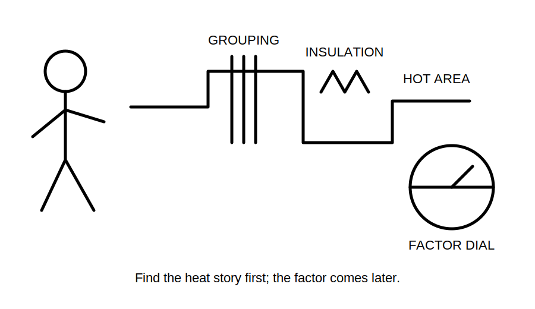
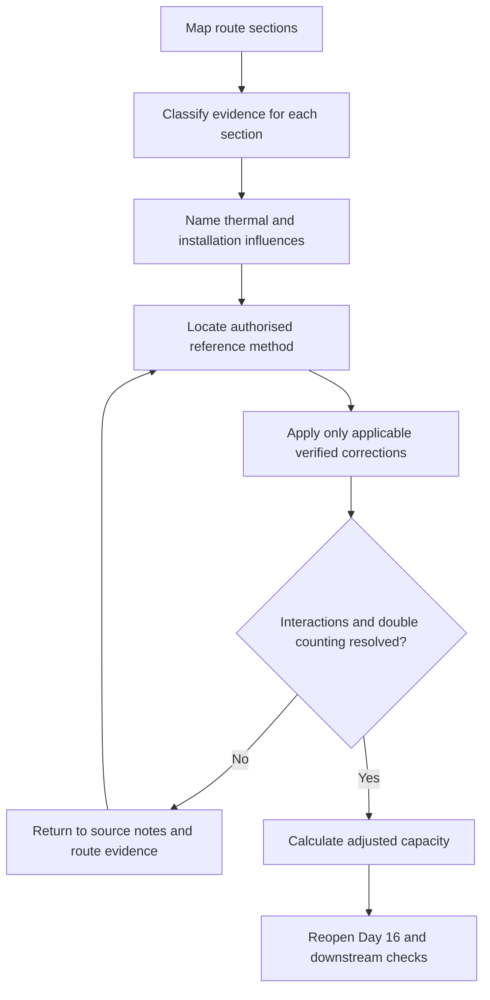
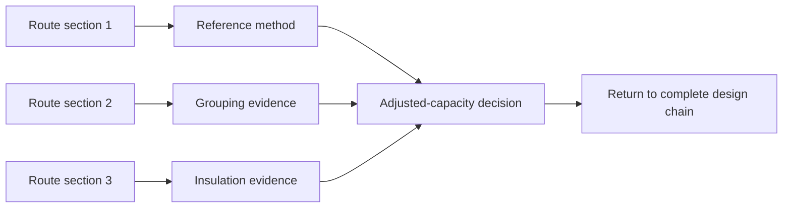

# Day 17 — Installation Conditions and Derating-Factor Reasoning

> **Currency, copyright and safety notice:** This original module teaches how installation conditions alter a conductor-capacity claim. It does not reproduce cable tables, correction-factor tables, clause wording or manufacturer datasets. Exact methods, factors, combinations, exceptions and installation classifications remain `reference_check_required`. It is `review-required` and not `technically-reviewed`.

## 1. Outcome and entry check

### Observable objectives

By the end of this block, the learner should be able to:

1. distinguish base tabulated capacity from adjusted current-carrying capacity;
2. identify material installation conditions before selecting a correction method;
3. define ambient temperature, grouping, thermal insulation, enclosure, installation method and heat-source influence;
4. separate observed facts, drawing assumptions and missing field evidence;
5. locate applicable current authorised data without copying values from memory;
6. combine fictional factors transparently without claiming a real selection;
7. identify when changed conditions reopen the Day 16 relationship; and
8. score at least 10/12 on the educational rubric with no zero in evidence classification or safety boundary.

### Entry check — six minutes, closed note

1. Why is catalogue or tabulated capacity not automatically installed capacity?
2. Name four installation conditions that can affect heat dissipation.
3. What evidence is required before applying a grouping assumption?
4. Why must correction factors not be guessed?
5. Which Day 16 decisions may reopen when installation conditions change?

## 2. Why it matters

Conductor capacity depends on the thermal environment in which the conductor operates. A candidate chosen from an incomplete installation description may appear adequate while relying on a capacity that the actual arrangement cannot support. The learner must classify the environment first, then use the authorised method, then return the adjusted capacity to the full design chain.

*Caption: Find the heat story first; the factor comes later.*

## 3. Core concepts and terminology

- **Base capacity:** a current-carrying value associated with a defined reference installation condition.
- **Adjusted capacity:** the capacity after all applicable authorised corrections are applied for the actual conditions.
- **Installation method:** the physical arrangement of the wiring system, including support, enclosure, surrounding material and heat-dissipation path.
- **Ambient temperature:** the temperature of the surrounding environment relevant to the authorised method.
- **Grouping:** proximity of loaded circuits or conductors that can increase mutual heating.
- **Thermal insulation influence:** reduction in heat dissipation where wiring is surrounded by, covered by or near insulating material.
- **Enclosure influence:** thermal effect of conduit, trunking, duct, enclosure or other containment.
- **Heat-source influence:** additional heating from equipment, sunlight, roof spaces or another environmental source.
- **Correction factor:** an authorised adjustment associated with a specified condition and method.
- **Double correction:** applying the same condition twice because it is already embedded in the selected reference method or another factor.

## 4. Rule-finding workflow

Use **C-O-N-D-I-T-I-O-N**:

1. **C — Capture the route.** Define each section from source to load and note where the physical conditions change.
2. **O — Observe or identify evidence.** Separate verified description, drawing notation, manufacturer instruction and assumption.
3. **N — Name each thermal influence.** Record installation method, ambient temperature, grouping, insulation, enclosure and external heat.
4. **D — Determine the authorised reference condition.** Locate current tables, notes, definitions and exceptions appropriate to the conductor and installation.
5. **I — Identify applicable corrections.** Record each factor’s source, scope and condition; do not use remembered values.
6. **T — Test interactions and double counting.** Confirm how factors combine and whether a condition is already represented.
7. **I — Integrate the adjusted capacity.** Return the result to the Day 16 load-device-conductor relationship.
8. **O — Observe downstream consequences.** Recheck voltage drop, protection, terminals, equipment and route changes.
9. **N — Note the bounded conclusion.** State unresolved evidence, reopening triggers and technical-review requirements.

A route may require more than one section analysis. The governing result cannot be selected until each material section and transition is addressed.

## 5. Visual model or worked example

### Fictional worked example

A training drawing shows a cable route with three sections:

1. open support in a ventilated room;
2. shared enclosure with two other loaded circuits; and
3. a short section near thermal insulation.

Fictional authorised-training factors are supplied by the assessor only for demonstrating the arithmetic: base capacity `40 A`, grouping factor `0.80`, insulation factor `0.75`. If the authorised method states multiplication for this fictional exercise, the adjusted example is:

`40 × 0.80 × 0.75 = 24 A`

These invented values are not standards data. The stronger learning result is the evidence record:

- which route section each factor addresses;
- whether the installation method already accounts for an influence;
- whether the short section changes the governing method;
- whether all circuits are materially loaded together; and
- whether the adjusted capacity reopens device or conductor selection.

### Worked-example fading

A second route description omits whether adjacent circuits are loaded and whether insulation fully surrounds the wiring. Record two conditional branches instead of selecting factors.

## 6. Practical application

### Part A — route evidence map

Create a section-by-section table with columns for physical route, evidence source, installation method, ambient condition, grouping, insulation, enclosure, external heat, authorised source needed and claim status.

### Part B — factor audit

Given fictional factors by an assessor, show the arithmetic and annotate why each factor is applicable. Add a “not applied” list for conditions considered but rejected, with reasons.

### Part C — changed-condition transfer

Reopen the design separately when:

1. one neighbouring circuit is removed;
2. the route moves into a hotter space; and
3. insulation is added around part of the run.

State which evidence, factor and Day 16 decisions change.

### Educational rubric

Score **0–2** for terminology, route mapping, condition classification, authorised-source use, evidence/factor traceability, and safety/claim boundary. Below **10/12**, or zero in evidence classification or safety, requires a varied re-attempt. This is not an official assessment threshold.

## 7. Common errors and safety checkpoint

### Common errors

- using a cable size before defining the route;
- treating one installation method as applying to every section;
- guessing factors from memory;
- applying a factor without proving its condition;
- multiplying factors that should not be combined under the selected method;
- double-counting the same thermal influence;
- ignoring short but thermally significant sections; and
- failing to return the adjusted capacity to protection and voltage-drop checks.

### Safety checkpoint

This module authorises no access to roof spaces, switchboards, enclosures or live equipment; no switching, isolation, opening, measurement, alteration, installation, energisation, commissioning or certification. Stop where real route conditions cannot be established safely or where authorised source interpretation or practical design approval is required.

## 8. Retrieval and next links

### Closed-note retrieval

1. Define base and adjusted capacity.
2. State the nine C-O-N-D-I-T-I-O-N steps.
3. Name six thermal or installation influences.
4. Explain double correction.
5. State why an adjusted capacity must return to the complete design chain.

### Delayed transfer

After 48 hours, sketch a three-section route, list evidence needed for each section and identify one condition that would reopen the selection.

### Navigation

- **Program:** [Six-Week Capstone Learning Plan](../MASTER_PLAN.md)
- **Previous:** [Day 16 — Design Current, Device Rating and Conductor Capacity Relationship](day-16-design-current-device-rating-and-conductor-capacity-relationship.md)
- **Knowledge note:** [[Six-Week Day 17 - Installation Conditions and Derating-Factor Reasoning]]
- **Next:** Day 18 — Voltage-Drop Concepts and Calculation Workflow

### References and review boundary

Use current authorised standards, manufacturer data, installation instructions, workplace procedures and RTO instructions. Exact installation classifications, capacities, factors, combination methods, exceptions and limits remain `reference_check_required`; no standards table, figure or clause sequence is reproduced.