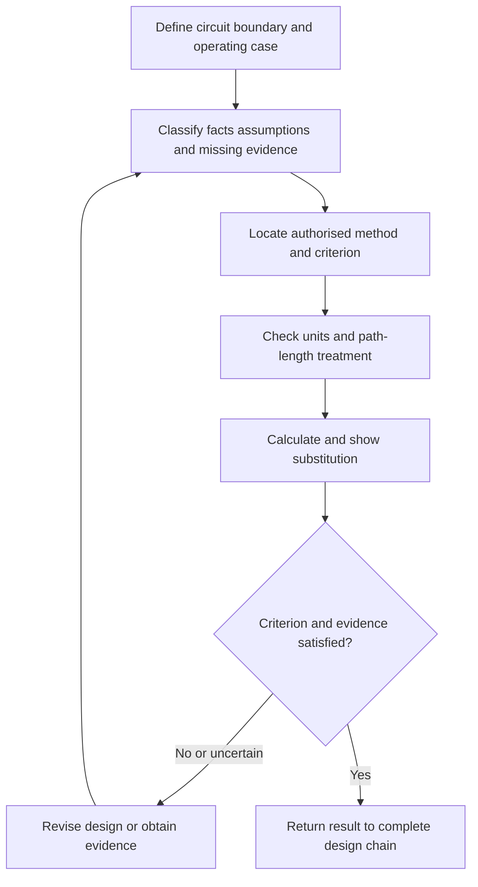
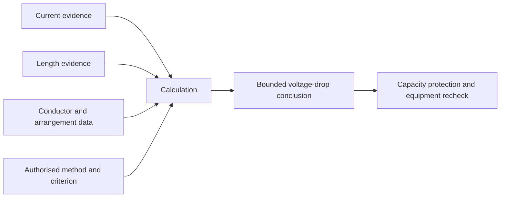

# Day 18 — Voltage-Drop Concepts and Calculation Workflow

> **Currency, copyright and safety notice:** This original module teaches an evidence-controlled voltage-drop workflow. It does not reproduce standards tables, mandated limits, clause wording or manufacturer datasets. Exact equations, coefficients, limits, treatment of circuit arrangements and exceptions remain `reference_check_required`. It is `review-required` and not `technically-reviewed`.

## 1. Outcome and entry check

### Observable objectives

By the end of this block, the learner should be able to:

1. define voltage drop, source voltage, load voltage, route length and design current;
2. distinguish a circuit-length input from conductor-path length required by the selected method;
3. identify the authorised source for the applicable equation or data;
4. separate supplied facts, derived values, assumptions and missing evidence;
5. perform and label a fictional voltage-drop calculation without presenting it as a real design approval;
6. test whether changed current, length, conductor or supply assumptions reopen the result;
7. integrate voltage drop with capacity, protection and equipment requirements; and
8. score at least 10/12 on the educational rubric with no zero in evidence control or safety boundary.

### Entry check — six minutes, closed note

1. Which Day 16 and Day 17 decisions must already be stable enough to begin a voltage-drop check?
2. Why can route length and electrical conductor-path length differ?
3. What units must be written beside every value?
4. Why is a remembered limit not acceptable evidence?
5. Name two changed conditions that force recalculation.

## 2. Why it matters

A conductor can satisfy an adjusted-capacity check yet still produce an unsuitable voltage at the connected equipment. Voltage drop is therefore not an isolated arithmetic exercise. It is an evidence-dependent check within the wider design chain, and its result must be reopened whenever a material input changes.

*Caption: Prove the inputs before trusting the answer.*

## 3. Core concepts and terminology

- **Voltage drop:** the reduction in voltage between two defined points while current flows.
- **Source voltage:** the voltage assumed or established at the circuit origin for the selected method.
- **Load voltage:** the voltage expected at the load after the calculated drop.
- **Design current:** the current used for the design condition being checked.
- **Route length:** the physical one-way path from origin to load.
- **Conductor-path length:** the electrical path length required by the authorised equation or tabulated method.
- **Voltage-drop coefficient:** authorised data expressing drop for defined conductor, current and length conditions.
- **Percentage drop:** calculated drop expressed as a percentage of the stated reference voltage.
- **Governing section:** the route or operating condition that controls the design conclusion.
- **Recalculation trigger:** a changed input that invalidates or reopens the prior result.

## 4. Rule-finding workflow

Use **V-O-L-T-A-G-E**:

1. **V — Verify the circuit boundary.** Define origin, load, route sections and operating condition.
2. **O — Organise the evidence.** Record current, length, conductor, phase arrangement, temperature assumptions and supply basis.
3. **L — Locate the authorised method.** Use current authorised standards, manufacturer data or training instructions.
4. **T — Translate inputs and units.** Convert only where required and label every quantity.
5. **A — Apply the method transparently.** Show equation, substitution and arithmetic with fictional or authorised training data.
6. **G — Gauge the result against the authorised criterion.** Do not substitute a remembered limit.
7. **E — Extend the conclusion into the full design chain.** Recheck conductor, protection, terminals, equipment and changed-condition triggers.

The calculation is only as strong as its weakest material input. An arithmetically correct answer with an unsupported length, current or method remains an unsupported design claim.

## 5. Visual model or worked example

### Fictional worked example

For arithmetic practice only, an assessor supplies:

- fictional design current: `18 A`;
- fictional route length: `32 m`;
- fictional training coefficient: `2.4 mV/A/m`;
- fictional reference voltage: `230 V`.

Using the assessor-stated training method:

`18 × 32 × 2.4 / 1000 = 1.3824 V`

`1.3824 / 230 × 100 = 0.60%` approximately.

These invented values are not standards data. A complete response must also state:

- whether the coefficient already accounts for the circuit arrangement;
- whether `32 m` is the correct path-length input;
- which operating current is being checked;
- which authorised criterion applies; and
- what change would force recalculation.

### Worked-example fading

Repeat the exercise where route length is known but the assessor does not state whether the coefficient uses one-way length or total conductor path. Record conditional branches; do not guess.

## 6. Practical application

### Part A — evidence ledger

Create columns for input, value, unit, evidence source, fact/derivation/assumption/missing status and recalculation trigger.

### Part B — varied scenarios

Analyse three fictional cases:

1. current increases while route and conductor stay fixed;
2. route length increases after equipment relocation; and
3. conductor changes after the Day 17 adjusted-capacity review.

For each, identify what must be recalculated and what downstream decisions reopen.

### Part C — explanation under assessment conditions

In 150 words or fewer, explain why voltage drop cannot be approved from arithmetic alone.

### Educational rubric

Score **0–2** for terminology, boundary definition, evidence classification, authorised-source use, arithmetic traceability, and integration/safety boundary. Below **10/12**, or zero in evidence control or safety, requires a varied re-attempt. This is not an official assessment threshold.

## 7. Common errors and safety checkpoint

### Common errors

- using route length without checking the method’s length convention;
- mixing metres, millivolts and volts without explicit conversion;
- using device rating instead of the required design current without justification;
- selecting a coefficient for the wrong conductor or arrangement;
- quoting a remembered limit as though verified;
- rounding too early;
- checking only one operating case; and
- failing to reopen capacity or equipment checks after a design change.

### Safety checkpoint

This module authorises no site access, switching, isolation, opening, measurement, testing, alteration, installation, energisation, commissioning, certification or approval. Stop where real inputs cannot be established safely or where authorised-source interpretation or practical design approval is required.

## 8. Retrieval and next links

### Closed-note retrieval

1. Define voltage drop and conductor-path length.
2. State the seven V-O-L-T-A-G-E steps.
3. Name four evidence inputs.
4. Explain why a correct calculation can still support an invalid conclusion.
5. Name three recalculation triggers.

### Delayed transfer

After 48 hours, create a fresh fictional case and write the evidence ledger before performing any arithmetic.

### Navigation

- **Program:** [Six-Week Capstone Learning Plan](../MASTER_PLAN.md)
- **Previous:** [Day 17 — Installation Conditions and Derating-Factor Reasoning](day-17-installation-conditions-and-derating-factor-reasoning.md)
- **Knowledge note:** [[Six-Week Day 18 - Voltage-Drop Concepts and Calculation Workflow]]
- **Next:** [Day 19 — Rest, Calculation Correction and Catch-Up](day-19-rest-calculation-correction-and-catch-up.md)

### References and review boundary

Use current authorised standards, manufacturer data, installation instructions, workplace procedures and RTO instructions. Exact equations, coefficients, circuit arrangements, criteria, limits and exceptions remain `reference_check_required`; no standards table, figure or clause sequence is reproduced.