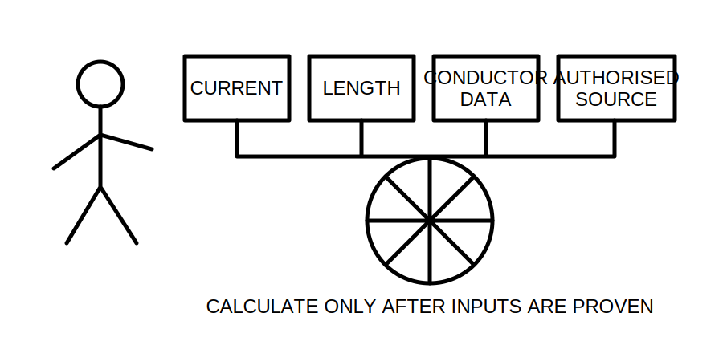
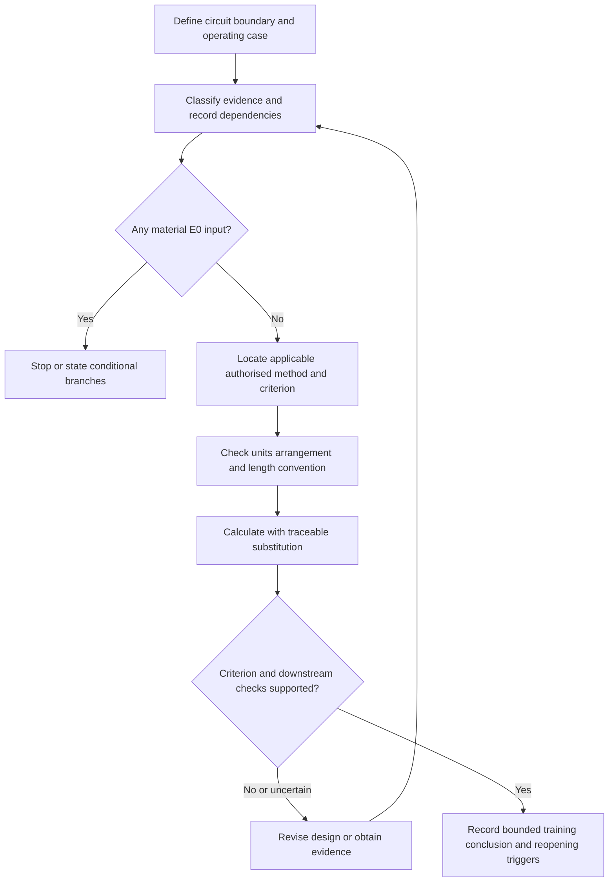
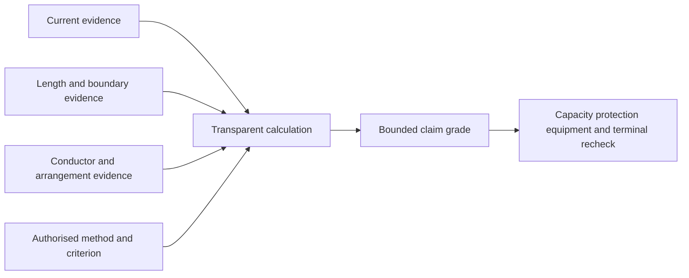
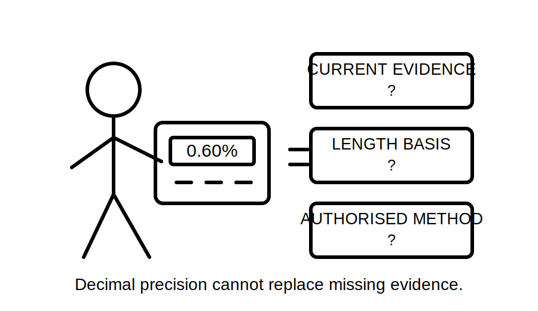

# Day 18 — Voltage-Drop Concepts and Calculation Workflow

> **Currency, copyright and safety notice:** This original module teaches an evidence-controlled voltage-drop workflow. It does not reproduce standards tables, mandated limits, clause wording or manufacturer datasets. Exact equations, coefficients, limits, treatment of circuit arrangements and exceptions remain `reference_check_required`. It is `review-required` and not `technically-reviewed`.

## 1. Outcome and entry check

### Observable objectives

By the end of this block, the learner should be able to:

1. define voltage drop, source voltage, load voltage, route length, conductor-path length and design current;
2. identify the exact circuit boundary and operating case being assessed;
3. distinguish one-way route length from the length input required by an authorised calculation method;
4. classify each material input by evidence grade and each conclusion by claim grade;
5. locate and record the authorised source for the equation, coefficient, criterion and arrangement assumptions;
6. perform and label a fictional voltage-drop calculation without presenting it as real design approval;
7. identify dependencies and reopening triggers before relying on a prior result;
8. integrate voltage drop with capacity, protection, equipment and terminal requirements; and
9. score at least 10/12 on the educational rubric with no critical error.

### Entry check — six minutes, closed note

1. Which Day 16 and Day 17 decisions must be stable enough to begin a voltage-drop check?
2. Why can route length and electrical conductor-path length differ?
3. What units must be written beside every value?
4. Why is a remembered limit not acceptable evidence?
5. Name two changed conditions that force recalculation.

## 2. Why it matters

A conductor can satisfy an adjusted-capacity check yet still produce an unsuitable voltage at the connected equipment. Voltage drop is therefore not an isolated arithmetic exercise. It is an evidence-dependent check within the wider design chain.

A neat answer can still be invalid when the current, length convention, conductor data, circuit arrangement, reference voltage or criterion is unsupported. The professional skill is not merely calculating; it is proving that the selected method applies to the defined case and knowing when the conclusion must be reopened.

*Caption: Prove the inputs before trusting the answer.*

## 3. Core concepts and terminology

- **Voltage drop:** the reduction in voltage between two defined points while current flows.
- **Source voltage:** the voltage assumed or established at the circuit origin for the selected method.
- **Load voltage:** the voltage expected at the load after the calculated drop.
- **Design current:** the current used for the design condition being checked.
- **Operating case:** the stated combination of loads, controls and supply conditions represented by the calculation.
- **Circuit boundary:** the defined origin, destination and route sections included in the check.
- **Route length:** the physical one-way path from origin to load.
- **Conductor-path length:** the electrical length required by the authorised equation or tabulated method.
- **Voltage-drop coefficient:** authorised data expressing voltage drop for defined conductor, current, length and arrangement conditions.
- **Reference voltage:** the stated voltage used when converting a voltage result to a percentage.
- **Percentage drop:** calculated voltage drop expressed as a percentage of the stated reference voltage.
- **Governing section:** the route section or operating case that controls the conclusion.
- **Dependency:** a fact or assumption that must remain valid for the conclusion to remain usable.
- **Recalculation trigger:** a changed or newly disputed dependency that invalidates or reopens the prior result.

### Evidence grades

Use one grade for every material input:

1. **E1 — supplied:** stated in the fictional task or authorised training brief but not independently corroborated;
2. **E2 — corroborated:** supported by a second consistent record or source;
3. **E3 — derived:** calculated transparently from supported inputs;
4. **E4 — authorised:** taken from a current applicable authorised source with edition and applicability recorded; and
5. **E0 — unresolved:** missing, conflicting, stale or not shown to apply.

An input is not upgraded merely because it looks plausible or produces a familiar answer.

### Claim grades

Use one grade for each conclusion:

- **C1 — description:** identifies what the supplied information appears to show;
- **C2 — conditional calculation:** states a result that remains dependent on named assumptions or unresolved inputs;
- **C3 — supported training conclusion:** applies an authorised training method to adequately supported fictional evidence; and
- **C4 — qualified technical conclusion:** requires current authorised sources, complete real evidence and authorised competent review outside this module.

This module can support C1–C3 educational work only. It cannot issue a C4 approval.

## 4. Rule-finding workflow

Use **V-O-L-T-A-G-E**:

1. **V — Verify the circuit boundary.** Define origin, load, route sections and operating condition.
2. **O — Organise the evidence.** Record current, length, conductor, arrangement, reference voltage, temperature assumptions and supply basis.
3. **L — Locate the authorised method.** Record the current source, edition, method, coefficient basis and criterion.
4. **T — Translate inputs and units.** Convert only where required and label every quantity.
5. **A — Apply the method transparently.** Show equation, substitution, units, arithmetic and rounding point.
6. **G — Gauge the result against the authorised criterion.** Match the criterion to the defined circuit and operating case; do not substitute a remembered limit.
7. **E — Extend and reopen.** Return the result to the full design chain and identify changes that require recalculation.

The decision gate occurs before arithmetic. If a material input is E0, the correct response is to stop, seek evidence or show conditional branches—not to choose the most convenient assumption.

### Voltage-drop dependency ledger

Create one row for each conclusion with these columns:

| Field | Required record |
|---|---|
| Boundary | origin, destination and included route sections |
| Operating case | load state and design current represented |
| Length basis | measured or supplied route length and method-specific treatment |
| Conductor data | material, size, arrangement and relevant condition basis |
| Method | authorised source, edition and applicable equation or coefficient |
| Criterion | authorised source and reason it applies |
| Result | substitution, units, rounding and claim grade |
| Dependencies | facts and assumptions that must remain true |
| Reopening triggers | changes or conflicts that invalidate the conclusion |

Reopen the conclusion when the load, controls, source, circuit boundary, route, conductor, arrangement, reference voltage, source edition, manufacturer instruction or applicable criterion changes. Also reopen it when later evidence conflicts with an earlier input.

## 5. Visual model or worked example

### Fictional worked example

For arithmetic practice only, an assessor supplies:

- fictional design current: `18 A`;
- fictional route length: `32 m`;
- fictional training coefficient: `2.4 mV/A/m`;
- fictional reference voltage: `230 V`.

Using the assessor-stated fictional training method:

`18 A × 32 m × 2.4 mV/A/m = 1382.4 mV`

`1382.4 mV ÷ 1000 = 1.3824 V`

`1.3824 V ÷ 230 V × 100 = 0.60%` approximately.

These invented values are not standards data. The arithmetic supports only a conditional calculation until the learner records:

- whether the coefficient already accounts for the circuit arrangement;
- whether `32 m` is the correct method-specific length input;
- which operating current is represented;
- whether the reference voltage is appropriate;
- which authorised criterion applies; and
- which changes force recalculation.

The diagram shows that arithmetic is one node in a dependency chain. It cannot create missing evidence upstream or replace downstream checks.

*Caption: Decimal precision cannot compensate for unsupported inputs.*

### Worked-example fading

Complete three versions in order:

1. **Supported:** use the full fictional data above and annotate each evidence and claim grade.
2. **Partially faded:** route length is supplied, but the length convention is omitted. Write conditional branches and stop before selecting one.
3. **Independent transfer:** the load is relocated and the conductor arrangement changes. Rebuild the ledger from a blank page and identify every reopened decision before calculating.

## 6. Practical application

### Part A — evidence and dependency ledger

Create columns for input, value, unit, evidence source, evidence grade, applicability, dependency, conflict, claim grade and reopening trigger.

### Part B — varied scenarios

Analyse three fictional cases:

1. current increases while route and conductor stay fixed;
2. route length increases after equipment relocation; and
3. conductor or arrangement changes after the Day 17 adjusted-capacity review.

For each case:

- identify which ledger rows become stale;
- state whether the prior result can be retained, conditionally reused or discarded;
- identify what must be recalculated; and
- identify which downstream decisions reopen.

### Part C — explanation under assessment conditions

In 150 words or fewer, explain why voltage drop cannot be approved from arithmetic alone. Include at least three dependencies and two reopening triggers.

### Educational rubric

Score **0–2** for each category:

1. terminology and boundary definition;
2. evidence grading and source applicability;
3. method, units and length-convention control;
4. transparent arithmetic and rounding;
5. dependency and reopening reasoning; and
6. integration and safety boundary.

A score below **10/12** requires a varied re-attempt.

### Critical-error gates

A re-attempt is required regardless of total score if the learner:

- invents or silently selects a missing material input;
- treats a remembered equation, coefficient or limit as verified;
- mixes units or length conventions without detection;
- presents a fictional result as practical approval;
- ignores a changed dependency; or
- proposes unauthorised practical measurement, opening, testing or alteration.

This rubric is an original learning aid, not an official RTO assessment threshold.

## 7. Common errors and safety checkpoint

### Common errors

- using route length without checking the method’s length convention;
- mixing metres, millivolts and volts without explicit conversion;
- using device rating instead of the required design current without justification;
- selecting a coefficient for the wrong conductor or arrangement;
- quoting a remembered equation or limit as though verified;
- rounding before the final reported step;
- checking only one operating case;
- treating calculator precision as evidence quality;
- carrying forward a stale result after a route or load change; and
- checking voltage drop in isolation from capacity, protection, terminals and equipment.

### Safety checkpoint

This module authorises no site access, switching, isolation, opening, measurement, testing, alteration, installation, energisation, commissioning, certification or approval. Stop where real inputs cannot be established safely or where authorised-source interpretation or practical design approval is required.

## 8. Retrieval and next links

### Closed-note retrieval

1. Define voltage drop, circuit boundary and conductor-path length.
2. State the seven V-O-L-T-A-G-E steps.
3. Name the five evidence grades and four claim grades.
4. Explain why a numerically correct calculation can support an invalid conclusion.
5. Name five recalculation triggers.
6. Reproduce the dependency-ledger headings from memory.

### Delayed transfer

After 48 hours, create a fresh fictional case and write the evidence and dependency ledger before performing arithmetic. Change one input after completion and mark every conclusion that must reopen.

### Navigation

- **Program:** [Six-Week Capstone Learning Plan](../MASTER_PLAN.md)
- **Previous:** [Day 17 — Installation Conditions and Derating-Factor Reasoning](day-17-installation-conditions-and-derating-factor-reasoning.md)
- **Knowledge note:** [[Six-Week Day 18 - Voltage-Drop Concepts and Calculation Workflow]]
- **Next:** [Day 19 — Rest, Calculation Correction and Catch-Up](day-19-rest-calculation-correction-and-catch-up.md)

### References and review boundary

Use current authorised standards, manufacturer data, installation instructions, workplace procedures and RTO instructions. Exact equations, coefficients, circuit arrangements, criteria, limits and exceptions remain `reference_check_required`; no standards table, figure or clause sequence is reproduced.