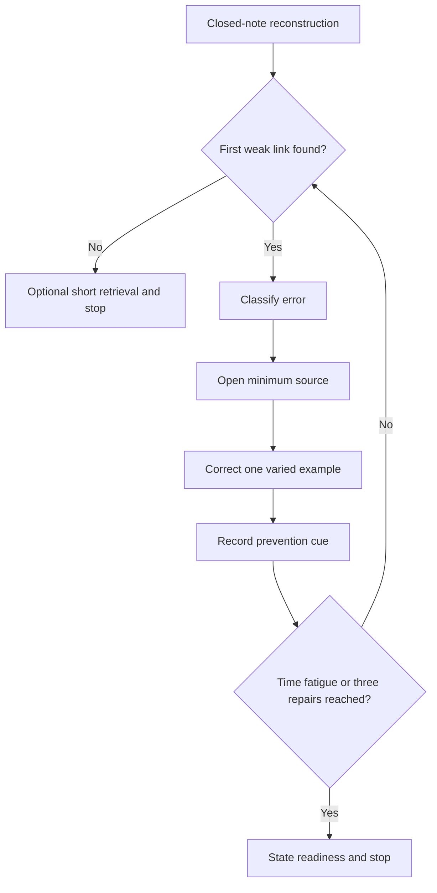
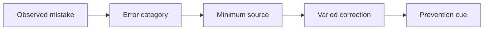

# Day 19 — Rest, Calculation Correction and Catch-Up

> **Boundary notice:** This is a recovery and retrieval block. It adds no new electrical theory, standards values or field procedures. It remains `review-required`, `reference_check_required` and not `technically-reviewed`.

## 1. Outcome and entry check

By the end of this block, the learner should be able to:

1. reconstruct the Day 15–18 design chain from memory;
2. classify a calculation error as input, unit, method, arithmetic, criterion or conclusion error;
3. correct no more than three high-value errors;
4. choose one bounded catch-up task;
5. use fatigue and time stop conditions; and
6. state readiness for Day 20 as ready, ready with one repair, or not ready.

### Entry check — four minutes, closed note

Write the sequence from load evidence through voltage-drop conclusion. Circle the first step you cannot explain confidently.

## 2. Why it matters

Repeated calculation without diagnosis can strengthen the wrong habit. Recovery, closed-note retrieval and targeted correction improve retention while limiting fatigue-driven mistakes.

*Caption: Repair the first weak link; do not restart the whole course.*

## 3. Core concepts and terminology

- **Retrieval:** producing an answer before reopening notes.
- **Error log:** a concise record of the error, cause, correction and prevention cue.
- **Input error:** using an unsupported or incorrect starting value.
- **Unit error:** mixing or omitting units and conversions.
- **Method error:** choosing or applying the wrong authorised process.
- **Arithmetic error:** incorrect calculation after valid inputs and method.
- **Criterion error:** using an unverified or wrong comparison requirement.
- **Conclusion error:** claiming more than the evidence and result support.
- **Catch-up triage:** selecting the smallest task that restores progression.
- **Stop condition:** a preset reason to end the session.

## 4. Rule-finding workflow

Use **R-E-C-O-V-E-R**:

1. **R — Rest first.** Begin only when concentration is adequate.
2. **E — Elicit from memory.** Reconstruct the chain before rereading.
3. **C — Classify the first error.** Use the six error categories.
4. **O — Open only the needed source.** Avoid broad rereading.
5. **V — Verify the correction.** Redo one varied example.
6. **E — Enter the prevention cue.** Record how to detect the error next time.
7. **R — Report readiness and stop.** End at 30 minutes or earlier if fatigue rises.

## 5. Visual model or worked example

A learner obtains a plausible voltage-drop percentage but omitted the unit conversion from millivolts to volts. Classify this primarily as a **unit error**, correct the conversion, then add the cue: “write target unit before substitution.” Do not restart unrelated demand or derating work unless the input chain is also defective.

## 6. Practical application

1. Reconstruct Days 15–18 on one page.
2. Correct up to three errors, highest safety or confidence risk first.
3. Choose one catch-up task: terminology cards, one route-condition map, one voltage-drop evidence ledger, or one changed-condition explanation.
4. Finish with a readiness statement and one next-study cue.

### Educational rubric

Score **0–2** for retrieval completeness, error classification, correction traceability, prevention cue, catch-up restraint and safety/fatigue boundary. Below **10/12**, or zero in safety/fatigue boundary, means Day 20 begins with one supervised remediation task. This is not an official assessment threshold.

## 7. Common errors and safety checkpoint

Common errors include rereading before retrieval, correcting low-value presentation errors first, doing more than three repairs, treating rest as failure, and continuing when concentration falls.

Stop immediately at 30 minutes, after three repairs, or when headache, agitation, repeated arithmetic slips or poor concentration appears. This module authorises no site access, switching, isolation, measurement, testing, design approval or practical electrical work.

## 8. Retrieval and next links

State the six error categories, the seven R-E-C-O-V-E-R steps and one personal stop condition. Recheck the prevention cues after 48 hours.

### Navigation

- **Program:** [Six-Week Capstone Learning Plan](../MASTER_PLAN.md)
- **Previous:** [Day 18 — Voltage-Drop Concepts and Calculation Workflow](day-18-voltage-drop-concepts-and-calculation-workflow.md)
- **Knowledge note:** [[Six-Week Day 19 - Rest Calculation Correction and Catch-Up]]
- **Next:** [Day 20 — Complete Cable-Selection Decision Sequence](day-20-complete-cable-selection-decision-sequence.md)

### References and review boundary

Use current authorised learning materials and RTO instructions only where a repair requires source confirmation. No standards value, table or clause sequence is reproduced.