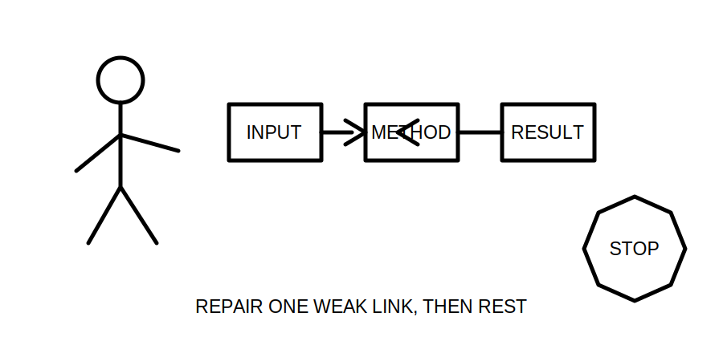
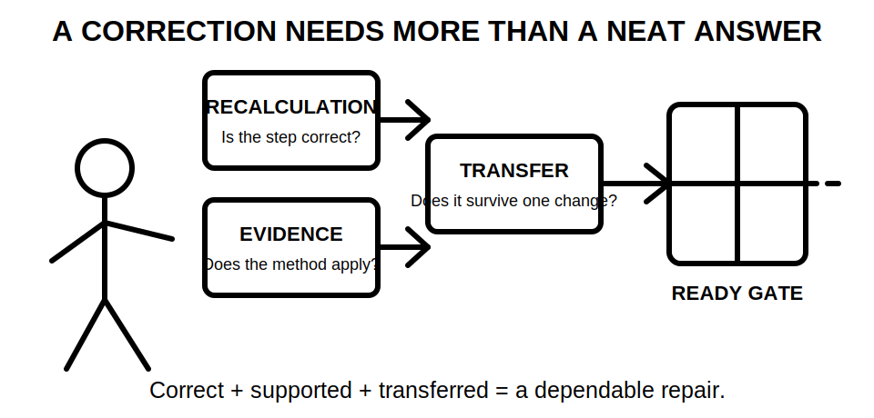
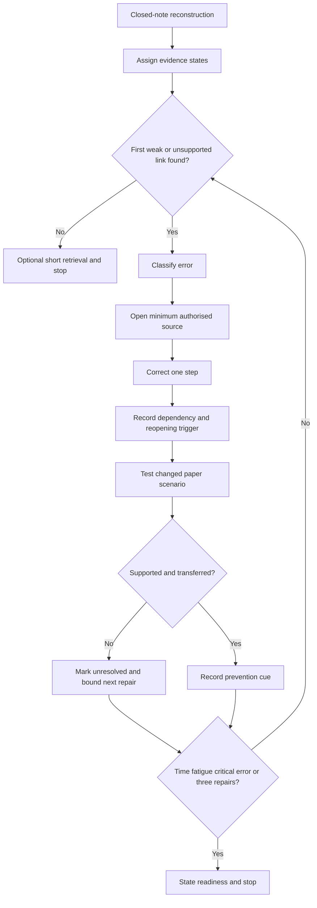
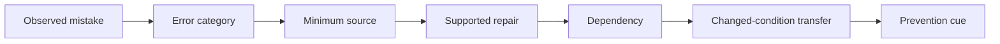

# Day 19 — Rest, Calculation Correction and Catch-Up

> **Boundary notice:** This is a recovery and retrieval block. It adds no new electrical theory, standards values or field procedures. It remains `review-required`, `reference_check_required` and not `technically-reviewed`.

## 1. Outcome and entry check

By the end of this block, the learner should be able to:

1. reconstruct the Day 15–18 design chain from memory;
2. classify a calculation error as input, unit, method, arithmetic, criterion or conclusion error;
3. assign an evidence state to each repaired step;
4. correct no more than three high-value errors using a traceable repair ledger;
5. transfer one correction to a changed paper scenario;
6. use fatigue, time and critical-error stop conditions; and
7. state readiness for Day 20 as **ready**, **ready with one repair**, or **not ready**.

### Entry check — four minutes, closed note

Write the sequence from load evidence through voltage-drop conclusion. Circle the first step you cannot explain confidently. Beside each step, mark it **recalled**, **located**, **supported**, **transferred** or **unresolved**.

## 2. Why it matters

Repeated calculation without diagnosis can strengthen the wrong habit. Recovery, closed-note retrieval and targeted correction improve retention while limiting fatigue-driven mistakes. A corrected answer is not yet dependable unless the learner can identify why it was wrong, what evidence supports the repair and whether the repair still works when one condition changes.

*Caption: Repair the first weak link; do not restart the whole course.*

*Caption: A neat recalculation is not complete until its evidence and changed-condition transfer are checked.*

## 3. Core concepts and terminology

- **Retrieval:** producing an answer before reopening notes.
- **Error log:** a concise record of the error, cause, correction and prevention cue.
- **Input error:** using an unsupported or incorrect starting value.
- **Unit error:** mixing or omitting units and conversions.
- **Method error:** choosing or applying the wrong authorised process.
- **Arithmetic error:** incorrect calculation after valid inputs and method.
- **Criterion error:** using an unverified or wrong comparison requirement.
- **Conclusion error:** claiming more than the evidence and result support.
- **Evidence state:** the current strength of support for a step: **recalled** from memory, **located** in a source, **supported** by applicable evidence, **transferred** successfully to a changed scenario, or **unresolved** because evidence is missing or conflicting.
- **Repair ledger:** a short table linking the original error, evidence state, correction, prevention cue, dependency and reopening trigger.
- **Dependency:** a fact or assumption that must remain true for the correction to remain valid.
- **Reopening trigger:** a change that requires the correction to be checked again.
- **Catch-up triage:** selecting the smallest task that restores progression.
- **Stop condition:** a preset reason to end the session.
- **Critical error:** an error that defeats a safety boundary, uses unsupported authoritative claims, or hides missing evidence behind confident arithmetic.

## 4. Rule-finding workflow

Use **R-E-C-O-V-E-R**:

1. **R — Rest first.** Begin only when concentration is adequate.
2. **E — Elicit from memory.** Reconstruct the chain before rereading and assign evidence states.
3. **C — Classify the first error.** Use the six error categories; do not label every mistake “arithmetic.”
4. **O — Open only the needed source.** Confirm the smallest missing definition, method or criterion.
5. **V — Verify the correction.** Redo the step, state its dependencies and test one changed paper scenario.
6. **E — Enter the prevention cue.** Record how to detect the error next time and what would reopen the repair.
7. **R — Report readiness and stop.** End at 30 minutes, three repairs, a critical error or earlier fatigue.

The diagram prevents a corrected number from being treated as a completed repair. The repair must also have applicable evidence, explicit dependencies and at least one transfer check.

## 5. Visual model or worked example

A learner obtains a plausible voltage-drop percentage but omitted the unit conversion from millivolts to volts.

1. Classify the primary mistake as a **unit error**.
2. Mark the original step **recalled but unsupported** until the method and units are checked.
3. Open only the authorised example or instruction needed to confirm the conversion convention.
4. Correct the step and record the cue: “write the target unit before substitution.”
5. Record the dependency: the same unit convention and calculation boundary must apply.
6. Change one fictional input unit and repeat the conversion without prompts.
7. Mark the repair **transferred** only if the changed example is correct and explained.

Do not restart unrelated demand or derating work unless the input chain is also defective.

### Worked-example fading

- **Round 1:** use the complete sequence above.
- **Round 2:** receive only the error category and identify the source, dependency and cue.
- **Round 3:** independently diagnose a different fictional calculation error and complete the ledger.
- **Delayed check:** repeat one repair after 48 hours without reopening the original worked answer.

## 6. Practical application

1. Reconstruct Days 15–18 on one page.
2. Create a repair ledger with these columns: **step**, **error category**, **evidence state**, **correction**, **dependency**, **reopening trigger**, **prevention cue**.
3. Correct up to three errors, highest safety or confidence risk first.
4. For each repair, change one fictional condition such as unit presentation, load description, route boundary or source note. Do not introduce unverified official values.
5. Choose one catch-up task: terminology cards, one route-condition map, one voltage-drop evidence ledger, or one changed-condition explanation.
6. Finish with a readiness statement and one next-study cue.

### Educational rubric

Score **0–2** for each category:

1. retrieval completeness;
2. error classification;
3. evidence and source traceability;
4. dependency and reopening control;
5. changed-condition transfer; and
6. safety, fatigue and catch-up restraint.

A score below **10/12** means Day 20 begins with one bounded supervised remediation task. This is an educational threshold, not an official RTO pass mark.

### Critical-error gates

Regardless of score, readiness cannot be marked **ready** when the learner:

- invents or silently assumes an exact official value, rule or criterion;
- treats a plausible answer as proof of a valid method;
- cannot distinguish an unresolved input from an arithmetic mistake;
- removes units or calculation boundaries so the repair cannot be audited;
- claims practical authority from this paper exercise; or
- continues after a stop condition.

## 7. Common errors and safety checkpoint

Common errors include rereading before retrieval, correcting low-value presentation errors first, changing several variables at once, treating a located source as automatically applicable, doing more than three repairs, treating rest as failure, and continuing when concentration falls.

Reopen a repair when the load description, source arrangement, route boundary, conductor assumption, units, authorised method, comparison criterion, source edition or RTO instruction changes, or when later evidence conflicts with the repair ledger.

Stop immediately at 30 minutes, after three repairs, after a critical error, or when headache, agitation, repeated arithmetic slips or poor concentration appears. This module authorises no site access, switching, isolation, measurement, testing, design approval or practical electrical work.

## 8. Retrieval and next links

Without notes, state the six error categories, five evidence states, seven R-E-C-O-V-E-R steps, one reopening trigger and one personal stop condition. Recheck one prevention cue and its changed-condition transfer after 48 hours.

### Navigation

- **Program:** [Six-Week Capstone Learning Plan](../MASTER_PLAN.md)
- **Previous:** [Day 18 — Voltage-Drop Concepts and Calculation Workflow](day-18-voltage-drop-concepts-and-calculation-workflow.md)
- **Knowledge note:** [[Six-Week Day 19 - Rest Calculation Correction and Catch-Up]]
- **Next:** [Day 20 — Complete Cable-Selection Decision Sequence](day-20-complete-cable-selection-decision-sequence.md)

### References and review boundary

Use current authorised learning materials and RTO instructions only where a repair requires source confirmation. Exact equations, coefficients, limits, criteria and assessment arrangements remain `reference_check_required`. No standards value, table, clause sequence, official assessment content or field procedure is reproduced.