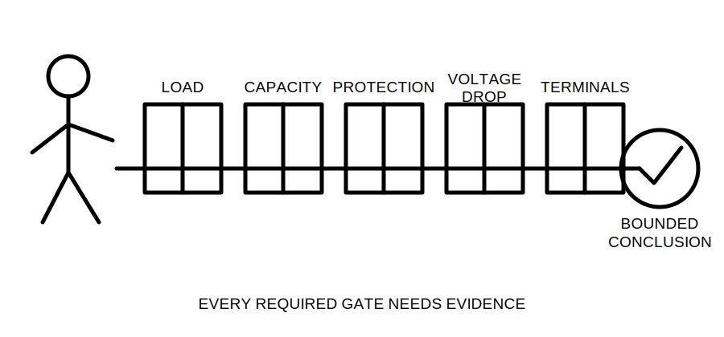
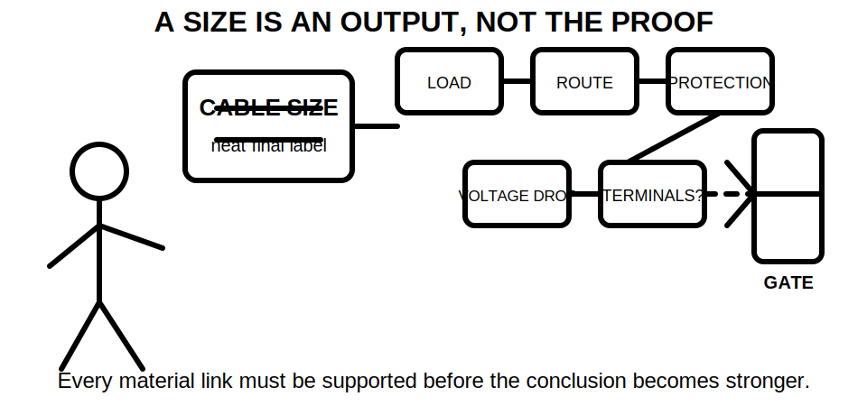
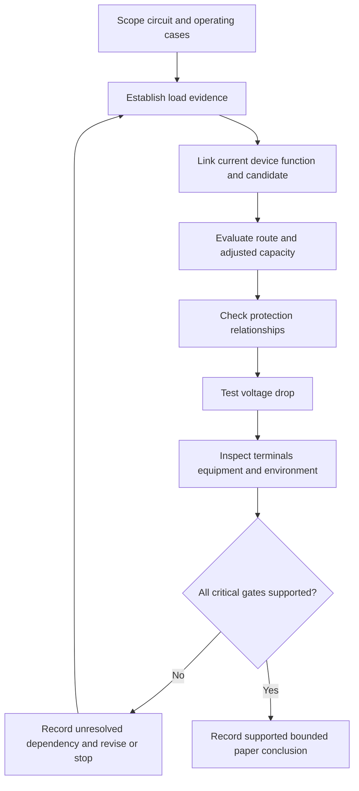
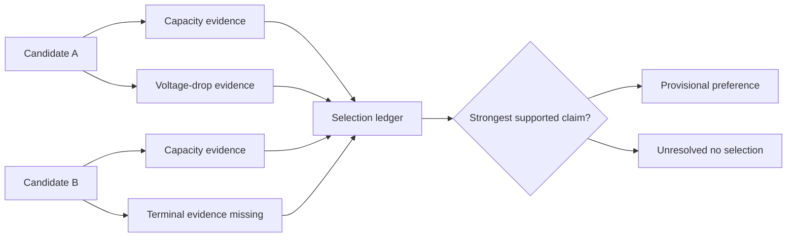

# Day 20 — Complete Cable-Selection Decision Sequence

> **Currency, copyright and safety notice:** This original module integrates evidence, demand, protection, conductor capacity, installation conditions and voltage drop. It does not reproduce standards tables, clause wording, official design forms or manufacturer datasets. Exact methods, limits, ratings, factors and exceptions remain `reference_check_required`. It is `review-required` and not `technically-reviewed`.

## 1. Outcome and entry check

### Observable objectives

By the end of this block, the learner should be able to:

1. reconstruct the complete cable-selection sequence in a defensible order;
2. assign an evidence grade and claim grade to each material decision;
3. distinguish inputs, dependencies, checks, conclusions and reopening triggers;
4. define candidate conductor, governing condition, terminal constraint and design margin;
5. complete a selection ledger linking every claim to evidence, scope and unresolved dependencies;
6. reject a selection where one critical gate remains unresolved;
7. compare two fictional candidates without treating size or one passing result as proof; and
8. transfer the sequence to a changed scenario and score at least 10/12 on the educational rubric with no critical error.

### Entry check — eight minutes, closed note

1. Reconstruct Days 15–18 in order.
2. Name one reason each stage can reopen an earlier stage.
3. Distinguish a candidate, provisional preference and supported paper conclusion.
4. Explain why terminal and equipment constraints are separate evidence gates.
5. State the practical and technical-review boundaries.

## 2. Why it matters

Cable selection is not a size lookup or a one-direction calculation. It is a controlled argument in which each conclusion depends on current evidence about the load, protective function, route, conductor, terminals and operating case. A late change can invalidate several earlier decisions. The defensible outcome is a bounded, traceable conclusion—not a plausible cable size.

*Caption: A candidate becomes supportable only when every material gate and dependency is addressed.*

*Caption: A cable size is an output label; the selection proof is the evidence chain behind it.*

## 3. Core concepts and terminology

- **Candidate conductor:** a conductor being evaluated; it is not yet accepted.
- **Provisional preference:** the strongest candidate under stated fictional evidence, still subject to unresolved dependencies or review.
- **Supported paper conclusion:** a bounded educational conclusion whose material inputs, methods and dependencies are evidenced for the supplied scenario.
- **Governing condition:** the operating case or route section that controls a result.
- **Terminal constraint:** a limitation associated with equipment connection points, conductor type, size, temperature basis or manufacturer instruction.
- **Design margin:** the difference between required and available capability; it cannot cure a failed or unsupported requirement.
- **Evidence gate:** a material question that must be resolved before a stronger claim is made.
- **Dependency:** a fact or earlier conclusion on which a later decision relies.
- **Reopening trigger:** changed or conflicting evidence that invalidates an earlier conclusion.
- **Selection ledger:** a record of claim, evidence, evidence grade, dependencies, result, unresolved item and reopening trigger.

### Evidence grades

1. **Supplied:** stated in the controlled scenario pack.
2. **Corroborated:** supported by more than one consistent controlled source.
3. **Derived:** calculated from supported inputs using an authorised method.
4. **Assumed:** introduced for learning continuity but not verified.
5. **Missing or conflicting:** absent, stale or inconsistent evidence.

### Claim grades

1. **Observation:** what the supplied information shows.
2. **Provisional reasoning:** a possible interpretation with open dependencies.
3. **Supported paper conclusion:** a bounded conclusion for the supplied fictional case.
4. **Authorised technical determination:** reserved for current authorised sources and qualified review; this module cannot make it.

## 4. Rule-finding workflow

Use **S-E-L-E-C-T-I-O-N**:

1. **S — Scope the circuit and operating cases.** Define source, load, route, phases, duty, boundaries and exclusions.
2. **E — Establish load evidence.** Build the load register and identify the authorised demand method.
3. **L — Link design current, protective function and candidate conductor.** Keep each role and dependency distinct.
4. **E — Evaluate installation conditions.** Segment the route and establish adjusted capacity using authorised data.
5. **C — Check protection relationships.** Do not infer device or fault performance from labels alone.
6. **T — Test voltage drop.** Preserve method, units, path boundary and criterion.
7. **I — Inspect terminal, equipment and environmental constraints.** Record manufacturer and installation dependencies.
8. **O — Observe interactions and changed-condition effects.** Reopen every affected gate before recalculating.
9. **N — Note the bounded conclusion.** State claim grade, unresolved evidence, technical-review needs and stop conditions.

The loop is deliberate. A changed load, route, device, terminal, source arrangement, manufacturer instruction or criterion can reopen several gates; only the affected checks should be repeated, but none may be silently carried forward.

### Selection ledger

| Claim or gate | Evidence and grade | Dependencies | Result | Reopening trigger |
|---|---|---|---|---|
| Operating case | controlled brief — supplied | load controls and duty | open/supported | load or control changes |
| Adjusted capacity | authorised fictional data — derived | route section and installation conditions | open/supported | route, grouping or ambient changes |
| Protection relationship | controlled device evidence — supplied/derived | protective function and conductor | open/supported | device or source changes |
| Voltage-drop conclusion | supported inputs — derived | current, length, arrangement and method | open/supported | load, length or method changes |
| Terminal compatibility | manufacturer evidence — supplied/missing | conductor construction and equipment | open/supported | equipment or instruction changes |

## 5. Visual model or worked example

### Fictional candidate comparison

A controlled training pack supplies candidates A and B. Candidate A has lower fictional adjusted-capacity margin but lower fictional voltage drop. Candidate B has higher margin but incomplete terminal evidence.

A defensible comparison records:

- the governing operating case;
- the governing route section;
- the evidence grade for every material input;
- whether protective function and conductor relationship are supported;
- the voltage-drop method, path boundary and units;
- terminal and manufacturer dependencies; and
- the strongest permitted claim grade.

The correct outcome may be: “Candidate A is the provisional preference for the supplied fictional case, subject to the stated unresolved review items.” If terminal evidence is missing for both, neither candidate supports a completed paper conclusion.

### Worked-example fading and transfer

1. Complete the ledger with headings supplied.
2. Repeat with only the gate names supplied.
3. Rebuild from a blank page after the route moves through a hotter grouped section.
4. Before arithmetic, identify every reopened dependency and explain why unaffected evidence may remain valid.

## 6. Practical application

### Part A — complete decision record

Produce one page containing scope, evidence ledger, operating cases, candidate comparison, source list, calculations, unresolved items, claim grades and reopening triggers.

### Part B — change propagation

Analyse separately:

1. increased load;
2. changed protective device;
3. added grouping;
4. longer route; and
5. different equipment terminals.

For each change, identify the first affected dependency, every reopened S-E-L-E-C-T-I-O-N gate and the strongest remaining claim.

### Part C — independent assessment response

Given a fresh fictional scenario, produce a bounded recommendation without copying the worked example. State exactly what prevents any stronger claim.

### Educational rubric

Score **0–2** for each category:

1. scope and operating cases;
2. evidence and claim calibration;
3. dependency and interaction control;
4. complete selection sequence;
5. bounded conclusion and communication; and
6. safety, copyright and authority boundary.

A score below **10/12** requires a varied re-attempt. Any critical error also requires remediation regardless of total score. This is not an official RTO pass mark.

**Critical errors:** inventing a material value; treating missing evidence as passed; presenting a candidate as approved or compliant; omitting a governing route or operating case; hiding an assumption; or implying authority for practical work or technical approval.

## 7. Common errors and safety checkpoint

### Common errors

- starting with cable size instead of scope and load evidence;
- treating one passing check as complete selection;
- using a high design margin to excuse another failed gate;
- hiding assumptions inside arithmetic;
- using device rating as proof of conductor suitability;
- ignoring the governing route section or operating case;
- failing to verify terminal or equipment restrictions;
- applying remembered values, factors or limits;
- carrying stale conclusions through a changed scenario; and
- describing an educational candidate as approved or compliant.

### Safety checkpoint

This module authorises no site access, switching, isolation, opening, measurement, testing, alteration, installation, energisation, commissioning, certification, verification or design approval. Stop where practical evidence, authorised-source interpretation or qualified approval is required.

## 8. Retrieval and next links

### Closed-note retrieval

1. State the nine S-E-L-E-C-T-I-O-N steps.
2. Define candidate conductor, dependency, claim grade and reopening trigger.
3. Name the five evidence grades.
4. Explain why design margin cannot replace a failed gate.
5. State the strongest conclusion permitted when one critical dependency remains unresolved.

### Delayed transfer

After 48 hours, rebuild the workflow and selection ledger from a blank page. Apply one changed condition and identify reopened gates before doing arithmetic.

### Navigation

- **Program:** [Six-Week Capstone Learning Plan](../MASTER_PLAN.md)
- **Previous:** [Day 19 — Rest, Calculation Correction and Catch-Up](day-19-rest-calculation-correction-and-catch-up.md)
- **Knowledge note:** [[Six-Week Day 20 - Complete Cable-Selection Decision Sequence]]
- **Next:** [Day 21 — Week 3 Integrated Circuit-Design Exercise](day-21-week-3-integrated-circuit-design-exercise.md)

### References and review boundary

Use current authorised standards, manufacturer data, installation instructions, workplace procedures and RTO instructions. Exact demand methods, ratings, capacities, factors, equations, limits, terminal requirements and exceptions remain `reference_check_required`; no standards table, figure, clause sequence or near-substitute content is reproduced.
