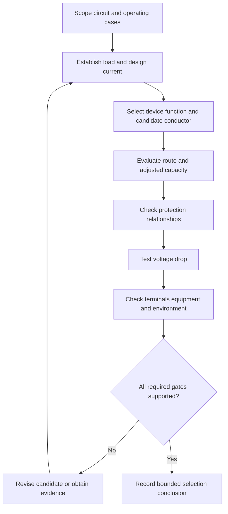
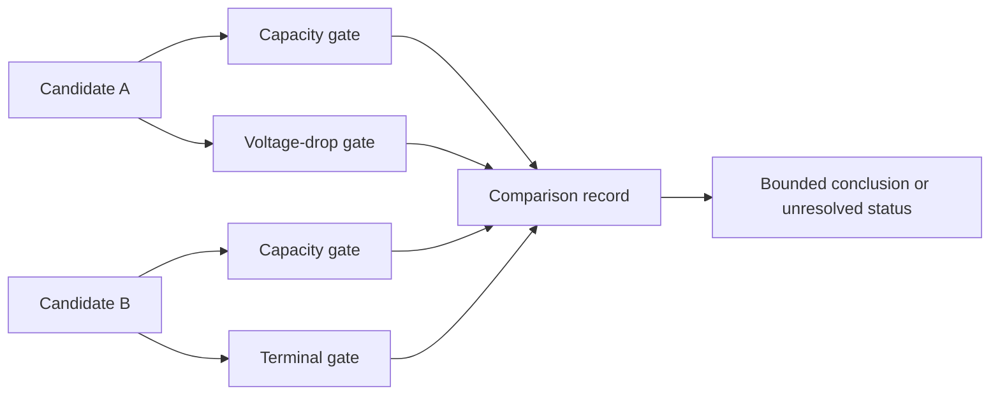

# Day 20 — Complete Cable-Selection Decision Sequence

> **Currency, copyright and safety notice:** This original module integrates evidence, demand, protection, conductor capacity, installation conditions and voltage drop. It does not reproduce standards tables, clause wording, official design forms or manufacturer datasets. Exact methods, limits, ratings, factors and exceptions remain `reference_check_required`. It is `review-required` and not `technically-reviewed`.

## 1. Outcome and entry check

### Observable objectives

By the end of this block, the learner should be able to:

1. state the complete cable-selection decision sequence in a defensible order;
2. identify which decisions are inputs, checks, outcomes and reopening triggers;
3. define candidate conductor, governing condition, terminal constraint and design margin;
4. keep load, device, conductor, route and voltage-drop evidence traceable;
5. reject a selection where one required evidence gate remains unresolved;
6. compare two fictional candidates without treating size alone as proof of suitability;
7. explain how one changed condition propagates through the chain; and
8. score at least 17/20 on the educational rubric with no zero in evidence control, integration or safety boundary.

### Entry check — eight minutes, closed note

1. Reconstruct Days 15–18 in order.
2. Name one reason each stage can reopen an earlier stage.
3. What is the difference between a candidate and a verified selection?
4. Why must terminal and equipment constraints be checked separately?
5. Which claims remain outside an automated learning module?

## 2. Why it matters

Cable selection is not a single table lookup. It is a controlled sequence of linked decisions. A candidate that passes one check can still fail another, and a late route or equipment change can invalidate apparently completed work. The defensible outcome is therefore a traceable chain with explicit unresolved evidence and reopening rules.

*Caption: A cable candidate becomes a selection only after every required gate is addressed.*

## 3. Core concepts and terminology

- **Candidate conductor:** a conductor considered for evaluation but not yet accepted.
- **Verified selection:** a bounded design conclusion supported by all required current evidence and authorised methods.
- **Governing condition:** the operating case or route section that controls the result.
- **Terminal constraint:** a limitation associated with equipment or device connection points, conductor type, size or temperature basis.
- **Design margin:** the difference between a required value and the verified available capability; it is not a substitute for compliance.
- **Evidence gate:** a required question that must be resolved before progressing.
- **Reopening trigger:** a changed fact that invalidates one or more earlier decisions.
- **Decision record:** the traceable set of inputs, sources, calculations, assumptions, outcomes and review flags.

## 4. Rule-finding workflow

Use **S-E-L-E-C-T-I-O-N**:

1. **S — Scope the circuit and operating cases.** Define source, load, route, phases, duty and boundaries.
2. **E — Establish load evidence.** Build the load register and determine the authorised demand method.
3. **L — Link design current, device function and candidate conductor.** Keep each role distinct.
4. **E — Evaluate installation conditions.** Map sections and establish adjusted capacity using authorised data.
5. **C — Check protection relationships.** Confirm the candidate does not rely on an unsupported device or fault-performance claim.
6. **T — Test voltage drop.** Use verified inputs, units, method and criterion.
7. **I — Inspect terminal, equipment and environmental constraints.** Record manufacturer and installation requirements.
8. **O — Observe interactions and changed-condition effects.** Reopen earlier gates where needed.
9. **N — Note the bounded conclusion.** State candidate status, unresolved evidence, technical-review needs and stop conditions.

No gate is “passed” merely because a value looks plausible. Each material input and method must have a source and scope.

## 5. Visual model or worked example

### Fictional candidate comparison

A training scenario supplies two unnamed conductor candidates, A and B, plus authorised fictional data. Candidate A has lower capacity margin but lower fictional voltage drop. Candidate B has higher capacity margin but a terminal compatibility question.

A valid comparison must record:

- which operating case governs demand;
- which route section governs adjusted capacity;
- whether the device function and conductor relationship is supported;
- which voltage-drop method and path length apply;
- whether terminal and manufacturer constraints are resolved; and
- which unresolved item prevents a verified selection.

The correct educational conclusion may be: “Candidate A is provisionally preferred for the supplied fictional case, subject to authorised technical review,” or “Neither candidate is yet supportable because terminal evidence is missing.”

### Worked-example fading

Repeat the comparison after the route moves through a hotter grouped section. Identify every gate that reopens before doing arithmetic.

## 6. Practical application

### Part A — complete decision record

Prepare one page with circuit scope, evidence ledger, operating cases, candidate comparison, source list, calculations, unresolved items and reopening triggers.

### Part B — change propagation

Analyse separately:

1. increased load;
2. changed protective device;
3. added grouping;
4. longer route; and
5. different equipment terminals.

For each, mark every affected S-E-L-E-C-T-I-O-N step.

### Part C — assessment response

Given a fresh fictional scenario, produce a concise bounded recommendation and identify the exact evidence preventing any stronger claim.

### Educational rubric

Score **0–2** for scope, load evidence, device/conductor roles, route and capacity, protection reasoning, voltage drop, terminal/equipment checks, interaction tracing, conclusion quality and safety boundary. Below **17/20**, or zero in evidence control, integration or safety, requires a varied re-attempt. This is not an official assessment threshold.

## 7. Common errors and safety checkpoint

### Common errors

- starting with cable size instead of circuit scope and load evidence;
- treating one passing check as complete selection;
- hiding assumptions inside arithmetic;
- using device rating as proof of conductor suitability;
- ignoring the governing route section;
- failing to check terminal or equipment restrictions;
- applying remembered values or limits;
- not reopening earlier decisions after a change; and
- describing an educational candidate as approved or compliant.

### Safety checkpoint

This module authorises no site access, switching, isolation, opening, measurement, testing, alteration, installation, energisation, commissioning, certification, verification or design approval. Stop where practical evidence, authorised-source interpretation or qualified approval is required.

## 8. Retrieval and next links

### Closed-note retrieval

1. State the nine S-E-L-E-C-T-I-O-N steps.
2. Define candidate conductor, governing condition and reopening trigger.
3. Name five evidence gates.
4. Explain why capacity margin cannot replace another failed check.
5. State the strongest conclusion permitted when one material item remains unresolved.

### Delayed transfer

After 48 hours, rebuild the sequence from a blank page and apply one changed condition without referring to the worked example.

### Navigation

- **Program:** [Six-Week Capstone Learning Plan](../MASTER_PLAN.md)
- **Previous:** [Day 19 — Rest, Calculation Correction and Catch-Up](day-19-rest-calculation-correction-and-catch-up.md)
- **Knowledge note:** [[Six-Week Day 20 - Complete Cable-Selection Decision Sequence]]
- **Next:** Day 21 — Week 3 Integrated Circuit-Design Exercise

### References and review boundary

Use current authorised standards, manufacturer data, installation instructions, workplace procedures and RTO instructions. Exact demand methods, ratings, capacities, factors, equations, limits, terminal requirements and exceptions remain `reference_check_required`; no standards table, figure or clause sequence is reproduced.