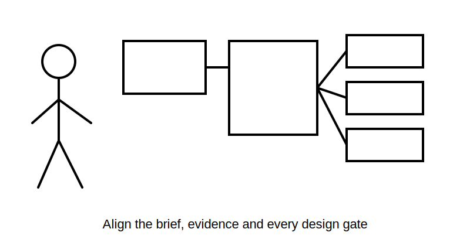
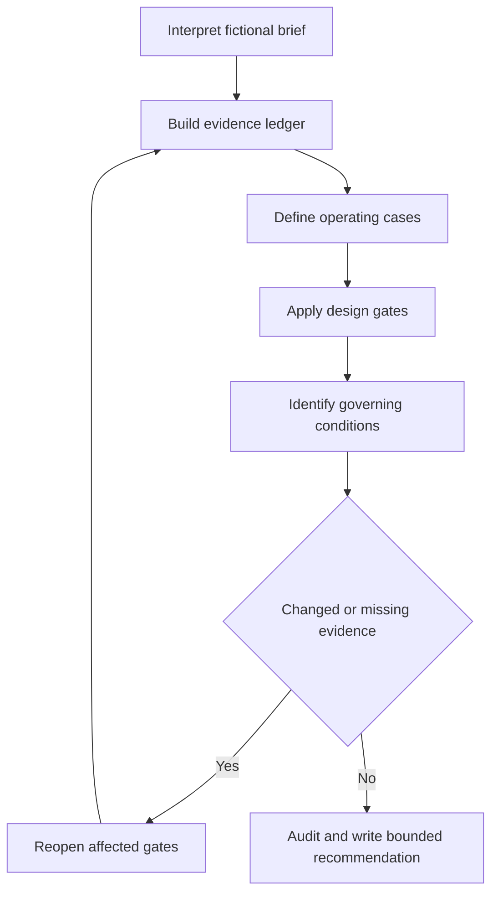

# Day 21 — Week 3 Integrated Circuit-Design Exercise

> **Currency, copyright and safety notice:** Original educational content only. Exact methods, limits, ratings, factors and jurisdiction-specific claims remain `reference_check_required`. This module is `review-required` and not `technically-reviewed`; no standards tables, figures, clause sequences or official assessment content are reproduced.

## 1. Outcome and entry check

By the end, the learner should be able to convert a fictional brief into a traceable scope; separate supplied facts, derivations, assumptions and missing evidence; apply the load–device–conductor–route–voltage-drop chain; identify governing cases; trace reopening triggers; and produce a bounded recommendation. Target: at least 17/20 on the educational rubric with no zero in evidence control, integration or safety.

**Entry check — ten minutes, closed note:** reconstruct Day 20; define governing condition, evidence gate and reopening trigger; name three unresolved-selection causes; distinguish plausible from verified; state the practical-authority boundary.

## 2. Why it matters

Integrated assessment tasks combine incomplete information, calculations, source selection and communication. Correct arithmetic inside an uncontrolled process is not enough.

*Caption: Integration means keeping the brief, evidence and every design gate aligned.*

## 3. Core concepts and terminology

- **Design brief:** stated need, boundaries, constraints and outputs.
- **Operating case:** a defined combination of loads and conditions.
- **Evidence ledger:** a record separating facts, derivations, assumptions, missing evidence and sources.
- **Governing case:** the case or route condition controlling a decision.
- **Design interaction:** a change in one decision that affects another.
- **Bounded recommendation:** a conclusion limited to available evidence and authority.
- **Critical omission:** a missing decision or safety boundary that invalidates the response.
- **Remediation trigger:** an error pattern requiring targeted correction and a varied re-attempt.

## 4. Rule-finding workflow

Use **I-N-T-E-G-R-A-T-E**: **I**nterpret the brief; **N**ame evidence classes; **T**est operating cases; **E**xecute the design sequence; **G**overn by the controlling condition; **R**eopen affected gates; **A**udit sources and units; **T**ell the bounded conclusion; **E**valuate readiness.

## 5. Visual model or worked example

A fictional detached training room requires lighting, socket outlets and one fixed item. The pack includes fictional load data, two route sections, two conductor candidates, fictional device information and an incomplete terminal note. A defensible response builds a load register, compares operating cases, identifies the governing route, keeps device function distinct from conductor capacity, uses only supplied fictional arithmetic and withholds a final selection while terminal evidence is missing.

Repeat with increased load and a longer route; list every reopened gate before recalculating.

## 6. Practical application

Produce a scope, evidence ledger, operating-case comparison, design record, source audit, bounded recommendation and review-required list. Trace the effect of changed load, grouping, device, length and terminal information.

Score 0–2 for scope, evidence control, operating cases, load reasoning, device/conductor roles, route analysis, voltage-drop control, interaction tracing, conclusion quality and safety. Below 17/20, or zero in evidence control, integration or safety, requires a varied re-attempt. This is not an official assessment threshold.

## 7. Common errors and safety checkpoint

Errors include starting with remembered cable size, mixing facts with assumptions, ignoring the governing route, hiding missing inputs, failing to reopen gates and presenting a provisional outcome as approved.

This paper-based module authorises no site access, switching, isolation, opening, measurement, testing, installation, alteration, energisation, commissioning, certification, verification or design approval.

## 8. Retrieval and next links

Retrieve the nine workflow steps; define evidence ledger, governing case and bounded recommendation; name four critical omissions; explain how one route change reopens several gates; state the strongest permitted conclusion when terminal evidence is missing.

- **Program:** [Six-Week Capstone Learning Plan](../MASTER_PLAN.md)
- **Previous:** [Day 20 — Complete Cable-Selection Decision Sequence](day-20-complete-cable-selection-decision-sequence.md)
- **Knowledge note:** [[Six-Week Day 21 - Week 3 Integrated Circuit-Design Exercise]]
- **Next:** [Day 22 — Functional Switching, Isolation and Emergency Switching Distinctions](day-22-functional-switching-isolation-and-emergency-switching-distinctions.md)
