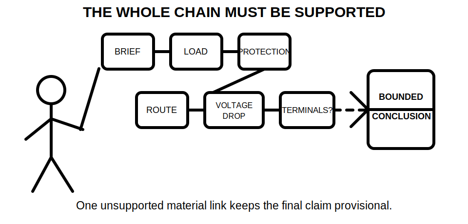
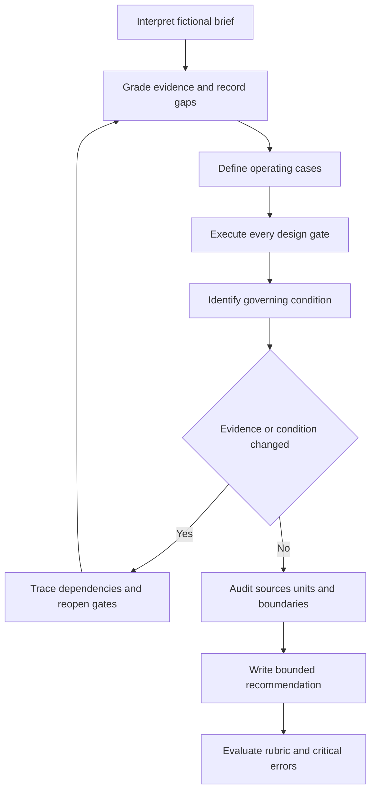
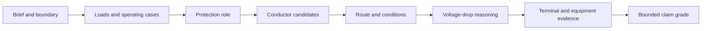

# Day 21 — Week 3 Integrated Circuit-Design Exercise

> **Currency, copyright and safety notice:** Original educational content only. Exact methods, limits, ratings, factors, equations, assessment conditions and jurisdiction-specific claims remain `reference_check_required`. This module is `review-required` and not `technically-reviewed`; no standards tables, figures, clause sequences, official assessment content or practical field procedures are reproduced.

## 1. Outcome and entry check

By the end of this block, the learner should be able to:

1. translate a fictional client brief into explicit loads, operating cases, route sections, constraints and required outputs;
2. classify each input using five evidence grades: **supplied**, **corroborated**, **derived**, **assumed**, or **missing/conflicting**;
3. apply the complete load–device–conductor–route–voltage-drop–terminal sequence without skipping a gate;
4. identify the governing condition and explain why it controls the present paper conclusion;
5. trace which earlier decisions must reopen after a changed load, route, device, grouping condition, terminal limit or source document;
6. state the strongest justified claim using four claim grades: **observation**, **provisional reasoning**, **supported paper conclusion**, or **authorised technical determination**; and
7. produce a bounded recommendation that separates resolved decisions, unresolved evidence and prohibited practical action.

**Entry check — ten minutes, closed note:** reconstruct the Day 20 selection sequence; define governing condition, evidence gate, dependency and reopening trigger; name three reasons a plausible conductor candidate may remain unresolved; distinguish a supported paper conclusion from an authorised technical determination; and state the practical-authority boundary.

## 2. Why it matters

Integrated design tasks are difficult because several individually reasonable decisions can become inconsistent when combined. A correct calculation does not repair an incomplete brief, an unsupported route assumption, a mismatched protective role or missing terminal evidence. The learner therefore needs a traceable chain in which every conclusion has evidence, dependencies and a clear reopening rule.

*Caption: Integration means keeping the brief, evidence and every design gate aligned.*

*Caption: A neat final answer is not defensible while a material dependency remains assumed, missing or conflicting.*

## 3. Core concepts and terminology

- **Design brief:** the stated need, boundaries, constraints, supplied information and expected outputs for a design task.
- **Operating case:** one defined combination of loads, controls and conditions that could occur together.
- **Evidence grade:** a label describing how strongly an input is supported.
  - **Supplied:** directly provided in the fictional task pack.
  - **Corroborated:** supported by more than one compatible source in the pack.
  - **Derived:** calculated or logically produced from identified inputs and a stated method.
  - **Assumed:** temporarily adopted without adequate supporting evidence.
  - **Missing/conflicting:** absent, unclear or inconsistent evidence that prevents a stronger claim.
- **Claim grade:** the strongest statement justified by the current evidence and authority.
  - **Observation:** a direct description of supplied material.
  - **Provisional reasoning:** a tentative interpretation that depends on unresolved evidence.
  - **Supported paper conclusion:** a traceable educational conclusion supported by the supplied fictional evidence.
  - **Authorised technical determination:** a conclusion made by an appropriately authorised person using current applicable sources and verified conditions; this module cannot produce it.
- **Integration ledger:** a record of each gate, its evidence, dependencies, result, unresolved items and reopening triggers.
- **Dependency:** an input or earlier conclusion that another conclusion relies on.
- **Governing condition:** the operating case, route section or constraint that controls the current decision.
- **Design interaction:** a change in one decision that alters another, such as a load change affecting design current, device choice, conductor evaluation and voltage-drop reasoning.
- **Reopening trigger:** new or changed evidence that makes an earlier conclusion stale and requires it to be reconsidered.
- **Bounded recommendation:** a conclusion explicitly limited by the available evidence, educational context and authority.
- **Critical omission:** a missing safety boundary, evidence gate or material dependency that invalidates the integrated response.

## 4. Rule-finding workflow

Use **I-N-T-E-G-R-A-T-E**:

1. **I — Interpret the brief:** identify the requested outcome, system boundary, loads, routes, constraints and excluded work.
2. **N — Name evidence classes:** grade every material input and mark missing or conflicting evidence before calculating.
3. **T — Test operating cases:** define credible combinations of loads and conditions without inventing diversity or control behaviour.
4. **E — Execute the design sequence:** work through load, protection role, conductor candidate, route conditions, voltage drop, terminals and equipment constraints.
5. **G — Govern by the controlling condition:** identify the case or section that sets the present limit.
6. **R — Reopen affected gates:** trace changed evidence backward and forward through all dependent decisions.
7. **A — Audit sources and units:** confirm source identity, applicability, units, boundaries and arithmetic traceability.
8. **T — Tell the bounded conclusion:** separate observations, provisional reasoning, supported paper conclusions and unresolved items.
9. **E — Evaluate readiness:** apply the educational rubric and critical-error gates before progressing.

The loop prevents a changed input from being patched only at the final calculation. Reopening begins at the earliest affected dependency and continues through every downstream claim.

### Integration ledger

Use one row for each material gate:

| Gate or claim | Evidence grade | Dependencies | Present result | Missing/conflicting evidence | Reopening trigger |
|---|---|---|---|---|---|
| Operating load case | supplied / corroborated / derived / assumed / missing | load list, controls, simultaneity basis | bounded statement | unresolved control behaviour | load or control changes |
| Protective role | evidence grade | load case, source, device information | bounded statement | missing characteristics | device or source changes |
| Conductor candidate | evidence grade | design current, device, route, conditions | candidate only | unresolved route or capacity evidence | load, device or route changes |
| Voltage-drop reasoning | evidence grade | current, length boundary, arrangement, method | bounded result | missing coefficient or boundary | load, route or method changes |
| Terminal and equipment fit | evidence grade | conductor, device, equipment data | resolved or withheld | incomplete terminal evidence | equipment or manufacturer-data changes |

A passing result at one row does not compensate for an unresolved critical row.

## 5. Visual model or worked example

A fictional detached training room requires lighting, socket outlets and one fixed item. The task pack contains fictional load data, two operating cases, two route sections, two conductor candidates, fictional protective-device information and an incomplete terminal note.

### Worked pass 1 — fully guided

1. Record the brief boundary and required outputs.
2. Grade the load values as supplied and the proposed simultaneous-use case as assumed until its basis is found.
3. Keep the device's protective role distinct from conductor capacity.
4. Identify the route section with the most restrictive supplied condition as the provisional governing section.
5. apply only the fictional method supplied in the exercise pack; preserve units and intermediate results.
6. Grade the terminal information as missing/conflicting and withhold final selection.
7. State the conclusion as provisional reasoning: one candidate appears preferable on supplied paper evidence, but the integrated selection remains unresolved pending terminal evidence and verification against current authorised sources.

The diagram is a dependency chain, not a claim that real design always follows a single linear path. Interactions may require earlier gates to reopen.

### Worked pass 2 — partially guided

Repeat the scenario with a longer second route section and a changed grouping condition. The learner receives the ledger headings but must independently identify every affected dependency. A valid response reopens route classification, adjusted capacity reasoning, governing-section identification, voltage-drop reasoning and the bounded conclusion.

### Transfer pass — independent

Use a new fictional brief with different load labels, one controlled load, an alternate route and conflicting equipment information. Complete the ledger without the mnemonic prompts. Do not reuse the first scenario's governing condition or candidate merely because the numbers look similar.

## 6. Practical application

Produce a compact integrated design record containing:

1. brief and boundary statement;
2. load register and operating-case comparison;
3. evidence-grade ledger;
4. complete design-gate record;
5. governing-condition explanation;
6. dependency and reopening map for one changed condition;
7. source, unit and arithmetic audit;
8. bounded recommendation with claim grades; and
9. review-required list.

### Educational rubric — 0, 1 or 2 points per category

| Category | 0 | 1 | 2 |
|---|---|---|---|
| Brief and operating cases | boundary or material case absent | partly defined | explicit, complete and traceable |
| Evidence control | facts, assumptions and gaps mixed | mostly separated | every material input graded and sourced |
| Design-chain integration | gate skipped or roles conflated | chain mostly complete | all gates linked with dependencies |
| Governing condition and reopening | governing basis absent | identified but weakly traced | justified and change propagation complete |
| Conclusion and communication | approval implied or uncertainty hidden | bounded but incomplete | claim grades, unresolved items and next evidence clear |
| Safety, source and authority boundary | unsafe or authoritative claim | boundary partly stated | explicit educational, source and practical limits |

**Target:** at least 10/12 with no critical error. This is an original educational readiness threshold, not an official RTO pass mark or claim about an authorised assessment.

**Critical errors requiring a varied re-attempt:** inventing a material rule or value; skipping a critical gate; presenting assumed evidence as verified; failing to reopen a stale conclusion; implying practical authority or approved design status; or omitting the safety/source boundary.

Complete a delayed retrieval attempt after at least one intervening study block: reconstruct the workflow, ledger and claim grades from memory, then apply them to a changed fictional brief.

## 7. Common errors and safety checkpoint

Common errors include:

- beginning with a remembered conductor size rather than the brief and evidence;
- treating all supplied numbers as equally applicable;
- using one likely operating case without stating its basis;
- confusing protective-device rating with proof of conductor suitability;
- applying a route factor without evidence that the route condition exists;
- carrying a changed load into one calculation but not reopening downstream gates;
- allowing a comfortable margin at one gate to conceal missing terminal or equipment evidence;
- reporting a provisional paper candidate as compliant, approved or ready to install; and
- copying wording or tables from a standard instead of recording a source location and original explanation.

**Stop and mark unresolved** when a material input, applicable source, route condition, equipment characteristic, terminal constraint, method or authority boundary is missing or conflicting. Do not invent a value to finish the exercise.

This paper-based module authorises no site access, switching, isolation, proving, opening, measurement, testing, installation, alteration, energisation, commissioning, certification, verification or design approval. Any real design decision, safety-critical procedure or compliance determination requires current authorised sources, verified site/equipment information and appropriately qualified review.

## 8. Retrieval and next links

Without notes:

1. retrieve the nine I-N-T-E-G-R-A-T-E steps;
2. define the five evidence grades and four claim grades;
3. reconstruct the integration-ledger headings;
4. name six reopening triggers;
5. explain why one passing calculation cannot validate the complete design chain;
6. state the strongest permitted conclusion when terminal evidence is missing; and
7. describe one critical error that forces a varied re-attempt.

- **Program:** [Six-Week Capstone Learning Plan](../MASTER_PLAN.md)
- **Previous:** [Day 20 — Complete Cable-Selection Decision Sequence](day-20-complete-cable-selection-decision-sequence.md)
- **Knowledge note:** [[Six-Week Day 21 - Week 3 Integrated Circuit-Design Exercise]]
- **Next:** [Day 22 — Functional Switching, Isolation and Emergency Switching Distinctions](day-22-functional-switching-isolation-and-emergency-switching-distinctions.md)
