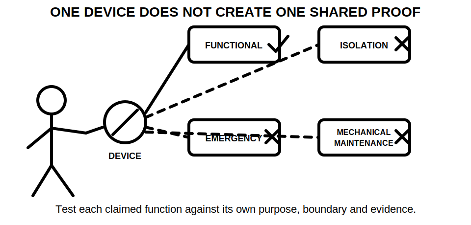
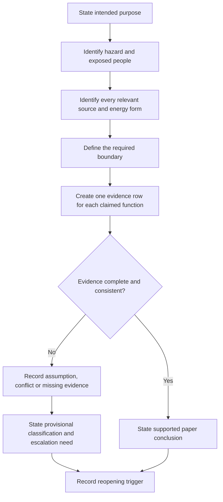
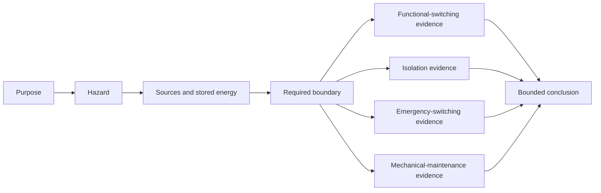

# Day 22 — Functional Switching, Isolation and Emergency Switching Distinctions

> **Currency, copyright and safety notice:** Original educational content only. Exact definitions, device requirements, operating arrangements, securing methods and jurisdiction-specific duties remain `reference_check_required`. This module is `review-required`, safety-critical and not `technically-reviewed`. It reproduces no standards table, figure, clause sequence, official assessment content or practical field procedure.

## 1. Outcome and entry check

By the end of this block, the learner should be able to:

1. distinguish functional switching, isolation, emergency switching and switching for mechanical maintenance by **purpose**, **hazard**, **people exposed**, **energy sources** and **required boundary**;
2. classify six fictional switching needs and justify each classification without relying on device colour, position, label or normal stop response;
3. grade the evidence supporting a device-function claim and state the strongest conclusion the evidence permits;
4. identify when one physical device may perform more than one function only if each function is separately supported;
5. reopen a conclusion when a source, operating mode, stored-energy condition, control arrangement or equipment instruction changes; and
6. achieve at least 10/12 on the educational rubric with no critical error.

**Entry check:** In two or three sentences each, explain why:

- a device being visibly “off” does not prove isolation;
- a normal stop control and an emergency action serve different purposes;
- a label is evidence to investigate, not proof of suitability;
- alternate or stored energy can invalidate an otherwise plausible boundary; and
- a paper exercise grants no authority to operate or verify equipment.

## 2. Why it matters

Switching words can sound interchangeable while describing materially different safety functions. Functional switching supports normal use. Isolation concerns separation from electrical energy for work or access. Emergency switching addresses urgent electrical danger. Switching for mechanical maintenance addresses electrically driven mechanical movement. Confusing these purposes can lead to an incomplete boundary, an unsupported device claim or unsafe reliance on a normal control.

*Caption: Classify the purpose and hazard before judging any device.*

*Caption: One device may appear to serve several purposes, but each claimed function needs its own evidence chain.*

## 3. Core concepts and terminology

- **Functional switching:** making, breaking or varying supply for normal operation or control. It answers, “How is the equipment ordinarily operated?”
- **Isolation:** establishing a defined separation intended to protect against electrical energy while work, access or examination occurs. It answers, “What must be separated, from which sources, for the stated boundary?”
- **Emergency switching:** rapid action intended to remove or control an electrical hazard during an emergency. It answers, “What urgent electrical danger must be controlled, and how quickly must action be available?”
- **Switching for mechanical maintenance:** switching intended to prevent electrically driven equipment from creating mechanical danger during maintenance. It answers, “What movement or mechanical action must be prevented?”
- **Purpose:** the safety or operational outcome the switching function is intended to achieve.
- **Hazard:** a source or situation with potential to cause harm, such as electrical energy or unexpected mechanical movement.
- **Energy source:** any supply or stored-energy condition that can energise, re-energise or move the equipment. In a fictional scenario this may include normal supply, alternate supply, control supply or stored energy.
- **Boundary:** the equipment, conductors, sources and energy forms intended to be controlled or separated.
- **Suitability evidence:** information supporting a claimed function, such as verified device data, poles or conductors controlled, contact arrangement, ratings, location, identification, operating method, securing provisions, system drawings and current instructions.
- **Independence of functions:** the rule that evidence supporting one purpose does not automatically prove another. A functional switch can be suitable for normal operation without being proven suitable for isolation or emergency switching.
- **Reopening trigger:** new or changed information that requires an earlier conclusion to be reconsidered.

### Evidence grades

1. **Supplied:** stated in the fictional brief but not independently corroborated.
2. **Corroborated:** supported by two consistent and relevant records or observations within the exercise.
3. **Derived:** reasoned from supported evidence with the reasoning shown.
4. **Assumed:** necessary to continue the exercise but not evidenced; it must remain explicit.
5. **Missing or conflicting:** absent, stale or inconsistent information that prevents a stronger claim.

### Claim grades

1. **Observation:** what the fictional record, drawing or label says.
2. **Provisional classification:** the likely switching purpose or boundary, dependent on unresolved evidence.
3. **Supported paper conclusion:** a bounded conclusion supported by the exercise evidence.
4. **Authorised technical determination:** a conclusion requiring current authorised sources, competent verification and applicable procedures; this module cannot make it.

A stronger-sounding answer is not a better answer when its evidence grade is weaker than the claim.

## 4. Rule-finding workflow

Use **S-W-I-T-C-H**:

- **S — State the purpose.** Describe the intended operational or safety outcome before naming a device.
- **W — Work out the hazard and people exposed.** Distinguish electrical danger, mechanical movement and ordinary operational need.
- **I — Identify every relevant source and energy form.** Include alternate, control and stored-energy possibilities raised by the fictional brief.
- **T — Trace the required boundary.** Record equipment, conductors, sources and energy forms that must be controlled.
- **C — Check each claimed function against evidence.** Test ratings, controlled conductors, arrangement, location, identification, operation, securing and instructions only at the level supplied by the exercise.
- **H — Hold the conclusion to the evidence.** State unresolved items, the permitted claim grade and the trigger that would reopen it.

The diagram prevents a common shortcut: starting with a visible device and then assigning functions to it. The workflow starts with purpose and hazard, then tests each function independently.

### Switching-function ledger

For every fictional claim, record:

| Field | Question |
|---|---|
| Purpose | What outcome is required? |
| Hazard and exposed person | What harm is being controlled, and for whom? |
| Sources and energy forms | What could energise, re-energise or move the equipment? |
| Required boundary | What must be controlled or separated? |
| Claimed function | Functional, isolation, emergency or mechanical-maintenance switching? |
| Evidence grade | Supplied, corroborated, derived, assumed, or missing/conflicting? |
| Device or arrangement evidence | What supports conductors controlled, operation, location, identification, ratings and securing? |
| Claim grade | Observation, provisional classification, supported paper conclusion, or authorised determination? |
| Reopening trigger | What change would invalidate or weaken the conclusion? |

### Mandatory reopening triggers

Reopen the ledger when any of the following changes:

- a new normal, alternate or control source is identified;
- stored energy or automatic restart becomes relevant;
- equipment operating mode or control logic changes;
- the intended work, access or maintenance boundary changes;
- the people exposed or hazard changes;
- device data, diagrams, labels or instructions conflict;
- the device location, accessibility, identification or securing arrangement changes; or
- later evidence shows that not all relevant conductors or energy forms are controlled.

## 5. Visual model or worked example

### Worked example: one machine, three different questions

A fictional workshop drawing shows a machine with a normal start/stop station, a red mushroom control and a separate local device. The brief also mentions a remote control circuit and possible stored mechanical energy. No device specification or verified conductor schedule is supplied.

**Step 1 — State purpose**

- Starting and stopping production is a functional-switching question.
- Responding to an urgent electrical danger is an emergency-switching question.
- Preventing unexpected driven movement during maintenance is a mechanical-maintenance switching question.
- Access to electrical parts raises an isolation question.

**Step 2 — Separate the boundaries**

The four purposes may require different boundaries. The normal stop may affect only control logic. The emergency action may address a defined electrical hazard. Mechanical-maintenance safety may depend on preventing movement and considering stored energy. Isolation may require separation from every relevant electrical source. The exercise does not provide enough evidence to merge those boundaries.

**Step 3 — Grade the evidence**

- Device colour and label: **supplied observation**.
- Claimed function based only on appearance: **assumed**.
- Remote control and stored energy: **supplied but unresolved dependencies**.
- Device suitability: **missing/conflicting** because specifications and arrangement evidence are absent.

**Step 4 — State the bounded conclusion**

> The scenario supports separate provisional purpose classifications. It does not support a conclusion that any one control performs isolation, emergency switching or mechanical-maintenance switching. Device and boundary evidence remain unresolved.

The four parallel evidence paths show why proof of one function cannot silently substitute for proof of another.

### Worked-example fading

1. **Fully guided:** complete the ledger for the example above using the supplied classifications.
2. **Partially guided:** repeat with a fictional alternate supply added, but determine which rows must reopen.
3. **Independent transfer:** classify a changed scenario in which the emergency hazard is electrical but the maintenance hazard is stored mechanical movement. Explain why the required boundaries may differ.

## 6. Practical application

Complete six fictional scenario cards. For each card:

1. write the required purpose in one sentence;
2. identify the hazard and person exposed;
3. list every stated or plausible source and mark each as supplied, corroborated, derived, assumed or missing/conflicting;
4. define the proposed boundary without claiming it is verified;
5. create a separate evidence row for every claimed function;
6. state the strongest permitted claim grade;
7. identify one reopening trigger; and
8. correct one deliberately misleading statement.

Use these misconception prompts:

- “It turns off, so it isolates.”
- “It is red, so it is emergency switching.”
- “The main switch must control every source.”
- “One device can perform all switching functions because it is nearby.”
- “A label proves which conductors are controlled.”
- “Stopping movement proves stored energy is controlled.”

### Educational rubric: 12 points

Score 0–2 in each category:

1. purpose classification;
2. hazard and exposed-person reasoning;
3. source and energy-form identification;
4. boundary definition;
5. evidence and claim control; and
6. safety, unresolved-item and reopening communication.

A score below 10/12 requires a varied re-attempt. This threshold is an original study aid, not an official RTO or licensing pass mark.

### Critical-error gates

A re-attempt is required regardless of total score if the learner:

- treats “off” as proof of isolation;
- ignores an explicit alternate source or stored-energy clue;
- assigns a function solely from colour, label or physical appearance;
- merges electrical isolation and mechanical-maintenance boundaries without evidence;
- claims authorised technical verification; or
- converts the paper exercise into practical switching or isolation instructions.

### Delayed retrieval

After at least one study interval, complete a new two-card set without viewing S-W-I-T-C-H. Compare the first and delayed ledgers for classification drift, omitted sources and over-strong claims.

## 7. Common errors and safety checkpoint

Common errors include:

- naming a device before defining the purpose;
- treating a normal stop response as proof of isolation;
- assuming one prominent switch controls every source or conductor;
- ignoring remote control, alternate supply, stored energy or automatic restart;
- using label, colour or proximity as conclusive evidence;
- proving one switching function and silently extending that proof to another;
- describing a boundary without stating who or what it protects; and
- presenting a paper classification as practical authority.

**Safety checkpoint:** Stop the exercise and record an unresolved dependency when the fictional evidence does not establish the source set, energy forms, affected conductors, boundary or claimed device function. Do not invent procedures, test actions or acceptance criteria to fill the gap.

This module authorises no site access, switching, isolation, proving, locking, tagging, opening, testing, measurement, maintenance, repair, alteration, energisation, commissioning, certification, verification or return to service.

## 8. Retrieval and next links

Without notes:

1. define the four switching functions by purpose;
2. write S-W-I-T-C-H from memory;
3. explain why one device needs separate evidence for each claimed function;
4. name the five evidence grades and four claim grades;
5. list four reopening triggers;
6. state the strongest claim when an alternate source remains unresolved; and
7. explain why the rubric is not an official assessment standard.

- **Program:** [Six-Week Capstone Learning Plan](../MASTER_PLAN.md)
- **Previous:** [Day 21 — Week 3 Integrated Circuit-Design Exercise](day-21-week-3-integrated-circuit-design-exercise.md)
- **Knowledge note:** [[Six-Week Day 22 - Functional Switching Isolation and Emergency Switching Distinctions]]
- **Next:** [Day 23 — Main Switches, Alternate Supplies and Isolation Boundaries](day-23-main-switches-alternate-supplies-and-isolation-boundaries.md)
