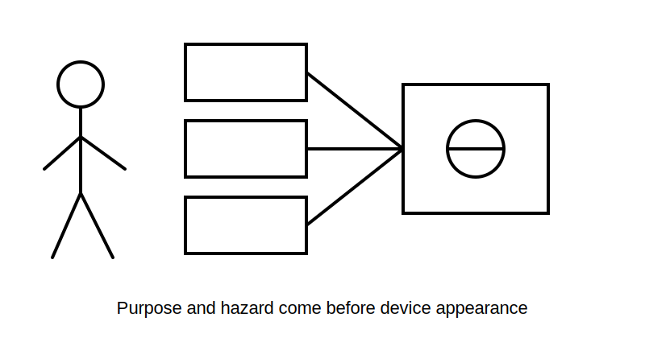
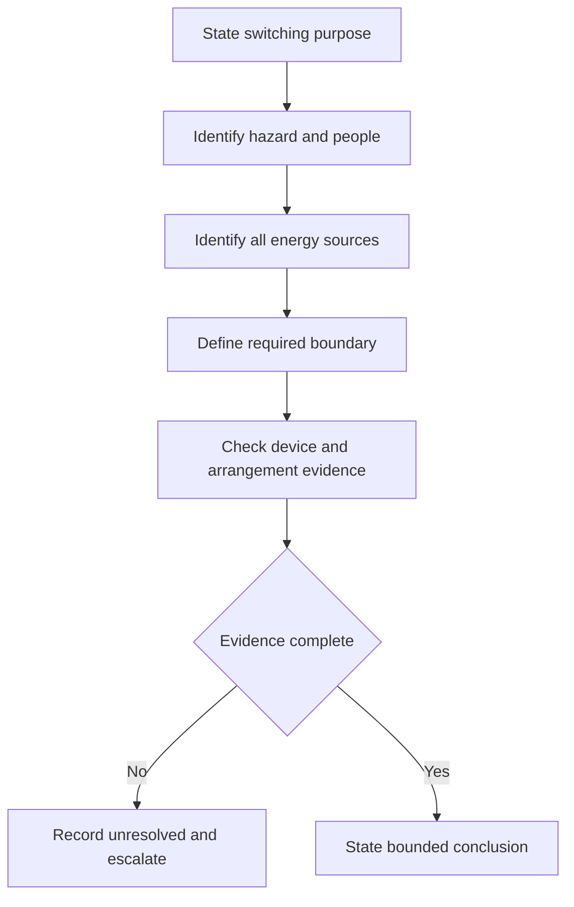
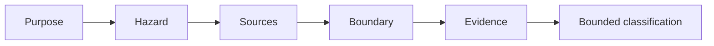

# Day 22 — Functional Switching, Isolation and Emergency Switching Distinctions

> **Currency, copyright and safety notice:** Original educational content only. Exact definitions, device requirements and procedures remain `reference_check_required`. This module is `review-required` and not `technically-reviewed`.

## 1. Outcome and entry check

The learner should define functional switching, isolation, emergency switching and switching for mechanical maintenance; classify fictional needs by purpose; identify hazards, people, sources and boundaries; explain why one device may not perform every function; record unresolved suitability evidence; and score at least 10/12 with no zero in classification, evidence control or safety.

**Entry check:** explain bounded conclusions; why a visible switch may not prove isolation; evidence needed for a safety function; why purpose comes first; and the practical-authority boundary.

## 2. Why it matters

Confusing ordinary control with isolation can expose a person to hazardous energy. Emergency action and mechanical-maintenance safety address different hazards.

*Caption: Start with purpose and hazard, not switch appearance.*

## 3. Core concepts and terminology

- **Functional switching:** making, breaking or varying supply for normal operation.
- **Isolation:** establishing a defined separation intended to protect against electrical energy while work or access occurs.
- **Emergency switching:** rapid action intended to remove or control an electrical hazard in an emergency.
- **Switching for mechanical maintenance:** switching intended to prevent electrically driven equipment creating a mechanical hazard.
- **Isolation boundary:** equipment, conductors and sources intended to be separated.
- **Suitability evidence:** verified information about ratings, poles, contacts, location, identification, operation, securing and instructions.

## 4. Rule-finding workflow

Use **S-W-I-T-C-H**: **S**tate purpose; **W**ork out hazard and people exposed; **I**dentify every source and affected conductor; **T**race the required boundary; **C**heck device and arrangement evidence; **H**old the conclusion to the evidence.

## 5. Visual model or worked example

A wall switch controlling lighting is functional control. Access inside equipment raises an isolation question. A rotating machine may raise emergency-switching and mechanical-maintenance questions separately. A label, colour or normal stop response does not prove function, boundary or suitability.

## 6. Practical application

For six fictional descriptions, record purpose, hazard, exposed people, possible sources, intended boundary, required evidence and strongest permitted conclusion. Correct: “It turns off, so it isolates”; “It is red, so it is emergency switching”; “The main switch controls every source”; and “A label proves suitability.”

Score 0–2 for purpose classification, hazard reasoning, source identification, boundary definition, evidence control and safety. Below 10/12, or zero in classification, evidence control or safety, requires a varied re-attempt.

## 7. Common errors and safety checkpoint

Errors include classifying by appearance, treating normal stopping as isolation, ignoring stored or alternate energy, assuming one switch controls every source and converting paper scenarios into practical instructions.

This module authorises no switching, isolation, proving, locking, tagging, opening, access, testing, measurement, maintenance, repair, energisation or return to service.

## 8. Retrieval and next links

Define the four functions; state S-W-I-T-C-H; explain why “off” does not prove “isolated”; name five suitability-evidence categories; state the strongest claim when an alternate source is unresolved.

- **Program:** [Six-Week Capstone Learning Plan](../MASTER_PLAN.md)
- **Previous:** [Day 21 — Week 3 Integrated Circuit-Design Exercise](day-21-week-3-integrated-circuit-design-exercise.md)
- **Knowledge note:** [[Six-Week Day 22 - Functional Switching Isolation and Emergency Switching Distinctions]]
- **Next:** [Day 23 — Main Switches, Alternate Supplies and Isolation Boundaries](day-23-main-switches-alternate-supplies-and-isolation-boundaries.md)
