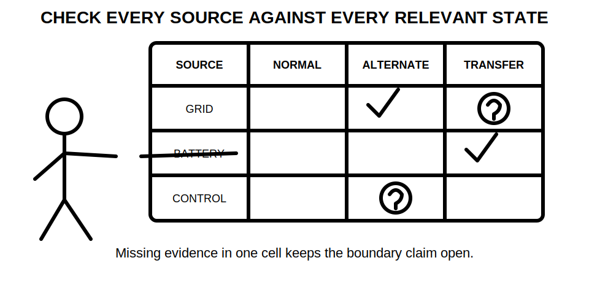
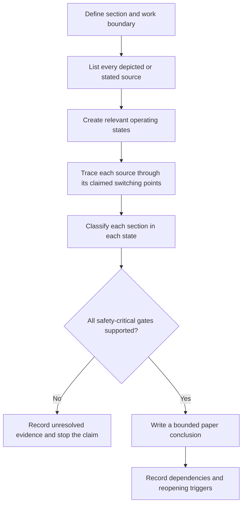
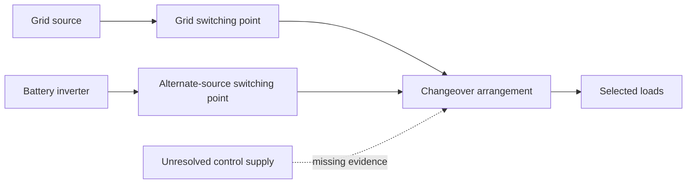

# Day 23 — Main Switches, Alternate Supplies and Isolation Boundaries

> **Currency, copyright and safety notice:** Original educational content only. Exact source-control, main-switch and isolation requirements remain `reference_check_required`. This module is `review-required`, safety-critical and not `technically-reviewed`.

## 1. Outcome and entry check

By the end of this module, the learner can:

1. define **main switch**, **normal supply**, **alternate supply**, **multiple supplies**, **backfeed**, **operating state** and **isolation boundary**;
2. construct a source-state map from a fictional installation brief;
3. distinguish a device label from evidence of the source, conductors and section it controls;
4. identify sections that are controlled, potentially energised or unresolved in each stated operating state;
5. write a bounded conclusion that identifies evidence, assumptions, missing information and stop conditions;
6. reopen the conclusion when a source, state, drawing, interlock or work boundary changes; and
7. achieve at least 10/12 on the educational rubric with no critical error.

**Entry check:** Without notes, state S-W-I-T-C-H from Day 22; define isolation boundary; name three possible non-grid sources; explain why “main switch off” is not proof that every relevant section is de-energised; and list the evidence needed before claiming that all applicable sources are controlled.

## 2. Why it matters

A main switch is a claimed control point, not universal proof that every source and every relevant energy path has been addressed. Installations may include generation, batteries, control supplies, changeover equipment, shared supplies or equipment capable of backfeed. The consequence of omitting one source is not merely an incomplete diagram: it can produce an unsafe boundary claim.

*Caption: A boundary is only as complete as the source map behind it.*

*Caption: Each source must be tested against each relevant operating state; one labelled device does not close every evidence gap.*

## 3. Core concepts and terminology

- **Main switch:** a device assigned a principal control role for a supply or installation section. The exact required role, conductors controlled and arrangement require authorised-source verification.
- **Normal supply:** the source intended for ordinary operation in the stated scenario.
- **Alternate supply:** another source capable of supplying all or part of the installation under at least one operating state.
- **Multiple supplies:** two or more sources capable of connection to the installation or section.
- **Backfeed:** energy reaching a point from a source or direction that may not be expected from the normal one-line view.
- **Changeover arrangement:** equipment intended to transfer a load or section between sources. Its existence does not prove its state, interlocking or suitability.
- **Operating state:** a defined combination of source availability and switching positions, such as normal-source operation, alternate-source operation, transfer, shutdown or an unresolved state.
- **Isolation boundary:** the stated separation between the part intended to be isolated and every identified source or energy path capable of affecting it.
- **Controlled section:** a section for which the stated device-to-source relationship is supported by the supplied evidence.
- **Potentially energised section:** a section that a mapped source may energise in the stated condition.
- **Unresolved section:** a section whose energisation status cannot be supported because evidence is missing, conflicting or outside the scenario.
- **Residual energisation risk:** the possibility that a section remains energised after an incomplete or unsupported control action.
- **Reopening trigger:** a change that invalidates or weakens an earlier conclusion and requires the analysis to be repeated.

### Evidence grades

1. **Supplied:** explicitly stated in the current brief, drawing or authorised extract.
2. **Corroborated:** supported by two independent current items.
3. **Derived:** reasoned from supported facts, with the inference shown.
4. **Assumed:** plausible but unsupported; it cannot close a safety-critical evidence gate.
5. **Missing or conflicting:** unavailable, stale or inconsistent information that blocks the claim.

### Claim grades

1. **Observation:** reports what the supplied material depicts or states.
2. **Provisional classification:** identifies a likely source, state, device role or boundary subject to confirmation.
3. **Supported paper conclusion:** a scenario-limited conclusion justified by stated evidence and dependencies.
4. **Authorised technical determination:** a conclusion made by an appropriately authorised person using current applicable information; this module does not confer that status.

A strong answer does not promote an assumption into a fact. It lowers the claim grade or records the issue as unresolved.

## 4. Rule-finding workflow

Use **S-O-U-R-C-E-S**:

- **S — Scope the section:** define the installation portion, task boundary and question being answered.
- **O — Observe every source:** list grid, generation, storage, control, shared, portable or other depicted sources without assuming any is inactive.
- **U — Understand operating states:** define the combinations of source availability and switching positions relevant to the scenario.
- **R — Relate each source to switching points:** trace source-by-source paths and record which device is claimed to control which section.
- **C — Construct the boundary map:** classify sections as controlled, potentially energised or unresolved for each state.
- **E — Examine evidence and dependencies:** check drawings, identification, device information, interlocks, stored energy and document currency.
- **S — State the bounded conclusion:** identify the claim grade, unresolved evidence, stop conditions and reopening triggers.

The workflow is deliberately state-based. A path that is controlled in normal operation may not be controlled in an alternate, transfer, fault or undocumented state.

### Source-state boundary ledger

For each source and state, record:

| Field | Required entry |
|---|---|
| Source identity | what the source is and where that identity came from |
| Operating state | source availability and relevant switching positions |
| Path | the depicted route to the section |
| Switching point | device claimed to interrupt or transfer the path |
| Controlled section | section supported as controlled by current evidence |
| Potentially energised section | section the source may energise in this state |
| Evidence grade | supplied, corroborated, derived, assumed, or missing/conflicting |
| Claim grade | observation, provisional classification, supported paper conclusion, or authorised determination |
| Dependency | information that must remain true for the row to remain valid |
| Reopening trigger | change that requires the row to be reassessed |

### Mandatory reopening triggers

Reopen the analysis when any of the following changes or becomes uncertain:

- a new grid, generator, inverter, battery, control or shared source appears;
- the operating mode, changeover position or automatic-control logic changes;
- the work or installation boundary changes;
- a drawing, label, schedule or device record is replaced or found to be stale;
- interlocking, stored energy, automatic restart or conductor-control evidence changes;
- a source can energise a section from a direction not shown in the earlier map; or
- later evidence conflicts with the source-state ledger.

## 5. Visual model or worked example

A fictional one-line diagram shows a grid source, a battery inverter and a changeover device feeding selected loads. A device is labelled “MAIN SWITCH”. A control-supply detail and the changeover interlock evidence are omitted.

The dashed path is not a confirmed connection. It represents an unresolved dependency that blocks a complete boundary claim.

### Fully guided reasoning

1. **Scope:** selected-load section only; no claim about the whole installation.
2. **Sources:** grid and battery are supplied evidence; control supply is indicated but unresolved.
3. **States:** grid operation, battery operation, transfer state and unresolved control-supply state.
4. **Paths:** trace grid and battery independently; do not let the main-switch label substitute for path evidence.
5. **Boundary:** grid control may be supported for the grid path; the battery path requires separate evidence; the control path remains unresolved.
6. **Conclusion:** “The supplied diagram supports a provisional source-state map, but it does not support a complete isolation-boundary claim because the control supply and interlock behaviour are unresolved.”

### Faded example

Repeat the analysis after the battery path is shown clearly but the generator inlet status is unknown. The learner receives only the source list and ledger headings, then must define states, dependencies and the strongest permitted claim.

### Independent transfer

A revised brief adds a maintenance bypass and changes the work boundary from selected loads to the changeover enclosure. Rebuild the ledger rather than editing only the conclusion. Explain which earlier rows remain valid and which must reopen.

## 6. Practical application

Complete the following paper-only sequence:

1. Build a source-state boundary ledger for a fictional installation containing a normal supply, battery inverter, generator inlet and control transformer.
2. Mark each row with an evidence grade and claim grade.
3. Identify at least four dependencies and four reopening triggers.
4. Write one supported bounded conclusion and one explicit stop statement.
5. Correct these misconceptions:
   - “The main switch label proves total isolation.”
   - “A source not operating now can be ignored.”
   - “A changeover device proves the sources cannot overlap.”
   - “A conceptual one-line diagram proves the physical installation.”
6. Complete a changed-source transfer task without reusing the original conclusion unchanged.
7. Reattempt the retrieval prompts after at least one sleep interval.

### Educational rubric — 12 points

Score 0–2 in each category:

1. scope and work-boundary definition;
2. source completeness;
3. operating-state analysis;
4. path and switching-point reasoning;
5. evidence, claim and reopening control; and
6. bounded conclusion and safety communication.

A score below 10/12 requires a varied reattempt. This is an original educational readiness threshold, not an official RTO pass mark.

**Critical-error gates:** the attempt is not ready if it omits a depicted source, treats an assumption as proof, claims a complete boundary with missing safety-critical evidence, gives practical switching instructions, or fails to reopen the analysis after a material source or boundary change.

## 7. Common errors and safety checkpoint

Common errors include:

- trusting a main-switch label without mapping its source and controlled section;
- drawing only the normal supply;
- ignoring control supplies, stored energy, automatic restart or possible backfeed;
- assuming a changeover state or interlock from appearance;
- confusing “not supplying load” with “incapable of energising the section”;
- treating a conceptual map, outdated drawing or label as verified physical condition;
- carrying an old conclusion into a changed-source scenario; and
- writing operational steps when the task only supports paper reasoning.

**Safety checkpoint:** Stop the paper conclusion when a source, state, conductor-control relationship, interlock, stored-energy path or work boundary is missing or conflicting. Record what an authorised person would need to verify; do not invent a field procedure.

This module authorises no site access, switching, isolation, proving de-energised, locking, tagging, opening, testing, measurement, maintenance, alteration, energisation, commissioning, certification, verification or return to service.

Exact definitions, required source-control arrangements, conductors controlled, identification, accessibility, interlocking, securing methods, testing and jurisdiction-specific duties require current authorised information and qualified review.

## 8. Retrieval and next links

Without notes:

1. define alternate supply, backfeed, operating state and residual energisation risk;
2. state S-O-U-R-C-E-S in order;
3. explain why a main-switch label cannot prove a complete isolation boundary;
4. name five source categories that may affect a boundary;
5. distinguish controlled, potentially energised and unresolved sections;
6. state the strongest claim permitted when one control supply is unresolved;
7. name four reopening triggers; and
8. explain why the same source map must be reconsidered when the work boundary changes.

- **Program:** [Six-Week Capstone Learning Plan](../MASTER_PLAN.md)
- **Previous:** [Day 22 — Functional Switching, Isolation and Emergency Switching Distinctions](day-22-functional-switching-isolation-and-emergency-switching-distinctions.md)
- **Knowledge note:** [[Six-Week Day 23 - Main Switches Alternate Supplies and Isolation Boundaries]]
- **Next:** [Day 24 — Switchboard Functional Areas, Accessibility and Identification](day-24-switchboard-functional-areas-accessibility-and-identification.md)
