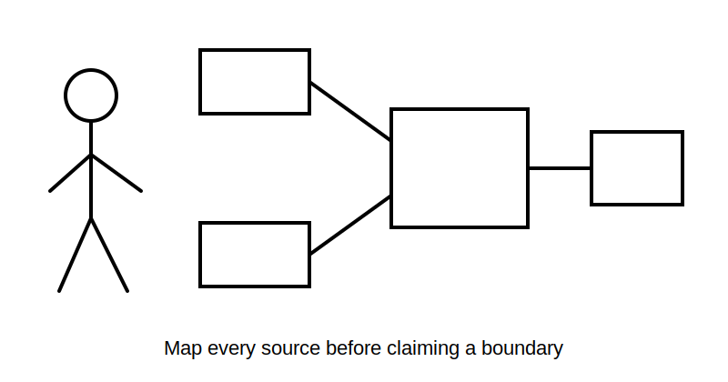
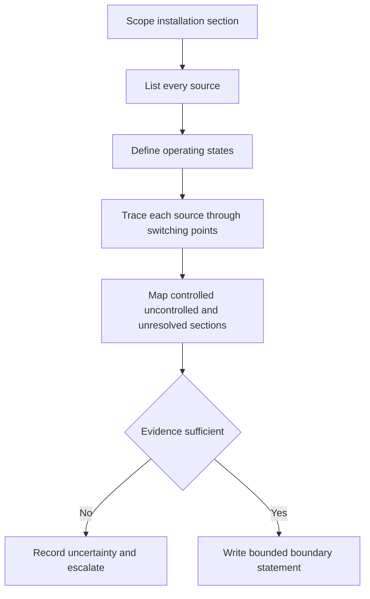
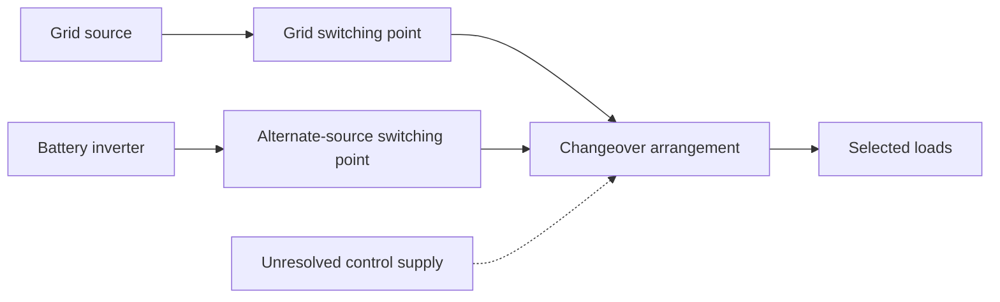

# Day 23 — Main Switches, Alternate Supplies and Isolation Boundaries

> **Currency, copyright and safety notice:** Original educational content only. Exact source-control and isolation requirements remain `reference_check_required`. This module is `review-required` and not `technically-reviewed`.

## 1. Outcome and entry check

The learner should define main switch, normal supply, alternate supply, multiple supply, backfeed and isolation boundary; map all depicted sources; distinguish a label from proof; trace sections that may remain energised; identify missing evidence; write a bounded boundary statement; explain the effect of a new source; and score at least 10/12 with no zero in source mapping, boundary reasoning or safety.

**Entry check:** state S-W-I-T-C-H; define isolation boundary; name three non-grid sources; explain why “main switch off” may be incomplete; identify evidence needed before claiming all sources are controlled.

## 2. Why it matters

Installations may include generation, batteries, changeover arrangements, control supplies or backfeed. A single switching action cannot be assumed to establish a complete boundary.

*Caption: A boundary is only as complete as the source map behind it.*

## 3. Core concepts and terminology

- **Main switch:** a device assigned a principal control role for a supply or installation section.
- **Normal supply:** the source intended for ordinary operation.
- **Alternate supply:** another source capable of supplying all or part of the installation.
- **Multiple supplies:** two or more sources capable of connection.
- **Backfeed:** energy reaching a point from an unexpected direction or source.
- **Changeover arrangement:** equipment intended to transfer a load between sources.
- **Source map:** a record of sources, paths, switching points and affected sections.
- **Residual energisation risk:** possibility that a section remains energised after an incomplete action.

## 4. Rule-finding workflow

Use **S-O-U-R-C-E-S**: **S**cope the section; **O**bserve every source; **U**nderstand operating states; **R**elate each source to switching points; **C**onstruct the boundary map; **E**xamine identification, diagrams and interlocks; **S**tate the bounded conclusion and stop conditions.

## 5. Visual model or worked example

A fictional diagram shows grid supply, battery inverter and changeover device feeding selected loads. One device is labelled “MAIN SWITCH”; one control-supply detail is omitted. A defensible analysis lists all sources, identifies operating states, traces paths independently, avoids claiming the label controls the inverter path and records the omitted detail as blocking a complete isolation claim.

The dashed path represents missing evidence, not a confirmed connection.

## 6. Practical application

Create a ledger containing source, state, path, switching point, controlled section, potentially energised section, evidence and unresolved question. Analyse an added battery, upstream control transformer, generator inlet, missing interlock data and outdated diagram.

Score 0–2 for scope, source mapping, operating states, path tracing, boundary statement and safety. Below 10/12, or zero in source mapping, boundary reasoning or safety, requires a varied re-attempt.

## 7. Common errors and safety checkpoint

Errors include trusting a main-switch label, drawing only the normal supply, ignoring control or stored energy, assuming changeover state, treating a conceptual map as verified conditions and giving practical switching steps.

This module authorises no switching, isolation, proving de-energised, locking, tagging, opening, testing, measurement, access, maintenance, alteration, energisation or return to service.

## 8. Retrieval and next links

Define alternate supply, backfeed and residual energisation risk; state S-O-U-R-C-E-S; explain why a main-switch label cannot prove a complete boundary; name four additional-source categories; state the strongest conclusion when one control supply is unresolved.

- **Program:** [Six-Week Capstone Learning Plan](../MASTER_PLAN.md)
- **Previous:** [Day 22 — Functional Switching, Isolation and Emergency Switching Distinctions](day-22-functional-switching-isolation-and-emergency-switching-distinctions.md)
- **Knowledge note:** [[Six-Week Day 23 - Main Switches Alternate Supplies and Isolation Boundaries]]
- **Next:** [Day 24 — Switchboard Functional Areas, Accessibility and Identification](day-24-switchboard-functional-areas-accessibility-and-identification.md)
