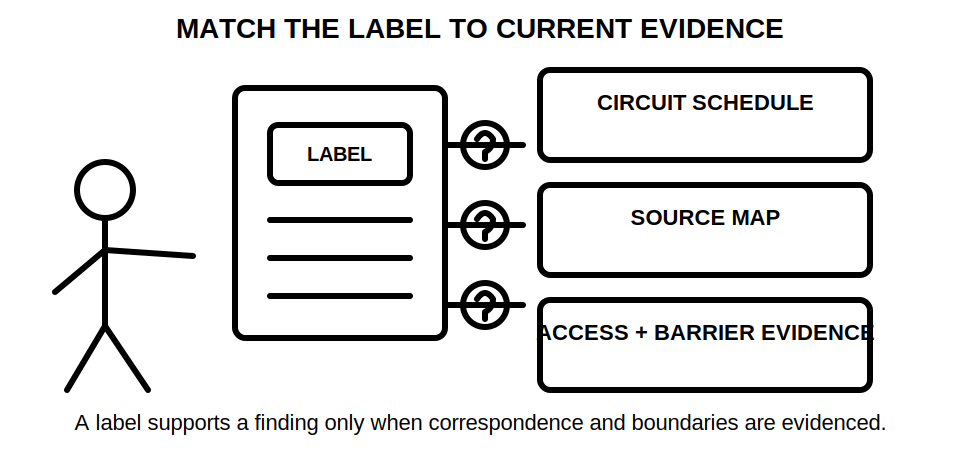
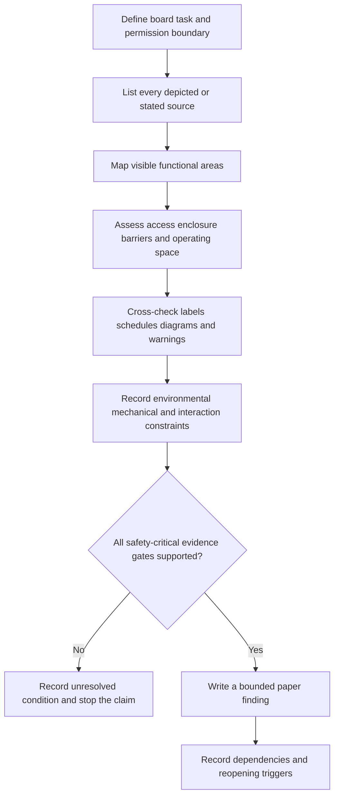
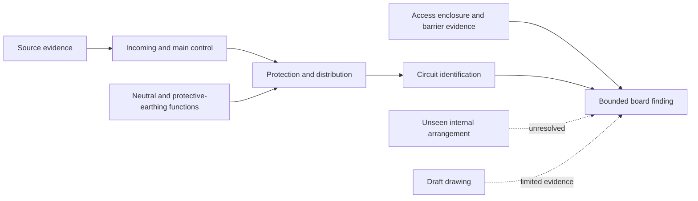

# Day 24 — Switchboard Functional Areas, Accessibility and Identification

> **Currency, copyright and safety notice:** Original educational content only. Exact switchboard construction, access, segregation, identification, enclosure and operating-space requirements remain `reference_check_required`. This module is `review-required`, safety-critical and not `technically-reviewed`.

## 1. Outcome and entry check

By the end of this module, the learner can:

1. define **switchboard**, **functional area**, **enclosure**, **accessibility**, **readily accessible**, **segregation**, **identification**, **dead front**, **operating space** and **interaction risk**;
2. map incoming supply, main control, distribution, neutral, protective-earthing, metering, control and alternate-supply functions from a fictional evidence pack;
3. distinguish physical reach, permission to access and evidence that an item can be operated safely;
4. grade labels, schedules, diagrams, photographs and stated observations without treating any one item as conclusive proof;
5. construct a board-evidence ledger that records dependencies, unresolved hazards and reopening triggers;
6. write a bounded paper finding that separates observation, provisional classification and supported conclusion;
7. rebuild the finding when identification, source, enclosure, access or environmental evidence changes; and
8. achieve at least 10/12 on the educational rubric with no critical error.

**Entry check:** Without notes, define switchboard, segregation and isolation boundary; state S-O-U-R-C-E-S from Day 23; explain why a neat closed-board photograph cannot prove internal arrangement or safe accessibility; and name four evidence items needed before accepting a circuit-identification claim.

## 2. Why it matters

A switchboard concentrates supply, control, protection and distribution functions. A mistaken label, an omitted alternate source, a blocked operating position or an unsupported assumption about internal barriers can turn a routine paper judgement into an unsafe field expectation.

Appearance is weak evidence. Neat routing, matching device rows or a prominent label may improve readability, but none proves source completeness, internal segregation, circuit correspondence, enclosure integrity, safe operating space or permission to interact with the board.

*Caption: Identify function, source and access boundary before judging layout.*

*Caption: Identification supports a claim only when it corresponds with current source, circuit and boundary evidence.*

## 3. Core concepts and terminology

- **Switchboard:** an assembly that distributes electrical energy and contains associated control or protective equipment.
- **Functional area:** a region grouped by purpose, such as incoming supply, main control, protection, distribution, metering, neutral, protective earthing or control.
- **Enclosure:** the physical barrier around equipment.
- **Accessibility:** whether a person can approach, reach or operate an item under stated conditions.
- **Readily accessible:** accessible without unreasonable delay or obstruction; exact application requires authorised-source verification.
- **Permission boundary:** the limit of what the learner or worker is authorised to approach, operate, open or inspect. Physical reach does not create permission.
- **Operating space:** the area needed to approach or operate equipment under the stated task and conditions; exact dimensions and requirements require authorised-source verification.
- **Segregation:** separation intended to reduce interaction, contact, fault propagation or confusion between parts or systems.
- **Identification:** labels, schedules, diagrams or durable markings intended to communicate function, source, circuit or hazard.
- **Correspondence:** evidence that an identifier actually matches the current circuit, source, device or section it claims to describe.
- **Dead front:** a barrier arrangement intended to prevent access to live parts during ordinary interaction; exact requirements require verification.
- **Interaction risk:** the possibility that operation, access, maintenance or a fault in one area affects another area or exposes a person to a hazard.
- **Unresolved board condition:** a feature whose function, source, accessibility, identification or barrier status cannot be supported from the supplied evidence.
- **Reopening trigger:** a change that invalidates or weakens an earlier finding and requires the relevant ledger rows to be reassessed.

### Evidence grades

1. **Supplied:** explicitly stated or shown in the current fictional brief, photograph, schedule, drawing or authorised extract.
2. **Corroborated:** supported by two independent current items that agree.
3. **Derived:** reasoned from supported facts, with the inference made visible.
4. **Assumed:** plausible but unsupported; it cannot close a safety-critical gate.
5. **Missing or conflicting:** absent, stale, illegible or inconsistent information that blocks the claim.

### Claim grades

1. **Observation:** reports only what the evidence visibly depicts or explicitly states.
2. **Provisional classification:** assigns a likely function, source, access condition or identification status subject to confirmation.
3. **Supported paper conclusion:** a scenario-limited finding justified by current evidence and recorded dependencies.
4. **Authorised technical determination:** a conclusion made by an appropriately authorised person using current applicable information; this module does not confer that status.

A strong answer does not promote a label, photograph or assumed layout into a verified physical condition.

## 4. Rule-finding workflow

Use **B-O-A-R-D-S**:

- **B — Bound the board and every source:** define the board, installation section, task, permission boundary and all depicted or stated sources.
- **O — Organise functional areas:** map incoming supply, control, protection, distribution, metering, neutral, protective-earthing, control and alternate-supply functions without assuming unseen construction.
- **A — Assess access and barriers:** separate physical reach, operating space, enclosure condition, barrier evidence and permission to interact.
- **R — Relate identification to evidence:** compare labels, schedules, diagrams and warnings with current source, circuit and device evidence.
- **D — Detect constraints and interactions:** screen environmental, mechanical, maintenance, alternate-supply, stored-energy and cross-system risks.
- **S — State bounded findings:** assign evidence and claim grades, record unresolved checks, stop conditions, dependencies and reopening triggers.

The sequence prevents a visual impression from becoming a compliance claim. A finding remains bounded to the board, task, evidence date and operating condition stated in the scenario.

### Board-evidence ledger

For each relevant feature, record:

| Field | Required entry |
|---|---|
| Observed feature | what is visible or stated without interpretation |
| Claimed function | incoming, control, protection, distribution, metering, neutral, earthing, control or other |
| Source relationship | source or section the feature is claimed to affect |
| Access condition | reach, obstruction, operating space, enclosure and permission evidence |
| Identification evidence | label, schedule, diagram, warning or marking and its currency |
| Correspondence evidence | why the identifier matches the current circuit, source or device |
| Interaction risk | possible effect on another function, system or person |
| Evidence grade | supplied, corroborated, derived, assumed, or missing/conflicting |
| Claim grade | observation, provisional classification, supported paper conclusion, or authorised determination |
| Dependency | information that must remain true for the row to remain valid |
| Reopening trigger | change that requires reassessment |
| Unresolved check | information an authorised person would need to verify |

### Mandatory reopening triggers

Reopen affected ledger rows when:

- a source, alternate supply, control supply or backfeed path is added or newly identified;
- a label, circuit schedule, warning, drawing or device record changes or is found stale;
- a board section, enclosure, barrier, cover or internal arrangement changes;
- access, obstruction, operating space, environmental exposure or maintenance conditions change;
- the task or permission boundary changes;
- a device, circuit or conductor is replaced, relocated or repurposed;
- later evidence conflicts with an earlier correspondence claim; or
- a photograph or visual record no longer represents the current board condition.

## 5. Visual model or worked example

A fictional evidence pack contains:

- one closed-board photograph;
- a main-switch label;
- two rows of protective devices;
- a visible neutral bar and protective-earthing bar;
- a blank circuit schedule;
- a battery warning label;
- a one-line diagram marked “draft”; and
- no evidence of internal segregation, enclosure integrity behind the cover or current circuit correspondence.

The dashed paths represent unresolved or limited evidence. They are not defect findings and they do not prove a physical connection.

### Fully guided reasoning

1. **Boundary:** closed-board paper review only; no permission to open, approach or operate equipment.
2. **Sources:** normal supply is indicated; the battery warning requires alternate-source mapping from Day 23.
3. **Functions:** visible labels and components support provisional functional mapping only.
4. **Access:** the photograph may show an obstruction, but exact accessibility and operating-space compliance cannot be determined without current context and authorised criteria.
5. **Identification:** the blank schedule is direct evidence of missing schedule content; it does not prove every circuit is otherwise unidentified.
6. **Segregation:** the closed enclosure provides no evidence of unseen internal barriers or conductor separation.
7. **Conclusion:** “The supplied evidence supports a provisional map of visible switchboard functions. Circuit correspondence, complete source mapping, internal segregation, enclosure condition and safe accessibility remain unresolved, so no complete technical determination is supported.”

### Faded example

A second pack supplies a completed schedule and current one-line diagram but removes the battery warning photograph and shows an obstructed operating position. The learner receives only B-O-A-R-D-S headings and the ledger columns, then must grade each item and write the strongest permitted finding.

### Independent transfer

A revised scenario adds a control transformer, replaces three device labels and changes the task from visual identification to planned maintenance access. Rebuild the affected ledger rows. Explain why the earlier source, identification, access and permission conclusions cannot simply be copied forward.

## 6. Practical application

Complete this paper-only sequence:

1. Build a board-evidence ledger for a fictional switchboard evidence pack.
2. Map at least seven functional areas and mark each as observed, provisionally classified or unresolved.
3. Grade every source, access, barrier and identification item.
4. Identify at least four dependencies and four reopening triggers.
5. Write one bounded finding and one explicit stop statement.
6. Correct these misconceptions:
   - “A neat board is a safe board.”
   - “A label proves the circuit it names.”
   - “Accessible means I may open or operate it.”
   - “One enclosure means one source.”
   - “A closed-board photograph proves internal segregation.”
7. Complete the faded example and independent changed-condition transfer.
8. Reattempt the retrieval prompts after at least one sleep interval.

### Educational rubric — 12 points

Score 0–2 in each category:

1. board, task and permission-boundary definition;
2. source and functional-area mapping;
3. access, enclosure and barrier reasoning;
4. identification and correspondence evidence;
5. dependencies, reopening and unresolved-condition control; and
6. bounded conclusion and safety communication.

A score below 10/12 requires a varied reattempt. This is an original educational readiness threshold, not an official RTO pass mark.

**Critical-error gates:** the attempt is not ready if it omits a depicted source, treats appearance or a label as proof, confuses physical reach with permission, claims unseen segregation or enclosure condition, gives practical opening or switching instructions, or fails to reopen the analysis after a material source, identification, access or board change.

## 7. Common errors and safety checkpoint

Common errors include:

- judging workmanship, safety or compliance by neatness alone;
- treating a label, schedule or warning as self-validating proof;
- assuming one enclosure has one source or one isolation boundary;
- confusing accessible, readily accessible and authorised to access;
- inferring internal barriers, conductor routing or segregation from an exterior photograph;
- treating a draft or stale diagram as current physical evidence;
- reporting an obstruction without defining the task, operating condition or applicable criterion;
- carrying an old identification finding into a changed-board scenario; and
- inventing practical opening, isolation or test steps.

**Safety checkpoint:** Stop the paper conclusion when a source, function, correspondence, enclosure, barrier, access condition, operating-space requirement, permission boundary or interaction risk is missing or conflicting. Record what an authorised person would need to verify; do not invent a field procedure.

This module authorises no site access, approach to live equipment, opening, switching, isolation, proving de-energised, locking, tagging, testing, measurement, maintenance, alteration, energisation, commissioning, certification, verification or approval.

Exact switchboard definitions, construction, access, operating-space, segregation, enclosure, identification, source-warning, conductor-control, maintenance and jurisdiction-specific requirements require current authorised information and qualified review.

## 8. Retrieval and next links

Without notes:

1. define functional area, correspondence, segregation, readily accessible and permission boundary;
2. state B-O-A-R-D-S in order;
3. explain why a label cannot prove circuit correspondence;
4. identify four facts a closed-board photograph cannot prove;
5. distinguish observation, provisional classification and supported paper conclusion;
6. name five mandatory reopening triggers;
7. write the strongest bounded finding for a blank schedule beside an alternate-supply warning; and
8. explain why a changed maintenance task reopens an earlier accessibility finding.

- **Program:** [Six-Week Capstone Learning Plan](../MASTER_PLAN.md)
- **Previous:** [Day 23 — Main Switches, Alternate Supplies and Isolation Boundaries](day-23-main-switches-alternate-supplies-and-isolation-boundaries.md)
- **Knowledge note:** [[Six-Week Day 24 - Switchboard Functional Areas Accessibility and Identification]]
- **Next:** [Day 25 — Wiring Systems, Mechanical Protection and Environmental Influences](day-25-wiring-systems-mechanical-protection-and-environmental-influences.md)
