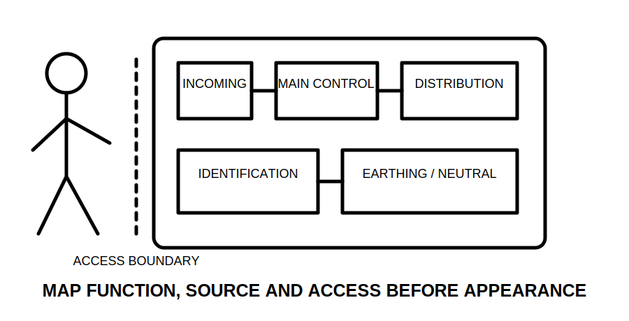
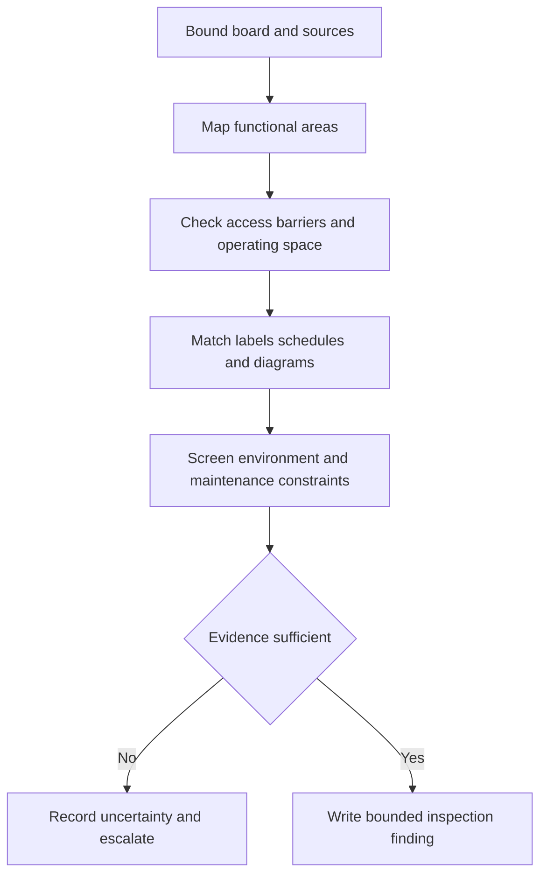
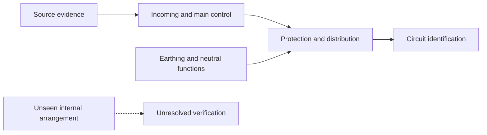

# Day 24 — Switchboard Functional Areas, Accessibility and Identification

> **Currency, copyright and safety notice:** Original educational content only. Exact switchboard construction, access, segregation, identification and enclosure requirements remain `reference_check_required`. This module is `review-required` and not `technically-reviewed`.

## 1. Outcome and entry check

The learner should identify the purpose of incoming supply, main control, distribution, neutral, protective-earthing, metering and alternate-supply areas; distinguish accessibility from unrestricted access; evaluate identification evidence; map unresolved hazards; and score at least 10/12 with no zero in boundary, identification or safety reasoning.

**Entry check:** define switchboard, enclosure, accessible, readily accessible, segregation and circuit identification; state S-O-U-R-C-E-S; explain why a neat photograph cannot prove a compliant switchboard.

## 2. Why it matters

A switchboard concentrates supply, control, protection and distribution functions. Poor identification, unclear source boundaries or unsuitable access can turn routine decisions into high-consequence errors.

*Caption: Identify function, source and access boundary before judging layout.*

## 3. Core concepts and terminology

- **Switchboard:** an assembly that distributes electrical energy and contains associated control or protective equipment.
- **Functional area:** a region grouped by purpose, such as incoming supply, protection, distribution or metering.
- **Enclosure:** the physical barrier around equipment.
- **Accessibility:** whether a person can approach, reach or operate an item under stated conditions.
- **Readily accessible:** accessible without unreasonable delay or obstruction; exact application requires authorised-source checking.
- **Segregation:** separation intended to reduce interaction, contact or confusion between parts or systems.
- **Identification:** labels, schedules, diagrams or durable markings that communicate function and source.
- **Dead front:** a barrier arrangement intended to prevent access to live parts during ordinary interaction; exact requirements require verification.

## 4. Rule-finding workflow

Use **B-O-A-R-D-S**: **B**ound the board and every source; **O**rganise functions; **A**ssess access and barriers; **R**elate labels to actual circuits and sources; **D**etect environmental, mechanical and maintenance constraints; **S**tate supported findings and unresolved checks.

## 5. Visual model or worked example

A fictional board photograph shows a main switch label, two rows of protective devices, a neutral bar, an earthing bar, a blank circuit schedule and a nearby battery warning label. The defensible response maps visible functions, treats the blank schedule as missing identification, links the battery warning to Day 23 source mapping and refuses to infer internal segregation or safe accessibility from the closed enclosure.

The dashed path marks an unknown, not a defect conclusion.

## 6. Practical application

Complete a paper inspection ledger with columns for observed feature, stated function, supporting evidence, access condition, identification quality, interaction risk and unresolved check. Analyse five variations: obsolete schedule, obstructed operating position, alternate-supply label without diagram, mixed control wiring, and an enclosure opening shown only in a training image.

Score 0–2 for functional mapping, source awareness, accessibility reasoning, identification evidence, bounded findings and safety. Below 10/12, or zero in source awareness, identification or safety, requires a varied re-attempt.

## 7. Common errors and safety checkpoint

Errors include judging workmanship by neatness alone, treating labels as proof, assuming one enclosure means one source, confusing accessibility with permission, inferring internal barriers from an exterior photograph and giving practical opening or isolation instructions.

This module authorises no approach to live equipment, opening, switching, isolation, proving de-energised, testing, measurement, maintenance, alteration, energisation, certification or approval.

## 8. Retrieval and next links

Define functional area, segregation and readily accessible; state B-O-A-R-D-S; explain why labels require corroboration; identify three facts a closed-board photograph cannot prove; write the strongest bounded finding for a blank circuit schedule beside an alternate-supply warning.

- **Program:** [Six-Week Capstone Learning Plan](../MASTER_PLAN.md)
- **Previous:** [Day 23 — Main Switches, Alternate Supplies and Isolation Boundaries](day-23-main-switches-alternate-supplies-and-isolation-boundaries.md)
- **Knowledge note:** [[Six-Week Day 24 - Switchboard Functional Areas Accessibility and Identification]]
- **Next:** [Day 25 — Wiring Systems, Mechanical Protection and Environmental Influences](day-25-wiring-systems-mechanical-protection-and-environmental-influences.md)
