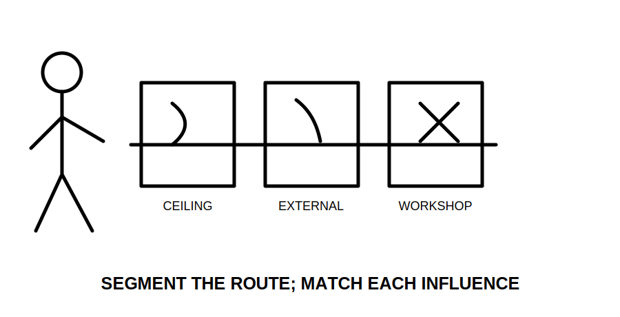
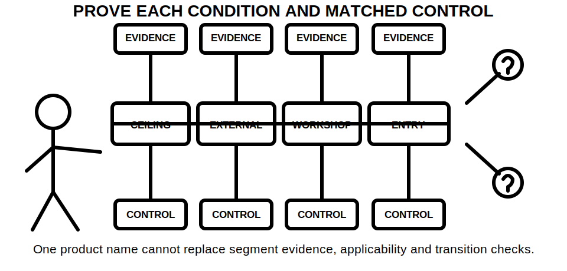
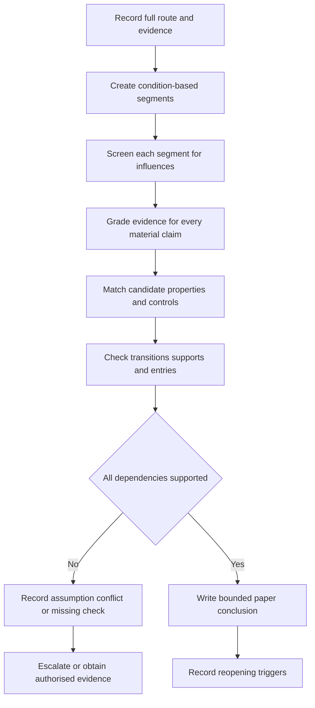
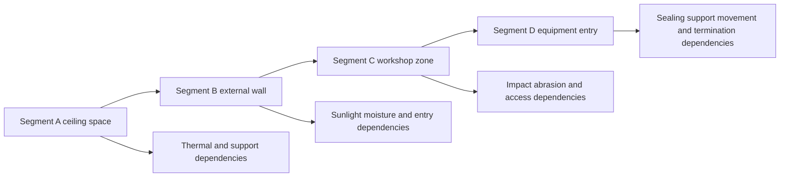

# Day 25 — Wiring Systems, Mechanical Protection and Environmental Influences

> **Currency, copyright and safety notice:** Original educational content only. Exact wiring-system selection, support, enclosure, mechanical-protection, environmental-rating, transition and jurisdiction-specific requirements remain `reference_check_required`. This module is `review-required`, safety-critical and not `technically-reviewed`.

## 1. Outcome and entry check

By the end of this module, the learner can:

1. divide a fictional wiring route into condition-based segments and justify each boundary;
2. distinguish a cable property from an installation control and from evidence about the route;
3. identify mechanical, thermal, moisture, chemical, sunlight, vibration, fauna and dust influences without inventing severity;
4. build a route-condition ledger that links every proposed control to evidence and dependencies;
5. state the strongest supportable paper conclusion and identify what would reopen it; and
6. score at least 10/12 on the original educational rubric with no critical error.

**Entry check:** Without notes, define **wiring system**, **route segment**, **mechanical damage**, **environmental influence**, **containment**, **support**, **ingress**, **transition point** and **governing segment**. Then explain why a single cable description cannot prove suitability for an entire route.

## 2. Why it matters

A circuit route is a chain of local conditions, not one averaged environment. A short section exposed to impact, heat, water, chemicals, sunlight or movement may govern the whole paper decision. Conversely, identifying a hazard does not prove that a particular cable, conduit, enclosure or support arrangement controls it.

The learner must keep three questions separate:

- **What condition is evidenced?**
- **What property or installation control is being relied upon?**
- **What authorised source and route evidence support that reliance?**

*Caption: Segment boundaries follow material changes in conditions, not convenient drawing lengths.*

*Caption: Naming a cable or conduit is not proof; each material influence needs evidence, an applicable control and a stated dependency.*

## 3. Core concepts and terminology

- **Wiring system:** conductors or cables together with their containment, support, accessories, entries, joints and installation method.
- **Route segment:** a portion of the route whose material installation and environmental conditions are sufficiently similar for one bounded analysis.
- **Segment boundary:** a point where a relevant condition, installation method, protection arrangement, support method or evidence quality changes.
- **Mechanical damage:** physical harm caused by impact, penetration, crushing, abrasion, movement, tension, bending or a similar action.
- **Environmental influence:** a surrounding condition—such as heat, moisture, chemicals, sunlight, vibration, fauna or dust—that can affect suitability or durability.
- **Cable property:** a characteristic attributed to a cable by applicable product information; it is not automatically a complete installation control.
- **Installation control:** a route-specific measure such as location, guarding, containment, support, separation, enclosure or another verified arrangement.
- **Containment:** conduit, trunking, duct, tray or another system used to route, support or protect wiring.
- **Support:** the means of maintaining position and limiting harmful stress, movement or loading.
- **Ingress:** entry of solids or liquids into an enclosure, accessory or system.
- **Transition point:** the interface between unlike route segments, systems or conditions; entries, terminations and changes of support require separate attention.
- **Governing segment:** the segment that imposes the most restrictive verified condition on the current paper conclusion.
- **Dependency:** a fact that must remain true for a conclusion to remain supportable.
- **Reopening trigger:** new or changed information that invalidates reliance on an earlier conclusion until it is reassessed.

### Evidence grades

Use one grade for every material route claim:

1. **Supplied:** stated in the current fictional brief or evidence pack.
2. **Corroborated:** supported by at least two compatible current items.
3. **Derived:** logically inferred from identified evidence, with the inference shown.
4. **Assumed:** temporarily adopted but not verified.
5. **Missing or conflicting:** unavailable, stale, inconsistent or ambiguous.

### Claim grades

- **Observation:** describes what an evidence item shows.
- **Provisional classification:** assigns a route or influence category pending confirmation.
- **Supported paper conclusion:** follows from identified evidence and stated dependencies.
- **Authorised technical determination:** requires current authorised sources, competent review and any required practical verification; this module cannot produce it.

A high-confidence opinion does not upgrade weak evidence.

## 4. Rule-finding workflow

Use **R-O-U-T-E-S**:

1. **R — Record the full path:** origin, destination, route geometry, access constraints and every evidence source.
2. **O — Outline distinct segments:** place a boundary wherever installation method, exposure, protection, support or evidence quality materially changes.
3. **U — Uncover influences:** screen each segment for mechanical, thermal, moisture, chemical, sunlight, vibration, fauna, dust and movement conditions.
4. **T — Test candidate controls:** match each influence to cable properties, installation controls and applicable authorised-source checks; do not treat one control as universal.
5. **E — Examine transitions:** review entries, joints, changes of containment, support discontinuities and interfaces between environments.
6. **S — State the governing segment:** record the strongest bounded conclusion, unresolved checks, dependencies and reopening triggers.

The diagram is a dependency workflow, not a practical installation procedure. A conclusion is bounded because it remains valid only while its identified evidence and dependencies remain valid.

### Route-condition ledger

Use one row per material segment and influence:

| Field | Required entry |
|---|---|
| Segment and boundaries | Start, end and reason for each boundary |
| Installation description | Cable, containment, support and entry information supplied |
| Influence | Specific condition without invented severity |
| Evidence and grade | Current source plus evidence grade |
| Candidate property/control | What is proposed to address the influence |
| Applicability dependency | What must be verified for that proposal to apply |
| Transition issue | Entry, joint, support or interface requiring separate review |
| Claim grade | Observation, provisional classification or supported paper conclusion |
| Reopening trigger | Change that forces reassessment |
| Unresolved check | Exact missing or conflicting information |

Mandatory reopening triggers include changed route, added insulation, changed ambient or process conditions, new wash-down practice, altered vehicle or tool access, changed chemical exposure, damaged containment, changed support spacing, new fauna evidence, stale product information, changed cable or accessory, altered transition detail and conflicting later evidence.

## 5. Visual model or worked example

A fictional circuit crosses:

- **Segment A:** an indoor ceiling space with uncertain insulation contact and incomplete support evidence;
- **Segment B:** an exposed external wall with sunlight and moisture evidence;
- **Segment C:** a low-level workshop zone with impact and abrasion potential; and
- **Segment D:** an entry into equipment where sealing, support and movement evidence are incomplete.

### Guided reasoning

1. Segment at each material condition change; do not average the route.
2. Record only the severity supported by the evidence pack.
3. Separate statements about cable properties from statements about installation controls.
4. Treat containment as one candidate control, not automatic proof against every influence.
5. Record transition points independently because a suitable segment can still have an unsupported entry or interface.
6. Withhold a final selection while insulation contact, support, product applicability or entry evidence remains unresolved.
7. State which segment currently governs and why; change the governing segment if later evidence changes the comparison.

### Faded example

For a second fictional route, the learner receives only a sketch, product extract and maintenance note. They must create the segments, ledger and bounded conclusion without the completed influence list.

### Changed-condition transfer

Rework the ledger after each independent change:

- ceiling insulation is added;
- the external wall becomes part of a wash-down zone;
- mobile equipment begins crossing the workshop route;
- a corrosive vapour source is introduced; and
- the equipment is relocated, creating an unsupported vertical drop.

For each change, identify the affected ledger rows, invalidated conclusions, new evidence required and whether the governing segment changes.

## 6. Practical application

Produce a paper-only evidence pack containing:

1. an annotated route sketch with justified boundaries;
2. a completed route-condition ledger;
3. a comparison of at least two fictional wiring-system responses;
4. one bounded selection rationale;
5. a list of unresolved authorised-source checks;
6. a reopening statement for each material dependency; and
7. a changed-condition revision showing traceable propagation rather than a fresh unexplained answer.

### Original educational rubric

Score each category 0–2:

| Category | 0 | 1 | 2 |
|---|---|---|---|
| Route segmentation | Missing or arbitrary | Partly justified | Every material boundary justified |
| Terminology | Material misuse | Mostly accurate | Precise and consistently applied |
| Influence screening | Material influence omitted or invented | Partial | Complete, evidence-bounded screening |
| Control and dependency reasoning | Names a product/control as proof | Some dependencies | Each control tied to evidence and applicability |
| Transition and change propagation | Ignores interfaces or changes | Partial | Reopens and updates all affected rows |
| Safety and claim control | Unsafe authority or compliance claim | Boundary stated incompletely | Clear paper-only scope and bounded claims |

**Readiness threshold:** 10/12, with no zero in route segmentation, influence screening, control/dependency reasoning or safety and claim control. This is an original learning threshold, not an official RTO assessment rule.

**Critical errors requiring a varied re-attempt:**

- averaging unlike segments into one condition;
- inventing an environmental rating, severity, limit or product capability;
- treating conduit, enclosure or a cable label as universal proof;
- omitting a known alternate route condition or transition;
- failing to reopen a conclusion after a material change; or
- presenting a paper exercise as technical approval or practical authority.

Complete delayed retrieval after at least one sleep interval: reconstruct R-O-U-T-E-S, the evidence grades, the claim grades and five reopening triggers without viewing the module, then correct the response against the ledger model.

## 7. Common errors and safety checkpoint

Common errors include:

- selecting from load current alone;
- drawing segments by equal length rather than condition;
- confusing a cable property with complete installed-system suitability;
- treating containment as protection against every influence;
- ignoring supports, entries, joints and transitions;
- using an assumed severity as if measured or verified;
- accepting stale drawings or product data without a currency check;
- naming a governing segment without recording why it governs; and
- writing “compliant”, “approved” or “safe” when the evidence supports only a bounded paper conclusion.

**Stop conditions:** Stop the exercise and record an unresolved check when the source is unavailable, evidence conflicts, route conditions are ambiguous, product applicability cannot be established, a practical observation would be required, or the learner is about to invent a value, rating, test or field action.

This module authorises no site inspection, roof-space or ceiling-space access, approach to live equipment, drilling, cutting, opening, installation, cable handling, testing, measurement, alteration, energisation, commissioning, certification, verification or approval.

## 8. Retrieval and next links

Without notes:

1. define route segment, segment boundary, governing segment and transition point;
2. state R-O-U-T-E-S in order;
3. list the five evidence grades and four claim grades;
4. name eight influence families;
5. explain why a short segment may govern;
6. explain why conduit is not universal proof;
7. identify five reopening triggers;
8. write the strongest bounded conclusion when support and entry evidence are missing; and
9. explain how added insulation propagates through the route-condition ledger.

- **Program:** [Six-Week Capstone Learning Plan](../MASTER_PLAN.md)
- **Previous:** [Day 24 — Switchboard Functional Areas, Accessibility and Identification](day-24-switchboard-functional-areas-accessibility-and-identification.md)
- **Knowledge note:** [[Six-Week Day 25 - Wiring Systems Mechanical Protection and Environmental Influences]]
- **Next:** [Day 26 — Rest, Visual-Recall Practice and Catch-Up](day-26-rest-visual-recall-practice-and-catch-up.md)
