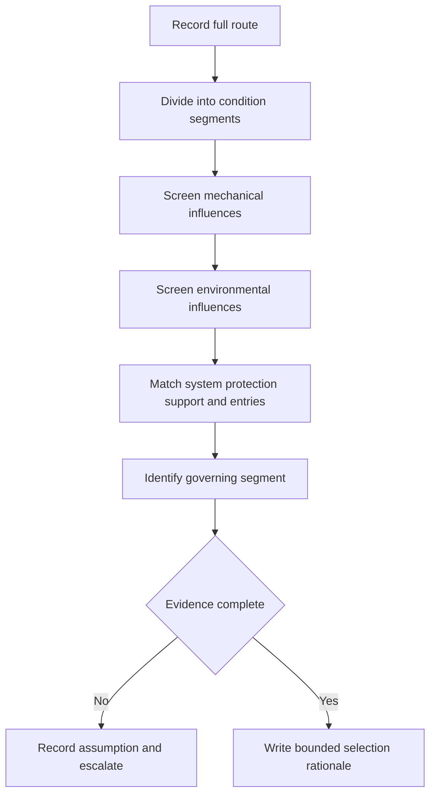
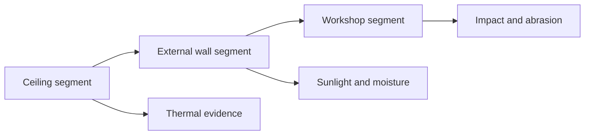

# Day 25 — Wiring Systems, Mechanical Protection and Environmental Influences

> **Currency, copyright and safety notice:** Original educational content only. Exact wiring-system selection, support, enclosure, mechanical-protection and environmental requirements remain `reference_check_required`. This module is `review-required` and not `technically-reviewed`.

## 1. Outcome and entry check

The learner should classify route segments, identify mechanical and environmental influences, separate cable properties from installation controls, map unsupported assumptions, compare fictional options and score at least 10/12 with no zero in route segmentation, influence screening or safety.

**Entry check:** define wiring system, route segment, mechanical damage, environmental influence, support and enclosure; explain why one cable description cannot represent every part of a route.

## 2. Why it matters

A cable may pass through several conditions between origin and load. Selection that ignores one exposed, hot, wet, corrosive or mechanically vulnerable segment can invalidate the whole design argument.

*Caption: The governing route segment may be short, but it still controls the decision.*

## 3. Core concepts and terminology

- **Wiring system:** conductors or cables together with containment, support, accessories and installation method.
- **Route segment:** a portion of the route with materially similar conditions.
- **Mechanical damage:** physical harm from impact, penetration, crushing, abrasion, movement or similar action.
- **Environmental influence:** heat, moisture, chemicals, sunlight, vibration, fauna, dust or other surrounding condition affecting suitability.
- **Containment:** conduit, trunking, duct, tray or another system used to route or protect wiring.
- **Support:** means of maintaining position and limiting harmful stress or movement.
- **Ingress:** entry of solids or liquids into an enclosure or system.
- **Governing segment:** the route portion that imposes the most restrictive verified condition.

## 4. Rule-finding workflow

Use **R-O-U-T-E-S**: **R**ecord the full path; **O**utline distinct segments; **U**ncover mechanical and environmental influences; **T**est wiring-system and protection options against each segment; **E**xamine transitions, supports and entries; **S**tate the governing segment and unresolved evidence.

## 5. Visual model or worked example

A fictional circuit crosses an indoor ceiling space, an exposed external wall and a low-level workshop zone. The indoor segment has thermal uncertainty, the external segment has sunlight and moisture exposure, and the workshop segment has impact risk. The response treats each segment separately, identifies transition points and refuses to choose a final wiring system until missing support and enclosure data are resolved.

## 6. Practical application

Build a route ledger with segment, length category, installation method, likely influence, evidence source, proposed control, transition issue and unresolved check. Analyse changes involving added insulation, a wash-down area, a vehicle path, corrosive vapour and an unsupported vertical drop.

Score 0–2 for route segmentation, terminology, influence screening, option comparison, transition reasoning and safety. Below 10/12, or zero in segmentation, influence screening or safety, requires a varied re-attempt.

## 7. Common errors and safety checkpoint

Errors include selecting from load current alone, averaging unlike route conditions, treating conduit as universal protection, ignoring entries and transitions, inventing environmental ratings and describing a paper option as approved.

This module authorises no site inspection, access, drilling, cutting, opening, installation, testing, measurement, alteration, energisation, certification or approval.

## 8. Retrieval and next links

Define route segment, containment and governing segment; state R-O-U-T-E-S; name five environmental influences and four mechanical influences; explain why a short exposed segment can govern; identify what must be reopened when insulation is added.

- **Program:** [Six-Week Capstone Learning Plan](../MASTER_PLAN.md)
- **Previous:** [Day 24 — Switchboard Functional Areas, Accessibility and Identification](day-24-switchboard-functional-areas-accessibility-and-identification.md)
- **Knowledge note:** [[Six-Week Day 25 - Wiring Systems Mechanical Protection and Environmental Influences]]
- **Next:** [Day 26 — Rest, Visual-Recall Practice and Catch-Up](day-26-rest-visual-recall-practice-and-catch-up.md)
