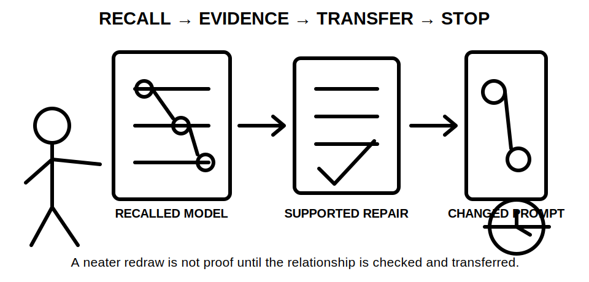
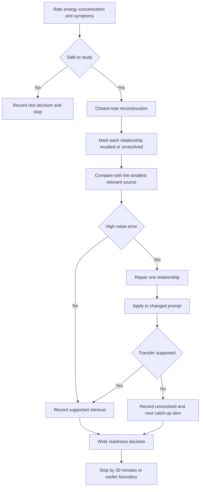

# Day 26 — Rest, Visual-Recall Practice and Catch-Up

> **Currency, copyright and safety notice:** This recovery block introduces no new electrical theory. It uses original prompts and educational models only. Any technical correction remains `reference_check_required`; this module is not `technically-reviewed` and grants no practical electrical authority.

## 1. Outcome and entry check

Within a maximum of 30 minutes, the learner will:

1. reconstruct one switchboard relationship map and one segmented wiring-route model without notes;
2. grade the evidence supporting each reconstructed relationship;
3. identify and repair no more than three high-value errors;
4. transfer one corrected relationship to a changed fictional prompt;
5. record one readiness decision with a reason; and
6. stop when any time, fatigue, uncertainty or safety boundary is reached.

A successful outcome is observable: two closed-note reconstructions, an error-repair ledger, one changed-prompt transfer and one written readiness decision. Artistic quality is irrelevant.

**Entry check:** before starting, record:

- energy from 1–5;
- concentration from 1–5;
- headache, agitation or unusual fatigue as present or absent;
- the Days 22–25 sequence from memory;
- the one likely misconception with the highest safety or assessment consequence; and
- whether a current authorised reference is available for any proposed technical correction.

Do not begin the retrieval task when energy or concentration is 1, when symptoms impair attention, or when the learner cannot maintain the boundary between paper study and practical electrical work. Choose rest and record the reason instead.

## 2. Why it matters

Recovery is part of learning design, not unused study time. Closed-note reconstruction tests whether relationships can be produced without recognition cues. Short, selective correction then strengthens the weakest prerequisite without turning a recovery day into an overloaded technical lesson.

The block also calibrates confidence. A fluent sketch can still contain unsupported links; a hesitant sketch can contain sound relationships. The learner therefore records both the remembered claim and the evidence used to check it.

*Caption: Retrieve first, repair the smallest useful gap, then stop at the boundary.*

*Caption: A neater redraw is not proof of learning; the correction must be supported and transferred.*

## 3. Core concepts and terminology

- **Visual recall:** producing a model or relationship without viewing the source.
- **Recognition:** identifying information when it is shown. Recognition is easier than recall and is not a substitute for reconstruction.
- **Reconstruction:** rebuilding a conceptual diagram from remembered relationships rather than copying its appearance.
- **Retrieval cue:** a limited prompt that initiates recall without supplying the answer, such as “show every source and boundary.”
- **Relationship:** a stated connection between two concepts, such as a source feeding a section or a route segment being exposed to an influence.
- **Evidence grade:** a label describing how strongly a recalled relationship is supported:
  - **recalled:** produced from memory but not yet checked;
  - **located:** matched to a relevant section of an existing module or authorised source;
  - **supported:** the source clearly supports the bounded relationship being claimed;
  - **transferred:** the corrected relationship was applied successfully to a changed prompt;
  - **unresolved:** evidence is missing, conflicting, stale or outside the learner’s authority to determine.
- **Error log:** a record of the original claim, error type, correction, evidence, transfer result and reopening trigger.
- **High-value error:** a gap affecting safety boundaries, prerequisite reasoning, repeated assessment performance or a downstream decision.
- **Surface error:** an issue of drawing neatness, spelling or layout that does not change the relationship. Surface errors do not consume the three-repair limit unless they obscure meaning.
- **Misconception:** a stable but incorrect relationship, not merely a forgotten label.
- **Confidence calibration:** comparing confidence before checking with the quality of evidence after checking.
- **Catch-up triage:** selecting the smallest missed item that restores readiness for the next scheduled block.
- **Changed-prompt transfer:** applying a corrected relationship where one relevant feature has changed, without copying the original answer.
- **Reopening trigger:** a later change that makes a previous correction require checking again.
- **Stop condition:** a predetermined reason to end the session rather than continue with degraded attention.
- **Readiness:** sufficient retrieval, evidence control and concentration to begin the next learning block. Readiness is not technical competence, authorisation or proof of practical skill.

### Claim boundaries

Use these four claim grades in the repair ledger:

1. **memory claim** — what the learner initially recalled;
2. **provisional correction** — a likely correction identified during comparison;
3. **supported study conclusion** — a bounded correction supported by the available learning material or authorised reference;
4. **authorised technical determination** — a conclusion requiring current authorised information and qualified review; this module does not produce this grade.

## 4. Rule-finding workflow

Use **R-E-D-R-A-W**:

- **R — Rate readiness:** record energy, concentration and symptoms; choose retrieve or rest.
- **E — Evoke the model closed-note:** draw only from memory using a minimal cue.
- **D — Detect the highest-value gap:** compare relationships, not artistic appearance.
- **R — Review the smallest source needed:** locate evidence for only the selected gap.
- **A — Apply the correction:** redraw the affected relationship and test it on one changed prompt.
- **W — Write the readiness decision and stop:** record ready, limited catch-up required or rest required, then end the block.

The decision point comes before technical checking. A learner who is too fatigued to compare evidence reliably should rest rather than generate confident but weak corrections.

### Error-repair ledger

Record one row per selected error:

| Field | Required entry |
|---|---|
| Prompt and relationship | What was being reconstructed and the exact link claimed |
| Initial confidence | Low, medium or high before checking |
| Evidence grade before checking | Recalled or unresolved |
| Error type | Omission, reversal, boundary error, unsupported assumption, terminology error or sequence error |
| Smallest source checked | Module section or authorised source identifier; do not copy extensive wording |
| Bounded correction | The corrected relationship in the learner’s own words |
| Evidence grade after checking | Located, supported or unresolved |
| Changed prompt | One relevant condition changed |
| Transfer result | Supported, partial or failed |
| Reopening trigger | What later change would require checking again |

Reopen a correction when the fictional source arrangement, task boundary, circuit role, route segment, environmental influence, identification evidence or reference source changes. Also reopen it when later evidence conflicts with the source used during this block.

## 5. Visual model or worked example

### Worked example A — guided switchboard reconstruction

**Cue:** draw five boxes representing sources, main control, distribution, identification evidence and access or permission boundary.

**Initial recall:** the learner draws one source feeding a main control and distribution section, then places a label beside the distribution section. The learner omits an alternate-source question and treats physical reach as permission.

**Detect:** two high-value errors are selected:

1. source completeness was assumed;
2. accessibility was conflated with authority.

**Review:** the learner checks only the relevant Day 23 and Day 24 sections. The learner records a supported study conclusion that every relevant source and operating state must be considered, and that physical access, operating space and permission are distinct concepts.

**Apply:** on a fresh prompt stating that a labelled alternate supply may exist, the learner adds an unresolved source branch rather than declaring a complete isolation boundary.

**Transfer result:** supported. The changed prompt alters source evidence, so the earlier single-source conclusion is reopened.

### Worked example B — partially guided route reconstruction

Use only this cue: **segment by changed condition**.

Draw a fictional route with indoor, exposed and equipment-entry segments. For each segment, write:

- one observed or supplied influence;
- one candidate property or installation control;
- one applicability dependency; and
- one transition question.

Compare the result with Day 25 only after the complete redraw. Repair no more than one relationship.

### Independent transfer

Choose one changed fictional condition:

- the route gains a wash-down segment;
- a support is removed;
- the equipment entry changes;
- identification evidence conflicts with the drawing; or
- an alternate source is newly disclosed.

Without reopening all notes, mark which previous relationship must be reopened and why. Then check only the smallest relevant source.

## 6. Practical application

### Thirty-minute maximum sequence

- **Minute 0–3:** readiness and symptom check.
- **Minute 3–10:** closed-note switchboard reconstruction.
- **Minute 10–16:** closed-note segmented-route reconstruction.
- **Minute 16–23:** compare evidence and repair up to three high-value errors in total.
- **Minute 23–27:** complete one changed-prompt transfer.
- **Minute 27–30:** write the readiness decision and exactly one next study action.

Stop earlier when a stop condition occurs. Unused time is not a reason to add new theory.

### Readiness decision

Choose exactly one:

- **Ready:** both models contain the main relationships, selected corrections are supported, the changed prompt was handled without an unsafe claim, and attention remains adequate.
- **Limited catch-up required:** one bounded prerequisite gap remains; identify one specific section or prompt for the next available catch-up period.
- **Rest required:** fatigue, symptoms, repeated unsafe claims, unresolved high-confidence errors or inability to control scope makes further study unreliable.

### Educational scoring rubric

Score each category 0, 1 or 2. This is an original study-readiness tool, not an official RTO pass mark.

| Category | 0 | 1 | 2 |
|---|---|---|---|
| Closed-note reconstruction | copied, absent or structurally unusable | partial relationships | key relationships shown without notes |
| Terminology | terms confused or undefined | mostly correct with one material gap | terms used accurately and explained |
| Evidence grading | confidence treated as proof | grades used inconsistently | every selected relationship graded consistently |
| Error repair | correction unsupported or overly broad | correction partly bounded | smallest useful correction supported and recorded |
| Changed-prompt transfer | copied answer or unsafe certainty | partial transfer with unresolved issue | changed relationship reopened and bounded correctly |
| Recovery discipline | time or fatigue boundary ignored | stopped late or scope expanded | all limits and stop conditions followed |

**Critical-error gates:** regardless of score, choose `limited catch-up required` or `rest required` when the learner:

- treats a label, normal stop response or physical reach as proof of isolation, permission or safety;
- invents an exact technical value, clause, test result or official assessment rule;
- proposes practical switching, opening, testing, inspection or alteration;
- conceals an unresolved source, boundary or evidence conflict; or
- continues after a stated fatigue or symptom stop condition.

## 7. Common errors and safety checkpoint

Common errors include:

- rereading before attempting recall;
- judging drawing quality instead of relationship accuracy;
- correcting every small issue rather than the highest-value three;
- using confidence as evidence;
- recording a correction without its source;
- copying the worked example into the changed prompt;
- treating a remembered label as proof of correspondence;
- collapsing source, control, boundary and permission into one box;
- averaging route conditions instead of segmenting them;
- turning catch-up into a new technical lesson; and
- exceeding the time boundary because the task feels unfinished.

### Safety checkpoint

Stop immediately when any of the following occurs:

- headache, marked fatigue, agitation or concentration deterioration;
- three repaired errors have already been recorded;
- three unresolved high-confidence errors are found;
- the learner cannot distinguish study reasoning from practical work authority;
- a correction would require an unavailable authorised source or qualified determination;
- the task prompts an urge to inspect, open, switch, isolate, prove, test, trace or alter real equipment; or
- the 30-minute maximum is reached.

This block authorises no site access, switchboard or enclosure access, switching, isolation, proving, locking, tagging, conductor tracing, measurement, testing, inspection, maintenance, alteration, energisation, commissioning, certification, verification or return to service.

## 8. Retrieval and next links

Before closing the module, answer without notes:

1. State R-E-D-R-A-W in order.
2. Distinguish recall, recognition and reconstruction.
3. Name the five evidence grades.
4. Explain why a fluent diagram can remain unsupported.
5. State the 30-minute and three-repair limits.
6. Give two fatigue or uncertainty stop conditions.
7. Explain the difference between readiness and technical competence.
8. Name one reopening trigger for a switchboard relationship and one for a route relationship.
9. Record exactly one next study action.

For delayed retrieval, repeat only questions 1, 3, 5 and 7 at the start of Day 27. Do not repeat the full recovery block.

- **Program:** [Six-Week Capstone Learning Plan](../MASTER_PLAN.md)
- **Previous:** [Day 25 — Wiring Systems, Mechanical Protection and Environmental Influences](day-25-wiring-systems-mechanical-protection-and-environmental-influences.md)
- **Knowledge note:** [[Six-Week Day 26 - Rest Visual-Recall Practice and Catch-Up]]
- **Next:** [Day 27 — Consumer Mains, Submains and Final-Subcircuit Roles](day-27-consumer-mains-submains-and-final-subcircuit-roles.md)
