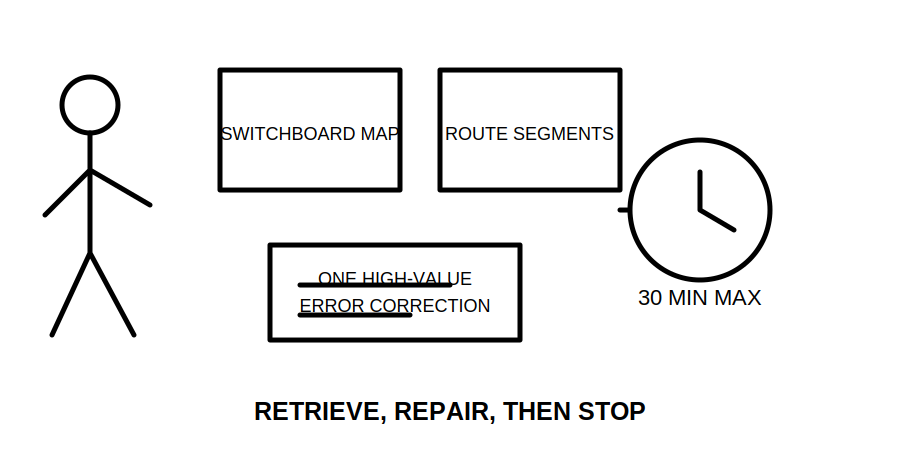
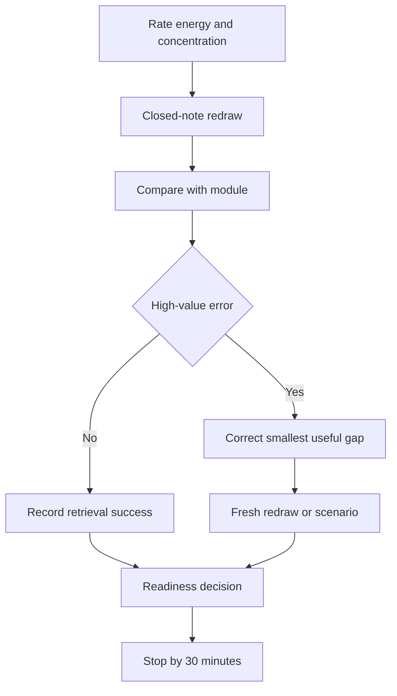

# Day 26 — Rest, Visual-Recall Practice and Catch-Up

> **Currency, copyright and safety notice:** This recovery block introduces no new electrical theory. It uses original prompts only. Any technical correction remains `reference_check_required`; the module is not `technically-reviewed`.

## 1. Outcome and entry check

Within a maximum of 30 minutes, the learner should reconstruct one switchboard map and one segmented wiring route from memory, correct no more than three high-value errors, make a readiness decision and stop when fatigue or uncertainty exceeds the stated boundary.

**Entry check:** rate energy and concentration from 1–5; list Days 22–25 from memory; identify the single error most likely to affect safety or assessment performance.

## 2. Why it matters

Recovery protects later learning. A short closed-note reconstruction exposes missing relationships more effectively than rereading every page while fatigued.

*Caption: Retrieve, repair the smallest useful gap, then stop.*

## 3. Core concepts and terminology

- **Visual recall:** reproducing a model or relationship without viewing the source.
- **Reconstruction:** rebuilding a diagram from remembered concepts rather than copying its appearance.
- **Error log:** a record of the mistake, likely misconception, correction and fresh check.
- **High-value error:** a gap affecting safety, prerequisite reasoning or repeated assessment performance.
- **Catch-up triage:** selecting the smallest missed item that restores sequence readiness.
- **Stop condition:** a predetermined reason to end the session rather than push through poor concentration.
- **Readiness:** sufficient retrieval and confidence calibration to begin the next block; not technical competence or work authority.

## 4. Rule-finding workflow

Use **R-E-D-R-A-W**: **R**ate readiness; **E**voke the model closed-note; **D**etect one important gap; **R**eview only the smallest source needed; **A**pply the correction to a fresh prompt; **W**rite the readiness decision and stop.

## 5. Visual model or worked example

Prompt A: draw source, main control, distribution, identification and access boundaries as five labelled boxes. Prompt B: draw a three-segment route and attach one mechanical or environmental influence to each segment. Compare only after both drawings are complete. Record omissions by concept, not artistic quality.

## 6. Practical application

Minute 0–5: readiness rating and closed-note terminology. Minute 5–15: two redraws. Minute 15–23: correct up to three high-value errors. Minute 23–27: one fresh scenario. Minute 27–30: choose ready, limited catch-up required or rest required. Catch-up is limited to one missed task and must not add new theory.

## 7. Common errors and safety checkpoint

Errors include turning recovery into a full study session, copying before retrieval, correcting low-value formatting, treating confidence as accuracy, continuing while fatigued and practising physical switching or inspection actions.

Stop immediately for headache, marked fatigue, repeated unsafe claims, inability to distinguish conceptual study from practical authority, or three unresolved high-confidence errors. This block authorises no electrical work, access, switching, isolation, testing or inspection.

## 8. Retrieval and next links

State R-E-D-R-A-W; redraw B-O-A-R-D-S and R-O-U-T-E-S from memory; name the 30-minute limit and three-error limit; explain the difference between readiness and technical competence; record exactly one next study action.

- **Program:** [Six-Week Capstone Learning Plan](../MASTER_PLAN.md)
- **Previous:** [Day 25 — Wiring Systems, Mechanical Protection and Environmental Influences](day-25-wiring-systems-mechanical-protection-and-environmental-influences.md)
- **Knowledge note:** [[Six-Week Day 26 - Rest Visual-Recall Practice and Catch-Up]]
- **Next:** [Day 27 — Consumer Mains, Submains and Final-Subcircuit Roles](day-27-consumer-mains-submains-and-final-subcircuit-roles.md)
