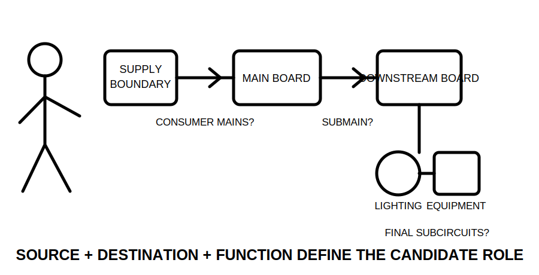
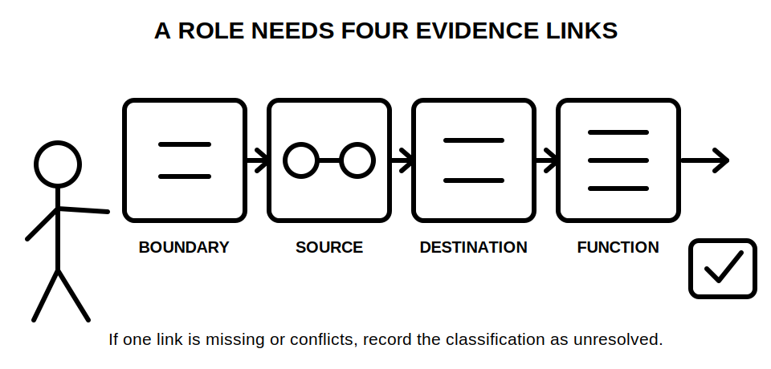
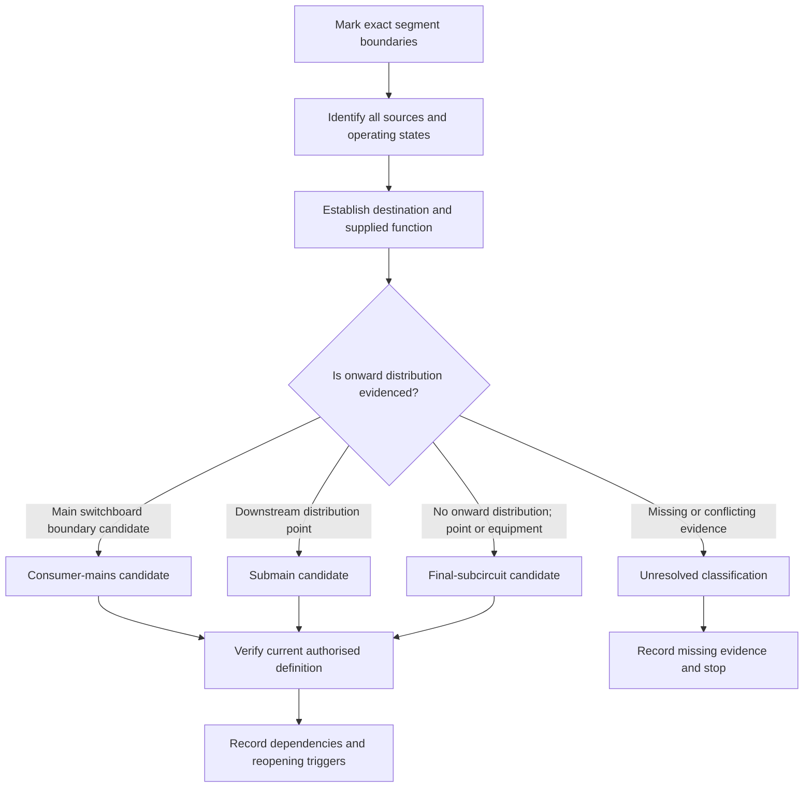
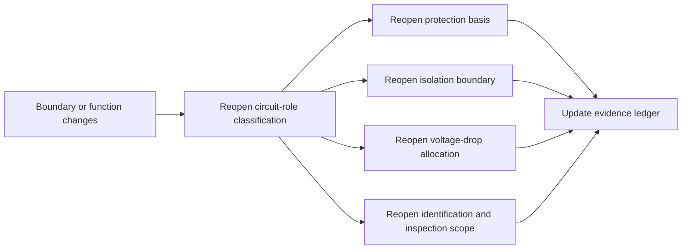

# Day 27 — Consumer Mains, Submains and Final-Subcircuit Roles

> **Currency, copyright and safety notice:** This original learning summary teaches circuit-role classification and evidence control without reproducing standards wording. Exact definitions, supply boundaries, protection, isolation, conductor, identification and jurisdiction-specific requirements remain `reference_check_required`. It authorises no electrical work.

## 1. Outcome and entry check

By the end, the learner can:

1. classify a documented circuit segment as a **consumer-mains candidate**, **submain candidate**, **final-subcircuit candidate** or **unresolved**;
2. identify the source, destination, distribution function and boundary evidence supporting that classification;
3. separate a remembered label from a supported study conclusion;
4. explain which downstream design, protection, isolation, identification and inspection decisions must be reopened when a role or boundary changes; and
5. complete an independent changed-brief classification with an explicit safety and reference boundary.

**Entry check:** Draw a supply boundary, a main switchboard, one downstream distribution board, one local control enclosure and two loads. Mark five circuit segments. For each segment, state what evidence—not cable size, route or appearance—would be needed before assigning a role.

## 2. Why it matters

Circuit roles are architectural relationships. A wrong classification can direct later protection, isolation, voltage-drop, identification, inspection and verification reasoning to the wrong boundary or source. The safest educational response to incomplete evidence is **unresolved**, not a confident guess.

*Caption: Trace source, destination and supplied function before naming the circuit role.*

*Caption: A familiar label is not a supported classification until all four evidence links agree.*

## 3. Core concepts and terminology

- **Supply point or supply boundary:** the documented point at which supply enters the installation context. Its exact legal and technical meaning depends on the authorised source and jurisdiction.
- **Main switchboard boundary:** the evidenced boundary associated with the installation's main switching and distribution function. Appearance or a label alone does not establish it.
- **Consumer mains candidate:** a segment whose evidenced source and destination appear to place it between the applicable supply boundary and main switchboard boundary. The exact definition must be verified.
- **Submain candidate:** a segment whose evidenced function is to supply a downstream switchboard or distribution point rather than directly supply the final point or current-using equipment.
- **Final-subcircuit candidate:** a segment whose evidenced function is to supply points or current-using equipment without another downstream distribution function within that circuit role.
- **Distribution function:** allocation of supply to multiple downstream circuits or branches. A box containing controls is not automatically a distribution board.
- **Utilisation function:** delivery of energy to a point or item of current-using equipment rather than onward circuit distribution.
- **Circuit boundary:** the evidenced start and end points used to decide which role and requirements may apply.
- **Role transition:** a point where one evidenced circuit role ends and another begins.
- **Upstream and downstream:** relative positions toward the source or toward supplied equipment. These terms do not by themselves prove a role.
- **Alternate source:** another source that may energise part of the installation in one or more operating states. Its presence can change source and boundary reasoning.
- **Evidence grade:** the strength of support for a statement:
  - **recalled** — produced from memory only;
  - **located** — a relevant drawing, label or record has been found but not reconciled;
  - **supported** — multiple relevant facts agree and conflicts are addressed;
  - **transferred** — the reasoning still works in a changed scenario;
  - **unresolved** — evidence is missing, stale or contradictory.
- **Claim grade:** the authority of a conclusion:
  - **memory claim** — an unverified recollection;
  - **provisional classification** — a bounded candidate based on incomplete evidence;
  - **supported study conclusion** — a reasoned educational conclusion with stated dependencies;
  - **authorised technical determination** — a conclusion made by an appropriately qualified person using current authorised sources and installation evidence.
- **Reopening trigger:** a change that invalidates or weakens an earlier conclusion and requires dependent decisions to be reconsidered.

## 4. Rule-finding workflow

Use **B-O-U-N-D-S**:

1. **B — Bound the segment:** mark the exact start and end under consideration.
2. **O — Observe every source:** identify the normal source, alternate sources and relevant operating states.
3. **U — Understand the destination:** determine whether it is the main switchboard boundary, another distribution point, a control enclosure, a point or current-using equipment.
4. **N — Name the supplied function:** state whether the destination distributes supply onward or uses/controls it locally.
5. **D — Distinguish evidence from appearance:** grade drawings, labels, schedules and scenario facts; record contradictions.
6. **S — State the bounded classification:** use candidate or unresolved language, identify dependencies and list downstream decisions that must reopen if the classification changes.

The diagram is a reasoning sequence, not a definition source. The same physical conductor can be misclassified when the supply boundary, board function or destination is assumed rather than evidenced.

### Circuit-role evidence ledger

For each segment, record:

| Field | Required entry |
|---|---|
| Segment identifier | Unique paper label |
| Start boundary | Documented source-side point |
| End boundary | Documented destination-side point |
| Source and state | Normal and alternate sources relevant to the segment |
| Destination function | Main distribution, downstream distribution, local control, point or current-using equipment |
| Evidence used | Drawing, schedule, label, scenario fact or authorised reference |
| Evidence grade | Recalled, located, supported, transferred or unresolved |
| Proposed role | Candidate role or unresolved |
| Dependencies | Facts that must remain true |
| Reopening triggers | Changes that require reclassification |
| Downstream checks affected | Protection, isolation, voltage drop, identification, inspection or verification reasoning |
| Claim grade | Memory, provisional, supported study conclusion or authorised determination |

## 5. Visual model or worked example

A fictional installation contains:

- a documented supply boundary;
- main switchboard **MSB**;
- workshop distribution board **WDB**;
- local motor-control enclosure **MCE**;
- lighting points and a fixed appliance.

Segments are:

- **A:** supply boundary to MSB;
- **B:** MSB to WDB;
- **C:** WDB to lighting points;
- **D:** WDB to fixed appliance;
- **E:** WDB to MCE;
- **F:** MCE to motor.

On the stated paper evidence:

- A is a **consumer-mains candidate** because its boundaries appear to connect the applicable supply boundary to MSB.
- B is a **submain candidate** because WDB performs evidenced downstream distribution.
- C and D are **final-subcircuit candidates** because they terminate at points or current-using equipment without another evidenced distribution function.
- E and F remain **unresolved** until the MCE's function is established. A local control enclosure may control one item without distributing final subcircuits, but a similarly located enclosure could also contain a distribution function.

The correct educational conclusion is bounded: these are candidates, not verified legal or technical determinations.

### Change propagation

A changed role is not a vocabulary-only correction. It can change the boundary assumed by several later design and inspection decisions.

### Worked-example fading

1. **Fully guided:** classify A–D using the completed ledger fields above.
2. **Partially guided:** classify E and F with the destination-function field blank; identify the smallest missing evidence.
3. **Prompt only:** redraw the installation after WDB is replaced by a local control enclosure with no onward distribution.
4. **Independent transfer:** add an alternate source connected downstream of MSB and explain which source and boundary claims must reopen.

## 6. Practical application

Complete three paper-only tasks.

### Task 1 — Classification ledger

For six fictional segments, complete every ledger field. Use **unresolved** whenever source, destination, distribution function or boundary evidence is missing or contradictory.

### Task 2 — Changed-brief transfer

Repeat the classification after each independent change:

1. a labelled “workshop board” is shown to contain control equipment only;
2. a downstream enclosure is shown to distribute three final subcircuits;
3. a generator can energise a downstream board in one operating state;
4. the supply boundary on the drawing conflicts with a later authorised record;
5. a segment previously thought to terminate at equipment actually terminates at another distribution point.

For each change, state the original conclusion, new evidence, revised evidence grade, role decision and downstream checks reopened.

### Task 3 — Delayed retrieval

At the start of Day 28, without notes:

- write B-O-U-N-D-S;
- define distribution function and unresolved classification;
- list the five evidence grades and four claim grades;
- explain why enclosure type, cable size and physical location cannot independently prove circuit role;
- identify three reopening triggers.

### Educational rubric — 12 points

- boundary accuracy — 2;
- source and operating-state control — 2;
- destination-function reasoning — 2;
- evidence and claim grading — 2;
- change propagation and reopening — 2;
- bounded safety/reference statement — 2.

This is an original study rubric, not an official RTO pass mark.

**Critical-error gates:** the result cannot be treated as ready when the learner invents a boundary, ignores a stated alternate source, treats a control enclosure as a distribution board without evidence, claims compliance from a sketch, or converts an unresolved classification into a definite technical conclusion.

## 7. Common errors and safety checkpoint

Common errors include:

- naming the role from cable size, route, colour, enclosure label or physical location;
- calling every feeder a submain;
- assuming every enclosure is a switchboard or distribution board;
- overlooking alternate sources and operating states;
- confusing local control with onward distribution;
- ignoring a role transition;
- preserving downstream calculations after a boundary changes;
- treating a located drawing as current and reconciled evidence;
- using an educational candidate classification as a compliance determination.

**Reopening triggers:** changed supply boundary; added or removed alternate source; changed operating state; changed destination; confirmed or removed distribution function; revised single-line diagram; stale or conflicting schedules; altered board arrangement; changed circuit destination; newly discovered interconnection; or later evidence that contradicts a label.

**Stop and escalate** when the supply boundary, source relationship, board function, destination, operating state or applicable authorised definition cannot be established. Do not inspect or open equipment to resolve a paper exercise.

This module authorises no site access, switchboard or enclosure access, switching, isolation, proving, locking, tagging, conductor tracing, testing, measurement, inspection, installation, alteration, energisation, commissioning, certification, verification or approval.

## 8. Retrieval and next links

Without notes:

1. state B-O-U-N-D-S;
2. distinguish submain and final-subcircuit candidates using destination and distribution function;
3. give one example where a labelled enclosure remains unresolved;
4. explain the difference between a supported study conclusion and an authorised technical determination;
5. list four downstream decisions reopened by a changed role;
6. redraw the worked example with one changed board function and one alternate source.

- **Program:** [Six-Week Capstone Learning Plan](../MASTER_PLAN.md)
- **Previous:** [Day 26 — Rest, Visual-Recall Practice and Catch-Up](day-26-rest-visual-recall-practice-and-catch-up.md)
- **Knowledge note:** [[Six-Week Day 27 - Consumer Mains Submains and Final-Subcircuit Roles]]
- **Next:** [Day 28 — Week 4 Switchboard and Wiring-System Inspection Exercise](day-28-week-4-switchboard-and-wiring-system-inspection-exercise.md)
