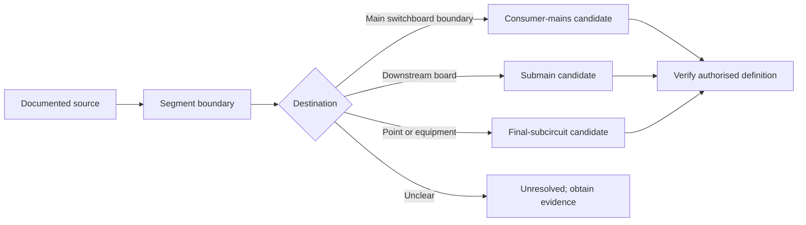

# Day 27 — Consumer Mains, Submains and Final-Subcircuit Roles

> **Currency, copyright and safety notice:** This original learning summary explains system roles without reproducing standards wording. Exact definitions, boundaries, protection, isolation, conductor and identification requirements remain `reference_check_required`. It authorises no electrical work.

## 1. Outcome and entry check

By the end, the learner can classify a documented circuit segment as consumer mains, submain, final subcircuit or unresolved; justify the classification from source, destination and supplied equipment; map upstream/downstream dependencies; and state which claims still require authorised references.

**Entry check:** sketch supply point, main switchboard, one distribution board and two loads. Mark each boundary and explain why physical cable size alone cannot establish a circuit role.

## 2. Why it matters

A wrong role classification can send later protection, isolation, voltage-drop, identification and inspection reasoning to the wrong requirements. Classification must follow function and boundaries, not appearance.

*Caption: Trace source, destination and supplied function before naming the circuit role.*

## 3. Core concepts and terminology

- **Supply point:** the documented boundary at which supply enters the installation context; its exact legal and technical meaning requires verification.
- **Consumer mains:** conductors serving the installation between the applicable supply boundary and main switchboard boundary; exact definitions vary by authorised source.
- **Submain:** a circuit supplying a downstream switchboard or distribution point rather than individual consuming equipment.
- **Final subcircuit:** a circuit supplying points or current-using equipment without another downstream distribution board in that circuit role.
- **Upstream/downstream:** relative position toward the supply or toward supplied equipment.
- **Circuit boundary:** the start and end points used to decide which role and evidence apply.
- **Role transition:** where one circuit role ends and another begins.
- **Unresolved classification:** a deliberate result when source, destination or distribution function is not evidenced.

## 4. Rule-finding workflow

Use **B-O-U-N-D-S**: **B**ound the segment; **O**bserve its source; **U**nderstand its destination; **N**ame the supplied function; **D**istinguish distribution from utilisation; **S**tate the classification and unresolved evidence.

The diagram is a classification aid, not a substitute for current definitions or installation-specific evidence.

## 5. Visual model or worked example

A fictional installation has a supply boundary, main switchboard MSB, workshop distribution board WDB, lighting points and a fixed appliance. Segment A runs from the supply boundary to MSB; Segment B runs MSB to WDB; Segments C and D run WDB to the lighting points and appliance. On the stated facts, A is a consumer-mains candidate, B a submain candidate, and C/D final-subcircuit candidates. Each conclusion remains bounded because exact terminology and requirements need authorised verification.

Changed condition: if the “workshop board” is only local control equipment and not a distribution board, reopen Segment B’s classification rather than preserving the original label.

## 6. Practical application

Complete a paper evidence table for four fictional segments with columns: source, destination, supplied function, intermediate distribution present, proposed role, evidence grade, downstream checks reopened and reference needed. Then explain one changed condition that would alter each classification.

Assessment rubric, 12 points: boundary accuracy 2; source/destination evidence 2; role reasoning 2; terminology 2; changed-condition reopening 2; bounded safety/reference statement 2. Any invented boundary or unsupported compliance claim is a critical error.

## 7. Common errors and safety checkpoint

Common errors: naming by cable size or location; calling every feeder a submain; overlooking alternate sources; treating a local control enclosure as a distribution board; ignoring role transitions; and claiming compliance from a sketch.

Stop and escalate when the supply boundary, board function, alternate-source relationship or destination cannot be established. This module authorises no access, switching, isolation, opening, tracing, testing, installation, alteration, certification or approval.

## 8. Retrieval and next links

State B-O-U-N-D-S from memory; distinguish submain from final subcircuit using destination and function; explain one unresolved classification; redraw the example with a changed board function.

- **Program:** [Six-Week Capstone Learning Plan](../MASTER_PLAN.md)
- **Previous:** [Day 26 — Rest, Visual-Recall Practice and Catch-Up](day-26-rest-visual-recall-practice-and-catch-up.md)
- **Knowledge note:** [[Six-Week Day 27 - Consumer Mains Submains and Final-Subcircuit Roles]]
- **Next:** [Day 28 — Week 4 Switchboard and Wiring-System Inspection Exercise](day-28-week-4-switchboard-and-wiring-system-inspection-exercise.md)
