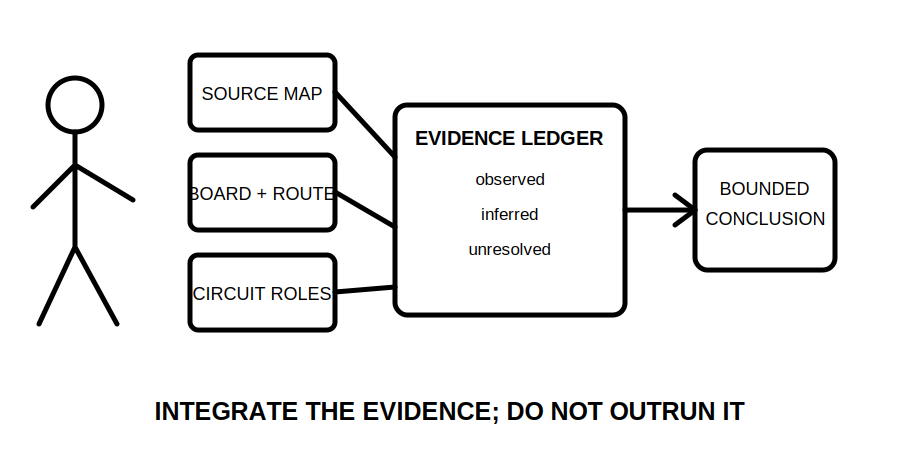
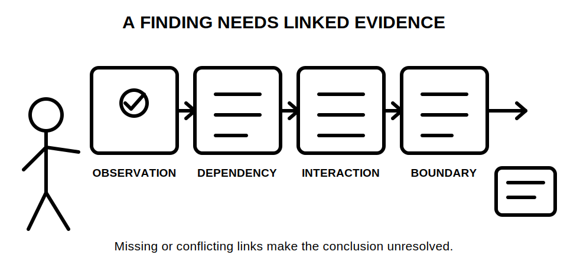
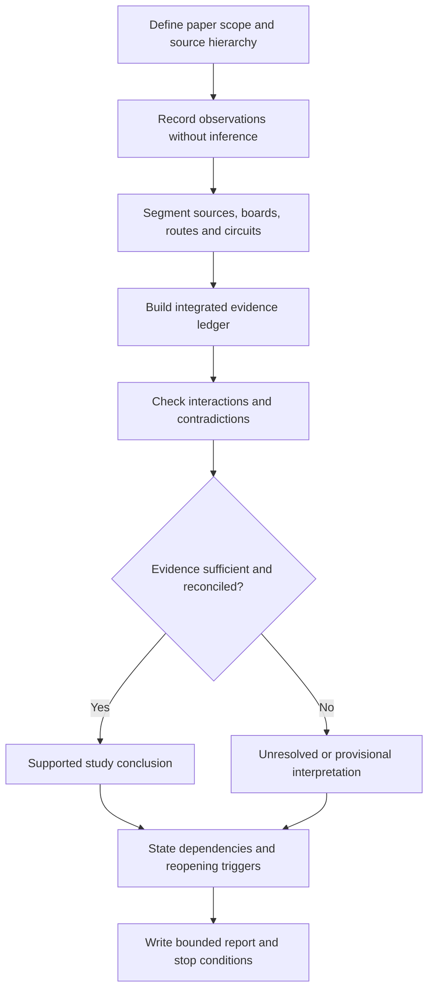
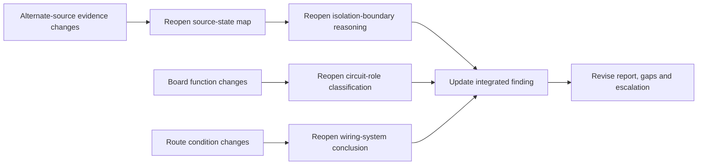

# Day 28 — Week 4 Switchboard and Wiring-System Inspection Exercise

> **Currency, copyright and safety notice:** This original module is a paper-based fictional inspection exercise. Exact switchboard construction, access, identification, wiring-system, circuit-role and jurisdiction-specific requirements remain `reference_check_required`. It authorises no site access, opening, switching, isolation, testing, measurement or practical inspection.

## 1. Outcome and entry check

By the end, the learner can:

1. define a paper inspection scope and separate supplied facts from assumptions;
2. integrate source-state, switchboard-area, route-condition and circuit-role evidence in one ledger;
3. distinguish observation, inference, educational finding and authorised technical determination;
4. identify interactions that require dependent conclusions to be reopened;
5. produce a bounded inspection summary that states evidence gaps, stop conditions and escalation needs; and
6. complete an independent changed-pack transfer without making unsupported compliance or safety claims.

**Entry check:** Without notes, reproduce S-O-U-R-C-E-S, B-O-A-R-D-S, R-O-U-T-E-S and B-O-U-N-D-S. For each workflow, state its evidence object, one dependency and one reopening trigger.

## 2. Why it matters

Integrated inspection reasoning fails when separate observations are collected but not connected. An alternate source can change an isolation boundary; an uncertain board function can change a circuit-role classification; a route transition can change the significance of identification or protection evidence. A defensible paper report preserves these dependencies and leaves unresolved matters unresolved.

*Caption: Combine source, board, route and circuit-role evidence before writing a conclusion.*

*Caption: A visible feature becomes a bounded educational finding only after its dependencies and evidence limits are recorded.*

## 3. Core concepts and terminology

- **Inspection scope:** the stated boundary of what may be considered from the supplied fictional evidence.
- **Observation:** a directly shown or documented fact, recorded without interpretation.
- **Inference:** a reasoned interpretation derived from one or more observations; it must state its supporting evidence.
- **Educational finding:** a bounded study conclusion that links observations, dependencies, unresolved information and a required next action.
- **Authorised technical determination:** a conclusion made by an appropriately qualified person using current authorised sources and sufficient installation evidence.
- **Evidence gap:** information required before a classification or conclusion can be supported.
- **Interaction:** a dependency where one feature changes the significance of another.
- **Contradiction:** two evidence items that cannot both support the same conclusion without reconciliation.
- **Critical error:** an unsafe or unsupported claim that overrides a numerical study score.
- **Reopening trigger:** a changed or newly discovered fact that requires one or more earlier conclusions to be reconsidered.
- **Evidence grade:**
  - **recalled** — produced from memory only;
  - **located** — relevant evidence found but not reconciled;
  - **supported** — relevant evidence agrees and conflicts are addressed;
  - **transferred** — reasoning remains valid in a changed scenario;
  - **unresolved** — evidence is missing, stale or contradictory.
- **Claim grade:**
  - **memory claim** — unverified recollection;
  - **provisional interpretation** — bounded inference based on incomplete evidence;
  - **supported study conclusion** — educational conclusion with evidence, dependencies and limits stated;
  - **authorised technical determination** — reserved for qualified review using current authorised material.

## 4. Rule-finding workflow

Use **I-N-S-P-E-C-T**:

1. **I — Identify scope and sources:** define the paper boundary, source hierarchy, operating states and evidence currency.
2. **N — Note observations only:** record what the pack directly shows before interpreting it.
3. **S — Segment the installation:** separate source paths, board areas, route sections and circuit boundaries.
4. **P — Pair evidence and dependencies:** connect each proposed finding to supporting observations, evidence grades and facts that must remain true.
5. **E — Examine interactions:** test whether source, board, route, circuit-role or identification evidence changes another conclusion.
6. **C — Classify the claim:** choose provisional, supported study conclusion or unresolved; reserve technical determination for authorised review.
7. **T — Tell the bounded conclusion:** state the finding, evidence, limits, reopening triggers, stop condition and next authorised action.

The diagram is a reporting workflow, not a practical inspection procedure. It prevents a photograph, label or isolated observation from becoming a compliance conclusion without linked evidence.

### Integrated inspection ledger

For each issue or feature, record:

| Field | Required entry |
|---|---|
| Item identifier | Unique paper label |
| Scope location | Drawing, board area, route segment or circuit boundary |
| Direct observation | What is explicitly shown or documented |
| Proposed inference | Interpretation kept separate from the observation |
| Related workflow | S-O-U-R-C-E-S, B-O-A-R-D-S, R-O-U-T-E-S or B-O-U-N-D-S |
| Evidence used | Drawing, schedule, label, scenario fact or authorised reference |
| Evidence grade | Recalled, located, supported, transferred or unresolved |
| Dependencies | Facts that must remain true |
| Interaction check | Other conclusions affected |
| Contradictions or gaps | Missing, stale or conflicting evidence |
| Reopening triggers | Changes that require reconsideration |
| Claim grade | Memory, provisional, supported study conclusion or authorised determination |
| Bounded next action | Paper correction, authorised source check or qualified escalation |

## 5. Visual model or worked example

A fictional pack contains:

- a main switchboard marked **MSB**;
- an alternate-source warning label but no supplied source-state diagram;
- workshop board **WDB**;
- an external route that changes from enclosed to exposed;
- one downstream enclosure labelled **Control**;
- a circuit schedule that conflicts with a later single-line drawing.

A defensible first pass records:

- the warning label as a **located observation**, not proof of the complete source arrangement;
- WDB as a distribution-board candidate only where onward distribution is evidenced;
- the route transition as a separate segment requiring its own condition record;
- the control enclosure function as unresolved until distribution versus local-control evidence is reconciled;
- the schedule/drawing conflict as an evidence gap that blocks a supported circuit-role conclusion.

This change-propagation model shows why integrated inspection is not a checklist of independent defects. One changed fact can invalidate several downstream claims.

### Worked-example fading

1. **Fully guided:** complete a supplied ledger for the alternate-source label and route transition.
2. **Partially guided:** analyse WDB with the dependency and interaction fields left blank.
3. **Prompt only:** classify the control enclosure and the conflicting schedule/drawing evidence.
4. **Independent transfer:** repeat the exercise after the warning label is removed, a current source-state diagram is added, and the external route is rerouted through a different environment.

## 6. Practical application

Complete three paper-only tasks.

### Task 1 — Integrated inspection record

Produce:

- one source-state diagram;
- one switchboard functional-area map;
- one route-condition ledger;
- one circuit-role table;
- one integrated inspection ledger containing at least six findings or unresolved items; and
- a six-sentence bounded summary.

Every summary sentence must identify the observation, claim grade and evidence limit.

### Task 2 — Changed-pack transfer

Repeat the affected ledger entries after each independent change:

1. a generator can energise WDB in one additional operating state;
2. the downstream control enclosure is shown to distribute two final subcircuits;
3. a circuit schedule is superseded by an authorised later drawing;
4. the external route changes from sheltered to exposed;
5. a label is present but does not correspond with the supplied circuit record.

For each change, identify which earlier conclusions reopen and why.

### Task 3 — Delayed retrieval

At the start of Day 29, without notes:

- reproduce I-N-S-P-E-C-T;
- list five evidence grades and four claim grades;
- define observation, inference, interaction and reopening trigger;
- name four critical-error gates;
- write one bounded finding from a fictional observation.

### Educational rubric — 12 points

- scope and observation control — 2;
- source-state and operating-state integration — 2;
- board, route and circuit-role segmentation — 2;
- evidence, dependency and interaction control — 2;
- changed-pack transfer and reopening — 2;
- bounded report, safety and reference limits — 2.

This is an original study rubric, not an official RTO pass mark.

**Critical-error gates:** the work is not ready when the learner invents an observation; treats a photograph, label or memory as sufficient proof; ignores an alternate source or contradiction; gives practical access, switching, isolation or testing instructions; claims an installation is compliant or safe; or presents an educational conclusion as technically reviewed.

## 7. Common errors and safety checkpoint

Common errors include:

- blending observations and inferences in one sentence;
- treating all photographs as current, complete and correctly labelled;
- listing issues without explaining significance or dependency;
- checking source, board, route and circuit-role evidence independently but not testing interactions;
- failing to reopen conclusions after a source, board function, route or circuit boundary changes;
- using **verified** as a casual claim grade;
- converting an unresolved item into a defect conclusion;
- reproducing remembered standards wording instead of locating an authorised source;
- treating a paper exercise as permission to inspect equipment.

**Reopening triggers:** changed source or operating state; revised drawing or schedule; changed board function; changed circuit destination; altered route or environment; new identification evidence; stale photographs; conflicting labels; newly discovered interconnection; changed inspection scope; or any later evidence that contradicts an earlier assumption.

**Stop and escalate** where access, opening, switching, isolation, proving, testing, measurement, conductor tracing, equipment identification, source verification or qualified judgement would be required. Record: **unresolved — authorised evidence or qualified review required**.

This module authorises no site access, switchboard or enclosure access, switching, isolation, proving, locking, tagging, conductor tracing, testing, measurement, inspection, installation, alteration, energisation, commissioning, certification, verification or approval.

## 8. Retrieval and next links

Without notes:

1. state I-N-S-P-E-C-T;
2. distinguish observation, inference, supported study conclusion and authorised technical determination;
3. explain why an alternate-source label is not a complete source-state proof;
4. identify three interactions between source, board, route and circuit-role evidence;
5. list five reopening triggers;
6. write a bounded finding that includes evidence, dependency, gap and next authorised action.

- **Program:** [Six-Week Capstone Learning Plan](../MASTER_PLAN.md)
- **Previous:** [Day 27 — Consumer Mains, Submains and Final-Subcircuit Roles](day-27-consumer-mains-submains-and-final-subcircuit-roles.md)
- **Knowledge note:** [[Six-Week Day 28 - Week 4 Switchboard and Wiring-System Inspection Exercise]]
- **Next:** [Day 29 — Wet-Area Risk Model and Rule-Finding Workflow](day-29-wet-area-risk-model-and-rule-finding-workflow.md)
