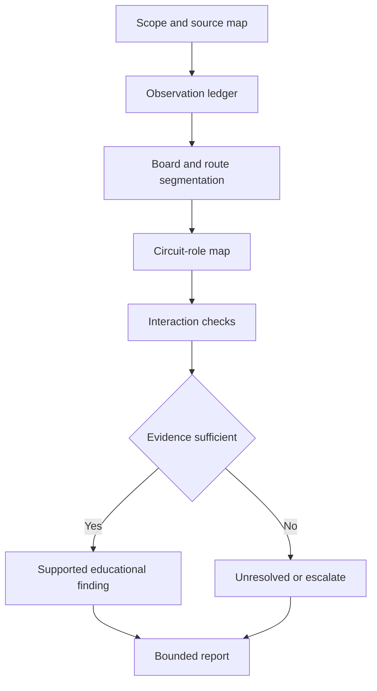

# Day 28 — Week 4 Switchboard and Wiring-System Inspection Exercise

> **Currency, copyright and safety notice:** This is a paper-based fictional inspection exercise. Exact construction, access, identification, wiring-system and circuit-role requirements remain `reference_check_required`. It does not authorise access to equipment or practical inspection.

## 1. Outcome and entry check

Given a fictional installation pack, the learner can map supplies and circuit roles, segment wiring routes, classify observations by evidence strength, identify unresolved hazards, and produce a bounded inspection summary with no unsupported compliance claim.

**Entry check:** retrieve S-O-U-R-C-E-S, B-O-A-R-D-S, R-O-U-T-E-S and B-O-U-N-D-S; state what each workflow controls.

## 2. Why it matters

Integrated assessment rarely presents one isolated concept. Strong performance preserves the evidence chain while moving between supply, switchboard, route, identification and circuit-role questions.

*Caption: Integrate source, board, route and circuit-role evidence before concluding.*

## 3. Core concepts and terminology

- **Inspection scope:** the stated boundary of what may be assessed from supplied evidence.
- **Observation:** a directly visible or documented fact.
- **Inference:** a reasoned interpretation requiring stated support.
- **Finding:** a bounded statement linking observation, criterion status and required action.
- **Evidence gap:** information needed before classification or conclusion.
- **Interaction:** where one feature changes the significance of another, such as an alternate supply affecting isolation or identification.
- **Critical error:** an unsafe or unsupported claim that overrides a numerical score.

## 4. Rule-finding workflow

Use **I-N-S-P-E-C-T**: **I**dentify scope and sources; **N**ote observations only; **S**egment boards, routes and circuits; **P**air each issue with evidence; **E**xamine interactions; **C**lassify as supported, unresolved or escalation-required; **T**ell the bounded conclusion.

## 5. Visual model or worked example

Fictional pack: a main switchboard with an alternate-source label, a workshop board, an external route transition and one unclear downstream enclosure. The learner records the label and route transition as observations, treats the enclosure function as unresolved, maps the workshop feeder only as a submain candidate, and flags isolation/identification interaction for authorised review. No compliance conclusion is made from photographs alone.

Worked-example fading: first complete a supplied evidence table; then analyse a changed pack where the alternate-source label is missing and the enclosure documentation is added.

## 6. Practical application

Produce: one source diagram; one functional-area map; one segmented route ledger; one circuit-role table; and a five-sentence inspection summary. Use claim grades: **described** (observation recorded), **supported** (reasoning and source identified), **verified** (reserved for authorised technical review).

Rubric, 20 points: scope 2; observations 2; source map 2; board map 2; route segmentation 2; circuit roles 2; interactions 2; evidence control 2; bounded report 2; retrieval accuracy 2. Critical errors include invented observations, practical instructions or unsupported “compliant/safe” conclusions.

## 7. Common errors and safety checkpoint

Errors: treating a photograph as full evidence; blending observation and inference; overlooking alternate sources; failing to reopen downstream reasoning; listing defects without significance; or converting a study exercise into a field inspection.

Stop where access, opening, isolation, testing, measurements, equipment identification or qualified judgement would be required. Use “unresolved—authorised evidence required.”

## 8. Retrieval and next links

Reproduce I-N-S-P-E-C-T; identify two interactions; explain the three claim grades; write one bounded finding from a fictional observation; list all practical stop conditions.

- **Program:** [Six-Week Capstone Learning Plan](../MASTER_PLAN.md)
- **Previous:** [Day 27 — Consumer Mains, Submains and Final-Subcircuit Roles](day-27-consumer-mains-submains-and-final-subcircuit-roles.md)
- **Knowledge note:** [[Six-Week Day 28 - Week 4 Switchboard and Wiring-System Inspection Exercise]]
- **Next:** [Day 29 — Wet-Area Risk Model and Rule-Finding Workflow](day-29-wet-area-risk-model-and-rule-finding-workflow.md)
