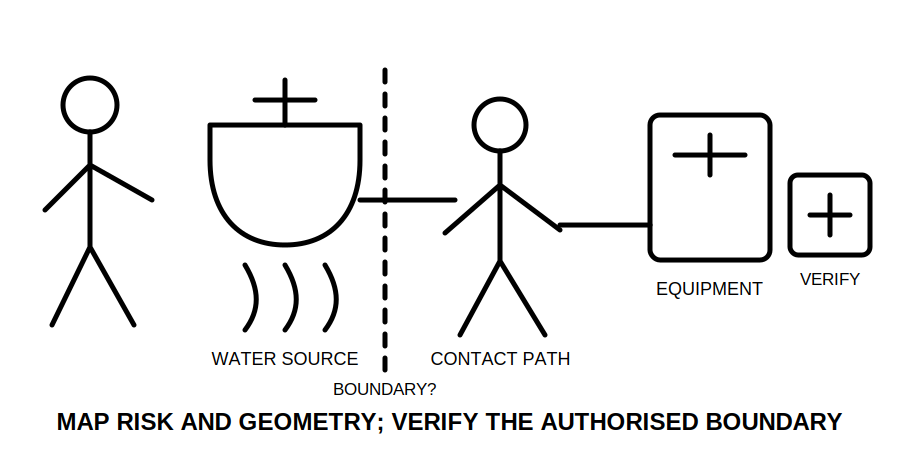
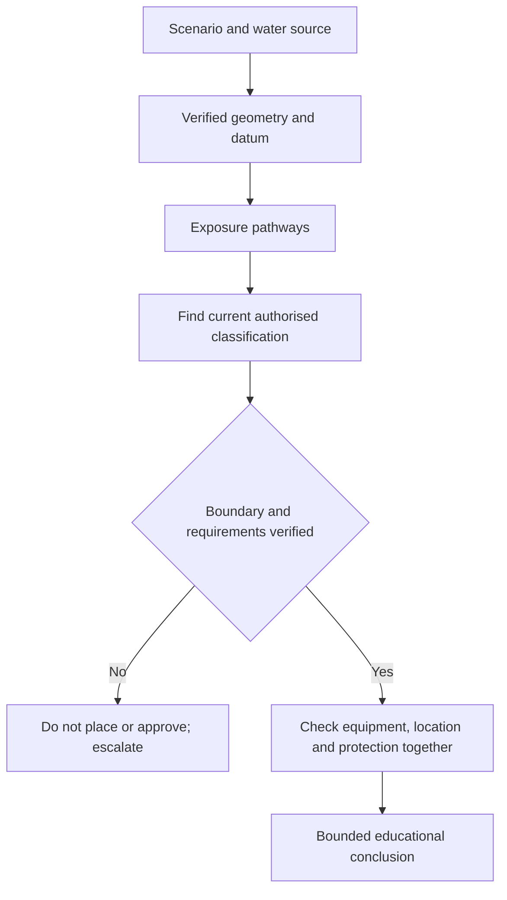

# Day 29 — Wet-Area Risk Model and Rule-Finding Workflow

> **Currency, copyright and safety notice:** This original risk-and-research module does not reproduce zone diagrams, dimensions, tables or clause wording. Exact classifications, boundaries, equipment requirements and protection measures must be checked against current authorised sources and remain `reference_check_required`.

## 1. Outcome and entry check

Given a fictional wet-area scenario, the learner can identify water sources and likely contact pathways, separate observed geometry from an authorised area classification, build a rule-finding query, record unresolved dimensions, and make a bounded equipment-location decision without inventing limits.

**Entry check:** define hazard, exposure pathway, boundary evidence and suitability. Explain why “waterproof” is not a complete technical classification.

## 2. Why it matters

Wet locations combine reduced body resistance, conductive surfaces, splashing, condensation, equipment contact and uncertain boundaries. Memorised sketches are fragile; reliable reasoning begins with geometry and risk, then verifies the current rule set.

*Caption: Map the water and contact pathway, then verify the boundary and equipment requirements.*

## 3. Core concepts and terminology

- **Wet area:** a location where water presence creates additional electrical risk; exact scope requires authorised definition.
- **Water source:** a fixture or condition from which water, spray, overflow or persistent moisture may arise.
- **Exposure pathway:** how a person or equipment could bridge electrical and wet/conductive conditions.
- **Area classification or zone:** an authorised spatial category linked to location-specific requirements; no dimensions are supplied here.
- **Boundary datum:** the verified physical reference from which an authorised boundary is measured.
- **Ingress protection:** a coded enclosure classification for entry of solids and water; it does not alone prove overall suitability.
- **Additional protection:** a protective measure required in addition to baseline controls; exact application requires verification.
- **Suitability:** evidence that equipment, location, mounting and protection collectively meet the applicable conditions.

## 4. Rule-finding workflow

Use **W-A-T-E-R-S**: **W**rite the scenario and jurisdiction; **A**nchor verified geometry and water sources; **T**race exposure/contact pathways; **E**stablish the authorised classification and boundary; **R**etrieve equipment/protection requirements; **S**tate supported, unresolved and escalation items.

The diagram intentionally omits dimensions and technical limits; those belong to current authorised material.

## 5. Visual model or worked example

Fictional scenario: a wash area contains a basin, a fixed hand dryer and an adjacent socket shown on an incomplete plan. Record fixture positions and plan scale as facts only if supplied. Identify hand-to-equipment and splash pathways. Because the relevant datum and dimensions are missing, do not assign a zone or approve the socket position. Write a precise evidence request: current plan dimensions, fixture geometry, equipment data, protective arrangement and applicable jurisdiction/source.

Changed condition: after verified geometry is supplied, classify the area only by consulting the authorised source; then reopen equipment location, ingress protection, additional protection and isolation reasoning.

## 6. Practical application

For three original scenarios—a bathroom-like space, a commercial wash point and an outdoor washdown area—complete a six-column sheet: water source; observed geometry; exposure pathway; authorised source/query; missing evidence; bounded decision. Avoid copying or reconstructing standards diagrams.

Rubric, 12 points: risk model 2; geometry/datum control 2; terminology 2; research query 2; equipment/protection interaction 2; bounded conclusion 2. Invented zone dimensions, IP ratings, protection requirements or approval claims are critical errors.

## 7. Common errors and safety checkpoint

Errors: guessing a zone from memory; treating distance from “the water” as one universal measure; assuming a high IP code solves every issue; ignoring reach/contact pathways; relying on an unscaled image; or applying one location’s rule to another.

This module authorises no entry, measurement, access, isolation, testing, installation, equipment selection, relocation or approval. Stop when geometry, classification, source currency, equipment data or protective arrangement is unresolved.

## 8. Retrieval and next links

State W-A-T-E-R-S; distinguish water source, datum, boundary and exposure pathway; explain why IP alone is insufficient; draft one authorised-source query; name four stop conditions.

- **Program:** [Six-Week Capstone Learning Plan](../MASTER_PLAN.md)
- **Previous:** [Day 28 — Week 4 Switchboard and Wiring-System Inspection Exercise](day-28-week-4-switchboard-and-wiring-system-inspection-exercise.md)
- **Knowledge note:** [[Six-Week Day 29 - Wet-Area Risk Model and Rule-Finding Workflow]]
- **Next:** [Day 30 — Other Special Locations and Additional-Condition Screening](day-30-other-special-locations-and-additional-condition-screening.md)
