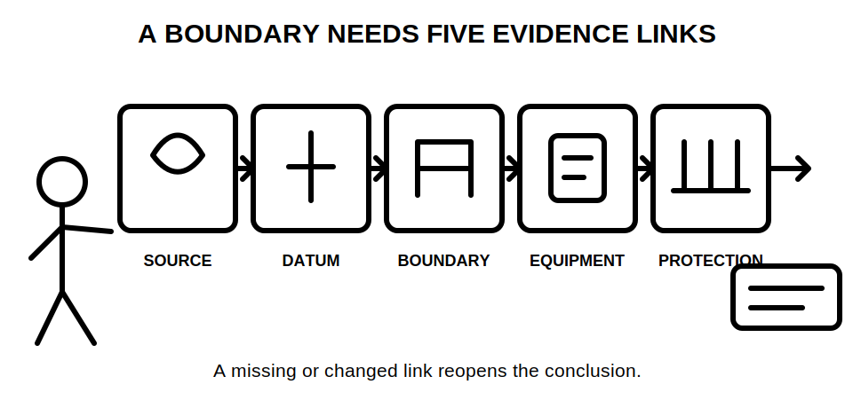
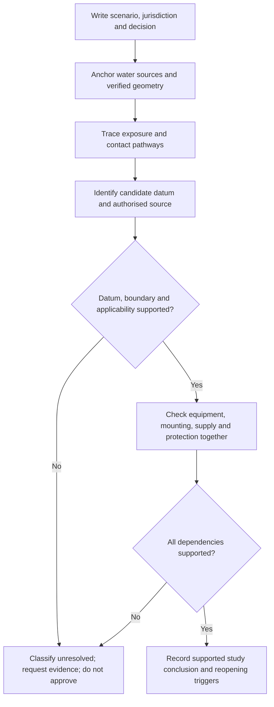
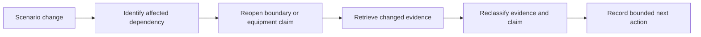

# Day 29 — Wet-Area Risk Model and Rule-Finding Workflow

> **Currency, copyright and safety notice:** This original risk-and-research module does not reproduce authorised zone diagrams, dimensions, tables or clause wording. Exact classifications, boundary datums, dimensions, equipment requirements, protection measures and jurisdictional duties must be checked against current authorised sources and remain `reference_check_required`.

## 1. Outcome and entry check

Given a fictional wet-area evidence pack, the learner can:

1. identify every supplied water or moisture source and at least two plausible exposure pathways;
2. separate observed geometry from inferred geometry and authorised spatial classification;
3. construct a traceable rule-finding query containing jurisdiction, location type, datum, equipment and required decision;
4. classify each evidence item using the five-grade model below;
5. state a bounded equipment-location conclusion and reopen it when a source, datum, dimension, operating condition or equipment detail changes.

**Entry check:** define **hazard**, **exposure pathway**, **boundary datum**, **spatial classification**, **ingress protection** and **suitability**. Then explain why the words “waterproof”, “outside the splash area” and “it looks far enough away” are not complete technical evidence.

## 2. Why it matters

Water and persistent moisture can increase electrical risk by changing contact conditions, reducing effective body resistance, creating conductive paths and exposing equipment to ingress or deterioration. The reasoning problem is not solved by memorising one bathroom sketch. A defensible study conclusion must connect the actual location, verified geometry, authorised classification, equipment evidence and protective measures.

A weak answer starts with a remembered zone. A stronger answer starts with the scenario and asks what facts are required before any boundary or equipment claim can be supported.

*Caption: A wet-area conclusion remains unresolved until the source, datum, boundary, equipment and protection links are supported.*

## 3. Core concepts and terminology

- **Wet area:** a location in which water or persistent moisture creates additional electrical considerations. The exact authorised scope depends on the applicable source and location type.
- **Water source:** a fixture, outlet, process or condition from which water, spray, overflow, condensation or washdown may arise.
- **Exposure pathway:** a credible route by which a person, conductive object or item of equipment could bridge electrical and wet or conductive conditions.
- **Observed geometry:** dimensions, locations or physical relationships directly supported by a scaled drawing, verified schedule or other supplied evidence.
- **Inferred geometry:** a spatial relationship estimated from appearance, memory or an unscaled image. It must not be treated as a verified dimension.
- **Boundary datum:** the authorised physical reference from which a spatial boundary is measured. A datum might be associated with a fixture, opening, surface or other defined feature; the correct datum must be verified rather than guessed.
- **Spatial classification or zone:** an authorised area category linked to location-specific requirements. This module deliberately supplies no zone dimensions.
- **Ingress protection:** a coded enclosure classification describing resistance to entry of solids and water under defined conditions. It is one evidence item, not proof of complete installation suitability.
- **Additional protection:** a protective measure required in addition to baseline controls for a stated application. Its exact form and application require authorised-source verification.
- **Suitability:** supported compatibility between equipment characteristics, location, mounting, supply arrangement, environmental exposure and protective measures.
- **Reopening trigger:** new or conflicting evidence that invalidates an earlier dependency and requires the conclusion to be reassessed.

### Evidence grades

1. **Recalled:** remembered without a located source.
2. **Located:** a potentially relevant source or item has been found, but applicability is not established.
3. **Supported:** the item is current enough for the task, applicable to the stated scenario and connected to its dependencies.
4. **Transferred:** the reasoning remains valid after a meaningful scenario change.
5. **Unresolved:** evidence is missing, conflicting, unclear or outside the learner's authority.

### Claim grades

- **Memory claim:** unsupported recollection.
- **Provisional interpretation:** plausible but dependent on unresolved evidence.
- **Supported study conclusion:** traceable to supplied evidence and current authorised material, within the educational scope.
- **Authorised technical determination:** a conclusion made by an appropriately qualified person using applicable current requirements and verified conditions. Automated content cannot assign this grade.

## 4. Rule-finding workflow

Use **W-A-T-E-R-S**:

- **W — Write** the scenario, jurisdiction, location type, task and proposed claim.
- **A — Anchor** every water source, verified dimension and candidate boundary datum.
- **T — Trace** person, equipment, splash, condensation, overflow and conductive-contact pathways.
- **E — Establish** the applicable authorised classification and the evidence needed to place its boundaries.
- **R — Retrieve** equipment, protection, mounting, supply and interaction requirements without copying systematic source content.
- **S — State** the evidence grade, claim grade, unresolved items, reopening triggers and bounded next action.

The flowchart prevents a remembered diagram or isolated distance from becoming the starting assumption. The decision remains unresolved whenever the datum, boundary, source applicability or interacting equipment requirements are unsupported.

### Wet-area evidence ledger

Record one row for each proposed equipment or location claim:

| Field | Required record |
|---|---|
| Proposed claim | What location, equipment or protection conclusion is being considered? |
| Water and moisture sources | What supplied facts establish them? |
| Exposure pathways | How could a person, conductive object or equipment encounter the conditions? |
| Geometry and datum | Which dimensions are observed, inferred or missing, and what datum requires verification? |
| Authorised query | Which current source, jurisdiction and location classification must be checked? |
| Equipment and protection | What product, mounting, supply and protective evidence is needed? |
| Evidence grade | Recalled, located, supported, transferred or unresolved |
| Dependencies | Which facts must remain true for the conclusion to stand? |
| Reopening triggers | Which changes require reassessment? |
| Claim grade and next action | Bounded conclusion, escalation or evidence request |

### Reopening triggers

Reopen the ledger entry when any of the following changes or conflicts with later evidence:

- fixture type, outlet position, water trajectory, spray or washdown process;
- the physical datum or the interpretation of where measurement begins;
- plan scale, dimension, wall, screen, opening, barrier or mounting position;
- equipment type, enclosure information, mounting method or manufacturer limitation;
- supply arrangement, protective measure, isolation arrangement or circuit purpose;
- room use, occupancy, accessibility, cleaning method or environmental exposure;
- jurisdiction, source edition, amendment status or referenced technical requirement.

## 5. Visual model or worked example

### Fully guided example

A fictional wash area evidence pack contains an unscaled photograph, a plan showing a basin symbol, a hand-dryer schedule and a note proposing a socket nearby.

1. **Write:** the decision is whether the proposed socket location can be supported for study purposes.
2. **Anchor:** the basin and equipment are shown, but the plan scale, fixture geometry, socket coordinates and relevant datum are absent. These are unresolved, not observed dimensions.
3. **Trace:** plausible pathways include splash to equipment, wet-hand contact and conductive contact through nearby surfaces or objects.
4. **Establish:** a current authorised source is required to determine the location classification, datum and boundary. No zone is assigned from the image.
5. **Retrieve:** request the current scaled plan, fixture geometry, equipment data, supply and protective arrangement, jurisdiction and applicable authorised source.
6. **State:** the socket-location claim is **unresolved**. The bounded action is to obtain the missing evidence; no approval or practical action is authorised.

### Partially guided example

A revised pack adds a scaled plan and one verified dimension but does not identify whether a screen changes the applicable geometry or whether the proposed equipment's mounting instructions permit the environment.

Complete the ledger without guessing:

- identify which geometry is now supported;
- identify the candidate datum requiring authorised confirmation;
- record the screen and product limitation as dependencies;
- classify the conclusion as provisional or unresolved;
- write two precise evidence requests.

### Independent changed-condition transfer

Repeat the reasoning after one change at a time:

1. the outlet location moves but the datum remains uncertain;
2. a fixed screen is added to the drawing;
3. the equipment changes to a different product with different enclosure evidence;
4. the room changes from ordinary cleaning to regular washdown;
5. an alternate supply or changed protective arrangement appears in the pack.

For each change, identify the ledger fields that must reopen. A transferred response does not merely repeat the original conclusion; it propagates the changed dependency through classification, equipment, protection and next action.

The second diagram models change propagation. A conclusion is not transferred until the changed fact has been traced through every dependent claim.

## 6. Practical application

Complete three original paper scenarios: a bathroom-like room, a commercial hand-wash point and an outdoor washdown location. For each scenario:

1. produce a simple source-and-pathway sketch using only supplied facts;
2. complete the wet-area evidence ledger for two proposed equipment claims;
3. draft an authorised-source query that includes jurisdiction, location type, datum question, equipment and decision;
4. identify at least four unresolved or reopening items;
5. complete one changed-condition transfer without adding invented dimensions or technical limits;
6. write a final bounded study conclusion in no more than 80 words.

### Educational rubric — 12 points

- Water and moisture source model: 2
- Geometry and datum control: 2
- Exposure-pathway reasoning: 2
- Authorised rule-finding query: 2
- Equipment and protection dependency control: 2
- Claim grading, reopening and bounded conclusion: 2

This is an original learning rubric, not an official RTO pass mark.

**Critical-error gates:** the response is not ready to progress when it invents a zone dimension, datum, equipment rating, protective requirement, compliance result or permission to perform practical work; treats an unscaled image as measurement evidence; or fails to stop on a missing safety-critical dependency.

## 7. Common errors and safety checkpoint

Common errors include:

- assigning a zone from memory before identifying the exact location type and datum;
- measuring from “the water” without verifying the authorised physical reference;
- treating all wet locations as though they use one universal geometry;
- assuming a high ingress-protection code proves location, mounting, supply and protective suitability;
- confusing a product marketing term with a verified technical classification;
- using an unscaled photograph or perspective view as dimensional evidence;
- ignoring screens, openings, barriers, washdown, condensation, alternate supplies or changed room use;
- carrying forward an earlier answer after a dependency changes;
- presenting a study conclusion as technical approval.

**Safety checkpoint:** this module authorises no site entry, measurement, enclosure access, switching, isolation, proving, testing, equipment selection, installation, relocation, energisation, commissioning, certification or approval. Stop when geometry, datum, classification, source currency, product evidence, supply arrangement, protective measure or authority is unresolved. Escalate safety-critical or conflicting evidence to an appropriately qualified person.

## 8. Retrieval and next links

Without notes:

1. state W-A-T-E-R-S in order;
2. distinguish water source, exposure pathway, observed geometry, inferred geometry, datum and boundary;
3. name the five evidence grades and four claim grades;
4. explain why ingress protection alone is insufficient;
5. list five reopening triggers;
6. write one precise authorised-source query and one bounded stop statement.

**Delayed retrieval:** at the start of Day 30, redraw the workflow and reconstruct one wet-area ledger row from memory. Compare it with this module, correct only evidenced errors and record whether the response was recalled, supported or transferred.

- **Program:** [Six-Week Capstone Learning Plan](../MASTER_PLAN.md)
- **Previous:** [Day 28 — Week 4 Switchboard and Wiring-System Inspection Exercise](day-28-week-4-switchboard-and-wiring-system-inspection-exercise.md)
- **Knowledge note:** [[Six-Week Day 29 - Wet-Area Risk Model and Rule-Finding Workflow]]
- **Next:** [Day 30 — Other Special Locations and Additional-Condition Screening](day-30-other-special-locations-and-additional-condition-screening.md)
