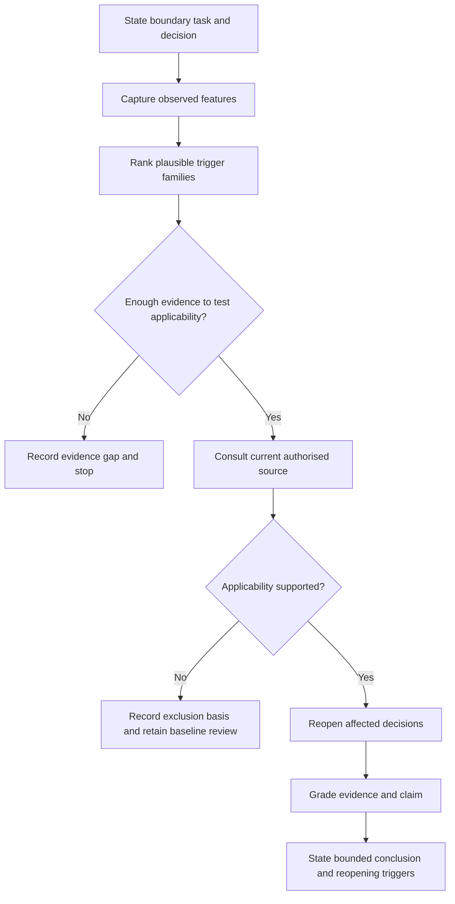
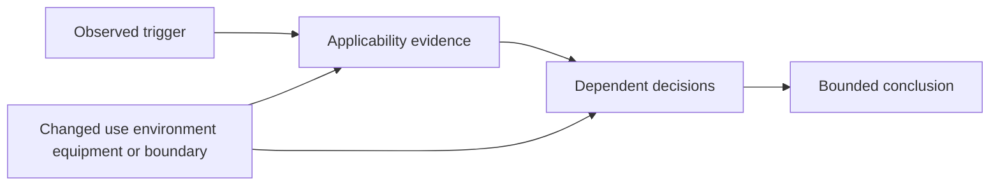
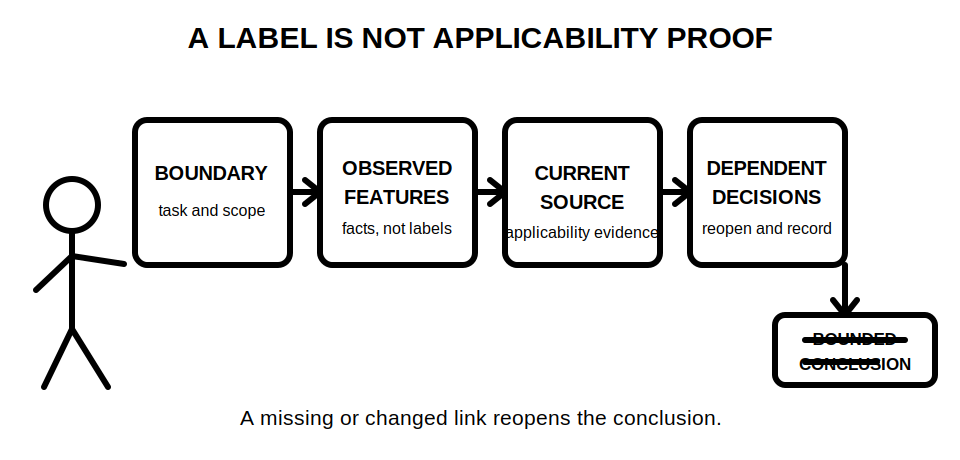

# Day 30 — Other Special Locations and Additional-Condition Screening

> **Currency, copyright and safety notice:** This original module teaches screening and evidence control. It does not reproduce standards location lists, tables, diagrams, dimensions, ratings, clause wording or official assessment content. Exact classifications, applicability tests and additional requirements remain `reference_check_required` and require current authorised sources and qualified review.

## 1. Outcome and entry check

Given a fictional site pack, the learner can:

1. identify at least six observed location, activity, occupancy or environmental features;
2. separate those observations from candidate specialist classifications;
3. construct an applicability ledger containing source queries, missing evidence, dependencies and reopening triggers;
4. grade each conclusion by evidence and claim strength; and
5. stop before making an unsupported compliance, equipment-selection or approval claim.

**Entry check:** define **baseline requirement**, **additional condition**, **trigger feature**, **candidate classification**, **applicability evidence**, **dependency** and **bounded conclusion**. Explain why a room name, photograph, product label or remembered example cannot alone establish the applicable specialist rule set.

## 2. Why it matters

A technically competent baseline design can still fail when a location, activity or user group creates additional conditions. The error often begins before calculation: a learner either misses a trigger or assigns a familiar label too early. Both mistakes distort later decisions about equipment suitability, protection, wiring systems, access, switching, isolation, inspection and verification.

The correct sequence is therefore **observe → screen → verify applicability → reopen affected decisions → state a bounded result**.

*Caption: Observed features justify a source check; they do not prove a classification.*

## 3. Core concepts and terminology

- **Baseline requirement:** a generally applicable requirement considered before verified location-specific additions.
- **Additional condition:** a verified requirement introduced by a location, use, environment, equipment type, occupancy or exposure pattern.
- **Trigger feature:** an observed characteristic that justifies checking whether a specialist rule set applies.
- **Candidate classification:** a provisional label used to guide research, not a final technical determination.
- **Applicability evidence:** current authorised information showing that a rule set does or does not govern the stated boundary and conditions.
- **Environmental influence:** an external condition—such as moisture, heat, dust, impact, corrosion, contamination or restricted ventilation—that may affect suitability.
- **Occupancy or use influence:** the way supervision, vulnerability, public access, work activity or foreseeable behaviour changes exposure.
- **Dependency:** an input on which a conclusion relies, such as room use, cleaning method, equipment duty, access control, source arrangement or boundary geometry.
- **Reopening trigger:** a change or conflict requiring the conclusion to be checked again.
- **Bounded conclusion:** a statement limited to what the available evidence supports, with uncertainties and prohibited actions explicit.

### Evidence grades

1. **Recalled:** remembered but not located in a current source.
2. **Located:** relevant source section found, applicability not yet demonstrated.
3. **Supported:** source and scenario evidence support the stated educational conclusion.
4. **Transferred:** the reasoning remains valid after an independently changed condition.
5. **Unresolved:** evidence is missing, conflicting, stale or outside the learner's authority.

### Claim grades

1. **Memory claim:** unsupported recollection.
2. **Provisional interpretation:** plausible but dependent on unresolved evidence.
3. **Supported study conclusion:** traceable and appropriately bounded educational conclusion.
4. **Authorised technical determination:** decision made by an authorised competent person using current applicable sources and verified site evidence.

A learner may produce grades 1–3. This module does not confer grade 4.

## 4. Rule-finding workflow

Use **S-C-R-E-E-N**:

- **S — State** the installation, task and decision boundary.
- **C — Capture** observed environmental, activity, occupancy, access and equipment features without adding labels.
- **R — Rank** plausible trigger families and consequences, not presumed classifications.
- **E — Establish** precise current-authorised-source queries and applicability evidence needed.
- **E — Extract** only verified applicability inputs and reopen every dependent design or inspection decision.
- **N — Note** evidence grade, claim grade, gaps, reopening triggers, stop conditions and bounded next action.

The workflow does not treat “no specialist classification proven” as “no risk exists.” Baseline risk, product instructions, workplace controls and other applicable duties still require review.

### Applicability ledger

For every candidate trigger, record:

| Field | Required entry |
|---|---|
| Decision boundary | What is being classified or decided, and what is outside scope |
| Observed features | Facts only, with source or scenario location |
| Candidate trigger family | Why a specialist applicability check is justified |
| Authorised-source query | Exact question to resolve, without invented clause numbers |
| Missing evidence | Information still needed |
| Affected decisions | Equipment, protection, wiring, access, switching, isolation, inspection or verification items reopened |
| Evidence grade | Recalled, located, supported, transferred or unresolved |
| Claim grade | Memory, provisional, supported study or authorised determination |
| Reopening triggers | Changes that invalidate or reopen the row |
| Bounded next action | Research, escalate, retain baseline review or stop |

The diagram shows why a change does not merely alter one label: it can invalidate applicability evidence and every dependent decision.

## 5. Visual model or worked example

**Fictional scenario:** A detached equipment room is dusty, periodically washed down, accessible to contractors and used for equipment that can restart automatically. The site pack contains an unscaled photograph, a cleaning note with no method, a generic enclosure brochure and an old circuit schedule.

**Guided pass**

1. **Observed:** dust residue, stated periodic cleaning, contractor access, automatic restart note and conflicting document currency.
2. **Not yet established:** cleaning trajectory, exposure intensity, equipment identity, enclosure suitability, source arrangement, access controls and whether a specialist location rule set applies.
3. **Queries:** Which current authorised provisions govern the verified use and environment? What evidence establishes equipment suitability? Which switching, isolation, identification and inspection decisions reopen?
4. **Bounded conclusion:** additional-condition screening is required; no classification, rating, equipment suitability or approval is established.

**Partially guided transfer:** The cleaning method changes from dry vacuuming to directed washdown. Update the ledger without copying the guided answer. Reopen environmental exposure, equipment suitability, wiring-system protection, access and inspection reasoning.

**Independent transfer:** The washdown ceases, but the room becomes publicly accessible and contains a corrosive process. Identify which earlier rows can remain, which must reopen and what new source queries are required.

*Caption: Boundary, observed features, current source and dependent decisions must link before a supported study conclusion is possible.*

## 6. Practical application

Complete one ledger for each original scenario:

1. a farm outbuilding with animals, dust, washdown and unsupervised access;
2. a temporary work area with changing boundaries and portable equipment;
3. a public pool plant room separated from the public area but exposed to chemicals and maintenance activity; and
4. a commercial kitchen service space with heat, grease, cleaning and restricted access.

For each scenario:

- record at least six observations;
- identify two plausible trigger families without declaring a classification;
- write two precise authorised-source queries;
- identify five dependent decisions;
- list four reopening triggers;
- grade the evidence and claim; and
- produce one bounded conclusion and escalation action.

### Original educational rubric — 12 points

- observations and boundary: 2;
- trigger reasoning: 2;
- terminology and observation/inference control: 2;
- authorised-source queries and evidence gaps: 2;
- dependencies, reopening and transfer: 2;
- bounded conclusion and safety limits: 2.

**Critical-error gates:** invented classifications, dimensions, limits, ratings, clause numbers, approvals or practical authority; treating a room name or product label as proof; or failing to stop when applicability or safety evidence is unresolved. A critical error requires correction regardless of numerical score. This rubric is not an official RTO pass mark.

## 7. Common errors and safety checkpoint

Common errors include:

- classifying from a room name, industry label or memorable example;
- converting an observed feature directly into a compliance conclusion;
- assuming one trigger controls every decision;
- ignoring occupancy, activity, temporary states or cleaning methods;
- treating marketing language, a single rating or an unscaled photograph as complete evidence;
- failing to reopen baseline choices after applicability is verified; and
- carrying a conclusion forward after the use, environment, equipment, boundary, jurisdiction or source currency changes.

**Safety checkpoint:** This module authorises no site entry, enclosure opening, switching, isolation, proving, measurement, testing, equipment selection, installation, alteration, energisation, commissioning, certification, verification or approval. Stop and escalate when the boundary, use, environment, exposure, equipment identity, source arrangement, authorised-source applicability, access authority or safe-work preconditions are missing or conflicting.

## 8. Retrieval and next links

Without notes, state S-C-R-E-E-N, the five evidence grades and four claim grades. Then explain:

1. why a trigger feature is not a classification;
2. why “specialist rules not proven” does not remove baseline risk review;
3. five dependent decisions that can reopen; and
4. six reopening triggers.

**Delayed retrieval:** At the start of Day 31, classify four statements as observation, candidate trigger, supported study conclusion or unsupported claim, then update one Day 30 ledger row after a changed equipment duty.

- **Program:** [Six-Week Capstone Learning Plan](../MASTER_PLAN.md)
- **Previous:** [Day 29 — Wet-Area Risk Model and Rule-Finding Workflow](day-29-wet-area-risk-model-and-rule-finding-workflow.md)
- **Knowledge note:** [[Six-Week Day 30 - Other Special Locations and Additional-Condition Screening]]
- **Next:** [Day 31 — Fixed Appliances, Local Isolation and Connection Decisions](day-31-fixed-appliances-local-isolation-and-connection-decisions.md)
