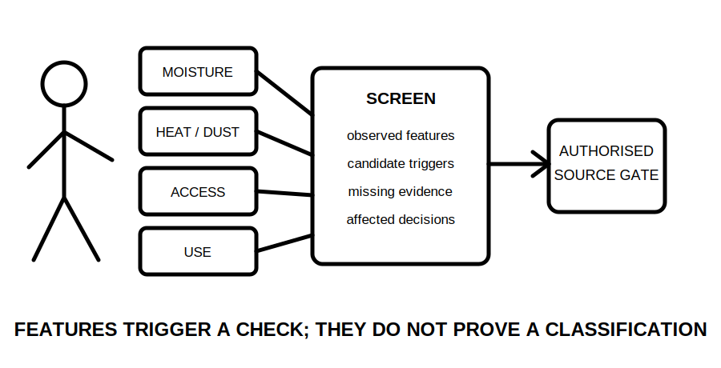
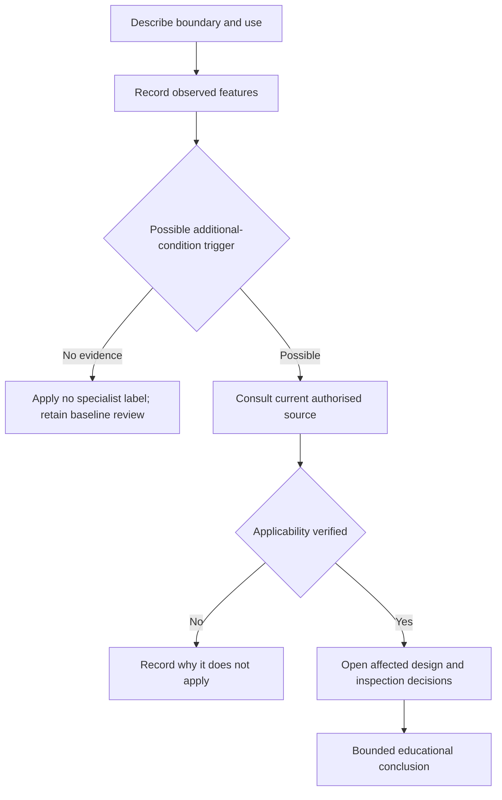

# Day 30 — Other Special Locations and Additional-Condition Screening

> **Currency, copyright and safety notice:** This original screening module teaches how to recognise when baseline installation reasoning may be insufficient. It does not reproduce location lists, tables, dimensions, ratings or clause wording. Exact classifications and additional conditions remain `reference_check_required`.

## 1. Outcome and entry check

Given a fictional site description, the learner can identify location features that may trigger additional requirements, separate observed facts from candidate classifications, form an authorised-source query, record missing evidence and stop before making an unsupported compliance decision.

**Entry check:** define baseline requirement, additional condition, environmental influence and classification evidence. Explain why an unusual location name alone does not establish the applicable rule set.

## 2. Why it matters

Locations involving water, heat, corrosive agents, restricted movement, public access, medical use, agriculture, construction activity or other heightened exposure can change equipment, protection, wiring, access and verification decisions. Missing the trigger can invalidate otherwise competent baseline reasoning.

*Caption: Screen the actual conditions, then verify whether an additional rule set applies.*

## 3. Core concepts and terminology

- **Baseline requirement:** the generally applicable installation requirement before location-specific conditions are considered.
- **Additional condition:** a verified requirement introduced by a location, use, environment, equipment type or exposure pattern.
- **Trigger feature:** an observed characteristic that justifies checking a specialist rule set.
- **Candidate classification:** a provisional label requiring confirmation from an authorised current source.
- **Environmental influence:** an external condition such as moisture, heat, impact, corrosion, dust or access that can affect suitability.
- **Occupancy or use influence:** how people, supervision, vulnerability or activity alter foreseeable exposure.
- **Evidence gap:** information needed before classification or equipment decisions can be supported.

## 4. Rule-finding workflow

Use **S-C-R-E-E-N**: **S**tate the installation boundary; **C**apture observed location and use features; **R**ank plausible additional-risk triggers; **E**stablish candidate source sections; **E**xtract only verified applicability and decision inputs; **N**ote supported, unresolved and escalation items.

The model prevents a memorable label from replacing applicability evidence.

## 5. Visual model or worked example

Fictional scenario: a detached equipment room is dusty, periodically washed down and accessible to contractors. Record dust, washdown, access and equipment duty as observations. Treat any specialist classification as provisional. Build source queries for environmental influences, equipment suitability, wiring protection, isolation and inspection. Do not invent ratings or declare compliance while cleaning method, enclosure data and access controls remain unknown.

Changed condition: if the room becomes continuously occupied by the public, reopen occupancy, access, mechanical protection, switching and emergency-response reasoning.

## 6. Practical application

Screen four original scenarios: a farm outbuilding, a temporary work area, a public pool plant room and a commercial kitchen service space. Complete: observed feature; hazard/exposure implication; candidate additional-condition source; missing evidence; affected decisions; bounded statement.

Rubric, 12 points: observations 2; trigger reasoning 2; terminology 2; source query 2; dependency reopening 2; bounded conclusion 2. Invented classifications, limits, equipment ratings or approvals are critical errors.

## 7. Common errors and safety checkpoint

Errors: classifying from a room name; assuming one unusual feature controls every decision; overlooking use and occupancy; treating equipment marketing language as compliance evidence; or failing to reopen baseline design choices after a trigger is verified.

This module authorises no site entry, opening, isolation, switching, measurement, testing, selection, installation or approval. Stop when applicability, environment, use, equipment data or source currency is unresolved.

## 8. Retrieval and next links

State S-C-R-E-E-N; distinguish trigger feature from verified classification; name five decisions that may reopen; draft one precise source query; state four stop conditions.

- **Program:** [Six-Week Capstone Learning Plan](../MASTER_PLAN.md)
- **Previous:** [Day 29 — Wet-Area Risk Model and Rule-Finding Workflow](day-29-wet-area-risk-model-and-rule-finding-workflow.md)
- **Knowledge note:** [[Six-Week Day 30 - Other Special Locations and Additional-Condition Screening]]
- **Next:** [Day 31 — Fixed Appliances, Local Isolation and Connection Decisions](day-31-fixed-appliances-local-isolation-and-connection-decisions.md)
