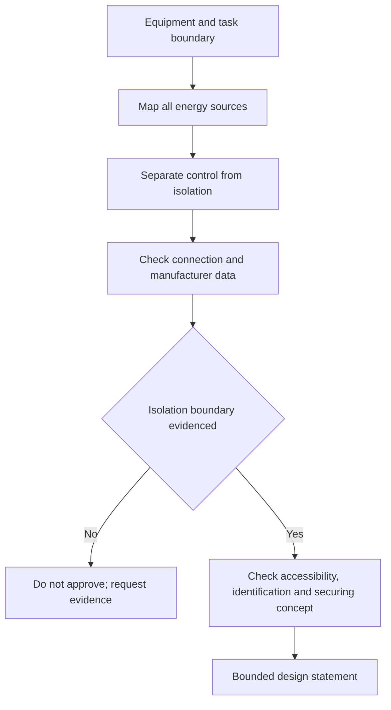

# Day 31 — Fixed Appliances, Local Isolation and Connection Decisions

> **Currency, copyright and safety notice:** This original decision module does not supply mandatory device arrangements, distances, ratings, connection methods or clause wording. Exact appliance, isolation, switching and connection requirements must be verified against current authorised sources.

## 1. Outcome and entry check

Given a fictional fixed-appliance brief, the learner can separate functional control from isolation, identify every energy source and connection boundary, compare candidate connection arrangements, list evidence needed for local isolation and write a bounded decision without authorising work.

**Entry check:** distinguish fixed appliance, functional switch, isolating device, connection point and alternate energy source.

## 2. Why it matters

A device that starts and stops equipment may not provide a safe isolation boundary. Appliances can also retain, generate or receive energy through control, battery, thermal, mechanical or alternate electrical paths. Sound reasoning maps the equipment and all sources before choosing a connection or isolation concept.

*Caption: Map all sources and the work boundary before evaluating isolation or connection options.*

## 3. Core concepts and terminology

- **Fixed appliance:** equipment secured or intended to remain in a defined location; exact classification requires source verification.
- **Functional control:** a means used for normal operation, not automatically a safe isolation means.
- **Isolation:** separation from every relevant source of electrical energy for a defined boundary.
- **Local isolation:** an isolating arrangement associated with equipment or its immediate work area; exact requirements require verification.
- **Connection method:** the arrangement joining appliance conductors to the installation, such as a verified fixed or detachable concept.
- **Energy source:** any supply or stored/generated energy capable of affecting the equipment or work boundary.
- **Locking or securing provision:** a control intended to prevent unintended re-energisation; exact suitability is source-dependent.
- **Line of sight:** visibility relationship sometimes relevant to control or isolation decisions; do not assume it is universally sufficient.

## 4. Rule-finding workflow

Use **I-S-O-L-A-T-E**: **I**dentify equipment and work boundary; **S**urvey every energy source; **O**bserve operating controls and connection data; **L**ocate candidate isolation points; **A**ccess authorised applicability and equipment instructions; **T**est the reasoning against changed states on paper; **E**xpress supported and unresolved decisions.

The diagram is a reasoning sequence, not an isolation procedure.

## 5. Visual model or worked example

Fictional scenario: a wall-mounted heater has a room controller, a distribution-board protective device and an unspecified local connection enclosure. Record the controller as functional control only until evidence proves otherwise. Map the supply and any retained thermal or control energy. Request appliance instructions, connection details, intended servicing boundary and authorised isolation requirements before selecting a concept.

Changed condition: adding a remote-control module reopens source mapping, unintended-start reasoning, identification and isolation-boundary evidence.

## 6. Practical application

Compare three fictional appliances: water heater, commercial cooking appliance and fixed ventilation unit. For each, complete: intended function; servicing boundary; sources; operational controls; candidate connection; candidate isolation; missing evidence; bounded conclusion.

Rubric, 12 points: boundary 2; source map 2; control/isolation distinction 2; connection evidence 2; changed-state reasoning 2; bounded conclusion 2. Treating a controller or protective device as proven isolation without evidence is a critical error.

## 7. Common errors and safety checkpoint

Errors: naming one switch without mapping sources; confusing overcurrent protection with isolation; ignoring stored or remote-control energy; assuming plug connection is always acceptable; relying on proximity alone; or omitting manufacturer constraints.

This module authorises no switching, isolation, proving de-energised, opening, access, testing, connection, servicing or installation. Practical isolation must follow authorised workplace and regulatory procedures under appropriate supervision.

## 8. Retrieval and next links

State I-S-O-L-A-T-E; distinguish functional control, protection and isolation; list six evidence items; explain one changed-state reopening trigger; name four stop conditions.

- **Program:** [Six-Week Capstone Learning Plan](../MASTER_PLAN.md)
- **Previous:** [Day 30 — Other Special Locations and Additional-Condition Screening](day-30-other-special-locations-and-additional-condition-screening.md)
- **Knowledge note:** [[Six-Week Day 31 - Fixed Appliances Local Isolation and Connection Decisions]]
- **Next:** [Day 32 — Motors, Starting Conditions and Associated Protection Concepts](day-32-motors-starting-conditions-and-associated-protection-concepts.md)
