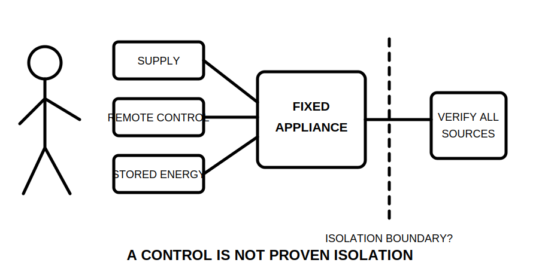
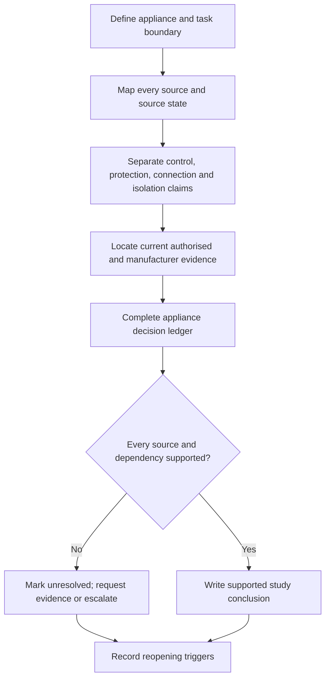
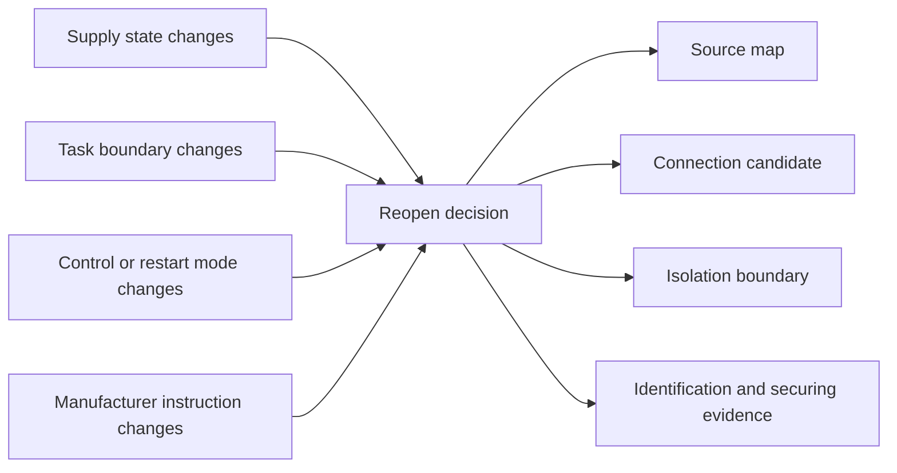
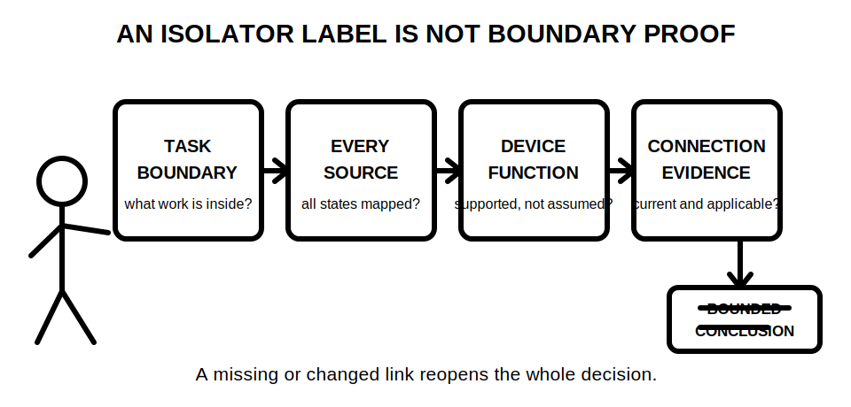

# Day 31 — Fixed Appliances, Local Isolation and Connection Decisions

> **Currency, copyright and safety notice:** This original decision module does not supply mandatory device arrangements, distances, ratings, connection methods or clause wording. Exact appliance, isolation, switching and connection requirements must be verified against current authorised sources and qualified review.

## 1. Outcome and entry check

Given a fictional fixed-appliance evidence pack, the learner can produce a traceable paper decision that:

1. defines the equipment and work boundary;
2. distinguishes functional control, protection, connection and isolation;
3. identifies every supply, stored-energy and automatic-start pathway;
4. grades the evidence supporting each claimed function;
5. compares candidate connection and isolation arrangements without approving one; and
6. reopens affected conclusions when the appliance, source state, task or manufacturer information changes.

**Entry check:** In one sentence each, define **fixed appliance**, **functional control**, **protective device**, **connection point**, **isolation boundary** and **alternate or stored energy**. Then explain why a device that stops normal operation is not automatically proven isolation.

## 2. Why it matters

An appliance can stop while energy remains available through another conductor, control circuit, battery, capacitor, thermal store, mechanical movement, automatic restart command or alternate supply. A nearby switch, labelled device or protective device is therefore an observation, not proof of a complete isolation boundary.

A defensible study conclusion links the task boundary to every source state, the intended connection arrangement, the claimed isolation function and the evidence that supports each link. Missing or changed evidence must reopen the conclusion rather than being hidden by confidence or familiarity.

*Caption: Map all sources and the work boundary before evaluating isolation or connection options.*

## 3. Core concepts and terminology

- **Fixed appliance:** equipment secured or intended to remain in a defined location. The authorised classification may depend on the equipment, installation and jurisdiction.
- **Task boundary:** the part of the equipment or installation affected by the proposed work. A servicing task may require a different boundary from normal operation.
- **Functional control:** a means used to start, stop or regulate normal operation. It does not automatically provide isolation.
- **Protective device:** a device intended to respond to specified abnormal conditions. Protection and isolation are different claimed functions and need separate evidence.
- **Isolation:** separation of a defined boundary from every relevant source of electrical energy. Exact requirements and acceptable means require authorised-source verification.
- **Local isolation:** an isolating arrangement associated with equipment or its immediate work area. “Local” does not by itself prove accessibility, visibility, completeness or suitability.
- **Connection method:** the arrangement joining appliance conductors to the installation. A detachable or fixed concept is only a candidate until equipment instructions and authorised requirements support it.
- **Source state:** a defined operating condition for each source, such as available, disconnected, automatically recoverable, stored, generated or unresolved.
- **Automatic restart:** equipment operation initiated without a person locally commanding it after supply restoration, control change or stored command.
- **Securing provision:** a means intended to resist unintended reconnection or operation. Exact suitability is source-, device- and task-dependent.
- **Evidence grade:** the strength of support for a statement: **recalled**, **located**, **supported**, **transferred** or **unresolved**.
- **Claim grade:** the authority of a conclusion: **memory claim**, **provisional interpretation**, **supported study conclusion** or **authorised technical determination**.
- **Reopening trigger:** new or changed information that makes an earlier conclusion incomplete and requires dependent reasoning to be repeated.

### Appliance decision ledger

For each appliance, record:

| Field | Required record |
|---|---|
| Equipment and task boundary | What equipment and work are inside the decision? |
| Sources and source states | What can supply, store, generate or restore energy? |
| Functional controls | What do they operate, and what do they not prove? |
| Protective devices | What claimed protective role is evidenced? |
| Candidate connection | What arrangement is being considered and on what evidence? |
| Candidate isolation | What boundary and sources would it need to control? |
| Manufacturer evidence | What instructions, ratings or constraints are current and applicable? |
| Evidence and claim grades | How strong is each statement and who may authorise it? |
| Dependencies | Which conclusions rely on each input? |
| Reopening triggers | Which changes invalidate or narrow the conclusion? |
| Bounded action | Proceed with study reasoning, request evidence, escalate or stop |

## 4. Rule-finding workflow

Use **I-S-O-L-A-T-E**:

1. **I — Identify equipment and task boundary.** State the appliance, intended function, proposed task and affected parts.
2. **S — Survey every energy source and state.** Include normal supply, control supply, alternate supply, stored energy, generated energy and automatic restoration.
3. **O — Observe controls, protection, connection data and labels.** Record observations separately from inferred functions.
4. **L — Locate candidate connection and isolation points.** Treat each as a hypothesis, not an approval.
5. **A — Access current authorised applicability and manufacturer evidence.** Record source title, version, jurisdiction and unresolved gaps.
6. **T — Test dependencies against changed states.** Change one source, task, control mode or equipment instruction and reopen every affected conclusion.
7. **E — Express grades, limits and bounded action.** State what is supported, unresolved and outside learner authority.

The diagram is a rule-finding and evidence-control sequence. It is not an isolation, switching, proving or connection procedure.

This dependency model shows that a changed condition can invalidate several linked conclusions. Updating only the final answer while leaving its inputs unchanged is not adequate reasoning.

## 5. Visual model or worked example

### Fully guided example

A fictional wall-mounted heater has a room controller, a distribution-board protective device and an unspecified local connection enclosure.

1. **Boundary:** heater replacement, including conductors at the appliance connection point.
2. **Observed controls:** room controller and protective device labels.
3. **Unsupported inference to avoid:** “Either device isolates the heater.”
4. **Source map:** normal supply is identified; control supply, retained thermal energy, automatic restart and any auxiliary source remain unresolved.
5. **Evidence request:** current manufacturer instructions, connection details, source arrangement, control architecture, intended servicing boundary and authorised isolation requirements.
6. **Bounded conclusion:** no isolation or connection arrangement can be approved from the available pack. The learner may record candidates and missing evidence only.

### Partially guided example

A fictional fixed ventilation unit has a local selector, remote building-control command and an auxiliary control supply. Complete the ledger fields for boundary, sources, control claims, candidate isolation, missing evidence and reopening triggers. Explain why “OFF” at the selector is not enough evidence.

### Independent transfer

Repeat the process for a fictional water heater. Then change one condition: add a remote demand controller, replace the appliance with a model having different instructions, or expand the task from inspection to internal servicing. Identify every ledger field that must reopen.

*Caption: A label or nearby device is not boundary proof; task, every source, claimed function and connection evidence must agree.*

## 6. Practical application

Complete appliance decision ledgers for three fictional packs:

1. a storage water heater with an off-peak supply reference and incomplete connection drawing;
2. a commercial cooking appliance with a normal control, remote shutdown input and retained heat; and
3. a fixed ventilation unit with remote automatic restart and an auxiliary control source.

For each pack:

- identify observations and separate them from inferences;
- grade at least eight evidence statements;
- assign a claim grade to the proposed conclusion;
- compare two candidate connection arrangements without selecting one as compliant;
- define the isolation boundary that would need to be evidenced;
- list at least five dependencies and five reopening triggers;
- state one bounded action.

### Original educational rubric — 12 points

- boundary and task definition: 2;
- complete source-state map: 2;
- control/protection/connection/isolation distinction: 2;
- evidence and claim grading: 2;
- dependency and changed-condition transfer: 2;
- bounded conclusion and escalation: 2.

**Critical-error gates:** the response is not ready for progression if it treats a controller, protective device, plug, label, proximity or normal stop response as proven isolation; omits a known source; invents an exact requirement; or authorises practical work.

This rubric is an original learning tool, not an official RTO pass mark or technical approval process.

## 7. Common errors and safety checkpoint

Common errors include:

- naming one switch before defining the task boundary;
- confusing overcurrent protection, functional control and isolation;
- assuming “local,” “visible,” “lockable,” “plug-connected” or “hard-wired” proves suitability;
- omitting control supplies, stored energy, automatic restart or alternate supplies;
- treating manufacturer information as current without checking model and version;
- selecting a connection method before confirming appliance and installation constraints;
- recording a changed condition without reopening dependent conclusions;
- converting a supported study conclusion into an authorised technical determination.

**Stop and escalate** when a source is unknown, the task boundary is unclear, documentation conflicts, equipment identity is uncertain, a control function is inferred, access would expose electrical risk, or practical work is proposed without authorised procedures and supervision.

This module authorises no site access, opening, switching, isolation, proving de-energised, locking, tagging, testing, measurement, connection, disconnection, servicing, installation, energisation, commissioning, certification or return to service.

## 8. Retrieval and next links

Without notes:

1. state I-S-O-L-A-T-E in order;
2. distinguish functional control, protection, connection and isolation;
3. name the five evidence grades and four claim grades;
4. list eight source or state questions for a fixed appliance;
5. explain four dependency links and six reopening triggers; and
6. write one bounded conclusion for an evidence pack with an unresolved auxiliary source.

**Delayed retrieval:** On Day 32, redraw the appliance decision ledger from memory and explain how motor starting, control and stored mechanical energy could reopen a Day 31 conclusion.

- **Program:** [Six-Week Capstone Learning Plan](../MASTER_PLAN.md)
- **Previous:** [Day 30 — Other Special Locations and Additional-Condition Screening](day-30-other-special-locations-and-additional-condition-screening.md)
- **Knowledge note:** [[Six-Week Day 31 - Fixed Appliances Local Isolation and Connection Decisions]]
- **Next:** [Day 32 — Motors, Starting Conditions and Associated Protection Concepts](day-32-motors-starting-conditions-and-associated-protection-concepts.md)
