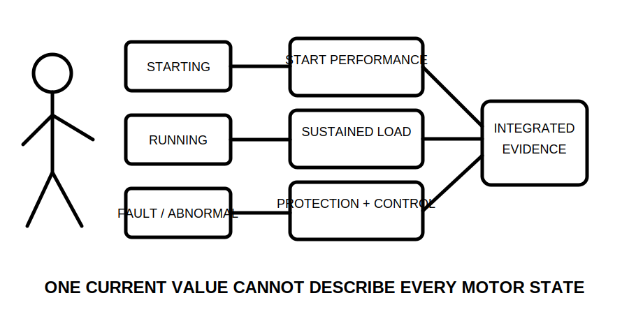
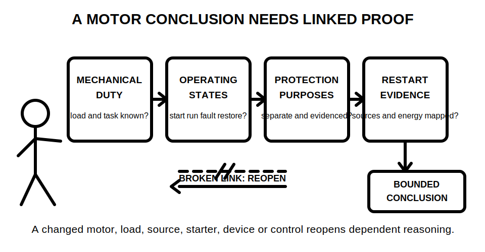
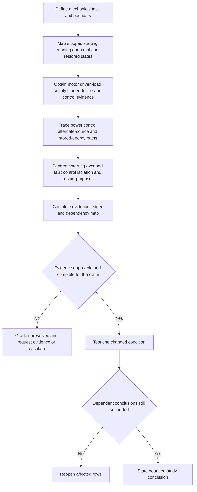
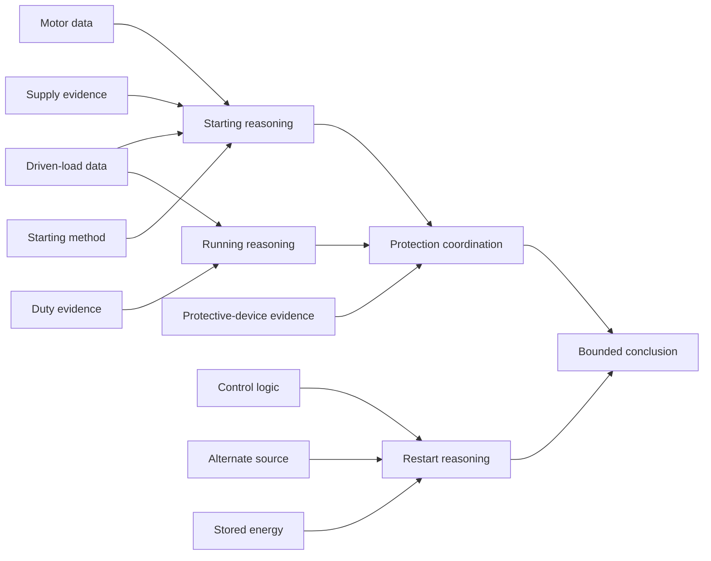

# Day 32 — Motors, Starting Conditions and Associated Protection Concepts

> **Currency, copyright and safety notice:** This original concept module does not provide motor tables, starting-current multipliers, protective settings, operating times, test values or clause wording. Exact motor data, device coordination, starting performance, restart controls and protection requirements remain `reference_check_required`. This automated content is not `technically-reviewed`.

## 1. Outcome and entry check

Given a fictional motor-load evidence pack, the learner can:

1. classify stopped, starting, running, overloaded, faulted and supply-restored states without treating them as one current condition;
2. distinguish the purposes of overload protection, short-circuit protection, control, isolation and restart prevention;
3. map the power path, control path, mechanical task and relevant energy states;
4. grade each item of evidence and each resulting claim;
5. identify dependencies and reopening triggers; and
6. produce a bounded study conclusion that states what is supported, unresolved and prohibited from practical action.

**Entry check:** define motor load, duty, starting condition, overload, short circuit, control circuit, power circuit, stored energy and unintended restart. For each term, give one example of evidence that could support its use and one assumption that would not.

## 2. Why it matters

A motor is an electromechanical system, not merely a nameplate current. Its starting behaviour depends on the motor, driven load, supply, starting method and control arrangement. Its running condition depends on actual duty and mechanical loading. Its protection functions address different abnormal conditions, and loss or restoration of supply can change motion risk.

A single current value, device rating, label or normal stop response cannot prove starting performance, overload protection, fault protection, isolation or restart safety.

*Caption: Separate operating states and protection purposes before comparing candidate arrangements.*

*Caption: A supported motor conclusion links mechanical duty, electrical states, protection purposes and restart evidence; a missing link reopens the decision.*

## 3. Core concepts and terminology

- **Motor load:** the electrical input associated with converting electrical energy into mechanical output. The phrase does not by itself identify the driven machine, duty or starting demand.
- **Driven load:** the pump, fan, conveyor or other mechanism that the motor accelerates and operates. Its inertia and torque demand can affect starting and running behaviour.
- **Duty:** the pattern and duration of starts, running, stopping and rest. A duty description must be supported by equipment or scenario evidence rather than guessed from the motor type.
- **Operating state:** a defined condition such as stopped, starting, running, overloaded, faulted or supply-restored. Each state creates a separate evidence question.
- **Starting condition:** the transient period while the motor and driven load accelerate. Exact current, duration and performance depend on verified equipment, load, supply and starting-method data.
- **Running condition:** the sustained operating state after acceleration, subject to actual duty, mechanical load and supply conditions.
- **Overload:** an overcurrent in an otherwise intact current path, commonly associated with excessive mechanical load or abnormal operation over time. It is not the same condition as a short circuit.
- **Short circuit:** an unintended low-impedance path that can produce high fault current. Exact device behaviour and coordination require authorised current information.
- **Overload protection:** protection intended to limit harmful effects of sustained abnormal current or operation. It does not automatically prove short-circuit protection or isolation.
- **Short-circuit protection:** protection intended to interrupt fault current associated with an unintended low-impedance path. It does not automatically prove overload protection or safe restart behaviour.
- **Power circuit:** the current path supplying motor energy.
- **Control circuit:** the path and logic that command starting, stopping or operating modes. A control command is not proof of electrical isolation.
- **No-voltage or undervoltage control:** a control concept addressing behaviour when supply is lost or reduced. Exact applicability and required behaviour must be verified.
- **Unintended restart:** automatic or unexpected resumption of motion after a supply, control, process or stored-energy condition changes.
- **Stored mechanical energy:** energy retained by rotating, elevated, pressurised or moving parts after electrical supply changes.
- **Coordination:** the supported relationship between the motor, conductors, starting arrangement, protective devices, controls, supply and driven load across relevant states.
- **Dependency:** a fact or conclusion that another conclusion relies on. A change to the dependency reopens the dependent conclusion.
- **Reopening trigger:** new or changed evidence that requires the reasoning chain to be checked again.
- **Bounded conclusion:** a statement limited to the evidence available and the learner's authority. It identifies unresolved matters and does not claim approval, settings or practical permission.

### Evidence grades

1. **Recalled:** remembered but not yet located in the supplied evidence.
2. **Located:** found in a named source or scenario item, but applicability has not been established.
3. **Supported:** applicable evidence is identified and its relationship to the claim is explained.
4. **Transferred:** the reasoning remains valid after a relevant condition changes.
5. **Unresolved:** evidence is missing, conflicting, stale or outside the learner's authority.

### Claim grades

1. **Memory claim:** based primarily on recall.
2. **Provisional interpretation:** plausible but incomplete or awaiting applicability checks.
3. **Supported study conclusion:** traceable to the fictional pack and explicit dependencies.
4. **Authorised technical determination:** requires current authorised sources, competent review and appropriate practical authority; this module cannot produce it.

### Motor-state evidence ledger

Use one row for each material claim:

| State or question | Observed evidence | Missing evidence | Protection or control purpose | Evidence grade | Claim grade | Dependencies | Reopening trigger | Bounded action |
|---|---|---|---|---|---|---|---|---|
| Starting state | What the pack actually states | Data not supplied | Starting performance | Grade | Grade | Motor, load, supply, starter | Any changed dependency | Request, compare or stop |
| Running state | Verified duty and load facts | Data not supplied | Sustained-load reasoning | Grade | Grade | Duty, load, supply | Changed duty or load | Recalculate or stop |
| Abnormal state | Verified scenario facts | Data not supplied | Overload or fault purpose | Grade | Grade | Device and system evidence | Changed device or source | Reopen coordination |
| Supply-restored state | Verified control description | Data not supplied | Restart prevention | Grade | Grade | Control mode and stored energy | Changed control or process state | Escalate or stop |

The ledger prevents a nameplate, catalogue statement, control label or remembered rule from silently becoming a complete motor-system conclusion.

## 4. Rule-finding workflow

Use **M-O-T-O-R-S**:

- **M — Map** the mechanical task, driven load, task boundary and every relevant operating state.
- **O — Obtain** current, applicable motor, load, supply, starter, device, control and manufacturer evidence.
- **T — Trace** power, control, alternate-source and stored-energy paths without treating a stop command as isolation.
- **O — Outline** overload, short-circuit, starting, control, isolation and restart purposes separately.
- **R — Review** coordination dependencies, evidence grades, claim grades and changed conditions.
- **S — State** supported findings, unresolved items, reopening triggers, escalation needs and prohibited actions.

The workflow deliberately delays the conclusion until operating states, purposes and dependencies have been separated. A supported statement about running current does not automatically support a statement about starting, overload, short circuit, isolation or restart.

### Dependency and reopening map

This diagram shows why a changed driven load, supply, starting method, duty, device, control mode, alternate source or stored-energy condition must reopen the affected conclusion rather than being appended as a minor note.

## 5. Visual model or worked example

### Fully guided example

A fictional pump pack provides a motor identifier and stated running current. It does not provide the driven-load curve, duty, starting method, starting duration, supply characteristics, protective-device data or control response after supply restoration.

1. Record the motor identifier and running current as **located** evidence only.
2. Do not infer starting current, acceleration time, protection settings or suitability.
3. Mark starting, protection coordination and restart claims **unresolved**.
4. List the missing motor, driven-load, duty, supply, starter, device and control evidence.
5. State the bounded conclusion: the pack supports recognition of one running-state fact but does not support a complete starting, protection or restart decision.

### Partially guided example

A fictional fan pack adds a named starting arrangement and a control description but changes the supply source during standby operation. Complete the ledger and identify which conclusions are reopened. Explain why the alternate source can affect starting and restart reasoning even when the motor itself is unchanged.

### Independent changed-condition transfer

Use a fictional conveyor pack. First produce a supported study conclusion for the supplied condition. Then apply one change: the driven load is modified, automatic restart is introduced, the supply source changes, the duty becomes intermittent with frequent starts, or the protective device is replaced. Reopen only the affected ledger rows, but explain all downstream effects.

### Delayed retrieval

At the start of Day 33, redraw the state-and-purpose map from memory, then compare it with this module. Record omissions as retrieval errors rather than silently correcting them.

## 6. Practical application

For fictional fan, pump and conveyor packs:

1. create a state matrix for stopped, starting, running, overloaded, short-circuited and supply-restored conditions;
2. trace separate power and control paths;
3. identify any alternate source and stored mechanical energy;
4. complete a motor-state evidence ledger;
5. distinguish each protection or control purpose;
6. grade evidence and claims;
7. apply one changed condition and reopen dependent conclusions; and
8. write a bounded conclusion containing supported, unresolved, escalation and stop items.

### Original educational rubric — 12 points

| Category | 0 points | 1 point | 2 points |
|---|---|---|---|
| Operating-state separation | States collapsed or omitted | Most states named | States clearly separated and evidenced |
| Terminology and path tracing | Terms confused; paths not traced | Partial definitions or tracing | Terms defined; power, control and energy paths clear |
| Protection-purpose separation | Purposes treated as interchangeable | Some purposes separated | Starting, overload, fault, control, isolation and restart purposes separated |
| Evidence and claim grading | Unsupported claims | Inconsistent grading | Grades traceable and justified |
| Dependencies and transfer | Changes appended without reopening | Some dependencies recognised | Changed condition reopens all affected reasoning |
| Bounded conclusion and safety | Approval or practical instruction claimed | Limits partly stated | Supported, unresolved, escalation and prohibited actions explicit |

This rubric is an original learning tool, not an official RTO pass mark.

**Critical-error gates:** the exercise is not ready to progress when the learner invents a starting multiplier, setting, operating time, device suitability, isolation state or restart behaviour; treats overload and short-circuit protection as interchangeable; treats a stop command as isolation; ignores an alternate source or stored energy; or proposes practical operation, adjustment, testing or fault simulation.

## 7. Common errors and safety checkpoint

Common errors include:

- using running current as the only design input;
- inferring starting behaviour from motor type or memory;
- treating overload and short-circuit protection as the same function;
- ignoring the driven load, duty or supply condition;
- assuming a control stop removes every energy source;
- assuming the motor cannot restart after supply restoration;
- ignoring stored mechanical, pressure or gravitational energy;
- copying a device setting or operating time without current applicable evidence;
- retaining a conclusion after its motor, load, source, starter, device or control dependency changes; and
- presenting an educational comparison as an authorised technical determination.

**Reopening triggers:** changed motor or driven load; changed duty or number of starts; changed supply characteristics or source; changed starting method; changed conductor or protective device; changed control mode; automatic restart introduced; stored-energy condition changed; manufacturer information changed; evidence conflict or loss of currency; changed jurisdiction; or changed task boundary.

**Safety checkpoint:** this module authorises no site access, energisation, starting, stopping, jogging, isolation, proving, locking, tagging, guard removal, adjustment, setting, measurement, testing, fault simulation, connection, disconnection, maintenance, commissioning or return to service. Stop when guards, task boundaries, sources, stored energy, control behaviour, motor data, driven-load data, device evidence, authorised procedures or competent supervision are unresolved.

## 8. Retrieval and next links

Without looking back:

1. state M-O-T-O-R-S in order;
2. define the six operating states used in the application;
3. distinguish overload protection, short-circuit protection, control, isolation and restart prevention;
4. name eight dependencies that can reopen a conclusion;
5. explain the five evidence grades and four claim grades; and
6. state three critical-error gates and one bounded conclusion.

- **Program:** [Six-Week Capstone Learning Plan](../MASTER_PLAN.md)
- **Previous:** [Day 31 — Fixed Appliances, Local Isolation and Connection Decisions](day-31-fixed-appliances-local-isolation-and-connection-decisions.md)
- **Knowledge note:** [[Six-Week Day 32 - Motors Starting Conditions and Associated Protection Concepts]]
- **Next:** [Day 33 — Rest, Retrieval and Scenario Triage](day-33-rest-retrieval-and-scenario-triage.md)
