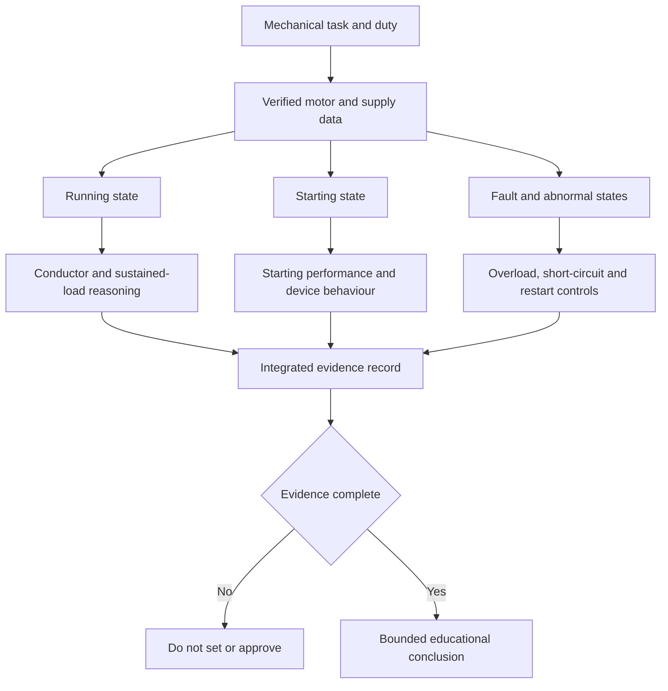

# Day 32 — Motors, Starting Conditions and Associated Protection Concepts

> **Currency, copyright and safety notice:** This original concept module does not provide motor tables, starting-current multipliers, protective settings, test values or clause wording. Exact equipment data, coordination and protection requirements remain `reference_check_required`.

## 1. Outcome and entry check

Given a fictional motor-load data pack, the learner can distinguish running and starting conditions, identify the separate purposes of overload, short-circuit and loss-of-supply controls, map control and power paths, and state which data must be verified before a protection concept can be supported.

**Entry check:** define motor load, starting condition, overload, short circuit, control circuit and unintended restart.

## 2. Why it matters

Motors can draw materially different current during starting, respond poorly to supply or mechanical abnormalities and create hazards if they restart unexpectedly. A single nameplate current or breaker rating does not establish a complete design or protection decision.

*Caption: Separate operating states and protection purposes before comparing candidate arrangements.*

## 3. Core concepts and terminology

- **Motor load:** electrical input associated with converting electrical energy into mechanical output.
- **Running condition:** the sustained operating state after acceleration, subject to actual duty and load.
- **Starting condition:** the transient period while the motor accelerates; exact current and duration depend on verified equipment and load data.
- **Duty:** the pattern and duration of operation, starts, stops and rest periods.
- **Overload protection:** protection intended to limit harmful overcurrent associated with excessive load or abnormal operation over time.
- **Short-circuit protection:** protection intended to interrupt high fault current from an unintended low-impedance path.
- **No-voltage or undervoltage control:** a control concept used to address operation when supply is lost or reduced; exact requirements and behaviour need verification.
- **Unintended restart:** automatic or unexpected resumption of motion after supply or control conditions change.
- **Control circuit:** the circuit that commands operation; it is distinct from the power circuit supplying motor energy.

## 4. Rule-finding workflow

Use **M-O-T-O-R-S**: **M**ap the mechanical task and operating states; **O**btain verified motor, load and supply data; **T**race power and control paths; **O**utline each protection purpose separately; **R**eview coordination, starting and restart evidence; **S**tate supported, unresolved and escalation items.

Each branch answers a different question; none should be collapsed into one current value.

## 5. Visual model or worked example

Fictional scenario: a pump motor has a stated running current but no starting method, duty, mechanical-load curve or protective-device data. Record the running current as one fact only. Do not infer starting current, acceleration time, overload setting or device suitability. Request the missing motor, driven-load, supply, starter, protection and control information.

Changed condition: adding automatic restart after a supply interruption reopens control logic, warning, supervision, isolation and risk assessment.

## 6. Practical application

For a fictional fan, pump and conveyor, create a state matrix with rows for stopped, starting, running, overloaded, short-circuited and supply-restored. Columns: expected state description; evidence required; protection/control purpose; unresolved risk; bounded conclusion.

Rubric, 12 points: operating states 2; terminology 2; power/control separation 2; protection-purpose separation 2; evidence discipline 2; bounded conclusion 2. Invented starting multipliers, settings, operating times or suitability claims are critical errors.

## 7. Common errors and safety checkpoint

Errors: using running current as the only design input; treating overload and short-circuit protection as interchangeable; ignoring mechanical duty; assuming a motor cannot restart; confusing a stop command with isolation; or setting protection from memory.

This module authorises no energisation, starting, stopping, isolation, adjustment, measurement, testing, fault simulation or work on rotating equipment. Stop when guards, isolation, control behaviour, motor data, driven-load data or authorised procedures are unresolved.

## 8. Retrieval and next links

State M-O-T-O-R-S; compare running, starting and fault states; distinguish four protection/control purposes; name six required data items; explain one unintended-restart risk.

- **Program:** [Six-Week Capstone Learning Plan](../MASTER_PLAN.md)
- **Previous:** [Day 31 — Fixed Appliances, Local Isolation and Connection Decisions](day-31-fixed-appliances-local-isolation-and-connection-decisions.md)
- **Knowledge note:** [[Six-Week Day 32 - Motors Starting Conditions and Associated Protection Concepts]]
- **Next:** Day 33 — Rest, Retrieval and Scenario Triage
