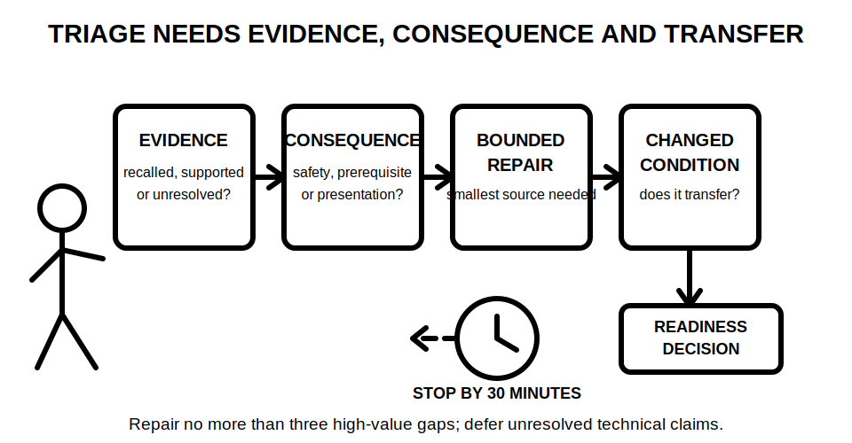
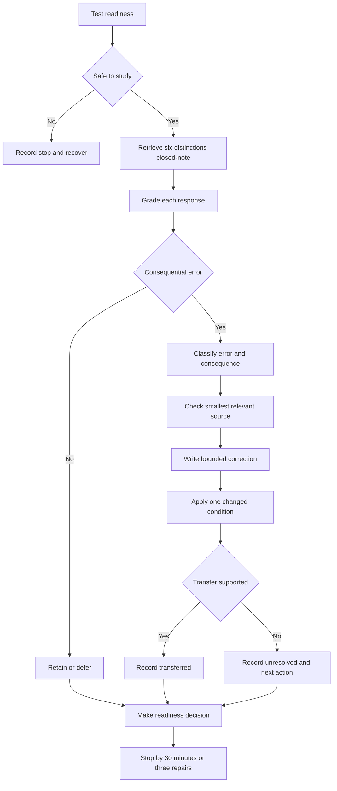

# Day 33 — Rest, Retrieval and Scenario Triage

> **Currency, copyright and safety notice:** This recovery block introduces no new electrical theory. It uses original prompts, ledgers, diagrams and scoring tools. Any disputed technical correction remains `reference_check_required`; this module is not `technically-reviewed` and grants no practical electrical authority.

## 1. Outcome and entry check

Within a maximum of 30 minutes, the learner will:

1. retrieve six Week 5 distinctions without notes;
2. grade the evidence supporting each response;
3. classify no more than three consequential errors by type, consequence and next action;
4. repair only the smallest useful gap supported by available learning material or an authorised source;
5. transfer one corrected distinction to a changed fictional scenario;
6. record a ready, conditional-ready or stop decision with evidence; and
7. stop when any time, fatigue, uncertainty or safety boundary is reached.

A successful outcome is observable: six closed-note responses, a scenario-triage ledger, no more than three bounded repairs, one changed-condition transfer and one written readiness decision.

**Entry check:** before starting, record:

- energy from 1–5;
- concentration from 1–5;
- headache, agitation, unusual fatigue or reduced attention as present or absent;
- whether a current authorised reference is available for any technical correction;
- the distinction most likely to be confused under time pressure; and
- whether the learner can keep paper study separate from practical electrical work.

Do not begin retrieval when energy or concentration is 1, when symptoms impair attention, or when the learner cannot maintain the study-only boundary. Record `stop — recovery required` instead.

## 2. Why it matters

A recovery block is not an invitation to compress missed theory into one sitting. Its purpose is to preserve learning by retrieving key distinctions, correcting only consequential errors and ending before fatigue degrades judgement.

Scenario triage also prevents a common assessment failure: treating every unknown as equally urgent. A learner must distinguish a harmless wording lapse from an unsupported safety claim, then choose the smallest action that restores readiness.

*Caption: Retrieve first, repair only high-value gaps, and defer anything requiring an authorised source or qualified supervision.*

*Caption: A correction is not complete until its evidence is graded and it survives one changed fictional condition.*

## 3. Core concepts and terminology

- **Retrieval:** producing knowledge without first viewing the answer.
- **Recognition:** identifying an answer when it is shown. Recognition is easier than retrieval and cannot substitute for closed-note recall.
- **Scenario triage:** sorting a prompt by evidence quality, consequence of error and next action.
- **Error type:** the form of the mistake, such as omission, category collapse, boundary error, unsupported assumption, terminology error or sequence error.
- **Consequence:** what the error could affect, including safety boundaries, later reasoning, assessment performance or only presentation.
- **High-value gap:** an error affecting safety, a prerequisite relationship, repeated performance or several downstream decisions.
- **Bounded repair:** the smallest correction needed to restore the affected distinction without reopening the entire topic.
- **Deferred item:** a question intentionally postponed because it is low priority, requires an unavailable authorised source or lies outside the learner's authority.
- **Evidence grade:** a label describing how strongly a response is supported:
  - **recalled:** produced from memory but not yet checked;
  - **located:** matched to a relevant section of an existing module or authorised source;
  - **supported:** the source clearly supports the bounded correction;
  - **transferred:** the corrected distinction was applied successfully to a changed scenario;
  - **unresolved:** evidence is missing, conflicting, stale or outside the learner's authority.
- **Confidence calibration:** comparing confidence before checking with evidence quality after checking.
- **Conditional-ready:** able to continue only with one named remediation, reference or support condition.
- **Stop condition:** a predetermined reason to end the block rather than continue with degraded judgement.
- **Reopening trigger:** a later change that makes a previous correction require checking again.
- **Readiness:** sufficient retrieval, evidence control and concentration to begin Day 34. Readiness is not technical competence, authorisation or proof of practical skill.

### Claim boundaries

Use four claim grades in the triage ledger:

1. **memory claim** — the learner's initial closed-note answer;
2. **provisional correction** — a likely repair identified during comparison;
3. **supported study conclusion** — a bounded correction supported by the available module or authorised reference;
4. **authorised technical determination** — a conclusion requiring current authorised information and qualified review; this block does not produce this grade.

## 4. Rule-finding workflow

Use **T-R-I-A-G-E**:

- **T — Test readiness:** rate energy, concentration and symptoms; choose retrieve or rest.
- **R — Retrieve closed-note distinctions:** answer before opening notes.
- **I — Identify the error and evidence grade:** name exactly what failed and whether the answer is recalled, located, supported or unresolved.
- **A — Assign consequence and priority:** prioritise safety-critical, recurring and prerequisite errors.
- **G — Give one bounded correction and transfer test:** check the smallest source needed, repair one distinction and apply it to one changed scenario.
- **E — End with readiness and one next action:** record ready, conditional-ready or stop, then finish by the time or repair limit.

The workflow gives priority to consequence and evidence, not convenience. A familiar-looking answer is not retained merely because confidence is high.

### Scenario-triage ledger

Record one row for each of the six prompts:

| Field | Required entry |
|---|---|
| Prompt | The exact fictional scenario or distinction |
| Closed-note response | The learner's first answer |
| Initial confidence | Low, medium or high |
| Evidence grade before checking | Recalled or unresolved |
| Error type | None, omission, category collapse, boundary error, unsupported assumption, terminology error or sequence error |
| Consequence | Safety, prerequisite, repeated assessment, downstream decision or presentation only |
| Priority | Repair now, defer with named action or retain |
| Smallest source checked | Module section or authorised-source identifier; do not copy extensive wording |
| Bounded correction | The smallest corrected distinction in the learner's own words |
| Evidence grade after checking | Located, supported, transferred or unresolved |
| Changed condition | One relevant feature altered |
| Transfer result | Supported, partial or failed |
| Reopening trigger | What later change requires rechecking |

Reopen a correction when the task boundary, location classification, source arrangement, appliance information, motor duty, operating state, control mode, alternate supply, stored energy, reference source, jurisdiction or evidence currency changes or conflicts with later information.

## 5. Visual model or worked example

### Worked example A — guided category-collapse repair

**Prompt:** “The red stop button stopped the fictional motor, so the motor is isolated.”

**Closed-note response:** agree, with high confidence.

**Triage:**

- error type: category collapse;
- consequence: safety-critical;
- evidence grade: recalled, then unresolved;
- priority: repair now.

**Smallest source check:** review only the Day 31 distinction between control and isolation and the Day 32 separation of operating state, control path and energy sources.

**Bounded correction:** a normal stop response shows that a control changed operation; it does not establish a verified isolation boundary or account for every source and stored-energy path.

**Changed condition:** the fictional motor now has an automatically restored control supply.

**Transfer:** the learner reopens the earlier conclusion and records the isolation claim as unresolved. The correction is graded `transferred`.

### Worked example B — partially guided special-location triage

Use only this cue: **trigger is not applicability proof**.

For a fictional wash area, record:

1. the observed condition;
2. the candidate special-location trigger;
3. the missing classification or geometry evidence;
4. the consequence of assuming applicability; and
5. the smallest next source action.

Do not invent a zone, distance, rating, clause or equipment decision.

### Independent transfer

Choose one changed fictional condition:

- a local isolator label conflicts with the drawing;
- a motor duty changes from intermittent to frequent starting;
- a wet-area boundary datum is unclear;
- an alternate source is newly disclosed;
- appliance instructions are revised; or
- the learner's confidence remains high after evidence becomes conflicting.

Without reopening every note, identify which prior conclusion must be reopened, why it matters and the smallest source needed next.

## 6. Practical application

### Thirty-minute maximum sequence

- **Minute 0–3:** readiness and symptom check.
- **Minute 3–11:** six closed-note prompts, about one minute each plus brief confidence grading.
- **Minute 11–16:** classify errors and choose no more than three high-value repairs.
- **Minute 16–23:** check the smallest relevant sources and write bounded corrections.
- **Minute 23–27:** complete one changed-condition transfer.
- **Minute 27–30:** score readiness and write exactly one next action.

Stop earlier when a stop condition occurs. Unused time is recovery time, not permission to add new theory.

### Six retrieval prompts

1. Distinguish a special-location trigger from verified applicability.
2. Distinguish functional control from isolation.
3. Distinguish a motor's running condition from its starting condition.
4. Distinguish overload protection purpose from short-circuit protection purpose.
5. Distinguish an observed fact from an inference.
6. Explain why one apparent source or one main switch does not prove a complete isolation boundary.

### Readiness decision

Choose exactly one:

- **Ready:** no critical error remains, at least five distinctions are supported or transferred, the changed condition was handled without unsafe certainty and attention remains adequate.
- **Conditional-ready:** one named prerequisite gap remains, with one specific source or remediation action identified before or during Day 34.
- **Stop:** fatigue, symptoms, repeated unsafe overclaiming, unresolved high-confidence errors or inability to control scope makes further study unreliable.

### Educational scoring rubric

Score each category 0, 1 or 2. This is an original study-readiness tool, not an official RTO pass mark.

| Category | 0 | 1 | 2 |
|---|---|---|---|
| Closed-note retrieval | copied, absent or mostly guessed | several partial distinctions | at least five distinctions produced without notes |
| Terminology and categories | material category collapse | mostly correct with one material gap | distinctions used accurately and explained |
| Evidence grading | confidence treated as proof | grades used inconsistently | every response graded consistently |
| Triage and bounded repair | low-value or broad relearning chosen | priority or repair partly bounded | consequential errors prioritised and smallest repairs used |
| Changed-condition transfer | copied answer or unsafe certainty | partial transfer with unresolved issue | affected conclusion reopened and bounded correctly |
| Recovery discipline | time, repair or fatigue limit ignored | stopped late or scope expanded | all limits and stop conditions followed |

**Critical-error gates:** regardless of score, choose `conditional-ready` or `stop` when the learner:

- treats a stop control, label, plug, physical reach or normal response as proof of isolation or permission;
- invents an exact clause, limit, test value, equipment rating or official assessment rule;
- conceals an unresolved source, boundary, geometry or evidence conflict;
- proposes practical switching, opening, testing, measurement, adjustment or alteration;
- continues after a fatigue, symptom, 30-minute or three-repair stop condition; or
- cannot distinguish readiness from technical competence or authority.

## 7. Common errors and safety checkpoint

Common errors include:

- opening notes before retrieval;
- selecting easy corrections instead of consequential ones;
- trying to relearn the whole week;
- using confidence as evidence;
- treating a familiar label as proof;
- repairing more than three items;
- writing a broad correction with no named source;
- copying the worked example into the changed condition;
- inventing exact technical details to make an answer feel complete;
- turning a recovery block into practical planning; and
- continuing because the ledger feels unfinished.

### Safety checkpoint

Stop immediately when:

- energy or concentration falls to 1;
- headache, marked fatigue, agitation or attention deterioration occurs;
- three repairs have been completed;
- three unresolved high-confidence errors are identified;
- an unavailable authorised source or qualified determination is required;
- the learner cannot maintain the boundary between study reasoning and practical work;
- the task prompts an urge to inspect, open, switch, isolate, prove, test, trace, adjust or alter real equipment; or
- the 30-minute maximum is reached.

This block authorises no site access, energisation, starting, stopping, jogging, switching, isolation, proving, locking, tagging, opening, guard removal, adjustment, measurement, testing, fault simulation, connection, disconnection, installation, maintenance, commissioning, certification, verification or return to service.

## 8. Retrieval and next links

Before closing the module, answer without notes:

1. State T-R-I-A-G-E in order.
2. Distinguish retrieval from recognition.
3. Name the five evidence grades.
4. Name the four claim grades.
5. Explain how consequence changes triage priority.
6. State the 30-minute and three-repair limits.
7. Give two fatigue or uncertainty stop conditions.
8. Explain why readiness is not technical competence.
9. Name two reopening triggers.
10. State exactly one next action for Day 34.

**Delayed retrieval:** at the start of Day 34, reproduce T-R-I-A-G-E, one critical-error gate and the changed-condition conclusion before opening notes.

- **Program:** [Six-Week Capstone Learning Plan](../MASTER_PLAN.md)
- **Previous:** [Day 32 — Motors, Starting Conditions and Associated Protection Concepts](day-32-motors-starting-conditions-and-associated-protection-concepts.md)
- **Knowledge note:** [[Six-Week Day 33 - Rest Retrieval and Scenario Triage]]
- **Next:** [Day 34 — Multiple and Alternative Supplies Awareness](day-34-multiple-and-alternative-supplies-awareness.md)
