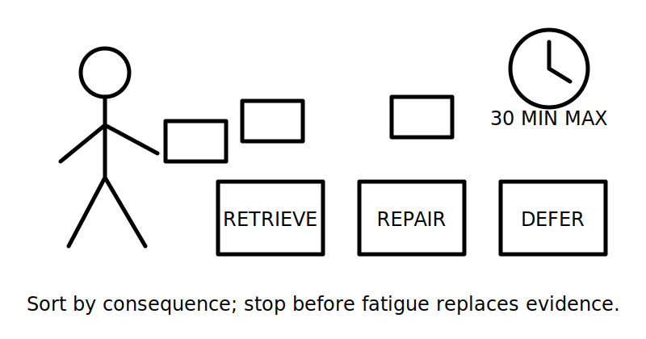
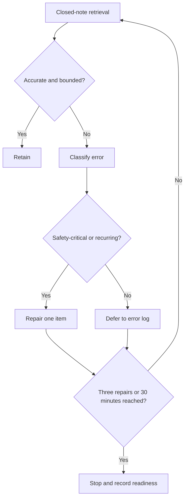

# Day 33 — Rest, Retrieval and Scenario Triage

> **Currency, copyright and safety notice:** This recovery module introduces no new electrical theory. It uses original prompts and requires authorised sources for any unresolved technical claim.

## 1. Outcome and entry check

Within 30 minutes, the learner can retrieve five Week 5 distinctions, classify errors by urgency, repair no more than three high-value gaps and make a defensible ready, conditional-ready or stop decision for Day 34.

**Entry check:** without notes, distinguish special-location trigger from verified applicability, functional control from isolation, running from starting condition, overload from short circuit, and observed fact from inference.

## 2. Why it matters

Recovery protects accuracy. Fatigue encourages invented details, collapsed categories and unsafe confidence. A bounded session preserves retrieval strength without turning a rest block into another theory lesson.

*Caption: Retrieve first, repair only high-value gaps, and defer anything requiring an authorised source or qualified supervision.*

## 3. Core concepts and terminology

- **Retrieval:** recalling knowledge without looking at notes.
- **Scenario triage:** sorting a prompt by consequence, evidence gap and next action.
- **Error log:** a record of the mistake, cause, correction and trigger for rechecking.
- **High-value gap:** an error that affects safety boundaries, several later decisions or repeated assessment performance.
- **Stop condition:** a limit requiring the session or practical reasoning to cease.
- **Conditional-ready:** able to continue only with named references, supervision or remediation.

## 4. Rule-finding workflow

Use **T-R-I-A-G-E**: **T**ime-box the session; **R**etrieve closed-note distinctions; **I**dentify error type; **A**ssign consequence and priority; **G**ive one bounded correction; **E**nd with readiness and next action.

The loop prevents indiscriminate catch-up. Safety-critical and recurring errors receive priority; low-value work is deferred.

## 5. Visual model or worked example

A learner labels a motor stop button as isolation. Classify this as a category-collapse error with safety consequences. Correct the statement: a stop control changes operation, while isolation requires a verified boundary and authorised procedure. Add the trigger “recheck whenever a scenario asks whether work may begin.”

## 6. Practical application

Complete six 60-second scenario cards: wet-area trigger; appliance isolation claim; motor starting evidence; alternate source clue; observation versus inference; and stop condition. For each, record: first classification, confidence from 1–3, missing evidence and next action. Repair at most three items.

Readiness rule: ready requires no critical error and at least four accurate classifications; conditional-ready requires a named remediation; stop requires fatigue, repeated unsafe overclaiming or inability to identify evidence gaps.

## 7. Common errors and safety checkpoint

Errors: opening notes before retrieval, trying to relearn the whole week, repairing easy items instead of consequential ones, treating confidence as evidence, or continuing while fatigued.

Stop at 30 minutes, after three repairs, or earlier for reduced concentration. This module authorises no access, switching, isolation, measurement, testing, adjustment, installation or work on electrical or rotating equipment.

## 8. Retrieval and next links

State T-R-I-A-G-E; name three error priorities; explain conditional-ready; give two fatigue stop conditions; identify one item that must be deferred to an authorised source.

- **Program:** [Six-Week Capstone Learning Plan](../MASTER_PLAN.md)
- **Previous:** [Day 32 — Motors, Starting Conditions and Associated Protection Concepts](day-32-motors-starting-conditions-and-associated-protection-concepts.md)
- **Knowledge note:** [[Six-Week Day 33 - Rest Retrieval and Scenario Triage]]
- **Next:** [Day 34 — Multiple and Alternative Supplies Awareness](day-34-multiple-and-alternative-supplies-awareness.md)
