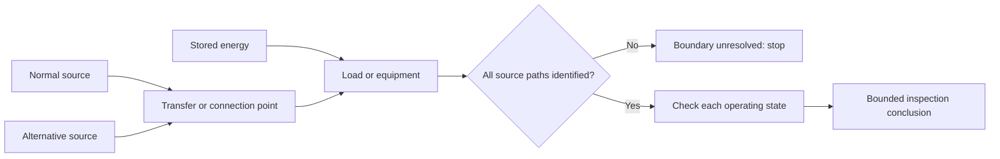

# Day 34 — Multiple and Alternative Supplies Awareness

> **Currency, copyright and safety notice:** This original awareness module does not provide wiring arrangements, switching sequences, labels, settings, clause wording or field procedures. Exact requirements and source-specific hazards remain `reference_check_required`.

## 1. Outcome and entry check

Given a fictional installation description, the learner can identify every stated energy source, map possible energisation states, distinguish normal, alternate and stored-energy contributions, identify unresolved transfer or isolation boundaries, and state a bounded inspection conclusion.

**Entry check:** define source, alternate supply, stored energy, backfeed, transfer device and isolation boundary.

## 2. Why it matters

An installation may remain energised after one source is disconnected. Generators, batteries, photovoltaic systems, uninterruptible supplies and interconnected equipment can change current paths, labels, switching assumptions and safe work boundaries.

*Caption: Identify every possible source and operating state before accepting an isolation or inspection claim.*

## 3. Core concepts and terminology

- **Normal supply:** the source ordinarily supplying the installation or load.
- **Alternative supply:** a source capable of supplying some or all loads instead of, or in addition to, the normal source.
- **Stored energy:** energy retained in batteries, capacitors, rotating equipment or other systems after an input source changes.
- **Backfeed:** energisation from a direction or source not assumed by the observer.
- **Transfer device:** equipment intended to change the connected source; exact construction and operation require verification.
- **Operating state:** a defined combination of source availability, switch position and load connection.
- **Isolation boundary:** the equipment and conductors claimed to be separated from all relevant energy sources.

## 4. Rule-finding workflow

Use **S-O-U-R-C-E-S**: **S**can for every source; **O**utline operating states; **U**nderstand possible energisation paths; **R**ecord transfer, protection and identification evidence; **C**heck the proposed boundary against every state; **E**scalate unresolved interactions; **S**tate only the supported conclusion.

The diagram is conceptual. It shows why a single open device is not evidence that every possible source path has been addressed.

## 5. Visual model or worked example

Fictional scenario: a site has a utility supply, a battery system and a portable generator connection point. The transfer arrangement and battery operating mode are absent from the data pack. Record three candidate sources, identify the missing transfer and stored-energy evidence, and reject the statement “main switch off means the installation is safe.”

Changed condition: adding automatic transfer reopens control behaviour, source priority, warning, identification and unintended parallel-operation questions.

## 6. Practical application

Create a source-state matrix for four fictional installations. Rows: source available, source unavailable, transfer state changed, stored energy present and faulted control state. Columns: possible energised area, evidence required, identification expected, unresolved interaction and permitted conclusion.

Rubric, 12 points: source inventory 2; state mapping 2; path reasoning 2; boundary discipline 2; evidence classification 2; bounded conclusion 2. Missing a stated source or authorising work from an unresolved boundary is a critical error.

## 7. Common errors and safety checkpoint

Errors: assuming only grid supply matters; treating a label as proof; ignoring stored energy; assuming transfer devices cannot fail; confusing functional shutdown with isolation; or overlooking control and auxiliary supplies.

This module authorises no access, switching, isolation, proving de-energised, measurement, testing, connection, disconnection or operation of source equipment. Stop whenever source inventory, transfer state, stored energy, identification or authorised procedure is incomplete.

## 8. Retrieval and next links

State S-O-U-R-C-E-S; name five possible source types; explain backfeed and stored energy; describe why one open switch may be insufficient; list four items that reopen the boundary decision.

- **Program:** [Six-Week Capstone Learning Plan](../MASTER_PLAN.md)
- **Previous:** [Day 33 — Rest, Retrieval and Scenario Triage](day-33-rest-retrieval-and-scenario-triage.md)
- **Knowledge note:** [[Six-Week Day 34 - Multiple and Alternative Supplies Awareness]]
- **Next:** [Day 35 — Week 5 Integrated Installation Inspection](day-35-week-5-integrated-installation-inspection.md)
