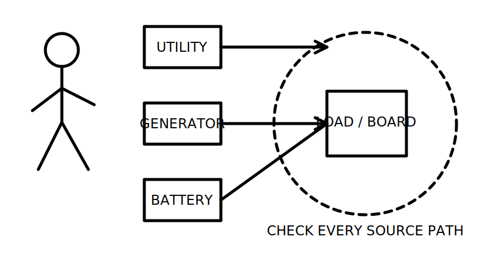
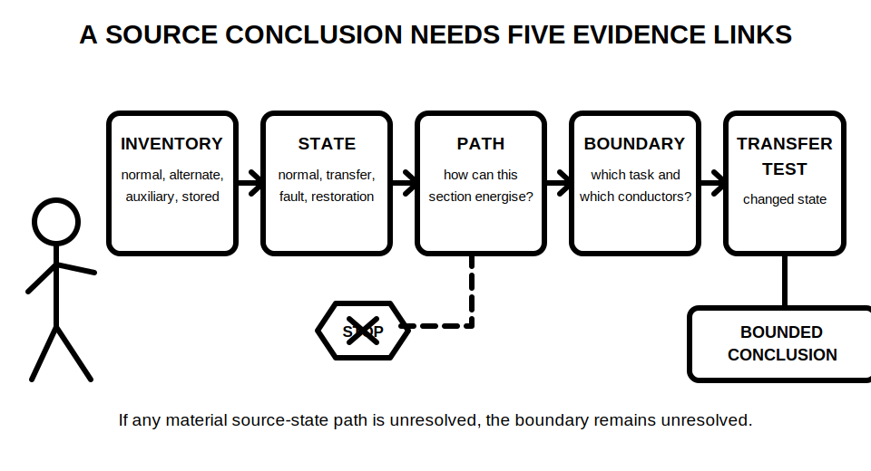
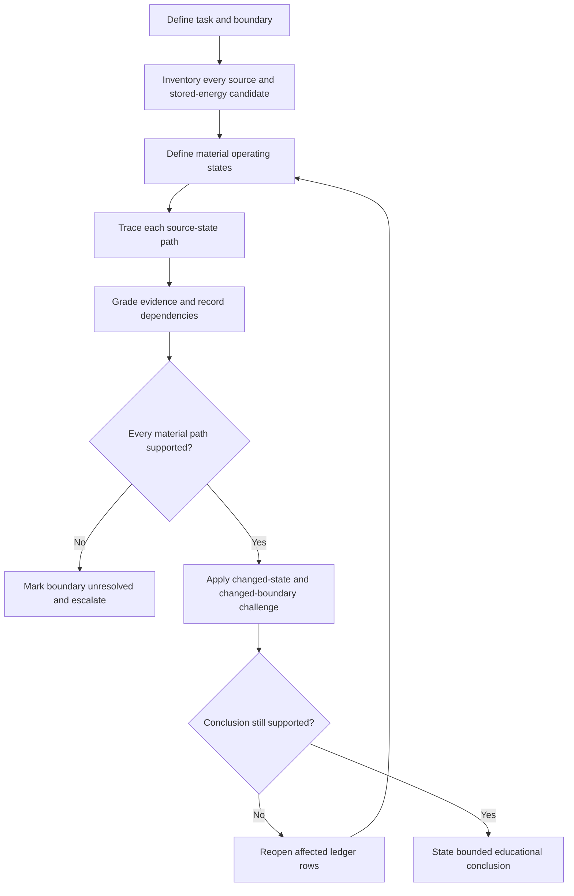

# Day 34 — Multiple and Alternative Supplies Awareness

> **Currency, copyright and safety notice:** This original awareness module does not provide wiring arrangements, switching sequences, labels, settings, clause wording or field procedures. Exact requirements, source-specific hazards and authorised work methods remain `reference_check_required` and require qualified review.

## 1. Outcome and entry check

Given a fictional installation description and evidence pack, the learner can:

1. identify every stated, indicated and unresolved energy source;
2. map possible energisation states without treating a normal operating state as the only state;
3. distinguish normal, alternative, auxiliary and stored-energy contributions;
4. trace candidate energisation paths to a defined work or inspection boundary;
5. grade the evidence supporting each path and state;
6. identify transfer, interlocking, control, protection, identification and isolation dependencies;
7. reopen conclusions when a source, state, mode or boundary changes; and
8. state a bounded educational conclusion without authorising practical work.

**Entry check:** explain, in your own words, the terms source, alternative supply, auxiliary supply, stored energy, backfeed, transfer device, interlocking, operating state and isolation boundary. For each definition, give one fictional example and one item of evidence that would be needed before relying on it.

A learner who cannot distinguish functional shutdown from isolation, or who assumes that one open switch addresses every source, should revisit Day 22 and Day 23 before continuing.

## 2. Why it matters

An installation may remain energised, become re-energised or contain hazardous stored energy after one apparent source is disconnected. Utility supplies, generators, batteries, photovoltaic systems, uninterruptible power supplies, control transformers, interconnected equipment and rotating systems can create different current paths in different operating states.

The assessment skill is not to memorise a list of technologies. It is to build a complete source-state model, identify what evidence supports it, and refuse conclusions that exceed that evidence.

*Caption: Identify every possible source and operating state before accepting an isolation or inspection claim.*

*Caption: A source label or normal operating response is only one clue; a bounded conclusion needs all five evidence links.*

## 3. Core concepts and terminology

### Source and state terms

- **Normal supply:** the source ordinarily intended to supply the installation or load in its usual operating condition.
- **Alternative supply:** a source capable of supplying some or all loads instead of, or in addition to, the normal supply. The exact classification and requirements depend on current authorised sources.
- **Auxiliary supply:** a supply used for control, indication, monitoring or another supporting function. It may remain energised when the main power path changes.
- **Stored energy:** energy retained in batteries, capacitors, rotating equipment, pressure systems or other components after an input source changes. This module considers only the awareness and evidence implications, not practical discharge procedures.
- **Backfeed:** energisation from a direction or source not assumed by the observer.
- **Transfer device:** equipment intended to change which source is connected to a load or distribution section. Its actual function cannot be inferred from a label alone.
- **Interlocking:** a control or mechanical relationship intended to prevent an impermissible combination of states. Its presence, scope and effectiveness require evidence.
- **Operating state:** a defined combination of source availability, switch or transfer position, control mode and load connection.
- **Source priority:** the intended order in which available sources supply a load. Intended priority is not proof of the actual state.
- **Parallel operation:** a state in which more than one source may be connected to the same electrical section. Whether it is intended, possible or prohibited requires verified evidence.
- **Automatic restoration:** a control action that may reconnect or restart supply after a condition changes.
- **Isolation boundary:** the equipment and conductors claimed to be separated from all relevant energy sources for a defined task.

### Evidence grades

Use one grade for every material source, state, path and boundary claim:

1. **Stated:** present only in the fictional brief or label.
2. **Indicated:** supported by a drawing, schedule, product description or consistent observation, but not yet cross-checked.
3. **Corroborated:** supported by at least two consistent evidence items with an identified scope and date.
4. **Transferred:** remains supported after a changed-state or changed-boundary challenge.
5. **Unresolved:** missing, contradictory, stale, ambiguous or outside the learner's authority.

### Claim grades

- **Assumption:** a possibility not yet supported by evidence.
- **Provisional educational conclusion:** a study conclusion limited to the supplied fictional evidence.
- **Supported educational conclusion:** a conclusion with traceable evidence, dependencies and reopening triggers.
- **Authorised technical determination:** a conclusion made by a competent authorised person using current requirements and approved procedures. This module cannot produce this grade.

A diagram, label, switch position or normal stop response may contribute evidence, but none independently proves source absence, transfer behaviour, interlocking, isolation or safety.

## 4. Rule-finding workflow

Use **S-O-U-R-C-E-S**:

- **S — Scan every source:** list normal, alternative, auxiliary and stored-energy candidates, including unresolved indications.
- **O — Outline operating states:** define normal, source-lost, transfer, maintenance, control-fault, stored-energy and restoration states that are material to the scenario.
- **U — Understand paths:** trace how each source could energise each relevant section in each state.
- **R — Record evidence and dependencies:** identify the evidence grade, source currency, transfer assumptions, interlocks, controls, protection, identification and unresolved gaps.
- **C — Check the boundary:** test the proposed inspection or work boundary against every source-state path.
- **E — Escalate unresolved interactions:** stop the educational conclusion at the first material unresolved source, path, transfer state or authority boundary.
- **S — State a bounded conclusion:** describe what is supported, what is not supported, what would reopen the decision and who must verify it.

Create a **source-state evidence ledger** with these columns:

| Source or stored-energy candidate | Operating state | Candidate path | Affected section | Evidence grade | Transfer or control dependency | Boundary implication | Reopening trigger | Bounded conclusion |
|---|---|---|---|---|---|---|---|---|

Do not collapse several states into one row. Separate rows expose assumptions that would otherwise remain hidden.

The diagram shows that evidence is tested twice: first against the stated scenario, then against a changed state or boundary. A conclusion that fails the second test has not transferred.

### Dependencies and reopening triggers

Reopen affected ledger rows when any of these changes or conflicts with later evidence:

- source type, availability, capacity or connection point;
- normal, alternate, emergency, maintenance or faulted operating state;
- manual or automatic transfer behaviour;
- interlocking, control logic, remote command or automatic restoration;
- battery, capacitor, rotating or other stored-energy condition;
- distribution boundary, work scope or inspection objective;
- conductor, device, protection, identification or warning arrangement;
- product information, drawing revision, source currency or jurisdiction;
- evidence access, competence, authority or approved procedure.

A change does not require restarting every conclusion. Reopen the rows and downstream claims that depend on the changed item.

## 5. Visual model or worked example

### Fully guided example

A fictional site evidence pack contains:

- a utility incomer shown on a single-line diagram;
- a battery inverter named on an equipment schedule;
- a portable-generator connection label on a photograph;
- a transfer-device label, but no verified functional description;
- no evidence describing battery operating mode, automatic restoration or interlocking.

A disciplined analysis records:

1. **Utility source:** indicated by the drawing, subject to drawing currency and correspondence.
2. **Battery source:** indicated by the schedule, but its operating states and energisation path are unresolved.
3. **Generator connection:** stated by the label; actual connection, compatibility and transfer behaviour remain unresolved.
4. **Transfer device:** its existence is indicated, but its poles, states, control mode and failure behaviour are not established.
5. **Boundary conclusion:** “main switch off means the installation is safe” is rejected because the source-state model is incomplete.
6. **Bounded conclusion:** the evidence pack indicates at least three source candidates, but does not support a complete isolation or de-energisation conclusion.

### Partially guided example

A revised pack adds a current transfer functional description and a drawing that shows the battery connected only to a nominated section. Complete the ledger without being given the answer. Grade each new item, identify which previous rows can be upgraded, and state which claims remain unresolved.

### Independent changed-condition transfer

Apply each change separately:

1. a remote-control mode is introduced;
2. the battery can restore supply automatically;
3. the work boundary moves downstream of a distribution board;
4. a control transformer remains supplied from another section;
5. the drawing revision predates the latest equipment schedule.

For each change, identify the minimum ledger rows to reopen, the downstream claims affected and the bounded conclusion that remains defensible.

## 6. Practical application

Complete a source-state evidence pack for four fictional installations. For each installation:

1. define the task and boundary;
2. inventory every stated, indicated and unresolved source or stored-energy candidate;
3. define at least four material operating states;
4. complete the source-state evidence ledger;
5. grade every material claim;
6. apply one changed-state and one changed-boundary challenge;
7. record dependencies and reopening triggers; and
8. provide a three-part conclusion: supported, unresolved, next authorised verification.

### Educational rubric — 12 points

| Category | 0 points | 1 point | 2 points |
|---|---|---|---|
| Source inventory | Misses a stated source | Lists sources but omits auxiliary or stored-energy clues | Complete inventory with unresolved candidates |
| State mapping | Treats normal state as the only state | Lists states without distinct paths | Material states are distinct and traceable |
| Path and boundary reasoning | Assumes device position proves boundary | Traces some paths but misses dependencies | Every material source-state path is tested against the boundary |
| Evidence control | Uses labels or confidence as proof | Grades evidence inconsistently | Evidence grades, scope and currency are explicit |
| Change propagation | Does not reopen conclusions | Reopens too broadly or too narrowly | Reopens the correct dependent rows and claims |
| Bounded conclusion | Authorises work or overclaims safety | Identifies uncertainty without a clear next step | Separates supported, unresolved and authorised verification needs |

**Critical-error gates:** the response is not ready for progression if it omits a stated source, treats functional shutdown as isolation, treats a label or switch position as complete proof, ignores stored or auxiliary energy, authorises practical work, or claims safety from an unresolved boundary.

This rubric is an original educational tool. It is not an official RTO pass mark or evidence of technical competence.

### Delayed retrieval

At the start of Day 35, reconstruct S-O-U-R-C-E-S and the ledger headings from memory. Then analyse one changed-source scenario before opening this module. Record confidence before checking and evidence grade after checking.

## 7. Common errors and safety checkpoint

Common errors include:

- assuming only the grid supply matters;
- treating source names as proof of actual connection or state;
- averaging several operating states into one vague description;
- ignoring auxiliary control supplies or stored energy;
- assuming transfer devices or interlocks cannot fail or be bypassed;
- confusing functional shutdown, emergency stopping, protection operation and isolation;
- treating a drawing, label, indicator or normal response as complete proof;
- overlooking remote commands, automatic restoration or changed control modes;
- moving the task boundary without reopening dependent conclusions; and
- converting an educational evidence conclusion into practical authority.

**Safety checkpoint:** this module authorises no site access, energisation, switching, transfer operation, source starting or stopping, isolation, proving de-energised, locking, tagging, opening, measurement, testing, connection, disconnection, fault simulation, installation, maintenance, commissioning, certification, verification or return to service.

Stop whenever source inventory, operating state, transfer behaviour, stored energy, auxiliary energy, identification, boundary, evidence currency, competence, authority or approved procedure is incomplete. Escalation is a valid and assessable conclusion.

## 8. Retrieval and next links

Without notes:

1. state S-O-U-R-C-E-S;
2. define the five evidence grades and four claim grades;
3. name eight possible source, auxiliary or stored-energy candidates;
4. explain why one open switch may not address every path;
5. reconstruct the source-state evidence ledger headings;
6. list six reopening triggers;
7. explain the difference between a source inventory and a supported boundary conclusion; and
8. state the critical-error gates.

- **Program:** [Six-Week Capstone Learning Plan](../MASTER_PLAN.md)
- **Previous:** [Day 33 — Rest, Retrieval and Scenario Triage](day-33-rest-retrieval-and-scenario-triage.md)
- **Knowledge note:** [[Six-Week Day 34 - Multiple and Alternative Supplies Awareness]]
- **Next:** [Day 35 — Week 5 Integrated Installation Inspection](day-35-week-5-integrated-installation-inspection.md)
