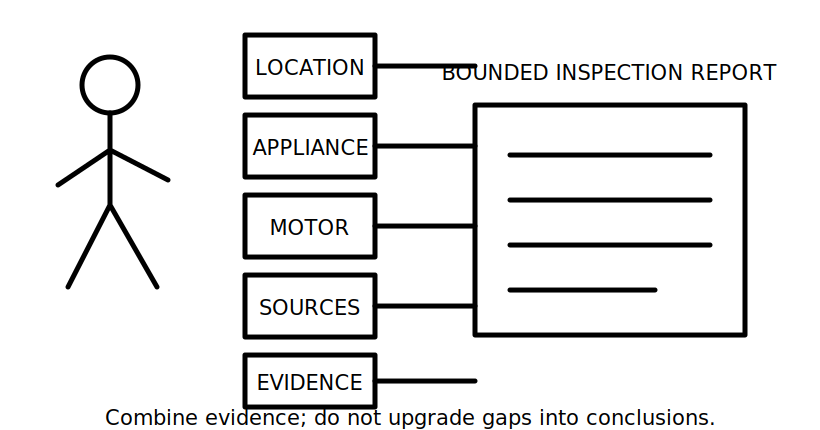
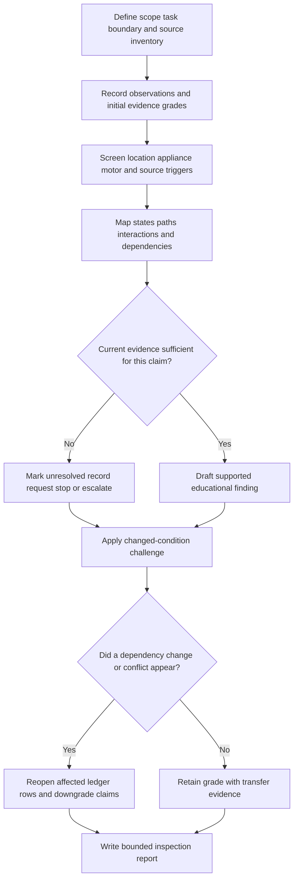
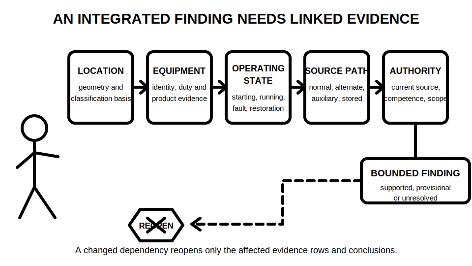

# Day 35 — Week 5 Integrated Installation Inspection

> **Currency, copyright and safety notice:** This original paper-based checkpoint uses fictional evidence. It does not provide authoritative inspection procedures, spatial classifications, switching instructions, ratings, settings, clauses, acceptance criteria or permission to perform electrical work.

## 1. Outcome and entry check

Given a fictional installation pack, the learner can produce a bounded inspection report that integrates special-location screening, fixed-appliance decisions, motor operating states, multiple-source mapping and evidence control without converting assumptions into technical determinations.

By the end, the learner can observably:

1. define the inspection scope, task boundary and source inventory;
2. classify each material item using five evidence grades;
3. separate observations, inferences, candidate concerns and authorised determinations;
4. identify at least five cross-topic interactions and their dependencies;
5. propagate two changed conditions through the report; and
6. state a conclusion that identifies what is supported, unresolved, stopped and escalated.

**Entry check:** distinguish observation from inference, an applicability trigger from a verified rule, functional control from isolation, running from starting condition, and a normal source from an alternative, auxiliary or stored-energy source. Any uncertain distinction is recorded as an entry gap rather than guessed.

## 2. Why it matters

Integrated inspection is not a checklist of isolated facts. A wet-area trigger may change equipment-suitability questions; a motor state may change protection and restart questions; an alternate source may change an apparent isolation boundary; and missing product or drawing evidence may reduce a conclusion from supported to provisional.

*Caption: Combine location, equipment, source, boundary and evidence information before stating any inspection conclusion.*

The key discipline is **interaction control**: each conclusion must survive the combined effect of the relevant location, equipment, operating state, source path and evidence currency.

## 3. Core concepts and terminology

- **Inspection scope:** the installation area, equipment, documents, operating states and questions included in the fictional review.
- **Task boundary:** the exact educational decision being attempted; it prevents a narrow paper exercise from being misrepresented as practical approval.
- **Observation:** information directly visible in, or explicitly supplied by, the fictional evidence pack.
- **Inference:** a reasoned interpretation derived from observations; it must remain labelled and may be wrong.
- **Candidate concern:** an observation or inference that may matter but cannot be called a defect until applicable criteria and facts are verified.
- **Interaction:** a dependency in which one condition changes the meaning, priority or required evidence for another condition.
- **Evidence dependency:** information that must be true or current before a claim remains supportable.
- **Reopening trigger:** a changed fact or conflicting item that requires affected ledger rows and conclusions to be reassessed.
- **Bounded conclusion:** a statement restricted to the evidence, task boundary, competence and authority available.
- **Evidence ledger:** a traceable record linking each claim to its evidence grade, dependencies, gaps, changed-condition response and next action.

### Five evidence grades

1. **Stated:** explicitly supplied in the fictional brief, drawing or schedule, but not independently checked.
2. **Indicated:** suggested by a symbol, label, image, device position or operating response.
3. **Corroborated:** supported by at least two consistent fictional evidence items with no known material conflict.
4. **Transferred:** remains supportable after a relevant changed-condition challenge.
5. **Unresolved:** missing, conflicting, stale, ambiguous or outside the learner's authority to determine.

### Four claim grades

1. **Assumption:** a working idea that cannot support a conclusion.
2. **Provisional educational conclusion:** reasoned but still dependent on unresolved evidence.
3. **Supported educational conclusion:** adequately supported for this fictional paper exercise and its stated scope.
4. **Authorised technical determination:** a qualified decision using current authorised sources and appropriate practical evidence; this module does not produce this grade.

A label, diagram, photograph, normal operating response or remembered rule can contribute evidence, but none independently proves compliance, defect status, isolation, suitability or safety.

## 4. Rule-finding workflow

Use **I-N-T-E-G-R-A-T-E**:

- **I — Identify** scope, task boundary, evidence pack and every stated or indicated energy source.
- **N — Note** observations without judgement and assign an initial evidence grade.
- **T — Triage** location, appliance, motor and source triggers by potential consequence and evidence need.
- **E — Examine** operating states, source paths and cross-topic interactions.
- **G — Gather** current authorised evidence or mark `reference_check_required` where it is unavailable.
- **R — Record** claims, evidence grades, dependencies, gaps and next actions in the integrated ledger.
- **A — Apply** stop conditions, escalation boundaries and claim-grade limits.
- **T — Test** at least two changed conditions and reopen every affected row.
- **E — End** with a bounded report that separates supported, provisional, unresolved and prohibited claims.

The diagram shows that changed conditions are not an optional final check. They determine whether a finding is robust enough to retain its grade or must be reopened and downgraded.

### Integrated inspection ledger

For each material item record:

`scope item → observation → topic trigger → operating state/source path → interaction → evidence grade → claim grade → dependencies → evidence request → reopening trigger → stop/escalation action → bounded conclusion`

Do not merge separate dependencies into a single vague note. A location classification, motor duty, source-transfer arrangement and product limitation can each reopen different parts of the same finding.

## 5. Visual model or worked example

### Fully guided example

**Fictional pack:** a pump motor serves a wash process area. A battery system and generator inlet appear on a drawing. The pack states that the pump stops from a local control, but transfer details, motor duty, product data, location geometry and isolation-path evidence are absent.

| Ledger element | Controlled entry |
|---|---|
| Observation | Pump motor, wash process, battery symbol, generator-inlet symbol and local stop control are stated or indicated. |
| Candidate interactions | Location conditions × equipment suitability; motor starting/restart × source capacity/control; alternate or stored source × isolation boundary. |
| Evidence grades | Supplied text is stated; drawing symbols are indicated; no key boundary claim is corroborated. |
| Unsupported leap | “The local stop isolates the pump” is prohibited because control response is not isolation proof. |
| Evidence requests | Current source arrangement, transfer/control description, motor duty/product data, location geometry/classification basis and authorised criteria. |
| Bounded conclusion | The pack identifies several material triggers, but suitability, isolation, protection and compliance remain unresolved. |

### Partially guided example

A revised pack removes the generator inlet and adds current product data for the pump. Update the ledger without rewriting it from scratch:

- close only the generator-inlet candidate path;
- retain the battery-source question;
- upgrade product-data evidence only where the new document applies;
- reassess motor-duty dependencies;
- retain location and isolation gaps; and
- explain why one removed source does not close unrelated evidence gaps.

*Caption: A conclusion remains bounded until location, equipment, state, source and authority evidence are linked; a changed dependency reopens the affected rows.*

### Independent transfer

Change two facts: the battery-supported circuit is now shown as supplying a control circuit only, and the wash-area boundary datum is revised. Identify every ledger row affected, every claim grade that changes, and every conclusion that remains unchanged. Credit is awarded for selective propagation, not blanket restarting or premature closure.

## 6. Practical application

Produce a one-page inspection report for a fictional workshop containing a wash area, fixed heater, motor-driven exhaust system and battery-supported essential circuit.

Required evidence products:

1. scope and task-boundary statement;
2. complete source-state inventory;
3. ten observations and five clearly labelled inferences;
4. six candidate concerns without premature defect labels;
5. five cross-topic interaction checks;
6. an integrated ledger with evidence and claim grades;
7. five evidence requests linked to specific dependencies;
8. three reopening triggers;
9. two stop or escalation conditions;
10. one changed-source and one changed-location transfer response; and
11. one bounded conclusion separating supported, provisional and unresolved findings.

### Original educational rubric — 12 points

| Category | 0 | 1 | 2 |
|---|---|---|---|
| Scope and source inventory | Material boundary or source omitted | Mostly complete with minor ambiguity | Complete, explicit and traceable |
| Observation and claim control | Inference or assumption presented as fact | Categories mostly separated | Categories and grades consistently controlled |
| Trigger and interaction reasoning | Topics treated independently | Some interactions identified | Material interactions and dependencies traced |
| Evidence ledger and reopening | Missing or non-traceable | Ledger present with partial change control | Evidence, dependencies and reopening are complete |
| Transfer and bounded conclusion | Changed facts ignored or overclaim made | Partial propagation | Selective propagation and bounded conclusion are sound |
| Safety, copyright and authority | Unsafe authority or invented criteria | Boundaries stated inconsistently | Stop, escalation, source and copyright boundaries are explicit |

This is not an official RTO pass mark. Any critical error overrides the numeric score:

- omitting a stated or indicated material energy source;
- presenting inference, a label or normal response as proof;
- inventing a classification, technical criterion, clause, value or acceptance limit;
- treating a control as proven isolation;
- failing to reopen an affected conclusion after a material change; or
- authorising practical work, energisation, testing, certification or approval.

### Delayed retrieval

At the start of Day 36, reconstruct I-N-T-E-G-R-A-T-E, the five evidence grades, four claim grades and three reopening triggers from memory before opening this module. Then compare the reconstruction with the ledger model and log one omission.

## 7. Common errors and safety checkpoint

Common errors include:

- inspecting one feature at a time and missing interactions;
- treating every trigger as a confirmed defect;
- confusing stated, indicated and corroborated evidence;
- ignoring alternate, auxiliary or stored energy;
- collapsing stopped, starting, running, fault and restored-supply states;
- accepting labels, drawings or normal operation as proof;
- applying one product document to a different configuration;
- failing to propagate changed geometry, source or operating-state evidence; and
- writing “compliant”, “safe” or “isolated” without complete authorised criteria and practical evidence.

Reopen affected ledger rows when scope, task boundary, location geometry or classification, appliance information, motor duty, operating state, control mode, source type, source availability, transfer behaviour, stored energy, drawing revision, product data, authorised reference, jurisdiction, evidence currency, competence or authority changes or conflicts with later evidence.

This is a document-only exercise. It authorises no site access, opening, switching, transfer operation, isolation, proving, locking, tagging, testing, measurement, operation, adjustment, fault simulation, installation, maintenance, energisation, commissioning, certification, verification, approval or return to service. Stop and escalate when scope, sources, operating states, classification basis, equipment data, authorised references, competence or authority are incomplete.

## 8. Retrieval and next links

Without notes:

1. state I-N-T-E-G-R-A-T-E;
2. define the five evidence grades and four claim grades;
3. name five cross-topic interactions;
4. explain four reopening triggers;
5. identify two critical errors;
6. rewrite one overconfident conclusion as a bounded statement; and
7. explain why a removed source cannot close an unrelated location or equipment gap.

- **Program:** [Six-Week Capstone Learning Plan](../MASTER_PLAN.md)
- **Previous:** [Day 34 — Multiple and Alternative Supplies Awareness](day-34-multiple-and-alternative-supplies-awareness.md)
- **Knowledge note:** [[Six-Week Day 35 - Week 5 Integrated Installation Inspection]]
- **Next:** [Day 36 — Verification Purpose, Evidence and Visual Inspection](day-36-verification-purpose-evidence-and-visual-inspection.md)
