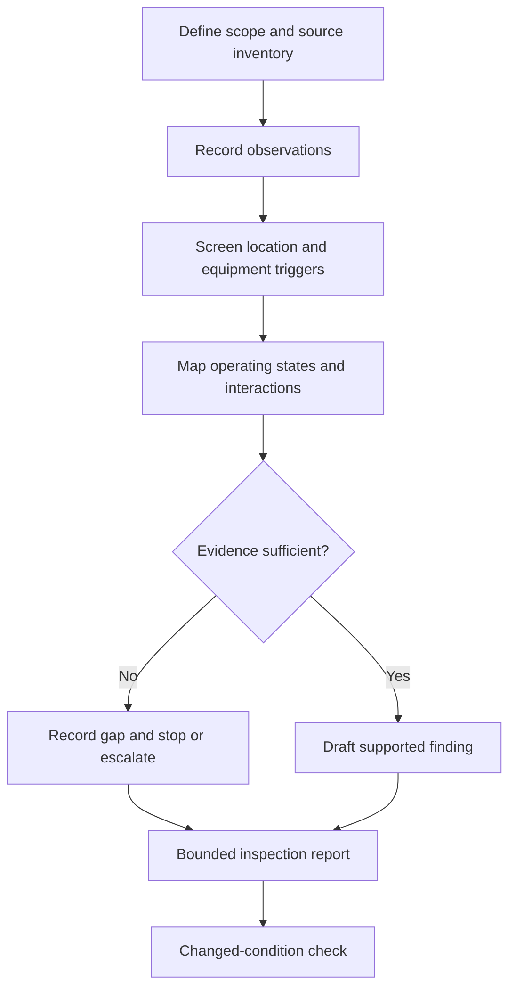

# Day 35 — Week 5 Integrated Installation Inspection

> **Currency, copyright and safety notice:** This original paper-based checkpoint uses fictional evidence. It does not provide authoritative inspection procedures, zone dimensions, switching instructions, ratings, settings, clauses or acceptance criteria.

## 1. Outcome and entry check

Given a fictional installation pack, the learner can integrate special-location screening, appliance and motor considerations, source mapping and evidence classification into a structured inspection report containing observations, inferences, unresolved items, stop conditions and a bounded conclusion.

**Entry check:** distinguish observation from inference, applicability trigger from verified rule, control from isolation, running from starting condition, and normal from alternative source.

## 2. Why it matters

Real inspection problems combine interacting conditions. A correct isolated fact can still produce an unsafe conclusion when source paths, location conditions, equipment duty or evidence gaps are ignored.

*Caption: Combine location, equipment, source, boundary and evidence information before stating any inspection conclusion.*

## 3. Core concepts and terminology

- **Inspection scope:** the defined installation area, equipment and questions covered by the review.
- **Observation:** information directly visible or explicitly supplied in the fictional pack.
- **Inference:** a reasoned interpretation that must remain distinguishable from observation.
- **Interaction:** a condition where one feature changes the significance of another.
- **Defect candidate:** an observed or inferred issue requiring authoritative verification before being labelled a defect.
- **Evidence ledger:** a record of each claim, source, confidence, gap and next action.
- **Bounded conclusion:** a statement limited to the available evidence and learner authority.

## 4. Rule-finding workflow

Use **I-N-T-E-G-R-A-T-E**: **I**dentify scope and sources; **N**ote observations without judgement; **T**riage location and equipment triggers; **E**xamine interactions and operating states; **G**ather authorised evidence; **R**ecord observations, inferences and gaps separately; **A**pply stop and escalation boundaries; **T**est changed conditions; **E**nd with a bounded report.

The workflow prevents a plausible observation from being upgraded directly into an authoritative defect or safety claim.

## 5. Visual model or worked example

Fictional pack: a pump motor serves a wet process area. A battery system and generator inlet are shown, but transfer details, motor duty and location classification are absent. Supported observations are limited to the stated equipment and source features. Record candidate interactions, request missing evidence and refuse to approve isolation, suitability or compliance.

Changed condition: the generator inlet is removed from the drawing. Reassess source inventory, but retain the battery, location and motor evidence gaps; one removed trigger does not close unrelated gaps.

## 6. Practical application

Produce a one-page inspection report for a fictional workshop containing a wash area, fixed heater, motor-driven exhaust system and battery-supported essential circuit. Include: scope; source-state map; eight observations; four inferences; four evidence requests; three interaction checks; two stop conditions; and one bounded conclusion.

Rubric, 20 points: scope/source inventory 3; observation accuracy 3; trigger screening 3; interaction reasoning 3; evidence ledger 3; safety boundaries 3; report clarity 2. Critical errors override the score: missing a stated source, presenting inference as observation, inventing technical criteria or authorising practical work.

## 7. Common errors and safety checkpoint

Errors: inspecting one feature at a time; treating every trigger as a confirmed defect; ignoring alternate or stored energy; collapsing motor states; accepting labels as proof; or writing “compliant” without complete verified criteria.

This is a document-only exercise. It authorises no site access, opening, switching, isolation, testing, measurement, operation, adjustment, installation, certification or approval. Stop when scope, sources, operating states, classification, equipment data or authorised references are incomplete.

## 8. Retrieval and next links

State I-N-T-E-G-R-A-T-E; distinguish four evidence categories; name five interaction checks; explain two critical errors; rewrite one overconfident conclusion as a bounded statement.

- **Program:** [Six-Week Capstone Learning Plan](../MASTER_PLAN.md)
- **Previous:** [Day 34 — Multiple and Alternative Supplies Awareness](day-34-multiple-and-alternative-supplies-awareness.md)
- **Knowledge note:** [[Six-Week Day 35 - Week 5 Integrated Installation Inspection]]
- **Next:** [Day 36 — Verification Purpose, Evidence and Visual Inspection](day-36-verification-purpose-evidence-and-visual-inspection.md)
